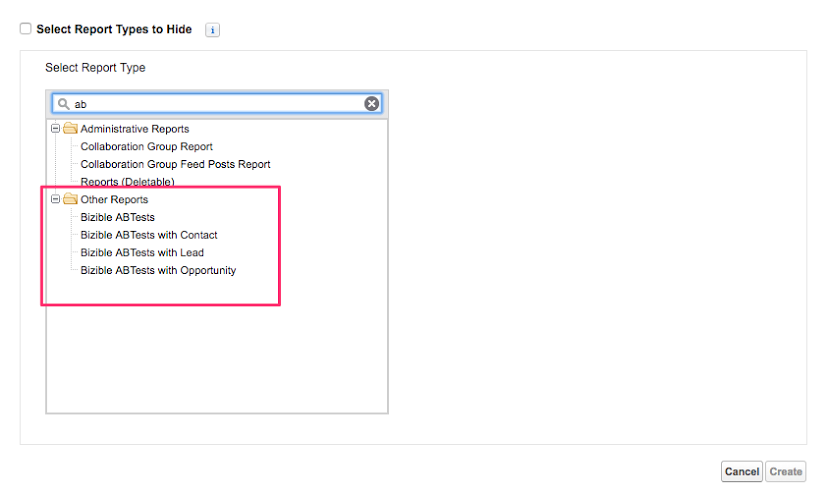
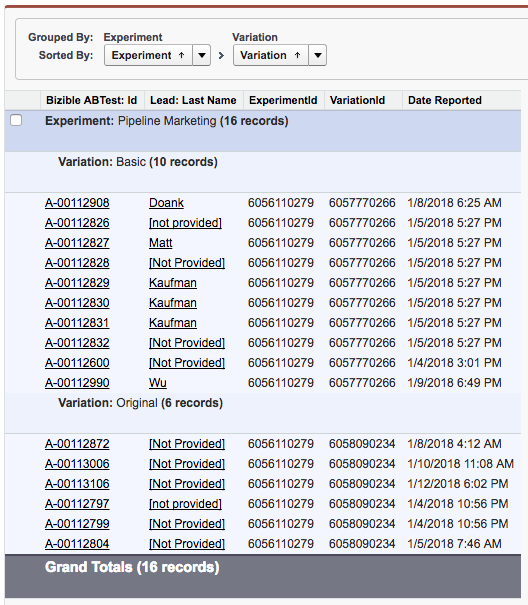

# Einrichten und Reporting von A/B-Tests {#a-b-testing-set-up-and-reporting}

Mit der A/B-Test-Integration in [!DNL Marketo Measure] können Sie die Auswirkungen Ihrer [Optimizely](https://www.optimizely.com/de){target="_blank"}- und VWO-Site-Experimente auf den Umsatz verfolgen. Dieser Artikel enthält Anweisungen, wie Sie in [!DNL Marketo Measure] A/B-Test-Abschnitte zu den Seiten-Layouts Lead, [!UICONTROL Kontakt], Fall und [!UICONTROL Opportunity] hinzufügen können. Außerdem werden allgemeine Berichtspraktiken und Empfehlungen für die Ausführung von A/B-Berichtstypen in [!DNL Marketo Measure] behandelt.

## Einrichten {#set-up}

Fügen Sie die A/B-Test-Abschnitte in [!DNL Marketo Measure] für Lead, Kontakt, Fall und Opportunity hinzu. [!DNL Marketo Measure] Die A/B-Test-Integration ermöglicht es Ihnen, die Auswirkungen Ihrer [Optimizely](https://www.optimizely.com/de){target="_blank"} - und [VWO](https://vwo.com/de){target="_blank"} -Site-Experimente auf den Umsatz zu verfolgen.

1. Stellen Sie sicher, dass Sie das Paket [!DNL Marketo Measure] v3.9 oder höher verwenden. Gehen Sie dazu zu [!UICONTROL Salesforce] >[!UICONTROL Einrichten] > [!UICONTROL Installierte Pakete].
1. Bearbeiten Sie das Seiten-Layout der Hauptseite und fügen Sie die zugehörige Liste der **[!DNL Marketo Measure]-A/B-Tests** zu der Seite hinzu.

   

1. Klicken Sie auf die Schaltfläche mit dem [!UICONTROL Schraubenschlüssel]. Entfernen Sie das Standardfeld „Id“ aus der Liste der ausgewählten Felder. Fügen Sie die Felder **[!UICONTROL Experiment]**, **[!UICONTROL Variation]**, und **[!UICONTROL DateReported]** hinzu. Ändern Sie „[!UICONTROL Sortieren nach]“ in **[!UICONTROL Berichtsdatum]** und wählen Sie **[!UICONTROL Absteigend]** in der Dropdown-Liste.

   

1. Deaktivieren Sie unter [!UICONTROL Schaltflächen] die Option **[!UICONTROL Neu]**.

   

1. Kontaktieren Sie Ihre [!DNL Marketo Measure]-Kundenbetreuung oder den [Marketo-Support](https://nation.marketo.com/t5/support/ct-p/Support){target="_blank"}, um die Funktion zu aktivieren.

## Berichterstellung {#reporting}

Kundinnen und Kunden verfügen über einige [!DNL Marketo Measure]-A/B-Berichtstypen, mit denen Sie über A/B-Tests in Bezug auf Leads, Kontakte und Opportunitys berichten können:

* [!DNL Marketo Measure]-A/B-Tests
* [!DNL Marketo Measure]-A/B-Tests mit Kontakt
* [!DNL Marketo Measure]-A/B-Tests mit Lead
* [!DNL Marketo Measure]-A/B-Tests mit Opportunitys

A/B-Berichtstypen werden verwendet, um zu melden, für welchen Lead oder Kontakt oder welche Opportunity ein A/B-Test durchgeführt wurde. Diese Berichte zeigen Ihnen auch den Umsatz, der mit einer Opportunity verbunden ist, die einem A/B-Test ausgesetzt war.

Beachten Sie, dass Optimizely/VWO eine Inhaltsvarianten-Plattform und kein Marketing-Kanal ist. Daher werden diese [!DNL Marketo Measure]-A/B-Berichtstypen anders verwendet als Buyer-Touchpoint-Berichte. Mit den Buyer-Touchpoint-Berichtstypen können Sie nachvollziehen, welcher Marketing-Kanal (bezahlte Werbung, Web-Direkt, Social) einen Lead oder Kontakt zu einer bestimmten Seite geführt hat. Die [!DNL Marketo Measure]-A/B-Berichtstypen können jedoch nicht verwendet werden, um darüber zu berichten, wie eine Variation einen Lead oder eine Opportunity beeinflusst hat. Da es sich bei einer A/B-Test-Variante nicht um einen Kanal handelt, werden Details zur Variante nicht im Buyer Touchpoint angezeigt.

Im Folgenden finden Sie einige empfohlene Felder, die für die Berichterstellung zu A/B-Tests verwendet werden sollten, um Klarheit und Erkenntnisse zu verbessern:

* Konvertierter Lead
* Experiment
* Experimentkennung
* Variation
* Variations-ID
* Gemeldetes Datum

## [!DNL Salesforce]-Beispielberichte {#salesforce-example-reports}

**[!DNL Marketo Measure]-A/B-Test mit Lead**

**[!DNL Marketo Measure]-A/B-Test mit Opportunity**

