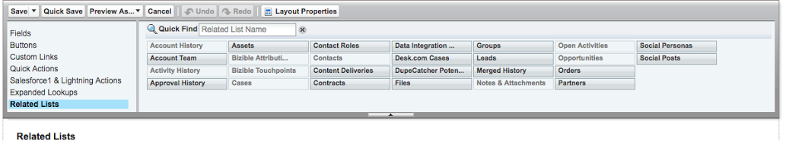

# Kontobasiertes Marketing – Überblick {#account-based-marketing-overview}

Die folgenden Abschnitte bieten einen kurzen Überblick über ABM, die Komponenten der ABM-Funktion in [!DNL Marketo Measure] und darüber, wie Sie sie zu Ihrem [!DNL Salesforce]-Seiten-Layout hinzufügen. Um mehr über ABM zu erfahren, lesen Sie den [ABM-Blog](https://business.adobe.com/blog/basics/account-based-marketing){target="_blank"} von Adobe.

Detaillierte Anweisungen zum Einrichten von ABM in Ihrer [!DNL Salesforce]-Instanz finden Sie unter [Einrichten des ABM-Seiten-Layouts in Salesforce](/help/advanced-marketo-measure-features/account-based-marketing/account-based-marketing-overview.md#setting-up-abm-page-layout-in-salesforce){target="_blank"}.

## Was ist ABM? {#what-is-abm}

Kontobasiertes Marketing (account-based marketing, ABM), ist eine Marketing-Strategie, bei der Sie Unternehmen und Konten als Ganzes ansprechen und an sie verkaufen, nicht nur an Einzelpersonen. [!DNL Marketo Measure] hilft Marketing- und Vertriebs-Teams bei der Ausführung erfolgreicher ABM-Strategien mit der Zuordnungsfunktion „Lead-zu-Konto“ und einer prädiktiven Interaktionsbewertung.

Damit unser ABM-Modell in Ihr CRM-System integriert werden kann, muss [!DNL Marketo Measure] die folgenden Kriterien erfüllen:

* Ihr CRM-System benötigt mindestens 25 Konten, für die mindestens eine geschlossene, gewonnene Opportunity vorhanden ist, damit wir die Gemeinsamkeiten von „erfolgreichen“ Konten/Opportunitys für Ihr Unternehmen einschätzen können.
* Auf der anderen Seite muss Ihr CRM mindestens 25 Konten ohne geschlossene, gewonnene Opportunity haben (alle anderen Opportunitys müssen entweder in der Kategorie „Offen“ oder in der Kategorie „Geschlossen, verloren“ sein). Dies hilft uns einzuschätzen, was Konten von geringerer Qualität in Ihrem Unternehmen ausmacht.

>[!NOTE]
>
>Die oben genannten „schlechten“ Konten müssen mindestens 12 Monate lang offen sein, ohne dass sich eine geschlossene, gewonnene Opportunity angesammelt hat. Das ist die Grundrichtlinie dafür, ob eine Opportunity für die Zwecke des Modells veraltet ist.

## Lead-zu-Konto-Zuordnung {#lead-to-account-mapping}

Die Lead-zu-Konto-Zuordnung ist ein wesentlicher Bestandteil eines effektiven ABM-Ansatzes. Mit der Lead-zu-Konto-Zuordnung werden interessierte Personen (oder Leads), die mit Ihrer Marke interagieren, in demselben Unternehmenskonto zusammengefasst. Auf diese Weise können Sie Einzelpersonen desselben Unternehmens auf konsistente Weise ansprechen und an diese verkaufen. Es sind keine zusätzlichen Konfigurationen für [!DNL Salesforce] erforderlich, damit diese Funktion in Anspruch genommen werden kann. Die [!DNL Marketo Measure] Führen Sie zur Kontozuordnung mit unterschiedlichen Übereinstimmungsmethoden:

* Lead-Website zu Konto-Website
* Lead-E-Mail-Domain zu Konto-Website-Domain
* Lead-Firmenname zu Kontoname
* Lead-Firma zu Konto-Website-Domain
* Lead-Website zur E-Mail-Domain von Kontokontakten
* Lead-E-Mail-Domäne für die E-Mail-Domäne von Kontokontakten
* Lead-Website zur E-Mail-Domäne der Kontoführer
* Lead-E-Mail-Domäne für die E-Mail-Domäne der Kontoführer

Die Leads/Kontakte der Konten werden durch ihre E-Mail-/Website-Domänen validiert und mit der Domain oder Subdomäne der Lead-E-Mail/Website abgeglichen. Das Konto mit den meisten Übereinstimmungen wird verwendet.

>[!NOTE]
>
>Für jeden Lead wird versucht, ihn in der bevorzugten Reihenfolge der oben genannten Methoden einem Konto zuzuordnen. Sobald eine Übereinstimmung gefunden wurde, wird die AccountId sofort auf dem Lead festgelegt und nicht mit einer anderen Methode abgeglichen.

## Prädiktive Interaktionsbewertung {#predictive-engagement-score}

Die prädiktive Interaktionsbewertung (Predictive Engagement Score, PES) von [!DNL Marketo Measure] ist ein dynamischer Wert, der veranschaulicht, wie stark ein bestimmtes Konto mit Ihren Marketing-Maßnahmen interagiert. Diese Bewertung ist hilfreich, um Konten zielgerichtet ansprechen zu können. Sie ist ein wertvolles Instrument zur Identifizierung von Konten, um effektiver und effizienter zu agieren.

Es gibt viele Komponenten, die in den Algorithmus eingehen, mit dem die PES berechnet wird. Neuigkeit und Alter haben – neben der letzten Touchpoint-Aktivität oder Seitenansichten – großen Einfluss auf die Bewertungsänderungen. Das Hinzufügen neuer Kontakte zu einem Konto wirkt sich ebenfalls auf den PES aus. Nachfolgend finden Sie eine Liste einiger PES-Eingaben:

* Gesamtzahl der Seitenansichten von dem Konto aus
* Durchschnittliche Anzahl der Seitenansichten
* Durchschnittliche Anzahl der Personen in dem Konto
* Alter der letzten Seitenansicht
* Durchschnittliches Alter der Seitenansichten
* Anzahl der Personen in dem Konto
* Spezifische, wichtige Seiten, und ob dort in den letzten 30/60/90 Tagen ein Besuch stattgefunden hat
* Ob das Konto ein geschlossenes verlorenes/gewonnenes Geschäft aufweist
* Wie wahrscheinlich ein Geschäft als verloren/gewonnen geschlossen wird

>[!NOTE]
>
>Sie werden bei einigen Konten die Bewertung „Nicht zutreffend“ oder „-“ (Bindestrich) in Ihrer prädiktiven Interaktionsbewertung sehen.

_Die Bewertung „Nicht zutreffend“ bedeutet einfach, dass für dieses Konto nicht genügend Daten vorhanden sind, damit das Modell eine echte Bewertung erstellen kann – mit mehr Daten wird letztendlich eine Bewertung vergeben._
_Die Bewertung „-“ (Bindestrich) bedeutet, dass dieses Konto aufgrund von Zeitbeschränkungen, gelegentlich fehlenden Prozessen usw. noch nicht vom ABM-Prozess verarbeitet wurde. Wenn Sie auf der Grundlage anderer ähnlicher Konten oder Zeiträume der Meinung sind, dass ein solches Konto eine Bewertung haben sollte, teilen Sie dies bitte [!DNL Marketo Measure] mit._

## Einrichten des ABM-Seiten-Layouts in [!DNL Salesforce] {#setting-up-abm-page-layout-in-salesforce}

Um mit der Verwendung der PES zu beginnen, müssen Sie das Feld „PES“ und die zugehörige Liste zu den entsprechenden Seiten-Layouts in [!DNL Salesforce] hinzufügen.

1. Navigieren Sie zu **[!UICONTROL Setup]** > **[!UICONTROL Anpassen]** > **[!UICONTROL Konten]** > **[!UICONTROL Seiten-Layout]**. Wählen Sie dann das Seiten-Layout aus, das Sie bearbeiten möchten.
1. Navigieren Sie zu [!UICONTROL Felder] und verschieben Sie das Feld „Prädiktive Interaktionsbewertung“ in den Abschnitt „Kontoinformationen“.

   

1. Navigieren Sie schließlich zu [!UICONTROL Zugehörige Listen] und verschieben Sie die zugehörige Liste für die Leads in Ihr Seiten-Layout.

   

1. Navigieren Sie dann zu **[!UICONTROL Setup]** > **[!UICONTROL Anpassen]** > **[!UICONTROL Leads]** > **[!UICONTROL Seiten-Layout]** und wählen Sie die entsprechenden Seiten-Layouts aus, die Sie bearbeiten möchten.
1. Klicken Sie auf **[!UICONTROL Felder]** und fügen Sie das Feld [!UICONTROL Konto] dort hinzu, wo Sie es auf der Seite haben möchten.

   

Das war’s schon!

