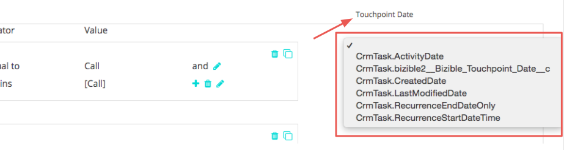

# Zuordnung von Salesforce-Aktivitäten {#salesforce-activities-attribution}

Durch die Integration von [!DNL Marketo Measure] Salesforce-Aktivitäten werden bestimmte Aufgaben- und Ereignisdatensätze in Ihr Attributionsmodell eingefügt. Beginnen Sie, Dinge wie Verkaufs-E-Mails oder Verkaufs-Telefonanrufe zu verfolgen, die nicht gebührend gutgeschrieben wurden. Um Ihre Aktivitätsregel zu konfigurieren, gehen Sie zu [experience.adobe.com/marketo-measure](https://experience.adobe.com/marketo-measure){target="_blank"}. Gehen Sie von dort zur Registerkarte **[!UICONTROL Einstellungen]** und klicken Sie auf die Registerkarte **[!UICONTROL Aktivitäten]** .

>[!AVAILABILITY]
>
>Diese Funktion ist nur für Tier-2-Kunden aktiviert. Wenden Sie sich an das Adobe Account Team (Ihren Kundenbetreuer), um eine höhere Kontoebene anzufordern.

Zunächst führen wir ein neues Konzept ein, das als [!DNL Marketo Measure] Kampagne bezeichnet wird. Für jede von Ihnen definierte Regel werden Sie die Datensätze in einer [!DNL Marketo Measure]-Kampagne zusammenfassen, die Sie benennen können. Fügen Sie nach Bedarf mehrere Kampagnen hinzu. Stellen Sie sich vor, Sie würden die Effektivität einer Outbound-Verkaufskampagne neben einer Paid Media-Kampagne messen!

Sie werden diesen [!DNL Marketo Measure] Kampagnennamen verwenden, um uns mitzuteilen, welchem Kanal er zugeordnet werden soll. Wenn Sie noch an ausgehende Verkäufe denken, sollten möglicherweise alle ausgehenden Vertriebskampagnen in einem BDR-Kanal platziert werden.

Machen Sie sich mit dieser Hierarchie vertraut:

* Kanal
   * Unterkanal
      * Kampagne
      * Kampagne
   * Unterkanal
      * Kampagne

>[!TIP]
>
>Wenn Sie beispielsweise eine eindeutige Kampagne für jeden Vertriebsmitarbeiter festlegen möchten, verwenden Sie dynamische Ersatzparameter, um den Kampagnennamen [!DNL Marketo Measure] auszufüllen. Im selben Beispiel können Sie `"Outbound Sales - {AssignedTo}"` eingeben und es wird in etwa `"Outbound Sales - Jill"` oder `"Outbound Sales - Jack."` geändert

Sobald Ihr [!DNL Marketo Measure] Kampagnenname festgelegt ist, ist es Zeit, Ihre Aktivitätsregeln einzurichten.

Die Regeln dienen als Filter, um uns mitzuteilen, welche Datensätze für die Zuordnung infrage kommen. Angenommen, Sie erstellen einen Bericht in Ihrem CRM-System mit einer ähnlichen Logik, um diesen Bericht zu generieren. Sie haben die Flexibilität, eine Kombination aus und/oder Anweisungen und verschiedenen Operatoren wie `matches any`, `contains`, `starts with`, `ends with`, `is equal to` zu verwenden. Definieren Sie `and` -Anweisungen innerhalb einer Boxed Rule oder Layer `or` -Anweisungen außerhalb des Felds.

>[!NOTE]
>
>Formelfelder können nicht in Ihren Regeln verwendet werden und werden nicht in der Auswahlliste angezeigt. Da Formeln im Hintergrund berechnet werden und einen Datensatz nicht ändern, kann [!DNL Marketo Measure] nicht erkennen, ob ein Datensatz zu einer Regel passt oder nicht.
>
>Stellen Sie sicher, dass die richtigen Werte für ID-Felder wie CrmEvent.CreatedById verwendet werden. [!DNL Salesforce IDs] ist 18 Zeichen lang (0054H000007WmrfQAC).

Wählen Sie abschließend eines Ihrer Datums- oder Datums-/Uhrzeitfelder aus, das als Buyer Touchpoint-Datum verwendet werden soll. Es können sowohl Standard- als auch benutzerdefinierte Felder ausgewählt werden.

>[!TIP]
>
>Bei der Paketinstallation enthält [!DNL Marketo Measure] ein benutzerdefiniertes Buyer Touchpoint-Datumsfeld im Aktivitätsdatensatz. Wenn Sie ein dynamisches Datum verwenden möchten, z. B. das Datum, an dem sich ein Status ändert, können Sie einen CRM-Workflow verwenden, um das &quot;Buyer Touchpoint-Datum&quot;festzulegen und in diesem Schritt hier das Buyer Touchpoint-Datum auszuwählen.

Vergessen Sie nicht, verschiedene Regeln für Aufgaben oder Ereignisse festzulegen. Sie müssen wissen, welches Objekt Ihr Sales-Team zur Aufzeichnung seiner Aktivitäten verwendet.

Sie möchten diese neuen Touchpoints wahrscheinlich in ihren entsprechenden [Marketingkanal](https://experience.adobe.com/#/marketo-measure/MyAccount/Business?busView=false&amp;id=10#/!/MyAccount/Business/Account.Settings.SettingsHome?tab=Channels.Online%20Channels){target="_blank"} platzieren. Definieren Sie dazu den Kanal mit dem soeben erstellten neuen Kampagnen-Mapping.

>[!TIP]
>
>Verwenden Sie beim Hinzufügen einer Kanaldefinition Platzhalterwerte, um Operatoren leichter anzugeben, z. B.:
>
>beginnt mit ( Outbound&#42; )
>
contains ( &#42;Outbound&#42; )
>
endet mit ( &#42;Outbound )
>
Keine Wildcard bedeutet im Grunde &quot;ist gleich&quot;. Daher sollten Sie sie nach Bedarf verwenden.

| **Operator** | **Anwendungsfall** |
|---|---|
| ist gleich | Einzelwert - genaue Übereinstimmung |
| Enthält | Einzelwert - enthält Wert |
| Entspricht allen | Mehrere Werte - genaue Übereinstimmung |
| Entspricht allen (enthält) | Mehrere Werte - &#42;Wert&#42;, &#42;Wert, &#42;Wert&#42; |

Und nicht zuletzt haben Sie die Möglichkeit, die Kosten für Ihre neuen Kanäle anzugeben. Mit dem Upload der Marketingausgaben ](https://experience.adobe.com/#/marketo-measure/MyAccount/Business?busView=false&amp;id=10#/!/MyAccount/Business/Account.Settings.SettingsHome?tab=Reporting.Marketing%20Spend){target="_blank"} können Sie Ihre Ausgaben auf Kanal-, Unterkanal- oder Kampagnenebene eingeben. [ Mit Ihren neuen [!DNL Marketo Measure]-Kampagnen können Sie diese zugehörigen Kosten pro Monat hinzufügen und dann den ROI für jede Kampagne sehen!

>[!MORELIKETHIS]
>
[FAQ zur Aktivitätszuordnung](/help/advanced-marketo-measure-features/activities-attribution/activities-attribution-faq.md)
