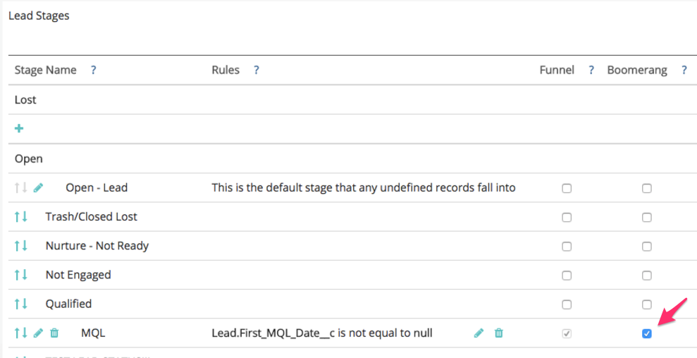
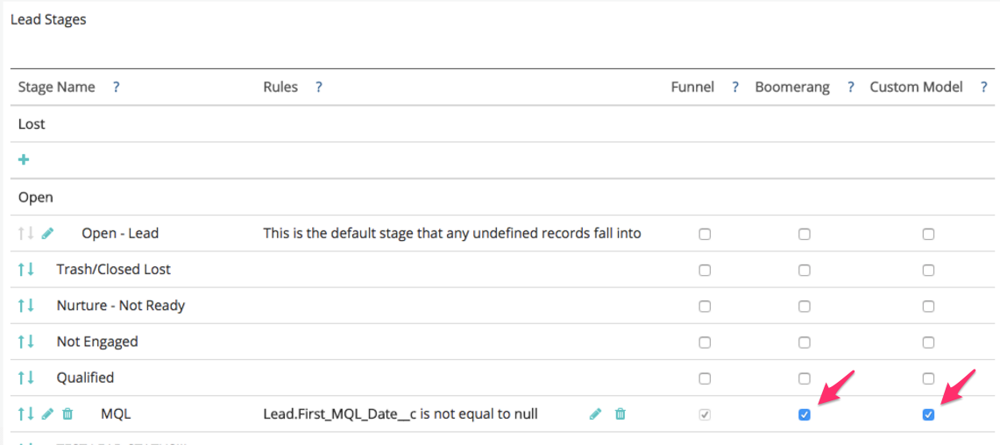
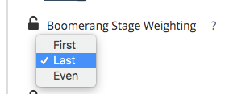
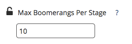
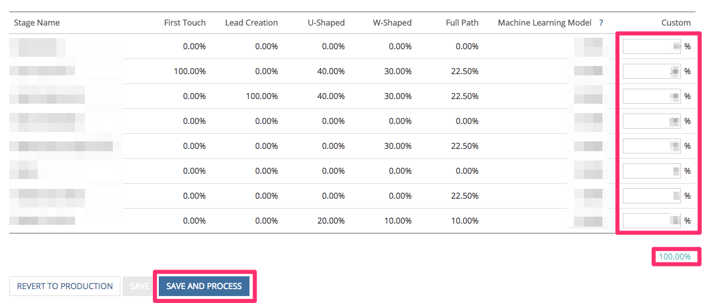

# Einrichten von Boomerang-Phasen {#setting-up-boomerang-stages}

>[!AVAILABILITY]
>
>Die Boomerang-Funktion ist nur für Kunden der Stufe 2 aktiviert. Um eine höhere Kontoebene anzufordern, wenden Sie sich an das Adobe Account Team (Ihren Account Manager).

Um [!UICONTROL Boomerang]-Stadien für Ihr Konto zu aktivieren, müssen Sie ein Konto-Administrator sein. Sie kann auch aktiviert werden, indem Sie sich an den [Marketo-Support wenden](https://nation.marketo.com/t5/support/ct-p/Support?profile.language=de){target="_blank"}. Nachdem die Funktion aktiviert wurde, befolgen Sie diese Anweisungen, um sie einzurichten.

## Boomerang-Stadium einrichten {#boomerang-stage-setup}

1. Navigieren Sie zu [!UICONTROL Stadienzuordnung]. Wählen Sie in der Spalte [!UICONTROL Boomerang] die Kästchen neben den Stadien aus, die Sie verfolgen möchten.

   

1. Gehen Sie zur Registerkarte [!UICONTROL Attributionseinstellungen] und geben Sie die Anzahl der Touchpoints für jedes Stadium ein, das Sie sehen möchten. Wir erlauben maximal 10. Der Standardwert ist 1.

   

1. Klicken Sie auf **[!UICONTROL Speichern]**.

   >[!NOTE]
   >
   >Warten Sie 24-48 Stunden, bis Ihre Daten entsprechend diesen Änderungen erneut verarbeitet wurden.

## Boomerang-Stadieneinrichtung mit benutzerdefinierter Modellattribution {#boomerang-stage-setup-with-custom-model-attribution}

1. Navigieren Sie zu [!UICONTROL Stadienzuordnung]. Wählen Sie in der Spalte [!UICONTROL Boomerang] die Kästchen neben den Stadien aus, die Sie verfolgen möchten.

   

1. Wenn Sie diese Boomerang-Stadien auch in Ihr benutzerdefiniertes Modell aufnehmen möchten und eine Attribution erhalten möchten, aktivieren Sie auch das Kästchen unter der Spalte &quot;[!UICONTROL Benutzerdefiniertes Modell].

   

1. Navigieren Sie zur Registerkarte [!UICONTROL Attributionseinstellungen] . Legen Sie fest, wie Sie die Attribution für Ihre Boomerang-Stadien gewichten möchten. Die Optionen sind, die Attribution beim ersten Vorkommen oder letzten Vorkommen zu gewichten oder sie gleichmäßig auf alle Vorkommen aufzuteilen.

   

1. Geben Sie die Anzahl der Vorkommnisse für jede Phase ein, die Sie sehen möchten. Wir können maximal 10 zulassen. Der Standardwert ist 1.

   

1. Legen Sie den Prozentsatz der Zuordnung fest, den Sie den Boomerang-Stadien zuweisen möchten, die Sie in das benutzerdefinierte Modell aufgenommen haben. Stellen Sie sicher, dass die Gesamtzuordnung für alle Stadien bis zu 100 % beträgt. Klicken Sie **[!UICONTROL Speichern und Verarbeiten]**.

   

   >[!NOTE]
   >
   >Warten Sie 24-48 Stunden, bis Ihre Daten entsprechend diesen Änderungen erneut verarbeitet wurden.
