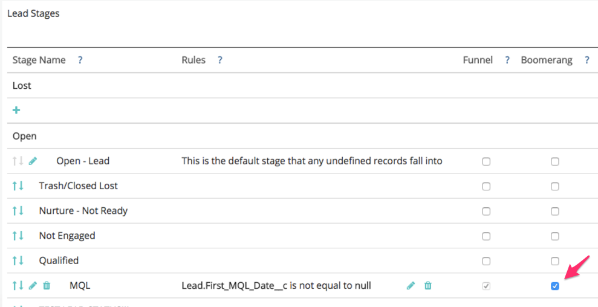

# Einrichten von Boomerang-Phasen {#setting-up-boomerang-stages}

>[!AVAILABILITY]
>
>Die Boomerang-Funktion ist nur für Tier-2-Kunden aktiviert. Wenden Sie sich an das Adobe Account Team (Ihren Kundenbetreuer), um eine höhere Kontoebene anzufordern.

Um [!UICONTROL Boomerang]-Phasen für Ihr Konto zu aktivieren, müssen Sie Kontoadministrator sein. Sie können sie auch aktivieren, indem Sie sich an den [Marketo-Support](https://nation.marketo.com/t5/support/ct-p/Support){target="_blank"} wenden. Nachdem die Funktion aktiviert wurde, befolgen Sie diese Anweisungen, um sie einzurichten.

## Einrichten der Boomerang-Phase {#boomerang-stage-setup}

1. Wechseln Sie zu [!UICONTROL Staging-Zuordnung]. Wählen Sie unter der Spalte &quot;[!UICONTROL Boomerang]&quot;die Kästchen neben den Bühnen aus, die Sie verfolgen möchten.

   

1. Geben Sie auf der Registerkarte [!UICONTROL Attributionseinstellungen] die Anzahl der Touchpoints für jede Phase ein, die Sie sehen möchten. Wir erlauben maximal 10. Der Standardwert ist 1.

   

1. Klicken Sie auf **[!UICONTROL Speichern]**.

   >[!NOTE]
   >
   >Die erneute Verarbeitung Ihrer Daten entsprechend diesen Änderungen dauert 24 bis 48 Stunden.

## Bumerang-Staging-Einrichtung mit benutzerdefinierter Modellzuordnung {#boomerang-stage-setup-with-custom-model-attribution}

1. Wechseln Sie zu [!UICONTROL Staging-Zuordnung]. Wählen Sie unter der Spalte &quot;[!UICONTROL Boomerang]&quot;die Kästchen neben den Bühnen aus, die Sie verfolgen möchten.

   

1. Wenn Sie möchten, dass diese Bumerang-Bühnen auch in Ihr benutzerdefiniertes Modell aufgenommen werden und eine Zuordnungsgutschrift erhalten, wählen Sie auch das Feld in der Spalte &quot;[!UICONTROL Benutzerdefiniertes Modell]&quot;.

   

1. Gehen Sie zur Registerkarte [!UICONTROL Attributionseinstellungen] . Bestimmen Sie, wie Sie die Attribution für Ihre Bumerang-Bühnen gewichten möchten. Die Optionen bestehen darin, die Attribution für das erste Vorkommen oder das letzte Vorkommen zu gewichten oder sie gleichmäßig auf alle Vorkommen aufzuteilen.

   

1. Geben Sie die Anzahl der Vorkommen jeder Phase ein, die Sie sehen möchten. Wir können maximal 10 zulassen. Der Standardwert ist 1.

   

1. Legen Sie den Attributionsprozentsatz fest, den Sie den im benutzerdefinierten Modell enthaltenen Boomerang-Phasen zuweisen möchten. Stellen Sie sicher, dass die Gesamtzuordnung für alle Phasen 100 % ergibt. Klicken Sie auf **[!UICONTROL Speichern und verarbeiten]**.

   

   >[!NOTE]
   >
   >Die erneute Verarbeitung Ihrer Daten entsprechend diesen Änderungen dauert 24 bis 48 Stunden.
