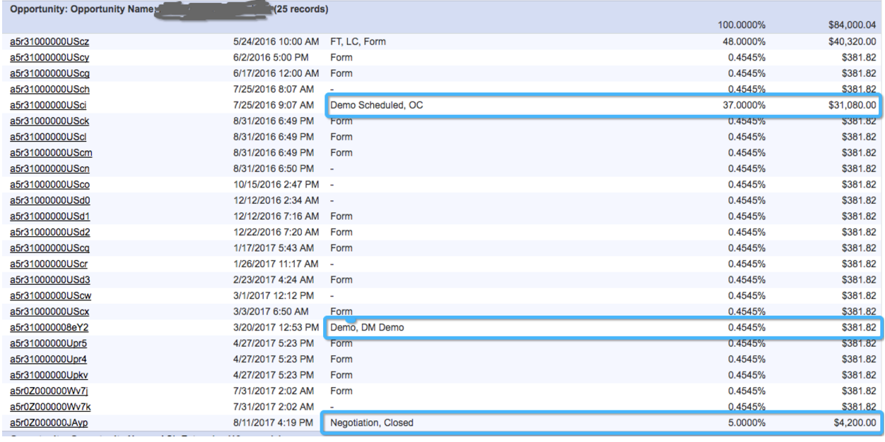

# Benutzerdefiniertes Attributionsmodell und -einrichtung {#custom-attribution-model-and-setup}

Eine Übersicht über die [!DNL Marketo Measure] benutzerdefiniertes Attributionsmodell und dessen Einrichtung.

## Benutzerdefiniertes Attributionsmodell {#custom-attribution-model}

Die [!DNL Marketo Measure] Mit dem benutzerdefinierten Attributionsmodell können Benutzer auswählen, welche Touchpoints oder benutzerdefinierten Bühnen in das Modell aufgenommen werden sollen. Benutzer können den Prozentsatz der Umsatzgutschriften steuern, die diesen Touchpoints und Bühnen zugeordnet werden, oder die Attributionsprozentwerte verwenden, die durch die [!DNL Marketo Measure] Modell für maschinelles Lernen.

## Einrichten Ihres benutzerdefinierten Attributionsmodells {#how-to-set-up-your-custom-attribution-model}

1. Bestimmen Sie, welche Phasen Sie in Ihr benutzerdefiniertes Modell aufnehmen möchten.

   Um mit der Erstellung Ihres benutzerdefinierten Attributionsmodells zu beginnen, müssen Sie auswählen, welche Phasen für Ihr Marketing-Team wichtig sind. Zusätzlich zu den [!DNL Marketo Measure] Meilensteine (FT, LC, OC, Closed) können Sie bis zu sechs weitere Lead-/Kontaktstatus- oder Opportunity-Phasen in Ihrem benutzerdefinierten Modell hinzufügen. Beispielsweise ist es üblich, dass die MQL-Bühne in das benutzerdefinierte Modell aufgenommen wird. Marketing-Teams möchten häufig wissen, welche Bemühungen oder Kanäle den Übergang zur MQL-Phase vorantreiben.

   Anmelden bei [experience.adobe.com/marketo-measure](https://experience.adobe.com/marketo-measure){target="_blank"}. Navigieren Sie zu [!UICONTROL Mein Konto] > [!UICONTROL Einstellungen] > und wählen Sie im Abschnitt CRM die Option **[!UICONTROL Staging-Zuordnung]**.

   Hier müssen Sie auswählen, welche Leads/Kontakte und Opportunity-Phasen eingeschlossen werden sollen, indem Sie die **[!UICONTROL In Modell einschließen]** ankreuzen.

   >[!NOTE]
   >
   >Sie können bis zu sechs benutzerdefinierte Phasen ausführen (ohne die Standardeinstellungen zu berücksichtigen: FT, LC, OC, Closed).

   

   >[!NOTE]
   >
   >_Alle_ Hier werden Leads/Kontakte und Opportunity-Phasen angezeigt, auch wenn die Bühne inaktiv ist oder nicht mehr in [!DNL Salesforce]. Wenn Sie diese Bühnen entfernen möchten, müssen Sie sie in [!DNL Salesforce].

   Wenn Sie Ihre Bühnen ausgewählt haben, klicken Sie auf die Schaltfläche **[!UICONTROL Speichern und verarbeiten]** -Schaltfläche unten auf der Seite. Die Schritte werden jetzt im **[!UICONTROL Attributionseinstellungen]** und Sie können Attributionsprozentsätze zu jeder Phase zuweisen. Benutzerdefinierte Bühnen werden auch in der Marketing Performance Suite als Lead- oder Opportunity-Phase im Demand Waterfall angezeigt.

   Wenn es andere Phasen gibt, die Sie in das Modell einbeziehen möchten, die jedoch nicht im [!UICONTROL Lead-/Kontaktstatus] oder [!UICONTROL Opportunity Stage] können Sie eine eigene benutzerdefinierte Phase anhand von Feldern in Ihrem CRM-System definieren.

   Im folgenden Beispiel wird eine benutzerdefinierte MQL-Phase mithilfe eines Datumsfelds definiert. In der Regel wird lediglich festgelegt, dass das Feld MQL-Datum, wenn es nicht leer ist, als MQL betrachtet werden und in das benutzerdefinierte Modell aufgenommen werden sollte. Beachten Sie, dass es auch wichtig ist, die benutzerdefinierten Bühnen nach deren Erstellung zu sortieren, damit sie dem Fortschritt Ihres Verkaufszyklus folgen.

   

   >[!CAUTION]
   >
   >Vergessen Sie nicht, die Verlaufsverfolgung für benutzerdefinierte Felder zu aktivieren.

Wenn in Ihrem benutzerdefinierten Modell ein benutzerdefiniertes Feld verwendet wird, MUSS das Feldverlauf-Tracking im CRM aktiviert werden. Anweisungen zum Aktivieren des Verlaufs von Feldern finden Sie unter [Bitte klicken Sie hier](/help/advanced-marketo-measure-features/custom-attribution-models/custom-model-setup-enable-field-history-tracking.md).

1. Bestimmen Sie die Attributionsprozentsätze für das benutzerdefinierte Modell.

   Navigieren Sie zu **[!UICONTROL Attributionseinstellungen]** in [!DNL Marketo Measure] Apps; Die benutzerdefinierten Bühnen werden hier in der Attributionstabelle angezeigt. Die Attributionstabelle enthält alle [!DNL Marketo Measure] Attributionsmodelle und die Attributionsgewichtung der einzelnen Modelle. Die Attributionsprozentsätze der ersten fünf Modelle sind fest und können nicht geändert werden.

   In der Spalte ganz rechts mit der Bezeichnung &quot;**[!UICONTROL Benutzerdefiniert]**,&quot;können Sie die Prozentgewichtung für jede Phase in Ihrem benutzerdefinierten Attributionsmodell festlegen. Geben Sie einfach die Werte für jede Phase unter der Spalte &quot;Benutzerdefiniert&quot;ein. Dann **[!UICONTROL Speichern und erneut verarbeiten]** nach Abschluss.

   Links neben der Spalte &quot;Benutzerdefiniert&quot;befindet sich die **[!DNL Marketo Measure]Modell für maschinelles Lernen**. Das Modell für maschinelles Lernen berechnet die Zuordnungsgewichtung anhand der relativen Bedeutung für den Gewinn eines Deals, je nachdem, was in jeder benutzerdefinierten Phase passiert ist. Weitere Informationen zum Modell für maschinelles Lernen finden Sie unter [Bitte klicken Sie hier](/help/advanced-marketo-measure-features/custom-attribution-models/machine-learning-model-faq.md).

   

## Touchpoint-Positionen {#touchpoint-positions}

Nachdem die Attributionsprozentsätze gespeichert und verarbeitet wurden, werden die Touchpoints aktualisiert und erhalten ihre neuen Bühnen und Positionen. Der Touchpoint, der zuletzt vor einer Staging-Transition aufgetreten ist, erhält die Gutschrift für diese Phase (wie unten dargestellt). Auch die benutzerdefinierte Gewichtung und der Umsatz werden umverteilt.

## Der Unterschied zwischen Trichterphasen und benutzerdefinierten Modellphasen {#the-difference-between-funnel-stages-and-custom-model-stages}

Sie können jetzt benutzerdefinierte Bühnen in Ihrem Marketing-Trichter sehen, selbst wenn Sie kein benutzerdefiniertes Modell aktiviert haben. Dies würde durch die Verwendung unserer Trichterschrittfunktion erfolgen. Trichterschritte ermöglichen es Ihnen jetzt, dem Trichter Bühnen hinzuzufügen, aber keine Attribution für sie zu sehen.

Trichterphasen werden weiterhin als Touchpoints verfolgt und in Ihrem CRM weiterhin als Touchpoint-Positionen angezeigt. Ohne benutzerdefiniertes Modell erhalten diese Touchpoints weiterhin die mittlere Touchzuordnung, wenn ein Formular ausgefüllt wird (10 % für Mittelkontakt), aber keine Attribution, wenn es nur ein Webbesuch ist.

Wie Sie unten sehen können, haben wir die Phase der Sorgfalt als Teil unserer Trichterphasen aufgenommen. Das bedeutet, dass wir Touchpoints haben, bei denen die Position &quot;Sorgfalt&quot;enthält. Diese Touchpoints erhalten jedoch nur dann eine Attribution-Gutschrift für den Nahen Kontakt, wenn das benutzerdefinierte Modell nicht aktiviert ist (höchstens 10 %).

>[!NOTE]
>
>Das Verhalten bei benutzerdefinierten BAT-Modellen besteht darin, den mittleren Touch-Prozentsatz des benutzerdefinierten Modells gleichmäßig auf andere Phasen zu unterteilen, sofern es keine mittleren Touches gibt.
