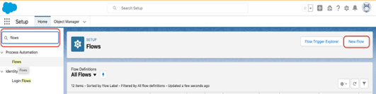

# Verwenden eines benutzerdefinierten Felds für den Umsatzbetrag {#using-a-custom-revenue-amount-field}

Standardmäßig ziehen die Touchpoints der Käuferzuordnung den Opportunity-Betrag aus einem von zwei Feldern:

* Betrag (SFDC-Standard)
* [!DNL Marketo Measure] Opportunity Amount (Custom)

Wenn Sie ein benutzerdefiniertes Feld &quot;Betrag&quot;für Ihre Möglichkeiten verwenden, müssen wir einen Workflow konfigurieren, um den Umsatz für den Touchpoint des Käufers zu berechnen. Dies erfordert fortgeschrittenere Kenntnisse über [!DNL Salesforce], sodass möglicherweise Hilfe von Ihrem SFDC-Administrator benötigt wird.

Zunächst benötigen wir die folgenden Informationen:

* API-Name Ihres Felds &quot;Betrag&quot;

Von hier aus beginnen wir mit der Erstellung des Workflows.

## Workflow in Salesforce Lightning erstellen {#create-the-workflow-in-salesforce-lightning}

Die folgenden Schritte richten sich an Benutzer von Salesforce Lightning. Wenn Sie weiterhin Salesforce Classic verwenden, werden diese Schritte [sind unten aufgeführt](#create-the-workflow-in-salesforce-classic).

1. Geben Sie unter Einrichtung &quot;Fluss&quot;in das Feld &quot;Schnellsuche&quot;ein und wählen Sie **Flüsse** um Flow Builder zu starten. Klicken Sie im rechten Bereich auf die **Neuer Fluss** Schaltfläche.

   

1. Auswählen **Aufzeichneter Fluss** und klicken Sie auf **Erstellen** rechts unten.

   

1. Wählen Sie im Fenster Start konfigurieren das Objekt Chancen aus. Wählen Sie im Abschnitt Trigger konfigurieren die Option **Ein Datensatz wird erstellt oder aktualisiert**.

   

1. Wählen Sie im Abschnitt Einstiegsbedingungen festlegen unter Bedingungsanforderungen die Option **Benutzerdefinierte Bedingungslogik ist erfüllt**.
   * Wählen Sie im Suchfeld das benutzerdefinierte Feld Betrag aus.
   * Setzen Sie den Operator auf **Is Null** und der Wert als **False**.
   * Legen Sie die Auswertungskriterien auf **Jedes Mal, wenn ein Datensatz aktualisiert wird, erfüllt er die Bedingungsanforderungen**.

   

1. Wählen Sie unter dem Abschnitt &quot;Fluss optimieren für&quot;die Option **Schnelle Feldaktualisierungen**. Klicks **Fertig**.

   

1. Um das Element hinzuzufügen, klicken Sie auf das Pluszeichen (+) und wählen Sie **Datensatz-Auslösung aktualisieren**.

   

1. Geben Sie im Fenster Neue Datensätze aktualisieren Folgendes ein:

   * Geben Sie einen Titel ein - der API-Name wird automatisch generiert
   * Wählen Sie unter &quot;So suchen Sie Datensätze, die aktualisiert und deren Werte festgelegt werden sollen&quot;die Option **Verwenden Sie den Opportunity-Datensatz, der den Fluss ausgelöst hat.**.
   * Wählen Sie im Abschnitt &quot;Filterbedingungen festlegen&quot;die Option **Immer Datensatz aktualisieren** als Bedingung zum Aktualisieren von Datensätzen.
   * Wählen Sie unter &quot;Feldwerte für den Kampagnensatz festlegen&quot;aus dem Feld Marketo Measure Opportunity Amount und value Ihr benutzerdefiniertes Amount -Feld aus.
   * Klicks **Fertig**.

   

1. Klicken Sie auf **Speichern**. Ein Popup wird angezeigt. Geben Sie im Fenster Fluss speichern &quot;Flussbezeichnung&quot;ein (der Fluss-API-Name wird automatisch generiert). Klicks **Speichern** erneut.

   

1. Klicken Sie auf **Aktivieren** -Schaltfläche, um den Fluss zu aktivieren.

   

## Erstellen des Workflows in Salesforce Classic {#create-the-workflow-in-salesforce-classic}

Die folgenden Schritte richten sich an Benutzer von Salesforce Classic. Wenn Sie zum Salesforce-Blitzgerät gewechselt haben, werden diese Schritte [finden Sie oben](#create-the-workflow-in-salesforce-lightning).

1. Navigieren Sie zu **[!UICONTROL Einrichtung]** > **[!UICONTROL Erstellen]** > **[!UICONTROL Workflow und Genehmigungen]** > **[!UICONTROL Workflow-Regeln]**.

   

1. Auswählen **[!UICONTROL Neue Regel]**, legen Sie das Objekt als &quot;Opportunity&quot;fest und klicken Sie auf **[!UICONTROL Nächste]**.

   

   

1. Konfigurieren Sie den Workflow. Legen Sie den Regelnamen auf &quot;Aktualisieren&quot;fest. [!DNL Marketo Measure] Opportunity Amount.&quot; Setzen Sie die Bewertungskriterien auf &quot;Erstellt und jedes Mal, wenn es bearbeitet wird&quot;. Wählen Sie für die Regelkriterien das benutzerdefinierte Feld Betrag aus und wählen Sie den Operator [!UICONTROL als &quot;not equal to&quot;(nicht gleich)] und lassen Sie das Feld &quot;Wert&quot;leer.

   

1. Hinzufügen einer Workflow-Aktion. Setzen Sie diese Auswahlliste auf &quot;[!UICONTROL Neue Feldaktualisierung].&quot;
   

1. Hier geben Sie die Feldinformationen ein. Im Feld &quot;Name&quot;wird die Verwendung der folgenden Benennung empfohlen: &quot;[!DNL Marketo Measure] Opp Amount.&quot; Der &quot;eindeutige Name&quot;wird automatisch basierend auf dem Feld &quot;Name&quot;aufgefüllt. Wählen Sie in der Auswahlliste &quot;Zu aktualisierendes Feld&quot;die Option[!DNL Marketo Measure] Opportunity Amount.&quot; Nachdem Sie das Feld ausgewählt haben, wählen Sie das Feld &quot;Workflow-Regeln nach Feldänderung neu bewerten&quot;. Wählen Sie unter &quot;Geben Sie den neuen Feldwert an&quot;die Option &quot;Verwenden Sie eine Formel, um den neuen Wert festzulegen&quot;. Legen Sie in das leere Feld den API-Namen des benutzerdefinierten Felds Betrag ab. Klicken Sie auf **[!UICONTROL Speichern]**.

   

1. Sie werden auf eine Rollup-Seite für Ihren Workflow zurückgeführt, stellen Sie sicher, dass Sie &quot;Aktivieren&quot;auswählen, und Sie können sofort loslegen. Klicken Sie zur Aktivierung auf **Bearbeiten** neben Ihrem neuen Workflow klicken Sie auf **Aktivieren**.

   Nachdem Sie diese Schritte ausgeführt haben, müssen die Möglichkeiten aktualisiert werden, damit der Workflow Trigger werden kann, sodass der neue Wert aus dem [!UICONTROL benutzerspezifische Chance] -Feld.

   Dies lässt sich erreichen, indem Sie Ihre Möglichkeiten über Data Loader in SFDC ausführen. Weitere Informationen zur Verwendung von Data Loader finden Sie unter [diesem Artikel](/help/advanced-marketo-measure-features/custom-revenue-amount/using-data-loader-to-update-marketo-measure-custom-amount-field.md).

Wenden Sie sich bei weiteren Fragen bitte an das Adobe Account Team (Ihren Kundenbetreuer) oder [[!DNL Marketo] Support](https://nation.marketo.com/t5/support/ct-p/Support){target="_blank"}.
