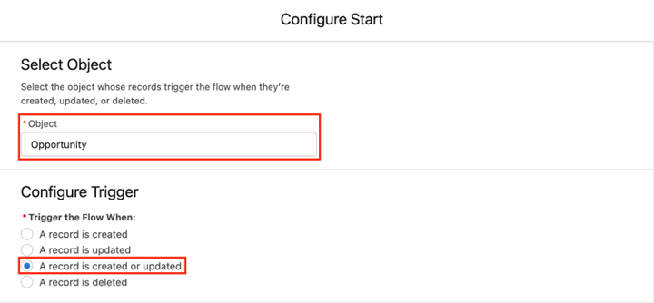
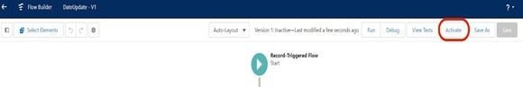

# Verwenden eines benutzerdefinierten Felds für den Umsatzbetrag {#using-a-custom-revenue-amount-field}

Standardmäßig ziehen die Touchpoints der Käuferzuordnung den Opportunity-Betrag aus einem von zwei Feldern:

* Betrag (SFDC-Standard)
* [!DNL Marketo Measure] Opportunity Amount (Custom)

Wenn Sie ein benutzerdefiniertes Feld &quot;Betrag&quot;für Ihre Möglichkeiten verwenden, müssen wir einen Workflow konfigurieren, um den Buyer Touchpoint-Umsatz zu berechnen. Dies erfordert ein wenig mehr erweitertes Wissen über [!DNL Salesforce], sodass es möglicherweise Hilfe von Ihrem SFDC-Administrator erfordert.

Zunächst benötigen wir die folgenden Informationen:

* API-Name Ihres Felds &quot;Betrag&quot;

Von hier aus beginnen wir mit der Erstellung des Workflows.

## Workflow in Salesforce Lightning erstellen {#create-the-workflow-in-salesforce-lightning}

Die folgenden Schritte richten sich an Benutzer von Salesforce Lightning. Wenn Sie weiterhin Salesforce Classic verwenden, sind diese Schritte [unter ](#create-the-workflow-in-salesforce-classic) aufgeführt.

1. Geben Sie unter Einrichtung &quot;Fluss&quot;in das Feld &quot;Schnellsuche&quot;ein und wählen Sie **[!UICONTROL Fluss]** aus, um den Flussaufbau zu starten. Klicken Sie im rechten Bereich auf die Schaltfläche **[!UICONTROL Neuer Fluss]** .

   

1. Wählen Sie **[!UICONTROL aufgezeichneten Fluss]** aus und klicken Sie unten rechts auf **[!UICONTROL Erstellen]** .

   

1. Wählen Sie im Fenster Start konfigurieren das Objekt Chancen aus. Wählen Sie im Bereich [!UICONTROL Trigger konfigurieren] die Option **[!UICONTROL Ein Datensatz wird erstellt oder aktualisiert]**.

   

1. Wählen Sie im Abschnitt Einstiegsbedingungen festlegen unter [!UICONTROL Bedingungsanforderungen] die Option **[!UICONTROL Benutzerdefinierte Bedingungslogik ist erfüllt]** aus.
   * Wählen Sie im Suchfeld das benutzerdefinierte Feld Betrag aus.
   * Setzen Sie den Operator auf **Is Null** und den Wert auf **[!UICONTROL False]**.
   * Setzen Sie die Auswertungskriterien auf &quot;**[!UICONTROL Jedes Mal, wenn ein Datensatz aktualisiert wird und die Bedingungsanforderungen erfüllt]**&quot;.

   

1. Wählen Sie unter dem Abschnitt &quot;Fluss optimieren für&quot;die Option **[!UICONTROL Schnelle Feldaktualisierungen]**. Klicken Sie unten rechts auf **[!UICONTROL Fertig]** .

   

1. Um das Element hinzuzufügen, klicken Sie auf das Pluszeichen (+) und wählen Sie **[!UICONTROL Update Triggering Record]** aus.

   

1. Geben Sie im Fenster Neue Datensätze aktualisieren Folgendes ein:

   * Geben Sie einen Titel ein - der API-Name wird automatisch generiert
   * Wählen Sie unter &quot;How to Find Records to Update and Set Your Values&quot;(So suchen Sie Datensätze, die aktualisiert und deren Werte festgelegt werden sollen) die Option **[!UICONTROL Use the Opportunity record, das den Fluss ausgelöst hat]**.
   * Wählen Sie im Abschnitt &quot;[!UICONTROL Filterbedingungen festlegen]&quot;die Option **[!UICONTROL Datensatz immer aktualisieren]** als Bedingungsanforderung zum Aktualisieren von Datensätzen.
   * Wählen Sie unter &quot;[!UICONTROL Feldwerte für den Kampagnensatz festlegen]&quot;im Feld die Option &quot;Marketo Measure-Opportunity Amount&quot;und den Wert &quot;from&quot;. Wählen Sie dann das benutzerdefinierte Feld Betrag aus.
   * Klicken Sie auf **[!UICONTROL Fertig]**.

   

1. Klicken Sie auf **[!UICONTROL Speichern]**. Ein Popup wird angezeigt. Geben Sie im Fenster Fluss speichern &quot;Flussbezeichnung&quot;ein (der Fluss-API-Name wird automatisch generiert). Klicken Sie erneut auf **[!UICONTROL Speichern]**.

   

1. Klicken Sie auf die Schaltfläche **[!UICONTROL Aktivieren]** , um den Fluss zu aktivieren.

   

## Erstellen des Workflows in Salesforce Classic {#create-the-workflow-in-salesforce-classic}

Die folgenden Schritte richten sich an Benutzer von Salesforce Classic. Wenn Sie den Wechsel zu Salesforce Lightning durchgeführt haben, finden Sie diese Schritte [über](#create-the-workflow-in-salesforce-lightning).

1. Navigieren Sie zu **[!UICONTROL Einrichten]** > **[!UICONTROL Erstellen]** > **[!UICONTROL Workflow und Genehmigungen]** > **[!UICONTROL Workflow-Regeln]**.

   

1. Wählen Sie **[!UICONTROL Neue Regel]**, legen Sie das Objekt als &quot;Gelegenheit&quot;fest und klicken Sie auf **[!UICONTROL Weiter]**.

   

   

1. Konfigurieren Sie den Workflow. Legen Sie den Regelnamen auf &quot;Update [!DNL Marketo Measure] Opportunity Amount&quot;fest. Setzen Sie die Bewertungskriterien auf &quot;Erstellt und jedes Mal, wenn es bearbeitet wird&quot;. Wählen Sie für die Regelkriterien das benutzerdefinierte Feld &quot;Betrag&quot;aus, wählen Sie den Operator [!UICONTROL als &quot;Nicht gleich&quot;] aus und lassen Sie das Feld &quot;Wert&quot;leer.

   

1. Hinzufügen einer Workflow-Aktion. Setzen Sie diese Auswahlliste auf &quot;[!UICONTROL Neues Feld-Update]&quot;.
   

1. Hier werden die Feldinformationen ausgefüllt. Im Feld &quot;Name&quot;wird die Verwendung der folgenden Benennung empfohlen: &quot;[!DNL Marketo Measure] Opp Amount&quot;. Der &quot;eindeutige Name&quot;wird automatisch basierend auf dem Feld &quot;Name&quot;aufgefüllt. Wählen Sie in der Auswahlliste &quot;Zu aktualisierendes Feld&quot;die Option &quot;[!DNL Marketo Measure] Opportunity Amount&quot;. Nachdem Sie das Feld ausgewählt haben, wählen Sie das Feld &quot;Workflow-Regeln nach Feldänderung neu bewerten&quot;. Wählen Sie unter &quot;Geben Sie den neuen Feldwert an&quot;die Option &quot;Verwenden Sie eine Formel, um den neuen Wert festzulegen&quot;. Legen Sie in das leere Feld den API-Namen des benutzerdefinierten Felds Betrag ab. Klicken Sie auf **[!UICONTROL Speichern]**.

   

1. Sie werden auf eine Rollup-Seite für Ihren Workflow zurückgeführt, stellen Sie sicher, dass Sie &quot;Aktivieren&quot;auswählen, und gehen Sie gut. Klicken Sie zum Aktivieren auf **[!UICONTROL Bearbeiten]** neben Ihrem neuen Workflow und klicken Sie dann auf **[!UICONTROL Aktivieren]**.

   Nachdem Sie diese Schritte ausgeführt haben, müssen die Möglichkeiten aktualisiert werden, damit der Workflow den neuen Trigger aus dem Feld [!UICONTROL benutzerdefinierte Gelegenheit] erhält.

   Dies lässt sich erreichen, indem Sie Ihre Möglichkeiten über Data Loader in SFDC ausführen. Weitere Informationen zur Verwendung von Data Loader finden Sie in [diesem Artikel](/help/advanced-marketo-measure-features/custom-revenue-amount/using-data-loader-to-update-marketo-measure-custom-amount-field.md).

Wenden Sie sich bei weiteren Fragen an das Adobe Account Team (Ihren Kundenbetreuer) oder an den [[!DNL Marketo] Support](https://nation.marketo.com/t5/support/ct-p/Support){target="_blank"}.
