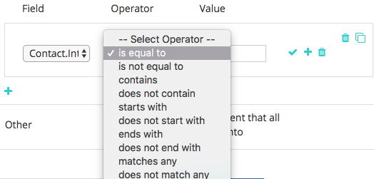

# Benutzerdefinierte Segmentierung {#custom-segmentation}

Segmente bieten die Möglichkeit, Daten im [!DNL Marketo Measure] ROI-Dashboard zu filtern, um einen bestimmten Datensatz weiter aufzuschlüsseln. Beispielsweise könnte ein Segment nach geografischem Gebiet oder einem Klassifizierungssystem definiert werden.

**Warum benutzerdefinierte Segmentierung?**

Mit der benutzerdefinierten Segmentierung können Sie Touchpoints nach Kategorien (Filtername) und Regeln (Filterwerte) filtern. Tier-1-Kunden erhalten ein Segment, die Ebenen 2 und höher zehn. Je nachdem, auf welches Objekt Ihr ROI-Dash verweist (Lead oder Kontakt), können Sie Segmente basierend auf den Feldern erstellen, die im Lead-/Kontaktobjekt gefunden werden. Außerdem können Sie Segmente basierend auf Feldern erstellen, die im Opportunity-Objekt gefunden wurden.

**Wann ist die Funktion &quot;Benutzerspezifische Segmentierung&quot;hilfreich?**

Benutzerdefinierte Segmentierung kann verwendet werden, um Daten für einen bestimmten Datensatztyp anzuzeigen. Nachdem Sie die Filterlogik zugeordnet haben, sollten Sie in der Demand Waterfall-Ansicht des Dashboards [!DNL Marketo Measure] die gleichen Daten sehen wie in Ihrem CRM-System.

**Wie richte ich ihn ein?**

>[!NOTE]
>
>Beim Aktualisieren von Segmentregeln werden historische Daten erneut verarbeitet.

Schritt 1: Bestimmen Sie, welche Informationen Sie sehen möchten.

Bevor Sie diese Funktion verwenden, sollten Sie herausfinden, nach welchen Touchpoint-Informationen Sie filtern möchten. Denken Sie daran, die exakten Werte in Ihrem CRM-System für Ihre Datensatztypen zu verwenden. Durch das Setup werden Touchpoints von oben nach unten im Marketing-Trichter gefiltert.

Schritt 2: Anmelden und Suchen Sie die Funktion [!UICONTROL Segmente] .

* Wechseln Sie zu [experience.adobe.com/marketo-measure](https://experience.adobe.com/marketo-measure){target="_blank"} und melden Sie sich an.
* Wählen Sie auf der Registerkarte [!UICONTROL Mein Konto] die Option [!UICONTROL Einstellungen]
* Wählen Sie [!UICONTROL Segmente] aus den Optionen auf der Seitenleiste links im Abschnitt [!UICONTROL Berichterstellung] aus.

Schritt 3: Grundlegendes zu den Komponenten.

* Verwenden Sie diese Legende, um die verschiedenen Symbole auf dieser Seite zu verstehen.

Schritt 4: Hinzufügen von Filterregeln

* Geben Sie zunächst den Kategorienamen ein. [!UICONTROL Geschäftstyp] ist ein Beispiel. Klicken Sie auf das Häkchen, wenn Sie fertig sind. Sie müssen einen Kategorienamen eingeben, bevor Sie Segmente hinzufügen können
* Klicken Sie auf das Pluszeichen, um ein Segment hinzuzufügen.
* Geben Sie einen Segmentnamen ein. Sie könnten beispielsweise ein Segment für &quot;New Business&quot;, &quot;Partners&quot;, &quot;Renewal&quot;oder &quot;Upsell&quot;haben

* Klicken Sie auf das Pluszeichen, um die Regeleingabefelder anzuzeigen. Die Optionen in der Feldauswahl beziehen Felder direkt aus Ihrem CRM-System.

>[!NOTE]
>
>Formelfelder können nicht in Ihren Regeln verwendet werden und werden nicht in der Auswahlliste angezeigt. Da Formeln im Hintergrund berechnet werden und einen Datensatz nicht ändern, kann [!DNL Marketo Measure] nicht erkennen, ob ein Datensatz zu einer Regel passt oder nicht.

* Die Option [!UICONTROL Wert] ist keine Dropdown-Liste und der Wert muss manuell eingegeben werden. Überprüfen Sie unbedingt die Werte in Ihrer Salesforce-Organisation.
* Wiederholen Sie diesen Vorgang für die Segmentregeln &quot;Chancen&quot;.
* Die Kategorie &quot;Sonstige&quot;ist ein Standardsegment, das alle nicht definierten Touchpoints erfasst. Sie können den Namen des Standardsegments ändern
* Klicken Sie auf das Papierkorbsymbol, um eine ganze Kategorie oder eine einzelne Regel innerhalb einer Kategorie zu löschen. Alternativ können Sie auf das Stiftsymbol klicken, um die Kategorie oder Regel zu bearbeiten
* Beachten Sie, dass Sie über die Schaltfläche &quot;[!UICONTROL Speichern]&quot;und die Schaltfläche &quot;Speichern und verarbeiten&quot;verfügen. Verwenden Sie die Schaltfläche Speichern , um Ihre Arbeit und Änderungen im Laufe der Zeit zu speichern. Verwenden Sie die Schaltfläche Speichern und verarbeiten NUR, wenn Sie Folgendes sichergestellt haben:

   * Ihre Zuordnung ist korrekt
   * Sie haben alle Segmente hinzugefügt, die Sie innerhalb einer Kategorie verfolgen möchten
   * Die Schaltfläche &quot;Speichern und verarbeiten&quot;Trigger [!DNL Marketo Measure] zum Synchronisieren aller Touchpoints und zum Anwenden der von Ihnen hinzugefügten neuen Informationen. Dieser Vorgang dauert 7 Tage und Regeln können während dieses Zeitraums nicht geändert werden

**_Zusätzliche Hinweise:_**

Wenn keine Regeln für Leads/Kontakte und Chancen eingerichtet sind, sehen Sie nur einen Teil Ihrer Daten. Wenn Sie also nicht die Angebotsregeln einrichten, sehen Sie nur Lead-/Kontaktdaten ohne die damit verbundenen Möglichkeiten. Dasselbe gilt, wenn Sie keine Regeln für Leads/Kontakte einrichten - Sie sehen nur Chancen ohne die zugehörigen Leads/Kontakte.

Wenn Sie fertig sind, klicken Sie zuerst auf [!UICONTROL Speichern], überprüfen Sie alles und klicken Sie dann auf [!UICONTROL Speichern und verarbeiten]. Beachten Sie, dass Sie Ihre Einstellungen sieben Tage nach dem Speichern und Verarbeiten nicht bearbeiten können, da [!DNL Marketo Measure] Ihre Daten während dieser Zeit neu formatiert.

Wenn Sie Marketo Measure Ultimate-Kunde sind und Ihr standardmäßiges Dashboard-Objekt als &quot;Kontakt&quot;festgelegt haben, verwenden Sie nicht die folgenden beiden für &quot;Lead&quot;spezifischen Felder ([Weitere Informationen](/help/marketo-measure-ultimate/data-integrity-requirement.md){target="_blank"}).

* b2b.personStatus
* b2b.isConverted

**Wie speichere ich die generierten Berichte?**

Die erstellten Berichte können nicht direkt in der Benutzeroberfläche gespeichert werden. [!DNL Marketo Measure] speichert jedoch die Segmentnamen in der URL, sodass Sie jeden Bericht mit einem Lesezeichen auf der Seite speichern können.
