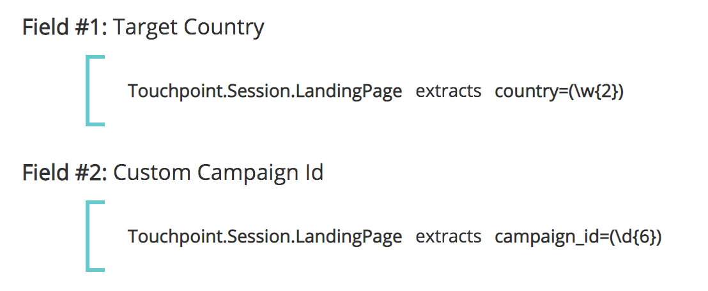

# Touchpoint Felder {#touchpoint-fields}

Traditionell schult unser Customer Success-Team, wenn Kunden [!DNL Marketo Measure] mit einbinden und wir keine direkte Tagging-Integration haben, unsere Kunden darin, wie sie ihre Landingpages entsprechend taggen können, damit sie das richtige UTM-Format verwenden und wir ihre Anzeigen auflösen können. Einige dieser Kunden verwenden keine UTMs, sondern eigene Tagging-Parameter. Dies bedeutet, dass es sehr zeitaufwendig sein kann, alle Landingpages über alle Werbenetzwerke hinweg mit einer neuen Tagging-Struktur zu bearbeiten, die [!DNL Marketo Measure] durchsetzt. Um uns an ihre Tagging-Struktur anzupassen, akzeptieren wir jetzt benutzerdefinierte Parameter, die unseren Regeldefinitionen zugeordnet werden können. Das Ziel besteht darin, die benutzerdefinierten Tracking-Parameter der Kunden anzupassen, sodass wir sie nicht dazu zwingen müssen, ihre URL-Struktur zu ändern.

>[!AVAILABILITY]
>
>Verfügbar mit vollständiger Segmentierung in Tier 2-Abonnements.

>[!NOTE]
>
>Dies ist eine erweiterte Funktion, die nur von Professional Services eingerichtet werden sollte.

## Aktivieren der Funktion {#enabling-the-feature}

Navigieren Sie im Menü [!DNL Marketo Measure] zur Seite Touchpoint-Felder . Dort können Sie die Funktion aktivieren, indem Sie **Ja** unter **Berechnete Felder aktivieren** auswählen. Nachdem die Funktion aktiviert wurde, können Sie Touchpoint-Felder erstellen.

## Anleitung {#how-to}

Um ein berechnetes Feld zu erstellen, beachten Sie, dass ein Benutzer drei verschiedene Aktionen ausführen kann: Extrahieren, Zuordnen zu und Verketten. Diese werden auch als Operatoren zum Definieren eines berechneten Felds bezeichnet.

### Auszüge {#extracts}

Der [!UICONTROL extrahiert]-Operator ruft den Wert eines Felds von einem anderen Speicherort ab, z. B. einem Kampagnenfeld oder Lead-Feld, oder extrahiert in einem komplexeren Anwendungsfall benutzerdefinierte Parameter aus der Landingpage. Anschließend wird sie in ein Touchpoint-Feld platziert.

**Beispiel #1**

Es gibt ein benutzerdefiniertes Feld für den Kontakt, campaign_source__c, das der Kunde zu Berichtszwecken auf den Touchpoint ablegen möchte. Sie können eine Regel definieren, um ein berechnetes Feld namens „Campaign Source&quot; zu erstellen und den Wert in dieses Feld abzulegen.

Ziel: Verwenden des Werts eines benutzerdefinierten Felds und Ablegen im Touchpoint-Objekt für ein einfacheres Reporting.

* Erstellen Sie ein berechnetes Feld und beschriften Sie es mit „Campaign Source&quot;
* Definieren Sie die Regel, indem Sie nach dem Feld Kontakt.Campaign_Source__c suchen
* Verwenden Sie den Operator „extrahiert“, da wir den Wert aus dem Parameter abrufen müssen
* Um die vollständige Zeichenfolge aus dem Feld zu extrahieren, verwenden wir den Ausdruck „(.&#42;)“

   * **(** markiert den Beginn der Extraktion
   * **)** markiert das Ende der Extraktion
   * **.&#42;** sagt uns, dass wir die vollständige Zeichenfolge extrahieren

**Beispiel #2**

Ein gängiges Anwendungsbeispiel für diese Funktion ist das Abrufen von Werten aus benutzerdefinierten Parametern einer URL-Zeichenfolge. Dies ist nützlich, wenn Sie andere Parameter als UTMs verwenden, die Werte jedoch in Touchpoint-Felder auswerten möchten.

**link:** `https://www.adobe.com/blog/marketing-revenue-reporting-overview?promo=5OFF` oder `https://www.adobe.com/blog/marketing-revenue-reporting-overview?promo=25OFF`.\
**Ziel:** ein benutzerdefiniertes Feld mit dem Namen „Rabattcode“ erstellen und den Wert „5OFF“ oder „25OFF“ ablegen, unabhängig davon, welcher Wert übergeben wird.

* Erstellen Sie ein berechnetes Feld und beschriften Sie es mit „Rabattcode“
* Definieren Sie die Regel, indem Sie zunächst nach dem Feld Touchpoint.Session.LandingPage suchen
* Verwenden Sie den Operator „extrahiert“, da wir den Wert aus dem Parameter abrufen müssen
* Um den Wert der Promotion zu extrahieren, definieren wir den Wert als „promo=(\w+)“

   * **(** markiert den Beginn der Extraktion
   * **)** markiert das Ende der Extraktion
   * **\w** gibt an, dass wir ein „Wort“ extrahieren, das 0-9 enthält
   * **+** extrahiert den vollständigen Wert des Parameters ohne Zeichenbeschränkung
   * Beachten Sie, dass Sie einen Schrägstrich und keinen umgekehrten Schrägstrich verwenden

**Beispiel #3**

Versuchen wir ein ähnliches Beispiel, bei dem wir einen Trackingcode extrahieren, z. B.: `https://www.adobe.com/blog/marketing-revenue-reporting-overview?cid=123456`.

**Ziel** Erstellen Sie ein berechnetes Feld und beschriften Sie es mit &quot;Adobe Campaign-ID“ mit dem Wert aus dem Parameter „cid“.

* Erstellen Sie ein berechnetes Feld und beschriften Sie es mit &quot;Adobe Campaign-ID“
* Definieren Sie die Regel, indem Sie zunächst nach dem Feld Touchpoint.Session.LandingPage suchen
* Verwenden Sie den Operator „extrahiert“, da wir den Wert aus dem Parameter abrufen müssen
* Um den Wert „123456“ zu extrahieren, definieren wir den Wert als „cid=(\d{6})“

   * **(** markiert den Beginn der Extraktion
   * **)** markiert das Ende der Extraktion
   * **\d** gibt an, dass wir eine „Ziffer“ extrahieren
   * **{6}** ist die Anzahl der Zeichen, die extrahiert werden

**Beispiel #4**

Da Ihre Landingpages immer komplizierter werden und Sie über mehrere Tracking-Parameter verfügen, müssen Sie möglicherweise mehrere Touchpoint-Felder erstellen und Werte mehrmals extrahieren, z. B.:
`https://www.adobe.com/blog/marketing-revenue-reporting-overview?trackID=123456&country=US&campaign_ID=7890`.

**Ziel** Erstellen Sie mehrere berechnete Felder für „Zielland“ und „Benutzerdefinierte Kampagnen-ID“ mit den entsprechenden Werten aus den Parametern.

* Erstellen Sie ein berechnetes Feld und beschriften Sie es mit „Zielland“
* Definieren Sie die Regel, indem Sie zunächst nach dem Feld Touchpoint.Session.LandingPage suchen
* Verwenden Sie den Operator „extrahiert“, da wir den Wert aus dem Parameter abrufen müssen
* Um den Wert „US“ zu extrahieren, definieren wir den Wert als „country=(\w{2})“

   * **(** markiert den Beginn der Extraktion
   * **)** markiert das Ende der Extraktion
   * **\W** gibt an, dass wir ein „Wort“ extrahieren
   * **{2}** ist die Anzahl der Zeichen, die extrahiert werden

* Erstellen Sie ein berechnetes Feld und beschriften Sie es mit „Benutzerdefinierte Kampagnen-ID“
* Definieren Sie die Regel, indem Sie zunächst nach dem Feld Touchpoint.Session.LandingPage suchen
* Verwenden Sie den Operator „extrahiert“, da wir den Wert aus dem Parameter abrufen müssen
* Um den Wert „123456“ zu extrahieren, definieren wir den Wert als „campaign_ID=(\d{6})“

   * **(** markiert den Beginn der Extraktion
   * **)** markiert das Ende der Extraktion
   * **\d** gibt an, dass wir eine „Ziffer“ extrahieren
   * **{6}** ist die Anzahl der Zeichen, die extrahiert werden

### Zuordnungen zu {#maps-to}

Der [!UICONTROL Maps-to]-Operator erstellt eine Tabelle von Werten, die in einen anderen Wert übersetzt oder zusammengefasst werden müssen. Normalerweise hat dies die Form eines Schlüsselwerts, bei dem ein Code einen Anzeigenamen darstellt und diesem Anzeigenamen zugeordnet werden muss.

**Beispiel #1**

Es gibt Kampagnen, die Sie für eine „End-of-Summer-Promotion“ und eine „Black Friday-Promotion“ erstellt haben und die über mehrere Kanäle laufen. Sie möchten ein berechnetes Feld namens „Initiative“ erstellen und alle Touchpoints mit einer „Ende-Sommer-Promotion“ oder einer „Black Friday-Promotion“ zusätzlich zu anderen möglichen Werten einem Initiativwert wie „Promotions“ zuordnen.

**Beispiel #2**

Nachdem wir nun gelernt haben, wie man Felder extrahiert und ihnen zuordnet, kombinieren wir diese Aktionen, um zunächst einen Wert aus einem Parameter zu extrahieren und ihn dann einem benutzerfreundlichen Namen zuzuordnen, der etwas sinnvoller ist. Beginnen wir also mit dieser Landingpage: `https://www.adobe.com/blog/marketing-revenue-reporting-overview?BZ=04-01-09-03-10`.

**Ziel** Erstellen Sie mehrere berechnete Felder, wobei die erste Zahl einer Region, die zweite einem Produkt, die dritte einer Initiative, die vierte einer Rolle und die fünfte einer Medienplattform zugeordnet ist. Ordnen Sie dann den numerischen Wert einem „Anzeigenamen“ zu.

* Erstellen Sie ein berechnetes Feld und beschriften Sie es mit „Region“
* Definieren Sie die Regel, indem Sie zunächst nach dem Feld Touchpoint.Session.LandingPage suchen
* Verwenden Sie den Operator [!UICONTROL extrahiert], da wir den Wert aus dem Parameter abrufen müssen
* Um den Wert „04“ zu extrahieren, definieren wir den Wert als „BZ=(\d{2})-\d{2}-\d{2}-\d{2}-\d{2}&quot;

   * **(** markiert den Beginn der Extraktion

      * Beachten Sie, dass nur die ersten Ziffern eine offene Klammer aufweisen, da nur die vier Ziffern extrahiert werden
   * **)** markiert das Ende der Extraktion

      * Beachten Sie, dass nur die ersten Ziffern die geschlossene Klammer aufweisen, da nur die vier Ziffern extrahiert werden
   * **\d** gibt an, dass wir eine „Ziffer“ extrahieren
   * **{2}** ist die Anzahl der Zeichen, die extrahiert werden

* Klicken Sie auf [!UICONTROL Speichern]. Sie müssen Ihr neues Feld speichern, bevor es für die nächste Regel verwendet werden kann!
* Als Nächstes möchten wir alle möglichen Werte für die ersten Ziffern seinen Anzeigenamen zuordnen
* Erstellen Sie ein berechnetes Feld und beschriften Sie es mit „Region_Name“
* Definieren Sie die Regel, indem Sie mit der Suche nach dem extrahierten Feld beginnen. In diesem Fall [!DNL Touchpoint.Region]
* Verwenden Sie den Operator [!UICONTROL zu“, &#x200B;] eine Zuordnung für jede Zahl zu ihrem Wert erstellen möchten
* Es wird eine Tabelle angezeigt, in der die einzelnen Zuordnungen aufgelistet werden. Am Ende wird er ungefähr so aussehen:
* Basierend auf der Zuordnung und der obigen URL würde der „Region_Wert“ für einen Touchpoint mit dieser Landingpage „EMEA“ lauten
* Wiederholen Sie die Extraktion und die Zuordnung für die verbleibenden 4 Ziffernsätze

   * Um 01 zu extrahieren, definieren Sie den Wert als „BZ=\d{2}-**(\d{2})**-\d{2}-\d{2}-\d{2}&quot;
   * Um 09 zu extrahieren, definieren Sie den Wert als „BZ=\d{2}-\d{2}-**(\d{2})**-\d{2}-\d{2}&quot;
   * Um 03 zu extrahieren, definieren Sie den Wert als „BZ=\d{2}-\d{2}-\d{2}-**(\d{2})**-\d{2}&quot;
   * Um die 10 zu extrahieren, definieren Sie den Wert als „BZ=\d{2}-\d{2}-\d{2}-\d{2}-**(\d{2})**&quot;

### Verkettet {#concatenates}

Der [!UICONTROL verkettet] Operator kombiniert Werte aus mehreren Feldern zu einem einzigen Feld. Dies ist nützlich, um einen benutzerdefinierten Wert zu erstellen, der Daten über verschiedene Felder hinweg abruft, um

**Beispiel #1**

Es gibt separate Felder im Opportunity-Objekt für Segment__c und Grad__c, die der Benutzer zu Berichtszwecken zu einem einzigen Feld im Touchpoint-Objekt kombinieren möchte. Durch Verketten der Felder werden Werte wie Enterprise_A oder Mid-Market_B angezeigt.

## Touchpoint-Felder und Segmente {#touchpoint-fields-and-segments}

Nachdem die Werte aus Ihrer URL ausgewertet wurden und auf dem Touchpoint vorhanden sind, sehen Sie die neuen Felder, wo immer Touchpoint-Felder verwendet werden, z. B. zum Erstellen von Segmenten oder zum Definieren von Regeln für das Löschen von Touchpoints.

Die Möglichkeit, Segmente mithilfe von Touchpoint-Feldern zu erstellen, ist mit dieser Produktversion verfügbar. Segmente konnten zuvor nicht mit Touchpoint-Feldern erstellt werden.

Um das Erstellen von Segmenten zu vereinfachen, können Sie jetzt aus den erstellten Touchpoint-Feldern dynamische Segmente erstellen. Wenn Sie beispielsweise ein Touchpoint-Feld erstellt haben, das eine geografische Region analysiert hat, anstatt für jede mögliche Region ein Segment zu erstellen, können Sie ein Segment einrichten, und wir erstellen Segmente für jede Instanz, für die ein neuer Wert angezeigt wird. Dies ist äußerst hilfreich, wenn ein Attribut wie die Postleitzahl geparst und als Segment verwendet werden muss!

Ihr Setup würde in etwa wie im folgenden Screenshot aussehen. Der Segmentname ruft den Wert des Touchpoint-Felds dynamisch unter Verwendung der geschweiften Klammern ab, um nach Ihrem Feld zu suchen.

Die Regel verweist auf dasselbe Touchpoint-Feld und sucht nach Werten, die „nicht gleich null“ sind.

## FAQs {#faq}

**Gibt es eine maximale Anzahl von Touchpoint-Feldern, die wir erstellen können?**

Es gibt eine Beschränkung von 100 Feldern.

**Ich sehe mein neues Touchpoint-Feld, das ich gerade erstellt habe, nicht in der Auswahlliste. Wo ist sie?**

Vergessen Sie nicht, Ihre Regeln zu speichern, nachdem Sie sie erstellt haben. Wenn Ihr neues Feld nicht angezeigt wird, überprüfen Sie, ob Sie gespeichert haben. Sie müssen das neue Feld speichern, bevor es für die nächste Regel verwendet werden kann.

>[!NOTE]
>
>Aufgrund der Komplexität ist ein Touchpoint-Feld, das den Operator „Zuordnungen zu“ verwendet, nicht für die Verwendung in einem anderen Touchpoint-Feld verfügbar.

**Welchen Ausdruck verwende ich, um mehrere Parameter aus einer einzelnen Landingpage zu extrahieren?**

Wie im #4 Beispiel extrahieren müssen Sie mehrere Felder erstellen, um jeden Parameter zu extrahieren. Wenn Sie also fünf verschiedene Werte haben, erstellen Sie fünf Touchpoint-Felder, um jeden davon zu extrahieren.

**Warum sehe ich meine neuen Felder nicht im [!DNL Marketo Measure]-Schema?**

Es ist zusätzliche Arbeit erforderlich, um die neuen Felder im [!DNL Marketo Measure] Data Warehouse-Schema offenzulegen. Derzeit werden die Felder über Einstellungen und Konfigurationen verfügbar gemacht, sodass Sie die Touchpoint-Felder beim Erstellen von Segmenten oder beim Erstellen von Regeln zum Löschen von Touchpoints verwenden können.

**Wie kann ich überprüfen, ob mein Extraktionsausdruck gültig ist, und den richtigen Wert abrufen?**

Es gibt ein Online-Tool ([[!DNL https]://regex101.com/](https://regex101.com/){target="_blank"}), mit dem Sie den Ausdruck ausführen und testen können. Der Ausdruck erscheint grün, wenn er gültig ist, oder rot, wenn er ungültig ist. Außerdem ist das [!UICONTROL Erläuterung] oben rechts hilfreich und gibt an, was Sie extrahieren.

