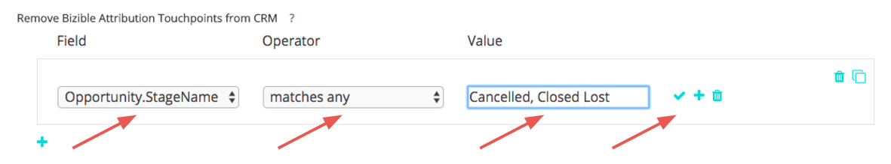
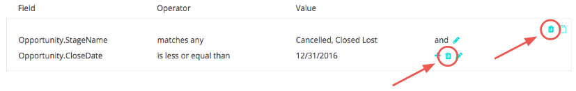

# Entfernen von Touchpoints und Unterdrückung von Touchpoints {#touchpoint-removal-and-touchpoint-suppression}

Erfahren Sie, wie Sie Touchpoints, die bestimmte Kriterien erfüllen, aus Ihrem CRM-System entfernen oder unterdrücken. Dies kann hilfreich sein, um Speicherplatz freizugeben, wenn Sie [!DNL Salesforce] Datenspeicherbeschränkungen.

Es gibt einen wichtigen Unterschied zwischen den Regeln zum Entfernen von Touchpoints und den Regeln zur Touchpoint-Unterdrückung:

* Touchpoint-Entfernung - [!DNL Marketo Measure] löscht (d. h. entfernt) alle Touchpoints aus Ihrem CRM-System, die den Regelkriterien entsprechen. Die Daten _can_ im [!DNL Marketo Measure] ROI-Dashboard, aber nicht mehr im CRM.
* Touchpoint-Unterdrückung - Dies ähnelt dem Entfernen von Touchpoints, die Daten können jedoch NICHT im ROI-Dashboard gemeldet werden.

Bevor Sie mit der Erstellung von Bereinigungs-/Unterdrückungsregeln für Touchpoint beginnen, sollten Sie Ihren Implementierungsplan mit Ihrem Marketing- und Verkaufsteam teilen. Sie sollten bereits wissen, welche Typen oder Werte entfernt werden sollen. Einige der häufigsten Anwendungsfälle sind:

* Touchpoints aus geschlossenen verlorenen Gelegenheiten löschen
* Touchpoints aus sehr alten Leads löschen
* Touchpoints aus nicht qualifizierten Leads löschen

Sobald die Regeln gespeichert wurden, [!DNL Marketo Measure] bereinigt und verteilt Ihr Attributionsmodell neu. Das bedeutet, dass sich die Meilensteine und Positionen ändern und sich das Attributionsguthaben Ihres Kanals ändert! Dadurch werden Ihre Daten geändert. Wenden Sie sich an Ihren Success Manager, wenn Sie Hilfe benötigen.

`1)` Es gibt zwei Abschnitte für Entfernungs-/Unterdrückungseinstellungen. Sie haben die Möglichkeit, diese Einstellung für Käufer-Touchpoints (Leads und Kontakte) oder Käuferzuordnungs-Touchpoints (Kontakte, Chancen und Konten) einzurichten.

Beginnen Sie mit dem Hinzufügen einer Regel und wählen Sie das Feld aus, das Ihre Kriterien definiert.

Wählen Sie aus einer Liste von Operatoren aus, die sich auf den nächsten Satz von Werten beziehen, den Sie in der nächsten Spalte hinzufügen werden.

>[!TIP]
>
>Um mehrere Werte in ein Feld einzufügen, verwenden Sie den Operator &quot;stimmt mit jedem überein&quot;mit Kommas, die jeden Wert trennen.

>[!TIP]
>
>Um einen leeren oder NULL-Wert in einem Feld zu berücksichtigen, lassen Sie einfach die [!UICONTROL Wert] leer. Dabei werden Szenarien berücksichtigt, z. B. die Auswertung mit einem Touchpoint ohne Formular-URL.

>[!NOTE]
>
>Formelfelder können nicht in Ihren Regeln verwendet werden und werden nicht in der Auswahlliste angezeigt. Da Formeln im Hintergrund berechnet werden und einen Datensatz nicht ändern, [!DNL Marketo Measure] kann nicht erkennen, ob ein Datensatz zu einer Regel passt oder nicht.

`2)` Fügen Sie Regeln innerhalb derselben Gruppe hinzu, um die &quot;AND&quot;-Logik in Ihrer Anweisung zu verwenden.
Oder fügen Sie neue Anweisungen außerhalb der Gruppe hinzu, um die &quot;OR&quot;-Logik in Ihrer Anweisung zu verwenden.

`3)` Wenn Ihre Regeln komplex werden und Sie Gruppen neu erstellen und kleine Änderungen an jeder Anweisung vornehmen müssen, verwenden Sie die [!UICONTROL Klonen] -Option, um die Dinge zu vereinfachen.

Wenn du einen Fehler machst, mach dir keine Sorgen. Sie können auch einzelne Zeilen Ihrer Anweisung oder vollständige Gruppen löschen.

`4)` Richten Sie Regeln für die Touchpoints der Käuferzuordnung ein, wenn Sie möchten, dass sie auf beide Objekte angewendet werden. Unsere Flexibilität ermöglicht es Ihnen, Regeln für ein oder beide Objekte festzulegen und diese für beide Objekte einzurichten, sofern sie zutreffen.

bis zum Ende: [!UICONTROL Speichern und verarbeiten] Ihre Regeln. Wenn Sie viele Änderungen vornehmen, stellen Sie sicher, dass Sie Ihre Änderungen auf dem Weg speichern. [!DNL Marketo Measure] beginnt nicht mit dem Entfernen Ihrer Touchpoints, bis Sie auf die Schaltfläche **Speichern und verarbeiten** Schaltfläche.

| **Operator** | **Anwendungsfall** |
|---|---|
| ist gleich | Einzelwert - genaue Übereinstimmung |
| Enthält | Einzelwert - enthält Wert |
| Entspricht allen | Mehrere Werte - genaue Übereinstimmung |
| Entspricht allen (enthält) | Mehrere Werte - &#42;value&#42;, &#42;Wert, &#42;value&#42; |

Kunden, die Dynamics verwenden und Unterdrückungsregeln basierend auf Status und/oder Status einrichten möchten, benötigen beim Einrichten der Regel die folgende Formatierung: `[Object].Statecode` ist gleich/nicht gleich `[Status Value]`. Wenn beispielsweise der Status-Code in Dynamics &quot;1&quot;auf einem Kontakt liest und der Status &quot;Inaktiv&quot;lautet und Sie alle derartigen Kontakte unterdrücken möchten, wäre das folgende Format für Ihre Unterdrückungsregel nicht korrekt: Contact.Statecode ist gleich 1. Stattdessen sollten Sie das folgende Format verwenden - da Status und Status als Paar fungieren, [!DNL Marketo Measure] liest den Wert aus Status in unserer Abfrage: Contact.Statecode ist gleich Inaktiv.
