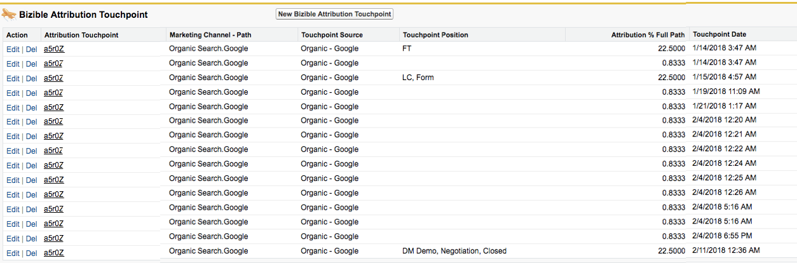

# Warum Sie Touchpoints nie löschen sollten {#why-you-should-never-delete-touchpoints}

Wenn Sie feststellen, dass es einen Touchpoint für eine Opportunity gibt, der fälschlicherweise Attributionsguthaben zugewiesen wird, wenden Sie sich an Ihren Account Manager, um die nächsten Schritte zu bestimmen. In diesen Situationen empfehlen wir die Verwendung der Touchpoint-Unterdrückungsfunktion des Käufers, um den Touchpoint aus SFDC und dem ROI-Dashboard zu entfernen. Ihr Account Manager kann Ihnen bei der Erstellung dieser Regeln behilflich sein. Löschen Sie diese Touchpoints nicht manuell.

Das [!DNL Marketo Measure]-Verarbeitungssystem registriert nicht, dass ein Touchpoint manuell aus SFDC gelöscht wurde. Bis heute gibt es keinen Trigger, der unserem System signalisiert, Daten anzupassen. [!DNL Marketo Measure] wird nicht automatisch ein anderer Touchpoint gepusht, um den gelöschten zu ersetzen, und die Touchpoint-Position oder Attribution wird nicht auf den nachfolgenden Touchpoint übertragen.

Wenn ein Touchpoint gelöscht wird, entsteht eine Bohrung in den Attributionsdaten. In der Regel manifestiert sich dies in den Attributions-Touchpoints einer Opportunity. In der Abbildung unten wurde der Touchpoint, der den Touch „Opportunity-Erstellung“ erhalten hätte, gelöscht. Infolgedessen fehlt dieser Opportunity der OC-Touchpoint und der Attributionsprozentsatz für diese Opportunity addiert sich nicht zu 100 %.

Wenn Touchpoints aus Ihrer SFDC gelöscht wurden, wenden Sie sich an den [Marketo-Support](https://nation.marketo.com/t5/support/ct-p/Support?profile.language=de){target="_blank"}, um einen erneuten Import Ihrer Daten anzufordern.
