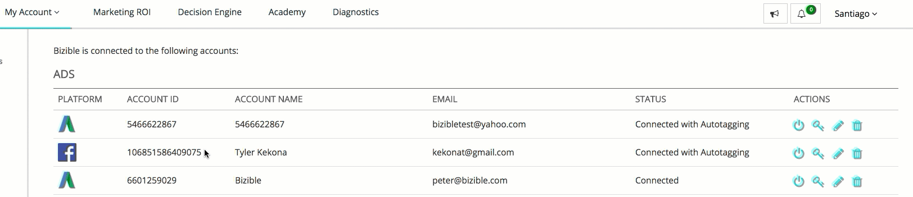

# [!DNL Facebook] API {#facebook-api}

## Einführung {#introduction}

Ähnlich wie unsere AdWords &amp; [!DNL Bing Ads] Integrationen, unsere [!DNL Facebook] -Integration umfasst zwei grundlegende Aktionen:

* Alle automatisch taggen [!DNL Facebook] Anzeigen mit einer [!DNL Marketo Measure] Parameter (_bf)
* Informationen zu Anzeigenkosten für alle aktiven Facebook-Anzeigen herunterladen

## Konfigurieren der [!DNL Facebook] Integration {#how-to-configure-the-facebook-integration}

Was die Einrichtung anbelangt, so müssen innerhalb der [!DNL Marketo Measure] App.

1. Navigieren Sie zu [experience.adobe.com/marketo-measure](https://experience.adobe.com/marketo-measure){target="_blank"} und melden Sie sich an.
1. Wählen Sie unter Mein Konto die Option **[!UICONTROL Einstellungen]**.
1. Wählen Sie unter Integrationen die Option **[!UICONTROL Verbindungen]**.
1. Auswählen **[!UICONTROL Einrichten einer neuen Werbeverbindung]** und ein Popup angezeigt. Auswählen **[!UICONTROL Facebook]** und melden Sie sich mit Ihren Facebook-Anmeldedaten an.

   >[!NOTE]
   >
   >Die Person, die [!DNL Facebook Ads] -Konto muss ein Administrator innerhalb der [!DNL Facebook Ads] -Konto.

1. Einmal [!DNL Marketo Measure] mit Ihrem Facebook-Konto verbunden ist, klicken Sie auf das Stiftsymbol neben dem Konto.
1. Verschieben Sie in dieser Ansicht das &quot;Auto-Tagging?&quot; auf &quot;Ja&quot;umschalten. Aktivieren Sie dann das Kontrollkästchen im [!UICONTROL Weitere Infos] -Abschnitt, um die Geschäftsbedingungen zu vereinbaren. Stellen Sie sicher, dass [!UICONTROL Automatisches Tagging] Umschalter ist weiterhin auf &quot;[!UICONTROL Ja]&quot;.

## Konto verbinden {#connecting-the-account}

## Aktivieren der Automatisierung {#enabling-autotagging}

>[!NOTE]
>
>Wenn Sie das automatische Tagging aktivieren, werden wir den Konversionsverlauf und den Social-Testversand aller Anzeigen zurücksetzen, die wir taggen. Wir empfehlen dringend [Exportieren dieser Daten als CSV](https://www.facebook.com/business/help/205067636197240) bevor Sie das automatische Tagging aktivieren.

Sobald Sie die Integration aktiviert haben, [!DNL Marketo Measure] beginnt mit dem Herunterladen der Kosten auf Anzeigenebene in die [!DNL Marketo Measure Marketing ROI] Dashboard.

Damit die Integration ordnungsgemäß funktioniert, müssen Sie das automatische Tagging in Ihrer [!DNL Facebook] -Konto. Dadurch kann unser System einen _bf -Parameter für alle Anzeigenlinks hinzufügen. Durch diesen Prozess wird der neue Parameter zusätzlich zu allen anderen Tracking-Parametern hinzugefügt, die Sie bereits zu Ihrem [!DNL Facebook] Anzeigen.

## Feldzuordnung {#field-mapping}

<table> 
 <colgroup> 
  <col> 
  <col> 
 </colgroup> 
 <tbody> 
  <tr> 
   <th>
<strong>Touchpoint-Feld</strong>
</th> 
   <th>
<strong>Wert</strong>
</th> 
  </tr> 
  <tr> 
   <td>
Anzeigen-Kampagnen-ID
</td> 
   <td>
[[!DNL Facebook] Kampagnen-ID]
</td> 
  </tr> 
  <tr> 
   <td>
Name der Anzeigenkampagne 
</td> 
   <td>
[[!DNL Facebook] Kampagnenname] oder [utm_campaign] , falls angegeben
</td> 
  </tr> 
  <tr> 
   <td>
Anzeigengruppen-ID
</td> 
   <td>
[[!DNL Facebook] ID des Anzeigensets]
</td> 
  </tr> 
  <tr> 
   <td>
Werbegruppenname
</td> 
   <td>
[[!DNL Facebook] Anzeigensetname]
</td> 
  </tr> 
  <tr> 
   <td>
Touchpoint-Quelle
</td> 
   <td>
"[!DNL Facebook]", oder [utm_source] , falls angegeben
</td> 
  </tr> 
  <tr> 
   <td>
Medium
</td> 
   <td>
"Social"oder [utm_medium] , falls angegeben
</td> 
  </tr> 
  <tr> 
   <td>
Anzeigen-ID oder Creative_Unique_Id (Data Warehouse)
</td> 
   <td>
[aus utm_content generierte benutzerdefinierte ID]
</td> 
  </tr> 
  <tr> 
   <td>
Anzeigeninhalt oder Creative_Name (Data Warehouse)
</td> 
   <td>
[utm_content] , falls angegeben
</td> 
  </tr> 
  <tr> 
   <td>
Schlüsselworttext oder Keyword_Name (Data Warehouse)
</td> 
   <td>
[utm_term] , falls angegeben
</td> 
  </tr> 
  <tr> 
   <td>
Ad_Unique_Id (Data Warehouse)
</td> 
   <td>
[[!DNL Facebook] Anzeigen-ID]
</td> 
  </tr> 
  <tr> 
   <td>
Ad_Name (Data Warehouse)
</td> 
   <td>
[[!DNL Facebook] Anzeigenname]
</td> 
  </tr> 
  <tr> 
   <td>
keyword_Unique_Id (Data Warehouse)
</td> 
   <td>
[aus utm_term generierte benutzerdefinierte ID]
</td> 
  </tr> 
  <tr> 
   <td>
Ad_Provider (Data Warehouse)
</td> 
   <td>
"[!DNL Facebook]"
</td> 
  </tr> 
  <tr> 
   <td>
Account_Unique_ID (Data Warehouse)
</td> 
   <td>
[[!DNL Facebook] Kundennummer]
</td> 
  </tr> 
  <tr> 
   <td>
Account_Name (Data Warehouse)
</td> 
   <td>
[[!DNL Facebook] Kontoname]
</td> 
  </tr> 
 </tbody> 
</table>

## FAQs {#faq}

**F: Was [!DNL Facebook] Anzeigen werden von [!DNL Marketo Measure]?**

A: Karussell, Einzelbild. Derzeit nicht Video, Bildschirmpräsentation oder Sammlung.

**F: Was ist der soziale Schutz?**

A: Der soziale Beweis ist eine sichtbare Interaktion wie &quot;Gefällt mir&quot;-Klicks, Klicks, Kommentare und &quot;Teilen&quot;-Klicks.

**F: Was passiert, wenn [!DNL Marketo Measure] Tags der Anzeige?**

A: [!DNL Facebook] erlaubt es nicht, Anzeigen so zu bearbeiten [!DNL Marketo Measure] muss das Kreativelement, das die Ziel-URL enthält, löschen und dann die Anzeige mit den neuen Parametern neu erstellen.

**F: Warum passiert [!DNL Marketo Measure] Alle aktualisieren [!DNL Facebook] Werbeanzeigen?**

A: Die [!DNL Marketo Measure] -Prozess besteht darin, alle Anzeigen zu taggen, falls sie erneut aktiviert werden.

**F: Welche Berechtigung benötigt der verbundene Benutzer?**

A: ads_management, email

**F: Wie lange kann der Import von Ausgabedaten dauern?**

A: 1 Stunde

**F: Wie lange kann der Import von Anzeigendaten dauern?**

A: 4 Stunden
