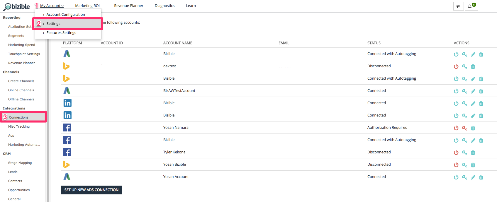
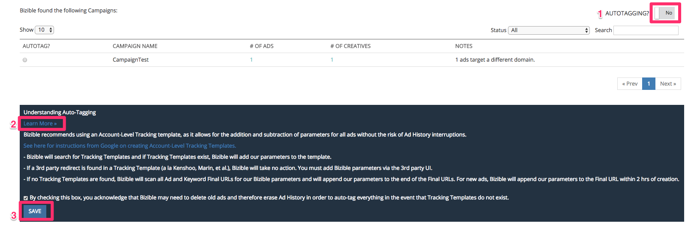

# Integrierte Anzeigenplattformen {#integrated-ad-platforms}

[!DNL Marketo Measure] verfügt über API-Verbindungen mit Google AdWords, Microsoft BingAds, [!DNL Facebook] Anzeigen und DoubleClick Campaign Manager. Über diese API-Verbindungen [!DNL Marketo Measure] ist in der Lage, Daten einfach abzurufen und in Ihr CRM-System sowie die externe Käufer-App zu übertragen. Es ist kein manuelles Hochladen von Kosten oder Daten erforderlich. Stattdessen müssen Ihre Konten einfach mit der [!DNL Marketo Measure] App. [!DNL Marketo Measure] lädt dann automatisch Ihre Marketingkosten von den Plattformen herunter und lädt sie in die [!DNL Marketo Measure] App. Wenn Sie das automatische Tagging für AdWords, BingAds oder [!DNL Facebook] Anzeigen, [!DNL Marketo Measure] hängt seine Parameter automatisch an die URLs Ihrer Anzeigen an.

## Anleitung zum Verbinden von Anzeigenplattformen {#how-to-connect-ad-platforms}

Bevor wir uns mit den Besonderheiten der einzelnen Plattformen befassen, werden wir uns mit der Frage beschäftigen, wie wir diese Konten mit [!DNL Marketo Measure]. Melden Sie sich zuerst bei der [!DNL Marketo Measure] und navigieren Sie zum **[!UICONTROL Einstellungen]** Option unter **[!UICONTROL Mein Konto]** oben links im Bildschirm. Wählen Sie als Nächstes **[!UICONTROL Verbindungen]** unter **[!UICONTROL Integrationen]** auf der linken Seite.

Wie in der Abbildung unten dargestellt, sehen Sie eine Schaltfläche zum Einrichten neuer Werbeverbindungen.

Nachdem Sie auf [!UICONTROL Einrichten einer neuen Werbeverbindung] Schaltfläche, wird ein Fenster (unten angezeigt) mit vier Anzeigen angezeigt [!UICONTROL connect]Ionentypen. Klicken Sie auf Verbinden . Daraufhin wird ein weiteres Fenster angezeigt, in dem Sie nach Anmeldeinformationen gefragt werden. Geben Sie die Anmeldedaten ein und klicken Sie auf [!UICONTROL autorisieren] , um das Konto mit [!DNL Marketo Measure].

## Google AdWords {#google-adwords}

Wenn Sie Ihre Anzeigen erstellen in [!DNL Google AdWords]sollten Sie Ihre Kampagnen auf eine von drei Arten mit Tags versehen: manuelles Tagging, automatisches Tagging oder Erstellen einer Tracking-Vorlage. Das manuelle Tagging Ihrer AdWords-URL setzt voraus, dass Sie die Parameter definieren und am Ende der Anzeigen-URLs hinzufügen. Das manuelle Tagging ermöglicht es jeder Nicht-Google-Plattform, die von den Parametern erfassten Daten einfach zu lesen.

Die Tracking-Vorlage ist ein Tool, das Google bereitstellt, um die so genannten ValueTrack-Parameter hinzuzufügen. Sie funktionieren auf die gleiche Weise wie UTMs und andere Tagging-Parameter.

## Was passiert, wenn automatisches Tagging aktiviert ist? {#what-happens-when-auto-tagging-is-enabled}

[!DNL Marketo Measure] Suchen nach Tracking-Vorlagen in Ihren [!DNL AdWords] Konto:

* *Option A*: Tracking-Vorlage gefunden. [!DNL Marketo Measure] fügt seine Parameter zur Vorlage hinzu.
* *Option B*: Es wird eine Umleitung von Drittanbietern gefunden. Wenn eine Umleitung von Drittanbietern in der Tracking-Vorlage gefunden wird, [!DNL Marketo Measure] kann keine Maßnahmen ergreifen. Sie müssen die [!DNL Marketo Measure] Tags in das Drittanbietersystem. Ein Beispiel für eine Umleitung von Drittanbietern wäre ein Angebotsmanagement-Tool wie Kenshoo oder Marin. Erfahren Sie mehr darüber, wie [Angebotsmanagement-Tools beeinflussen [!DNL Marketo Measure]](/help/api-connections/utilizing-marketo-measures-api-connections/how-bid-management-tools-affect-marketo-measure.md){target="_blank"}.

* *Option C*: Es wurde keine Tracking-Vorlage gefunden. [!DNL Marketo Measure] prüft alle Ihre Anzeigenziel-URLs auf die [!DNL Marketo Measure] Parameter. Basierend auf der Prüfung, wenn:
   * Parameter werden gefunden: das Setup abgeschlossen ist!
   * Parameter werden nicht gefunden: [!DNL Marketo Measure] hängt seine Parameter an das Ende der Anzeigenziel-URLs an. [!DNL Marketo Measure] fügt neue Anzeigen innerhalb von zwei Stunden nach ihrer Erstellung hinzu. Beachten Sie, dass die Parameter nicht zu einer Vorlage hinzugefügt werden.

Erfahren Sie mehr über unsere [[!DNL AdWords] Funktion für automatisches Tagging](/help/api-connections/utilizing-marketo-measures-api-connections/understanding-marketo-measure-adwords-tagging.md){target="_blank"}.

## Aktivieren [!DNL Marketo Measure] Automatisches Tagging für Adwords {#how-to-enable-marketo-measure-auto-tagging-for-adwords}

Vor der Aktivierung [!DNL Marketo Measure] automatisches Tagging, **Stellen Sie sicher, dass in Ihrem Adwords -Konto auf Konto-, Kampagnen- oder Anzeigengruppenebene eine Tracking-Vorlage aktiviert ist. Dies ist für jedes Adwords -Konto erforderlich, das [!DNL Marketo Measure] automatisches Tagging aktiviert ist.** Durch die Aktivierung einer Tracking-Vorlage wird jeder Verlust von Daten zum Anzeigenleistungsverlauf verhindert. Beachten Sie, dass die Aktivierung von Tracking-Vorlagen auf Keyword-, Sitelink- oder Anzeigenebene dazu führt, dass die Anzeige den Review- und Genehmigungsprozess durchläuft und möglicherweise den Leistungsverlauf Ihrer Anzeigen neu startet. Wenn überhaupt keine Tracking-Vorlage aktiviert ist, [!DNL Marketo Measure] anhängen. [!DNL Marketo Measure] Tracking-Parameter direkt zur &quot;endgültigen URL&quot;der Anzeige hinzufügen, was auch zum Verlust von Daten zum Anzeigenverlauf führen kann.

Wenn Sie über eine Tracking-Vorlage verfügen, befolgen Sie die unten stehenden Anweisungen, um [!DNL Marketo Measure] Automatisches Tagging. Hinweis: [!DNL Marketo Measure] markiert auch automatisch alle ausgesetzten Anzeigen in Ihrem Konto.

1. Melden Sie sich bei Ihrer [!DNL Marketo Measure] Konto unter [experience.adobe.com/marketo-measure](https://experience.adobe.com/marketo-measure){target="_blank"}.

1. Navigieren Sie zu [!UICONTROL Mein Konto] > [!UICONTROL Einstellungen] > [!UICONTROL Integrationen] > [!UICONTROL Verbindungen].

   

1. Klicken Sie auf das Bleistiftsymbol neben dem Adwords-Konto, das [!DNL Marketo Measure] automatisches Tagging aktiviert ist.

   

1. Drehen Sie in der oberen rechten Ecke die **[!UICONTROL Automatisierung]** Switch zu **[!UICONTROL Ja]**. Klicken Sie unten auf der Seite auf **[!UICONTROL Weitere Infos]** zum Erweitern des Textfelds und klicken Sie auf **[!UICONTROL Speichern]**. Die Einrichtung des automatischen Tagging ist abgeschlossen.

   

## Einrichten einer Tracking-Vorlage in AdWords mit [!DNL Marketo Measure] Parameter {#how-to-set-up-a-tracking-template-in-adwords-with-marketo-measure-parameters}

Beachten Sie, dass Sie Tracking-Vorlagen im [!UICONTROL Konto], [!UICONTROL Kampagne] oder Anzeigengruppenebene in AdWords. Wenn Sie Tracking-Vorlagen zur Suchbegriff-, Sitelink- oder Anzeigenebene hinzufügen, muss Ihre Anzeige den Review- und Genehmigungsprozess durchlaufen und riskieren, den Leistungsverlauf Ihrer Anzeigen neu zu starten. Weitere Informationen [Erstellen von Tracking-Vorlagen](https://support.google.com/adwords/answer/6076199?hl=en#tracking){target="_blank"}.

1. Melden Sie sich bei Ihrer [!DNL Google AdWords] Konto.
1. Gehen Sie zu [!UICONTROL Kampagnen] Ansicht über die Navigationsleiste auf der linken Seite
1. Navigieren Sie zu &quot;[!UICONTROL Einstellungen]&quot;, auch in der linken Navigationsleiste
1. Wechsel zum &quot;&quot;[!UICONTROL Kontoeinstellungen]&quot;Ansicht oben
1. Erweitern Sie die[!UICONTROL Tracking]&quot; Abschnitt
1. Fügen Sie eine der folgenden Textzeichenfolgen in die Tracking-Vorlage ein, um den Wert der Vorlage festzulegen:

   * Verwenden Sie den folgenden URL-Text, wenn Sie Fragezeichen in all Ihren URLs haben:

   `{lpurl}&_bt={creative}&_bk={keyword}&_bm={matchtype}&_bn={network}&_bg={adgroupid}`

   * Wenn keine Ihrer URLs Fragezeichen aufweisen, fügen Sie den folgenden URL-Text hinzu:

   `{lpurl}?_bt={creative}&_bk={keyword}&_bm={matchtype}&_bn={network}&_bg={adgroupid}*`

   Um zu verhindern, dass beim manuellen Taggen Ihrer URLs Fehler auftreten, wird in der Regel empfohlen, die UTM-Parameter automatisch zu generieren. Dies muss nicht bedeuten, dass AdWords automatisch getaggt wird oder [!DNL Marketo Measure] -Parameter gibt es mehrere Tools, die den Prozess vereinfachen, indem die Parameter für die URL basierend auf den von Ihnen bereitgestellten Informationen automatisch generiert werden.

   >[!TIP]
   >
   >Wenn Sie eine Fehlermeldung erhalten, dass die Tracking-Vorlage ungültig ist, versuchen Sie, Ihren Browser-Cache zu leeren und es erneut zu versuchen. Dadurch wird das Problem häufig behoben.

## Automatisches Generieren von UTM-Tags für [!DNL Google AdWords] {#how-to-automatically-generate-utm-tags-for-google-adwords}

Die Erstellung von UTM-Tags kann zunächst schwierig erscheinen, es stehen jedoch viele Tools zur Verfügung, um URLs mit UTM-Parametern einfach zu erstellen. Sie können eine der folgenden Ressourcen verwenden oder im Internet nach weiteren Tools suchen. Bedenken Sie Folgendes [!DNL Marketo Measure] unterstützt oder garantiert nichts mit diesen Plattformen und Tools.

**[!DNL Google URL]Builder**

Google URL Builder ist ein Standardwerkzeug zum Erstellen korrekt formatierter URLs mit UTM-Tags. Geben Sie einfach die URL und den gewünschten Wert für jeden Parameter ein und klicken Sie auf &quot;[!UICONTROL URL generieren]&quot;. Dies ist ein ideales Tool zur Verwendung, wenn Sie nur über eine Handvoll von URLs verfügen, die mit Tags versehen werden sollen. Zugriff auf das Tool [here](https://support.google.com/analytics/answer/1033867?hl=en){target="_blank"}.

**Von EpikOne generiertes Google-Arbeitsblatt**

Diese Tabelle enthält eine Formel, mit der automatisch getaggte Ziel-URLs generiert werden. Dieses Tool eignet sich hervorragend, wenn eine große Anzahl von Links mit Tags versehen werden muss. Auf das Arbeitsblatt zugreifen [here](https://spreadsheets.google.com/ccc?key=p7c_HKcmspSUfEYSO0gskKw&amp;hl=en){target="_blank"}.

**Rafflecopter-Link-Tagging-Tool**

Die von Rafflecopter erstellte Tabelle ist eine modifizierte Version von [!DNL EpikOne's] Tabelle. Es enthält auch eine Formel, mit der Sie automatisch getaggte Ziel-Links generieren, die Sie verwenden können.

Jedes dieser Tools verfügt über eine detaillierte Anleitung zur Verwendung und Anpassung an Ihre Anforderungen. Das Tool ist verfügbar [here](https://docs.google.com/spreadsheets/d/1QCIr1WUJQHE68cA4VTks2XE7nxuryaUymCEy_23-Oew/edit#gid=0){target="_blank"}.

**Wirkung von Amazing UTM Builder**

Dieses Tool ist eine Chrome-Erweiterung, mit der Sie schnell UTM-Tags generieren können. Suchen [here](https://chrome.google.com/webstore/detail/effin-amazing-utm-builder/eoaapiimcaimddnfhfnifgkinmpcbccp?hl=en){target="_blank"}.

## Bing-Werbeanzeigen {#bing-ads}

Bing Ads ist eine integrierte Plattform, mit der Sie automatisches Tagging für URLs aktivieren oder ein Tool von Drittanbietern wie [!DNL Marketo Measure], um Anzeigen zu taggen. [!DNL Bing Ads] ist auch auf UTM-Parameter angewiesen.

Die Funktion zum automatischen Tagging von Bing Ads fügt die folgenden UTM-Parameter hinzu:

* Utm_source
* Utm_medium
* Utm_term

Durch das automatische Tagging von Bing Ads wird auch der folgende benutzerdefinierte Parameter hinzugefügt:

`_bt={adid}`

Die Zeichenfolge würde wie folgt aussehen:

`{lpurl}?_bt={adid}&utm_term={keyword}&utm_source=Bing_Yahoo&utm_medium=CPC`

Es ist wichtig zu beachten, dass [!DNL Bing Ads] können Sie noch mehr Parameter hinzufügen, indem Sie ihre benutzerdefinierten Tags in Ihren endgültigen URLs verwenden, um bei Bedarf eine größere Granularität zu erhalten.

Eine Tracking-Vorlage kann bei Bedarf verwendet werden, ist jedoch nicht erforderlich für [!DNL Bing Ads] und [!DNL Marketo Measure] zur Integration. Dies liegt daran, dass [!DNL Bing] ermöglicht die Bearbeitung von Anzeigen ohne Änderung des Verlaufs. [!DNL Marketo Measure] kann die Ziel-URL aktualisieren.

Automatisches Tagging sollte über aktiviert werden [!DNL Marketo Measure] sodass der benutzerdefinierte [!DNL Marketo Measure] -Parameter automatisch angehängt werden. Es besteht kein Risiko, dass mit Bing Ads vergangene Anzeigen-Performance-Verläufe verloren gehen.

Besuchen Sie die [[!DNL Bing Ads]](https://advertise.bingads.microsoft.com/en-us/blog/post/august-2016/upgraded-urls-now-available-in-bing-ads-an-easier-way-to-manage-your-tracking-urls){target="_blank"} Website finden Sie weitere Informationen zum Hinzufügen von Tags auf ihrer Plattform.

## Facebook-Anzeigen {#facebook-ads}

Die [!DNL Marketo Measure] Integration mit [!DNL Facebook] ermöglicht es, Anzeigeninformationen automatisch herunterzuladen und die URL mit ihren Parametern zu versehen. [!DNL Marketo Measure] ruft die Informationen zu Kampagne und Anzeigenset über unser automatisches Tagging ab. Das Anzeigenset füllt unser Feld Anzeigengruppenname . Weitere Informationen zum Einrichten von URL-Tags im [!DNL Facebook] Plattform, besuchen Sie die [!DNL Facebook] [Business](https://www.facebook.com/business/help/1016122818401732/?ref=u2u){target="_blank"} Seite.

Vor der Aktivierung des automatischen Taggings mit [!DNL Facebook Ads]ist es wichtig, den vorherigen Leistungsverlauf als CSV-Datei zu exportieren. Wann [!DNL Marketo Measure] tags [!DNL Facebook Ads] mit dem Parameter _bf , [!DNL Facebook] liest die Anzeigen als brandneu und löscht den Leistungsverlauf. Daher ist es wichtig, einen Datensatz der vorherigen Leistung zu exportieren, wenn dies für Sie und Ihr Unternehmen von Nutzen ist.

Bitte beachten Sie, dass Sie Ihre [!DNL Facebook] jederzeit dem [!DNL Marketo Measure] App verwenden und keine Daten verloren gehen - nur bei aktiviertem automatischem Tagging wird der Leistungsverlauf gelöscht.

[Weitere Informationen finden Sie in diesem Artikel](https://www.facebook.com/business/help/393890194130036){target="_blank"} Informationen zum Exportieren aus Facebook [!DNL Facebook] Anzeigenberichte.

## linkedIn-gesponserte Inhalte {#linkedin-sponsored-content}

Die LinkedIn-Integration ermöglicht Folgendes: [!DNL Marketo Measure] , um Ziel-URLs zu taggen [!DNL LinkedIn] Sponsored Content, der letztendlich Folgendes ermöglicht [!DNL Marketo Measure] , um einem Benutzer durch die gesamte Touchpoint-Journey zu folgen und die Aktivität wieder dem jeweiligen [!DNL LinkedIn] Kampagne und Kreativ. Dies bietet Kunden Einblicke in den ROI ihrer [!DNL LinkedIn] Aktivität. [!DNL Marketo Measure] sucht nach Kreativen mit einer eindeutigen [!DNL LinkedIn] Freigeben und Hinzufügen von `?_bl={creativeId}` -Parameter an das Ende des Parameters an.

weil [!DNL LinkedIn] &quot;Teilen&quot;-Klicks können für mehrere Kampagnen und kreative Inhalte verwendet werden. Wir möchten Sie bitten, dass Kunden vorhandene Kreative nicht kopieren/klonen/duplizieren, damit sie ihre Einzigartigkeit beibehalten können. Wenn &quot;Teilen&quot;-Klicks gefunden werden, die nur auf einem Kreativ verwendet werden können, [!DNL Marketo Measure] kann die Freigabe so taggen, wie es ist, ohne dass kreative Inhalte oder &quot;Teilen&quot;-Klicks neu erstellt werden müssen. Alle Anzeigen-Verläufe (Impressionen, Klicks, &quot;Teilen&quot;-Klicks) bleiben erhalten.

Sobald eine Freigabe für mehrere Kreative freigegeben wurde, [!DNL Marketo Measure] muss einen Prozess zum Anhalten, Kopieren und erneuten Tagging durchlaufen, um einen eindeutigen Satz zu erstellen. [!DNL Marketo Measure] hält Live-Kreative an und archiviert sie. Das bedeutet, dass auch die Kreativelemente, die Impressionen, Klicks und Teilen aus sozialen Netzwerken enthalten, archiviert werden.

## Nicht integrierte Plattformen {#non-integrated-platforms}

Für Plattformen, die nicht in [!DNL Marketo Measure], die [!DNL Marketo Measure] Die Funktion für automatisches Tagging kann nicht verwendet werden. Die Parameter müssen manuell hinzugefügt werden.
