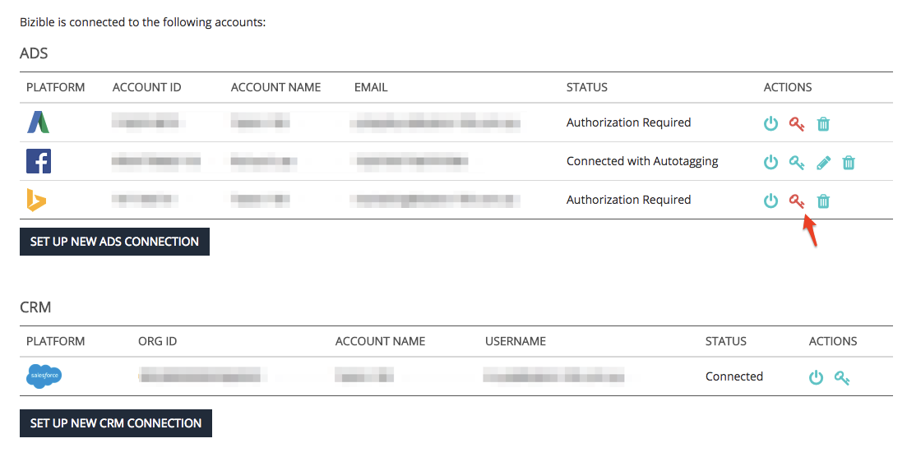

# Erneutes Autorisieren von Connected Accounts {#reauthorizing-connected-accounts}

Wenn die Verbindung eines Kontos von Ihrem [!DNL Marketo Measure] -Konto getrennt wird, ändert sich der Status der Plattform in &quot;Autorisierung erforderlich&quot;und zeigt ein rotes Symbol an.

Wenn die Verbindung Ihrer Anzeigenplattform getrennt wird, kann [!DNL Marketo Measure] keine Kostendaten herunterladen oder, wenn Sie die automatische Tagging-Funktion aktiviert haben, hängen Sie die [!DNL Marketo Measure] UTM-Parameter an neu erstellte Anzeigen an. [!DNL Marketo Measure] kann die UTM-Parameter nicht rückwirkend an Touchpoints anhängen, die von der Anzeigen-Plattform erstellt wurden, während das Konto getrennt wurde.

Wenn die Verbindung Ihrer CRM-Plattform getrennt wird, kann [!DNL Marketo Measure] keine [!DNL Marketo Measure] -Daten aktualisieren oder neue Touchpoints in Ihre Organisation übertragen. Sobald die CRM-Verbindung neu hergestellt wurde, sendet [!DNL Marketo Measure] alle Daten, die beim Trennen des Kontos verpasst wurden.

## Erneutes Autorisieren von getrennten Konten {#re-authorizing-disconnected-accounts}

1. Wechseln Sie zu [experience.adobe.com/marketo-measure](https://experience.adobe.com/marketo-measure){target="_blank"} und melden Sie sich an.
1. Wählen Sie **[!UICONTROL Einstellungen]** auf der Registerkarte [!UICONTROL Mein Konto] oben links.
1. Suchen Sie links den Abschnitt Integrationen und klicken Sie auf **[!UICONTROL Verbindungen]**.
1. Wählen Sie neben dem Konto, das neu verbunden werden soll, das Symbol für den roten Schlüssel aus.
1. Daraufhin wird ein Popup-Fenster angezeigt, in dem Sie aufgefordert werden, die Anmeldedaten für das Konto anzugeben.
