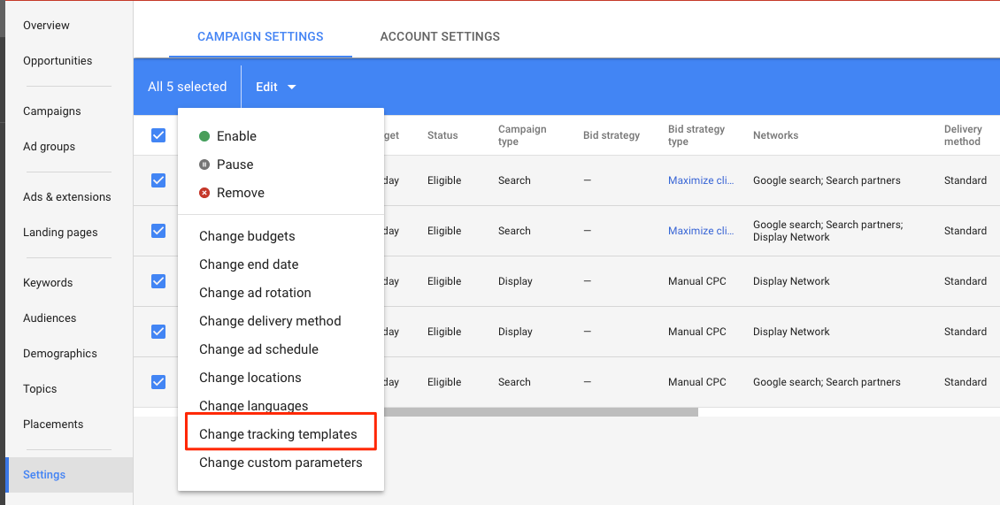
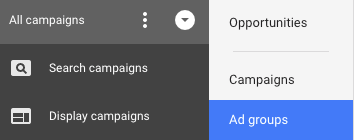

# Grundlagen [!DNL Marketo Measure] AdWords-Tagging {#understanding-marketo-measure-adwords-tagging}

Damit Ihre Anzeigen auf einer sehr detaillierten Ebene verfolgt werden können, müssen die Anzeigenziel-URLs eindeutig sein. Um dies zu erreichen, [!DNL Marketo Measure] Beim automatischen Tagging werden den Anzeigenziel-URLs Ihrer [!DNL AdWords] Anzeigen. Sehen wir uns ein Beispiel unten an.

Die folgende URL stellt keine granularen Daten bereit:

* `http://example.com/landing-page?myParam=foo`

Dieselbe URL liefert jedoch granulare Daten aufgrund der [!DNL Marketo Measure] Parameter:

* `http://example.com/landing-page?myParam=foo&_bt={creative}&_bk={keyword}&_bm={matchtype}&_bn={network}&_bg={adgroupid}`

## How [!DNL Marketo Measure] Automatische Tagging-Funktionen {#how-marketo-measure-auto-tagging-works}

**Wenn [!DNL Marketo Measure] findet eine Tracking-Vorlage:**

* [!DNL Marketo Measure] fügt seine Parameter zur Tracking-Vorlage hinzu.
* Wenn eine Umleitung von Drittanbietern in einer Tracking-Vorlage wie Kenshoo oder Marin gefunden wird, [!DNL Marketo Measure] wird keine Maßnahmen ergreifen. Sie müssen stattdessen [add [!DNL Marketo Measure] Parameter für das Tool eines Drittanbieters in Ihrem Konto](/help/api-connections/utilizing-marketo-measures-api-connections/how-bid-management-tools-affect-marketo-measure.md){target="_blank"}.

Wenn jedoch keine Tracking-Vorlage gefunden wird, [!DNL Marketo Measure] wird:

* Durchsuchen Sie alle Anzeigen-Ziel-URLs nach unserer [!DNL Marketo Measure] Parameter.
* Wenn du gefunden hast, kannst du gehen.
* Wenn nicht gefunden, [!DNL Marketo Measure] hängt seine Parameter an das Ende der Anzeigenziel-URLs an. Für neue Anzeigen: [!DNL Marketo Measure] hängt seine Parameter innerhalb von zwei Stunden nach der Erstellung an die Anzeigenziel-URL an.
* Vor der Aktivierung des automatischen Taggings muss eine Tracking-Vorlage vorhanden sein, damit [!DNL Marketo Measure] kann an ihn angehängt werden und ein Zurücksetzen des Anzeigenverlaufs verhindern.

[!DNL Marketo Measure] empfiehlt die Verwendung einer Tracking-Vorlage auf Kontoebene, Kampagnenebene oder Anzeigengruppenebene, da sie das Hinzufügen und Abziehen von Parametern für alle Anzeigen ermöglicht, ohne dass das Risiko von Unterbrechungen oder Löschungen des Anzeigenverlaufs besteht.

## Tracking-Vorlagen {#tracking-templates}

Wie von [!DNL Google AdWords], ist eine Tracking-Vorlage die URL, mit der eine Landingpage erreicht wird. Die erfassten Tracking-Informationen werden verwendet, um Ihren Anzeigen-Traffic zu verstehen. [Hier klicken](https://support.google.com/adwords/answer/7197008?hl=en){target="_blank"} für weitere Informationen von Google.

[!DNL Marketo Measure] empfiehlt die Verwendung einer Tracking-Vorlage auf Kontoebene, Kampagnenebene oder Anzeigengruppenebene, da diese die Addition und Subtraktion von Parametern für alle Anzeigen ermöglicht, ohne dass das Risiko von Unterbrechungen oder Löschungen des Anzeigenverlaufs besteht.

Es gibt zwei Tracking-Vorlagen [!DNL Marketo Measure] empfiehlt die Verwendung von . Verwenden Sie Folgendes, um zu bestimmen, welche Version für Sie geeignet ist:

* Wenn alle Ihre Anzeigen-URLs ein &quot;?&quot; in ihnen diese URL verwenden:

`{lpurl}&_bt={creative}&_bk={keyword}&_bm={matchtype}&_bn={network}&_bg={adgroupid}`

* Wenn keine Ihrer Anzeigen-URLs ein &quot;?&quot; in ihnen diese URL verwenden:

`{lpurl}?_bt={creative}&_bk={keyword}&_bm={matchtype}&_bn={network}&_bg={adgroupid}`

## Einrichten einer Tracking-Vorlage auf Kontoebene {#setting-up-a-tracking-template-at-the-account-level}

1. Melden Sie sich bei Ihrer [!DNL Google AdWords] Konto.

1. Klicks **[!UICONTROL Alle Kampagnen]** und dann **[!UICONTROL Einstellungen]** im sich öffnenden Fenster.

   

1. Klicks **[!UICONTROL Kontoeinstellungen]** oben und dann **[!UICONTROL Tracking-Vorlage]**. Geben Sie die [!DNL Marketo Measure] Tracking-Vorlage.

   

1. Klicken Sie auf **[!UICONTROL Speichern]**.

## Einrichten einer Tracking-Vorlage auf Kampagnenebene {#setting-up-a-tracking-template-at-the-campaign-level}

1. Klicks **[!UICONTROL Alle Kampagnen]** und dann **[!UICONTROL Kampagnen]** im sich öffnenden Fenster.

   

1. Wählen Sie alle zutreffenden Kampagnen aus oder **[!UICONTROL Alle auswählen]** klicken **[!UICONTROL Bearbeiten]** und klicken Sie anschließend auf **[!UICONTROL Ändern von Tracking-Vorlagen]**.

   

1. Geben Sie die [!DNL Marketo Measure] Tracking-Vorlage und klicken Sie auf **[!UICONTROL Anwenden]**.

## Einrichten einer Tracking-Vorlage auf Anzeigengruppenebene: {#setting-up-a-tracking-template-at-the-ad-group-level}

1. Klicks **[!UICONTROL Alle Kampagnen]** und dann **[!UICONTROL Anzeigengruppen]** im sich öffnenden Fenster.

   

1. Wählen Sie alle zutreffenden Anzeigengruppen aus oder klicken Sie auf Alle auswählen . **[!UICONTROL Bearbeiten]** und klicken Sie anschließend auf **[!UICONTROL Ändern von Tracking-Vorlagen]**.

1. Geben Sie die [!DNL Marketo Measure] Tracking-Vorlage und klicken Sie auf **[!UICONTROL Anwenden]**.

   

## FAQs {#faq}

**F: Welche Berechtigungen benötigt der verbundene Benutzer?**

A: userinfo.email

**F: Wie lange kann der Import von Ausgabedaten dauern?**

A: 6 Stunden

**F: Wie lange kann der Import von Anzeigendaten dauern?**

A: 4 Stunden

**F: Können wir bei dynamischen Suchanzeigen die Kombination aus Überschrift, Beschreibung usw. in den bereitgestellten Kreativelementen verfolgen?**

A: Wir können keine individuellen kreativen Details für dynamische Suchanzeigen abrufen, aber wenn das automatische Tagging aktiviert ist, können wir trotzdem die kreative ID abrufen und den Umsatz zuordnen.

>[!NOTE]
>
>Sobald die Änderungen vorgenommen wurden, sind Sie fertig. Sie können gerne Kontakt mit [Marketo-Support](https://nation.marketo.com/t5/support/ct-p/Support){target="_blank"} , wenn während der Einrichtung Fragen auftreten.

[Hier klicken](https://support.google.com/adwords/answer/6076199?hl=en#tracking){target="_blank"} für Anweisungen von Google zum Erstellen von Tracking-Vorlagen auf Kontoebene.
