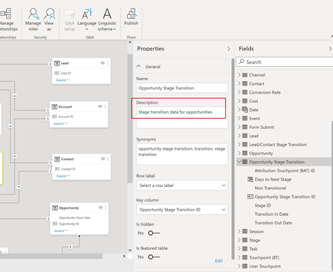

# [!DNL Marketo Measure] Berichtsvorlage - Power BI {#marketo-measure-report-template-power-bi}

## Erste Schritte {#getting-started}

Sie können auf die Vorlage des Power BI-Berichts zugreifen [here](https://github.com/adobe/Marketo-Measure-BI-Templates){target="_blank"}.

Adobe öffnen [!DNL Marketo Measure] Power BI-Datei der Berichtsvorlage.

Sie finden Ihre spezifischen Server-, Warehouse- und Schemadaten im [!DNL Marketo Measure] Benutzeroberfläche auf der [!DNL Data Warehouse] Informationsseite. Anweisungen zum Auffinden dieser Seite finden Sie im Abschnitt [here](/help/marketo-measure-data-warehouse/data-warehouse-access-reader-account.md){target="_blank"}.

Die Parameter QueryFilterStartDate und QueryFilterEndDate werden verwendet, um die Menge der importierten Daten zu begrenzen. Diese Parameter müssen im SQL-Format vorliegen, wie sie in den an [!DNL Snowflake]. Wenn Sie beispielsweise Daten auf die letzten zwei Jahre beschränken möchten, wäre QueryFilterStartDate dateadd (year,-2,current_date()). Diese Parameter werden mit den Datentypen der Datenzeit verglichen. Daher wird empfohlen, dateadd (day,1,current_date()) für QueryFilterEndDate zu verwenden, um alle Daten zur aktuellen Zeit zurückzugeben.

## Datenverbindung {#data-connection}

Die beim Öffnen der Datei eingegebenen Parameter werden verwendet, um native Abfragen zu strukturieren, die Tabellen aus dem Data Warehouse importieren. Sie müssen weiterhin eine Datenverbindung zu Ihrem [!DNL Snowflake] -Instanz. Dazu benötigen Sie dieselben Server- und Warehouse-Namen wie Ihren Benutzernamen und Ihr Passwort. Details darüber, wo Sie Ihren Benutzernamen finden und Ihr Passwort zurücksetzen können, werden bei Bedarf dokumentiert. [here](/help/marketo-measure-data-warehouse/data-warehouse-access-reader-account.md){target="_blank"}.

## Datenimport {#data-import}

Um die Berichtsleistung zu verbessern und die Transformationsfunktionen in Power Query zu nutzen, haben wir uns dafür entschieden, diese Vorlage mithilfe der Importspeichermethode einzurichten.

### Abfrageparameter {#query-parameters}

Um die in das Modell importierten Daten zu begrenzen, wird jede Tabelle mithilfe einer nativen Abfrage als Quelle eingerichtet. Native Abfragen erfordern eine Validierung, da Sie für jede Abfrage auf Ausführen klicken müssen. Dieser Schritt ist nur erforderlich, wenn die Abfragen zum ersten Mal ausgeführt werden oder sich die Parameter ändern.

Alle Abfragen filtern gelöschte Zeilen und die [!UICONTROL facts] -Tabellen sind so eingestellt, dass sie nach Zeilen mit einem geänderten Datum zwischen dem Start- und dem Enddatum filtern, die als Parameter eingegeben wurden.

>[!NOTE]
>
>Da die Datumsfilter auf das geänderte Datum einer Zeile angewendet werden, sollten Sie bei der Berichterstellung für Daten, die außerhalb des eingeschränkten Datumsbereichs liegen, Vorsicht walten lassen. Der geänderte Datumsbereich ist beispielsweise auf die letzten zwei Jahre beschränkt. Dies kann ein Ereignis mit einem Ereignisdatum von vor drei Jahren umfassen, das jedoch kürzlich geändert wurde. Die Berichterstellung zu Ereignissen aus dem Vorjahr wird jedoch zu unvollständigen Ergebnissen führen, da nicht alle Zeilen innerhalb des Zeitraums von zwei Jahren geändert wurden.

Die folgenden Tabellen werden als Faktentabellen behandelt: Diese Abfragen wurden um die Datumsbeschränkungen für das geänderte Datum erweitert.

* Aktivität
* Touchpoint
* Lead-Touchpoint
* Attributions-Touchpoint
* Kosten
* Site-Formular
* Sitzung
* Kampagnenmitglied
* Aufgabe
* Veranstaltung
* Übergang zur Lead-/Kontaktphase
* Opportunity Stage Transition

Die folgenden Tabellen werden als Dimensionstabellen behandelt: Für diese Abfragen werden keine Datumsgrenzen festgelegt.

* Konto
* Kampagne
* Kontakt
* Konvertierungsrate
* Chance
* Lead
* Stadium
* Kanal

## Datenumwandlungen {#data-transformations}

Auf die Daten in Power Query wurden einige Transformationen angewendet. Um die spezifischen Umwandlungen für eine Tabelle anzuzeigen, öffnen Sie Power Query, navigieren Sie zu einer Tabelle und beachten Sie die angewendeten Schritte auf der linken Seite des Fensters. Einige der spezifischen Umwandlungen sind nachfolgend beschrieben.

### Entfernte Spalten {#removed-columns}

Um das Datenmodell zu vereinfachen und redundante und unnötige Daten zu entfernen, haben wir die Anzahl der Spalten reduziert, die aus dem Original in den Power BI importiert wurden [!DNL Snowflake] Tabelle. Zu den entfernten Spalten gehören unnötige Fremdschlüssel, denormalisierte Dimensionsdaten, die besser über Beziehungen zu anderen Tabellen im Modell genutzt werden können, Audit-Spalten und Felder, die für interne [!DNL Marketo Measure] Verarbeitung. Sie können nach Bedarf Spalten hinzufügen oder entfernen. Navigieren Sie in einer beliebigen Tabelle zum Schritt &quot;Andere Spalten entfernt&quot;nach dem Schritt &quot;Quelle&quot;, klicken Sie auf das Zahnradsymbol und aktualisieren Sie die ausgewählten Spalten in der Liste.

>[!NOTE]
>
>* Gehen Sie beim Hinzufügen zusätzlicher Fremdschlüsselwerte vorsichtig vor. Power BI wird häufig so eingestellt, dass Beziehungen im Modell automatisch erkannt werden. Das Hinzufügen von Fremdschlüsselwerten kann zu unerwünschten Verknüpfungen zwischen Tabellen und/oder zur Deaktivierung vorhandener Beziehungen führen.
>
>* Die meisten Tabellen in [!DNL Marketo Measure] Data Warehouse enthält denormalisierte Dimensionsdaten. Wir haben daran gearbeitet, das Modell im Power BI so weit wie möglich zu normalisieren und zu bereinigen, um die Leistung und Datengenauigkeit zu verbessern. Gehen Sie bei der Aufnahme zusätzlicher denormalisierter Felder in Faktentabellen vorsichtig vor. Dies kann zu einer unpräzisen Berichterstellung führen, bei der die Dimensionsfilterung über Tabellen verteilt ist.

### Umbenannte Spalten {#renamed-columns}

Tabellen und Spalten wurden umbenannt, um sie benutzerfreundlicher zu gestalten und Namenskonventionen zu standardisieren. Um die Spaltennamenänderungen anzuzeigen, navigieren Sie in einer beliebigen Tabelle zum Schritt &quot;Umbenannte Spalten&quot;nach dem Schritt &quot;Entfernte andere Spalten&quot;.

### Umbenannte Segmente {#renamed-segments}

Da Segmentnamen anpassbar sind, haben sie allgemeine Spaltennamen im Snowflake Data Warehouse. [!DNL BIZ_SEGMENT_NAMES] ist eine Zuordnungstabelle, in der der allgemeine Segmentname und der zugeordnete benutzerdefinierte Segmentname aufgelistet werden, der im Segmentabschnitt im Abschnitt [!DNL Marketo Measure] Benutzeroberfläche. Die Tabelle Segmentname wird verwendet, um die Segmentspalten in den Tabellen Lead-Touchpoint und Attribution-Touchpoint umzubenennen. Wenn kein benutzerdefiniertes Segment vorhanden ist, bleibt der allgemeine Segmentname erhalten.

### Konversion der Groß-/Kleinschreibung {#case-sensitive-id-conversion}

[!DNL Marketo Measure] -Daten haben mehrere Tabellen, bei denen bei den Primärschlüsselwerten (ID) zwischen Groß- und Kleinschreibung unterschieden wird, nämlich bei Touchpoint und Campaign. Die Datenmaschine, die die Power BI-Modellierungsschicht steuert, unterscheidet nicht zwischen Groß- und Kleinschreibung, was zu &quot;doppelten&quot;ID-Werten führt. Um die Groß-/Kleinschreibung dieser Schlüsselwerte zu wahren, haben wir Umwandlungsschritte implementiert, die unsichtbare Zeichen an Kleinbuchstaben anhängen, wobei die Eindeutigkeit der ID bei der Auswertung in der Datenmaschinenschicht gewahrt bleibt. Weitere Informationen zum Problem und zu den detaillierten Schritten zur angewandten Methode finden Sie unter [here] (https://blog.crossjoin.co.uk/2019){target="_blank"}. Diese ID-Werte, bei denen zwischen Groß- und Kleinschreibung unterschieden wird, werden als &quot;Join IDs&quot;bezeichnet und als Join-Schlüssel in der Beziehungsschicht verwendet. Die Join-IDs wurden aus der Berichterstellungsebene ausgeblendet, sodass die ursprünglichen ID-Werte für die Verwendung in Berichten sichtbar bleiben, da die unsichtbaren Zeichen die Funktionen zum Ausschneiden/Einfügen und Filtern beeinträchtigen können.

### Zeilen hinzugefügt {#rows-added}

Um den Berechnungen im Modell Währungskonvertierungsfunktionen hinzuzufügen, haben wir eine Spalte für Unternehmensumrechnungssätze zu den Angebots- und Kostentabellen hinzugefügt. Der Wert in dieser Spalte wird auf Zeilenebene hinzugefügt und ausgewertet, indem sowohl für Datum als auch für Währungs-ID ein Eintrag in die Tabelle Konversionsrate aufgenommen wird. Weitere Informationen dazu, wie die Währungsumrechnung in diesem Modell funktioniert, finden Sie unter [Währungsumrechnung](#currency-conversion) in dieser Dokumentation.

Die Tabelle Konversionsrate , die in [!DNL Snowflake] enthält einen Datumsbereich für jede Konversion. Power BI erlaubt keine Zusammenführungskriterien für eine Berechnung (d. h. zwischen einem Datumsbereich). Um dem Datum beizutreten, haben wir der Tabelle Konversionsrate Schritte hinzugefügt, um die Zeilen so zu erweitern, dass für jedes Datum im Konversionsdatumsbereich eine Zeile vorhanden ist.

## Datenmodell {#data-model}

Klicken Sie auf das folgende Bild, um die Vollversion zu erhalten.

{target="_blank"}

### Beziehungen und Datenfluss {#relationships-and-data-flow}

Ereignisdaten, die zum Erstellen von Touchpoints verwendet werden, werden im [!UICONTROL Sitzung], [!UICONTROL Aufgabe], [!UICONTROL Ereignis], [!UICONTROL Aktivität], und Kampagnenmitgliedern . Diese Ereignistabellen werden über ihre jeweiligen IDs mit der Touchpoint-Tabelle verknüpft. Wenn das Ereignis zu einem Touchpoint führte, werden die Details in der Touchpoint-Tabelle gespeichert.

Lead-Touchpoints und Attributions-Touchpoints werden in ihren eigenen Tabellen gespeichert, wobei ein Link zur Touchpoint-Tabelle enthalten ist. Die meisten Dimensionsdaten für Lead- und Attributions-Touchpoints werden von ihrem Link zum entsprechenden Touchpoint bezogen.

In diesem Modell sind die Dimensionen &quot;Kampagne&quot;und &quot;Kanal&quot;mit dem Touchpoint verknüpft, sodass alle Berichte zu diesen Dimensionen über diesen Link erfolgen und das bedeutet, dass die dimensionalen Berichte zu Ereignisdaten möglicherweise unvollständig sind. Dies liegt daran, dass viele Ereignisse erst dann Links zu diesen Dimensionen haben, nachdem sie zu Touchpoints verarbeitet wurden. Hinweis: Einige Ereignisse, wie z. B. Sitzungen, haben direkte Links zu den Dimensionen &quot;Kampagne&quot;und &quot;Kanal&quot;. Wenn Berichte zu diesen Dimensionen auf Sitzungsebene gewünscht werden, wird empfohlen, zu diesem Zweck ein eigenes Datenmodell zu erstellen.

Kostendaten werden auf unterschiedlichen Aggregationsebenen innerhalb der [!DNL Snowflake] Data Warehouse-Kostentabelle. Für alle Anzeigenanbieter kann die Datenaggregation auf Kampagnenebene auf Kanalebene erfolgen. Aus diesem Grund ruft dieses Modell Kostendaten basierend auf dem Flag &quot;campaign_is_aggregatable_cost&quot;ab. Selbstgemeldete Kosten können nur auf Kanalebene eingereicht werden und sind nicht erforderlich, um über Campaign-Daten zu verfügen. Um eine möglichst genaue Kostenberichterstellung zu ermöglichen, werden die selbst gemeldeten Kosten basierend auf der Markierung &quot;channel_is_aggregatable_cost&quot;abgerufen. Die Abfrage, die Kostendaten importiert, wird mit der folgenden Logik geschrieben: Wenn ad_provider = &quot;SelfReport&quot;, dann channel_is_aggregatable_cost = true, ansonsten campaign_is_aggregatable_cost = true.

Kostendaten und Touchpoint-Daten haben einige gemeinsame Dimensionen, sodass beide Faktentabellen Beziehungen zu den Dimensionstabellen Kampagne und Kanal haben.

Im Kontext dieses Modells [!UICONTROL Lead], [!UICONTROL Kontakt], [!UICONTROL Konto]und [!UICONTROL Chancen] Daten werden als Dimensionsdaten betrachtet und direkt mit dem [!UICONTROL Lead] Touchpoint und [!UICONTROL Attribution] Touchpoint-Tabellen.

### Tabellen hinzugefügt {#added-tables}

**Datum**

Da Power BI nur Relationen zwischen Tabellen in einer Spalte ermöglicht, wurde eine Datumsdimensionstabelle hinzugefügt, um die nötige Verknüpfung zwischen den Tabellen mit den Beträgen (Chancen und Kosten) und der Tabelle Konversionsrate zu erleichtern. Weitere Informationen zur Berechnung von Währungsumrechnungen in diesem Modell finden Sie im Abschnitt Währungsumrechnung .

**Kennzahlen**

Alle Maßnahmen wurden einer speziellen Tabelle &quot;Maßnahmen&quot;hinzugefügt. Sie ist nicht mit dem Modell verbunden, dient aber zur einfachen Verwendung als ein Ort, an dem alle Kennzahlen gespeichert werden.

**Attributionsmodell**

Es wurde eine separate Tabelle hinzugefügt, in der die Namen der Attributionsmodelle gespeichert werden. Diese Tabelle wird verwendet, um Filter zu erstellen, mit denen der Benutzer bei berechneten Umsatzberechnungen zwischen Attributionsmodellen wechseln kann.

### Währungsumrechnung {#currency-conversion}

Die in der Tabelle &quot;Konversionsrate&quot;angegebenen Kurse stellen den Wert dar, der zum Konvertieren eines Betrags aus der Unternehmenswährung erforderlich ist. Für Konversionen in eine beliebige Währung ist eine doppelte Konvertierung erforderlich, zunächst von der ursprünglichen Währung in die Unternehmenswährung und dann von der Unternehmenwährung in die ausgewählte Währung. Der erste Schritt in dieser Kette im Modell besteht darin, eine Spalte mit der Konversionsrate zu den Tabellen mit Beträgen, Chancen und Kosten hinzuzufügen. Diese Schritte werden im Abschnitt Datenumwandlungen in diesem Dokument in der Kopfzeile Zeilen hinzugefügt beschrieben. Bei der Umrechnung von der ursprünglichen Währung in die Unternehmenskurve wird der Wert durch diese Spalte dividiert. Der nächste Schritt besteht darin, den Corporate-Währungswert mit dem Kurs in der Tabelle Konversionsrate zu multiplizieren, der der ausgewählten Währung entspricht.

* Konvertieren des ursprünglichen Werts in den Corporate-Währungs-Wert/Corporate-Konversionsrate = Wert in der Unternehmenskreditwährung
* Konvertieren des Werts aus dem Unternehmenswert in den ausgewählten Währungswert in der Unternehmenskreditwährung `*` Konversionsrate der ausgewählten Währung = Wert in der ausgewählten Währung

Da Konversionsraten nicht statisch sein müssen und sich nach bestimmten Datumsbereichen ändern können, müssen alle Währungsumrechnungsberechnungen auf Zeilenebene durchgeführt werden. Da sich die Konversionsraten wiederum auf einen bestimmten Datumsbereich beziehen, muss die Nachschlageberechnung innerhalb des DAX der Kennzahl durchgeführt werden, damit die Beziehung sowohl für den Währungscode als auch für das Datum definiert werden kann.

Die Währungskonversionsmessungen in diesem Modell ersetzen den Wert 1,0 für den Kurs, wenn keine Konversionsrate identifiziert werden kann. Es wurden separate Kennzahlen erstellt, um den Währungswert für die Kennzahl anzuzeigen, und eine Warnung, wenn eine Berechnung mehr als einen Währungswert enthält (d. h., ein Wert konnte nicht in die ausgewählte Währung konvertiert werden).

## Datendefinitionen {#data-definitions}

Zum Power BI-Modell wurden Definitionen für Tabellen, benutzerdefinierte Spalten und Kennzahlen hinzugefügt.

So zeigen Sie Definitionen für Spalten an, die direkt von [!DNL Snowflake], siehe [Data Warehouse-Dokumentation](/help/marketo-measure-data-warehouse/data-warehouse-schema.md){target="_blank"}

## Diskrepanzen zwischen Vorlagen und Discover {#discrepancies-between-templates-and-discover}

### Attributierter Umsatz {#attributed-revenue}

Lead-Touchpoints und Attributions-Touchpoints übernehmen Dimensionsdaten vom ursprünglichen Touchpoint. Das Reporting-Vorlagenmodell liefert alle geerbten Dimensionsdaten aus der Beziehung zu Touchpoint, während im Discover-Modell Dimensionsdaten in die Lead- und Attribution-Touchpoint-Datensätze denormalisiert werden. Die insgesamt zugewiesenen Umsätze oder zugeordneten Pipeline-Umsätze sollten zwischen den beiden Berichten liegen. Diskrepanzen können jedoch auftreten, wenn der Umsatz nach Dimensionsdaten (Kanal, Unterkanal oder Kampagne) aufgeschlüsselt oder gefiltert wird. Wenn die dimensionalen Umsätze zwischen der Vorlage und Discover nicht übereinstimmen, fehlen wahrscheinlich Touchpoint-Einträge im Vorlagenberichtsdatensatz. Dies geschieht, wenn ein Lead- oder Attributions-Touchpoint-Datensatz vorhanden ist, aber kein entsprechender Datensatz in der Touchpoint-Tabelle innerhalb des in den Bericht importierten Datensatzes vorhanden ist. Da diese Tabellen nach dem geänderten Datum gefiltert werden, ist es möglich, dass der Lead-/Attributions-Touchpoint-Datensatz vor Kurzem geändert wurde als der Touchpoint-Datensatz. Daher wurde der Lead-/Attribution-Touchpoint in den Datensatz importiert, während der ursprüngliche Touchpoint-Datensatz nicht enthalten war. Um dieses Problem zu beheben, erweitern Sie den gefilterten Datumsbereich für die Touchpoint-Tabelle oder erwägen Sie, die Datumsbeschränkung zusammen zu entfernen. Hinweis: Touchpoint ist eine große Tabelle. Beachten Sie daher die Kompromisse zwischen einem vollständigeren Datensatz und der Menge der zu importierenden Daten.

### Kosten {#cost}

Kostenberichte in den Vorlagen sind nur auf Kampagnen- und Kanalebene verfügbar. Discover bietet jedoch Berichte mit geringerer Granularität für einige Anzeigenanbieter (d. h. Kreative, Keywords, Anzeigengruppen usw.). Weitere Informationen zur Modellierung der Kostendaten in den Vorlagen finden Sie im Abschnitt Datenmodell dieser Dokumentation. Wenn die Dimension in [!UICONTROL Discover] auf Kanal oder Kampagne eingestellt ist, sollten die Kosten auf Kanal-, Unterkanal- und Kampagnenebene zwischen Discover und den Berichtvorlagen liegen.

### ROI {#roi}

Da der ROI aus den zugewiesenen Umsätzen und Kosten berechnet wird, können die gleichen Diskrepanzen, die bei diesen Berechnungen auftreten können, im ROI und aus den gleichen Gründen auftreten, wie in diesen Abschnitten beschrieben.

### Kontaktpunkte {#touchpoints}

Diese Metriken werden, wie in den Berichtsvorlagen dargestellt, nicht in Discover widergespiegelt. Es ist derzeit kein direkter Vergleich zwischen den beiden möglich.

### Web-Traffic {#web-traffic}

Das Datenmodell der Berichtsvorlage normalisiert die Dimensionsdaten von Kanal, Unterkanal und Kampagne über die Beziehung zwischen Sitzung und Touchpoint. Dies unterscheidet sich vom Discover-Datenmodell, das diese Dimensionen für die Sitzung denormiert. Aufgrund dieser Unterscheidung sollten die Gesamtzahlen für Besuche und Besucher zwischen Discover und der Berichtsvorlage übereinstimmen. Wenn diese Zahlen jedoch nach Anzeige oder Filterung nach Dimension angezeigt oder gefiltert werden, wird nicht erwartet, dass sie sich aufreihen. Dies liegt daran, dass die Dimensionsdaten in der Vorlage nur für Web-Ereignisse verfügbar sind, die zu einem Touchpoint führten (d. h. nicht anonyme Ereignisse). Weitere Informationen finden Sie unter [Datenmodell](#data-model) Abschnitt dieser Dokumentation.

Es können kleine Diskrepanzen bei der Gesamtzahl der Site-Formulare zwischen [!DNL Discover] und der Vorlage. Dies liegt daran, dass das Datenmodell in der Berichtsvorlage über eine Beziehung zu Sitzung und dann zu Touchpoint dimensionale Daten für das Site-Formular erhält. Es gibt einige Fälle, in denen Site-Formulardaten keine korrelierte Sitzung aufweisen.

### Leads und Konten {#leads-and-accounts}

Die Dimensionsberichte für die betroffenen Konten unterscheiden sich möglicherweise geringfügig zwischen Discover und der Vorlage. Dies liegt wiederum an der Dimensionsmodellierung, die aus der Beziehung zwischen Touchpoint und Lead-Touchpoint oder Attribution-Touchpoint entsteht. Weitere Informationen finden Sie in den Details, die im Abschnitt &quot;Zugewiesener Umsatz&quot;beschrieben sind.

Alle Lead-Zählungen in Discover werden Lead-Zählungen zugeordnet und in der Berichtsvorlage werden die Leads berührt. Daher ist kein direkter Vergleich zwischen den beiden Berichten für diese Maßnahme möglich.

### Interaktionsverlauf {#engagement-path}

Es gibt keinen direkten Vergleich zwischen den [!UICONTROL Interaktionspfad] Berichte in Discover und der Vorlage erstellen. Der Bericht in [!DNL Discover] vom Touchpoint modelliert wird, während der Bericht in der Vorlage vom Attribution Touchpoint modelliert wird. Die Vorlage konzentriert sich ausschließlich auf Chancen und ihre zugehörigen Touchpoints, anstatt alle Touchpoint-Daten anzuzeigen.

### Deal Velocity {#deal-velocity}

Es sollte keine Diskrepanz zwischen diesem Bericht in der Vorlage und der Kachel Deal Velocity im Velocity-Dashboard in Discover geben.
