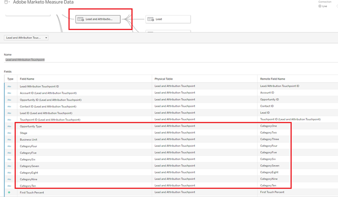

# [!DNL Marketo Measure] Berichtsvorlage - Tableau {#marketo-measure-report-template-tableau}

## Erste Schritte {#getting-started}

Sie können auf die [!DNL Tableau] Berichtsvorlage [here](https://github.com/adobe/Marketo-Measure-BI-Templates){target="_blank"}.

Öffnen Sie die [!DNL Adobe Marketo Measure] Berichtsvorlage Tableau-Arbeitsmappen-Datei.

Sie müssen die vorhandenen Verbindungsdaten auf Ihre spezifischen Snowflake-Verbindungsinformationen aktualisieren. Klicken Sie auf [!UICONTROL Verbindung bearbeiten] und folgen Sie den Schritten, die im Abschnitt [[!UICONTROL Datenverbindung]](#data-connection) Abschnitt dieser Dokumentation.


## Datenverbindung {#data-connection}

Sie müssen eine Datenverbindung zu Ihrer Snowflake-Instanz einrichten. Dazu benötigen Sie den Servernamen sowie Ihren Benutzernamen und Ihr Passwort. Details darüber, wo Sie diese Informationen finden und Ihr Passwort zurücksetzen können, werden bei Bedarf dokumentiert. [here](/help/marketo-measure-data-warehouse/data-warehouse-access-reader-account.md){target="_blank"}.


Sie müssen auch einen ersten SQL-Befehl eingeben. Dies unterstützt die Verwendung benutzerdefinierter Abfragen in diesem Datenmodell. Der einzugebende Befehl lautet &quot;Schema verwenden&quot;. `<your schema name>`&quot;. Den Namen Ihres Schemas finden Sie im [!UICONTROL Data Warehouse-Verbindungen] Seite, siehe oben referenzierte Dokumentation.


### Benutzerdefinierte SQL-Abfragen {#custom-sql-queries}

weil [!DNL Tableau] wendet Datenquellenfilter auf die Gesamtabfrage an und nicht auf die einzelne Tabelle, auf die der Filter gesetzt ist. Wir haben für jede Tabelle im Modell die Verwendung von benutzerdefiniertem SQL ausgewählt. Dadurch kann das Modell gelöschte und doppelte Zeilen auf Tabellenebene herausfiltern. Wenn beispielsweise als Datenquellenfilter angewendet, Sitzung._Gelöscht_Datum ist null wird dem , wobei-Satz der Abfrage hinzugefügt, was zur folgenden Abfrage führt.

**Filter zur Datenquelle hinzugefügt**

```
--A deleted session removes this row completely and the touchpoint data is lost. Select *
   From Touchpoint    tp
      join Session sn
      on tp.session_id = sn.session_id 
 Where tp._deleted_date is null
    and sn._deleted_date is null
```

Dies ist jedoch insofern falsch, als wenn eine Sitzung gelöscht wurde, der entsprechende Touchpoint jedoch nicht gelöscht wird, die Touchpoint-Daten aus dem Datensatz entfernt werden. Die Touchpoint-Daten sollen im Datensatz vorhanden sein, da der Touchpoint nicht gelöscht wurde. Durch das Hinzufügen von benutzerdefiniertem SQL wird sichergestellt, dass die Filterkriterien auf Tabellenebene angewendet werden, was zur folgenden Abfrage führt.

**Über benutzerdefinierte SQL angewendete Filter**

```
--A deleted session only removes the session related data, and the touchpoint data is preserved. Select *
   From Touchpoint       tp
      join Session sn
      on tp.session_id          = sn.session_id 
      and sn._deleted_date      is null
  Where tp._deleted_date is null
```

## Datenumwandlungen {#data-transformations}

Einige Transformationen wurden auf die Daten in [!DNL Tableau] aus dem ursprünglichen Zustand in Snowflake. Die meisten dieser Umwandlungen werden in den benutzerdefinierten SQL-Abfragen angewendet, die die Tabellen in der [!DNL Tableau] -Modell. Klicken Sie mit der rechten Maustaste auf den Tabellennamen und wählen Sie &quot;Benutzerdefinierte SQL-Abfrage bearbeiten&quot;, um die benutzerdefinierte SQL-Abfrage anzuzeigen, die zum Generieren einer Tabelle verwendet wird. Einige der spezifischen Umwandlungen sind nachfolgend beschrieben.


### Entfernte Spalten {#removed-columns}

Um das Datenmodell zu vereinfachen und unnötige Daten zu entfernen, haben wir die Anzahl der in Tableau importierten Spalten aus der ursprünglichen Snowflake-Tabelle reduziert. Zu den entfernten Spalten gehören unnötige Fremdschlüssel, denormalisierte Dimensionsdaten, die besser über Beziehungen zu anderen Tabellen im Modell genutzt werden können, Audit-Spalten und Felder, die für interne [!DNL Marketo Measure] Verarbeitung. Sie können nach Bedarf Spalten hinzufügen oder entfernen, indem Sie die Liste der importierten Spalten im Abschnitt Auswählen des benutzerdefinierten SQL-Codes bearbeiten.

>[!NOTE]
>
>Die meisten Tabellen in Data Warehouse enthalten denormalisierte Dimensionsdaten. Wir haben daran gearbeitet, das Modell zu normalisieren und zu bereinigen in [!DNL Tableau] soweit möglich, um die Leistung und Datengenauigkeit zu verbessern. Gehen Sie bei der Aufnahme zusätzlicher denormalisierter Felder in Faktentabellen vorsichtig vor. Dies kann zu einer unpräzisen Berichterstellung führen, bei der die Dimensionsfilterung über Tabellen verteilt ist.

### Umbenannte Spalten {#renamed-columns}

Tabellen und Spalten wurden umbenannt, um sie benutzerfreundlicher zu gestalten und Namenskonventionen zu standardisieren. Um die Spaltennamenänderungen anzuzeigen, verweisen Sie auf die benutzerdefinierten SQL-Anweisungen, mit denen die Tabellen erstellt werden.

### Zeilen hinzugefügt {#rows-added}

Um den Berechnungen im Modell Währungskonvertierungsfunktionen hinzuzufügen, haben wir sowohl der Opportunity- als auch der Cost-Tabelle eine Spalte für die Unternehmensumrechnungsrate und eine Spalte für die Zielkonversionsrate hinzugefügt. Der Wert in diesen Spalten wird auf Zeilenebene hinzugefügt und ausgewertet, indem sowohl für Datum als auch für Währungs-ID eine Verbindung zur Tabelle Konversionsrate hergestellt wird. Da Tableau nicht zulässt, dass Faktentabellen mehr als eine Dimensionstabelle teilen, wurden die Konversionsraten direkt zu den Tabellen hinzugefügt, die sie verwenden. Weitere Informationen dazu, wie die Währungsumrechnung in diesem Modell funktioniert, finden Sie unter [Währungsumrechnung](#currency-conversion) in dieser Dokumentation.


Es gibt einige Stellen, an denen zwei Tabellen aus [!DNL Snowflake] wurden mit einer Vereinigung kombiniert, um eine Tabelle im [!DNL Tableau] Datenmodell. In diesen Fällen wurde eine Spalte &quot;Typ&quot;hinzugefügt, die angibt, welche [!DNL Snowflake] -Tabelle, aus der sie stammt, und geben an, welche Entität die Zeile darstellt. Weitere Informationen zu den kombinierten Tabellen finden Sie im Abschnitt Beziehung und Datenfluss in dieser Dokumentation.


### Segmentnamen {#segment-names}

Da Segmentnamen anpassbar sind, haben sie allgemeine Spaltennamen im Snowflake Data Warehouse. [!DNL BIZ_SEGMENT_NAMES] ist eine Zuordnungstabelle, in der der allgemeine Segmentname mit dem angepassten Segmentnamen, dem er zugeordnet ist, aufgeführt wird, wie im Segmentabschnitt im Abschnitt [!DNL Marketo Measure] Benutzeroberfläche. Wenn Sie benutzerdefinierte Segmentnamen verwenden und Ihre [!DNL Tableau] -Modell verwenden, um diese zu integrieren, verwenden Sie diese Tabelle und benennen Sie die Spalten innerhalb des Tableau-Modells manuell um. Die Segmentspalten befinden sich in der Touchpoint-Tabelle Lead und Attribution und müssen nur einmal umbenannt werden.

Die [!UICONTROL KATEGORIE] enthält die Kategorienummer und die Spalte SEGMENT_NAME hat den angepassten Segmentnamen, dem sie zugeordnet ist.


Namen können auf zwei Arten aktualisiert werden. Die erste Option besteht darin, das benutzerdefinierte SQL zu aktualisieren. In diesem Beispiel wurden Kategorien 1 bis 6 anhand der Zuordnung aus der Tabelle Segmentnamen umbenannt.


Die andere Option besteht darin, die Spalten direkt im [!DNL Tableau] Tabelle.



## Datenmodell {#data-model}

Klicken Sie auf das folgende Bild, um die Vollversion zu erhalten.

[](/help/bi-report-templates/assets/tableau-data-model.png){target="_blank"}

### Beziehungen und Datenfluss {#relationships-and-data-flow}

Ereignisdaten, die zum Erstellen von Touchpoints verwendet werden, werden im [!UICONTROL Sitzung], [!UICONTROL Aufgabe], [!UICONTROL Ereignis], [!UICONTROL Aktivität]und [!UICONTROL Kampagnenmitglied] -Tabellen. Diese Ereignistabellen werden über ihre jeweiligen IDs mit der Touchpoint-Tabelle verknüpft. Wenn das Ereignis zu einem Touchpoint führte, werden die Details in der Touchpoint-Tabelle gespeichert.

Lead-Touchpoints und Attributions-Touchpoints werden in diesem Modell in einer Tabelle mit einer Verknüpfung zur Touchpoint-Tabelle zusammengefasst. Die Spalte &quot;Touchpoint-Typ&quot;wurde hinzugefügt, um festzulegen, ob es sich bei einer Zeile um einen Lead- oder einen Attributions-Touchpoint handelt. Die meisten Dimensionsdaten für Lead- und Attributions-Touchpoints werden von ihrem Link zum entsprechenden Touchpoint bezogen.

Die Möglichkeiten für Staging-Transitionen und Lead-Staging-Transitionen werden in diesem Modell in einer Tabelle zusammengefasst, mit einer Verknüpfung zum [!UICONTROL Lead und Zuordnung] Touchpoint-Tabelle. Die Spalte &quot;Übergangstyp&quot;wurde hinzugefügt, um festzulegen, ob es sich bei einer Zeile um eine Option oder eine Lead-Phase-Transition handelt.

Sowohl Kosten- als auch Touchpoint-Daten teilen die Dimensionen Kanal und Kampagne. Tableau ist jedoch in seiner Fähigkeit eingeschränkt, gemeinsame Dimensionen zwischen Faktentabellen zu modellieren. Da wir auf nur eine gemeinsame Dimensionstabelle beschränkt sind, wurden Kanal- und Kampagnendaten in einer Tabelle zusammengefasst. Sie werden mit einem Kreuzverschluss der beiden Dimensionen in einer Tabelle in Tableau kombiniert: Kanal und Kampagne. Die eindeutige ID wird durch Verkettung von Kanal und Kampagnen-IDs erstellt. Derselbe ID-Wert wird sowohl den Touchpoint- als auch den Kosten-Tabellen hinzugefügt, um eine Beziehung zu dieser kombinierten Dimensionstabelle zu erstellen.


In diesem Modell sind die Dimensionen &quot;Kampagne&quot;und &quot;Kanal&quot;mit dem Touchpoint verknüpft, sodass alle Berichte zu diesen Dimensionen über diesen Link erfolgen und das bedeutet, dass die dimensionalen Berichte zu Ereignisdaten möglicherweise unvollständig sind. Dies liegt daran, dass viele Ereignisse erst dann Links zu diesen Dimensionen haben, nachdem sie zu Touchpoints verarbeitet wurden.

>[!NOTE]
>
>Einige Ereignisse, wie z. B. Sitzungen, haben direkte Links zu den Dimensionen &quot;Kampagne&quot;und &quot;Kanal&quot;. Wenn Berichte zu diesen Dimensionen auf Sitzungsebene gewünscht werden, wird empfohlen, zu diesem Zweck ein eigenes Datenmodell zu erstellen.

Kostendaten werden auf unterschiedlichen Aggregationsebenen in der Snowflake Data Warehouse-Kostentabelle gespeichert. Für alle Anzeigenanbieter kann die Datenaggregation auf Kampagnenebene auf Kanalebene erfolgen. Aus diesem Grund ruft dieses Modell Kostendaten basierend auf dem Flag &quot;campaign_is_aggregatable_cost&quot;ab. Selbstgemeldete Kosten können nur auf Kanalebene eingereicht werden und sind nicht erforderlich, um über Campaign-Daten zu verfügen. Um eine möglichst genaue Kostenberichterstellung zu ermöglichen, werden die selbst gemeldeten Kosten basierend auf der Markierung &quot;channel_is_aggregatable_cost&quot;abgerufen. Die Abfrage, die Kostendaten importiert, wird mit der folgenden Logik geschrieben: Wenn ad_provider = &quot;SelfReport&quot;, dann channel_is_aggregatable_cost = true, ansonsten campaign_is_aggregatable_cost = true.

Im Rahmen dieses Modells wird Lead [!UICONTROL Kontakt], [!UICONTROL Konto]und [!UICONTROL Chancen] Daten werden als Dimensionsdaten betrachtet und direkt mit der Touchpoint-Tabelle &quot;Lead&quot;und &quot;Attribution&quot;verbunden.

### Währungsumrechnung {#currency-conversion}

Die in der Tabelle &quot;Konversionsrate&quot;angegebenen Kurse stellen den Wert dar, der zum Konvertieren eines Betrags aus der Unternehmenswährung erforderlich ist. Für Konversionen in eine beliebige Währung ist eine doppelte Konvertierung erforderlich, zunächst von der ursprünglichen Währung in die Unternehmenswährung und dann von der Unternehmenwährung in die ausgewählte Währung. Der erste Schritt in dieser Kette im Modell besteht darin, zwei Spalten mit diesen Konversionsraten zu den Tabellen mit Beträgen, Chancen und Kosten hinzuzufügen. Diese Schritte werden im Abschnitt Zeilen hinzugefügt in diesem Dokument beschrieben. Da Konversionsraten nicht statisch sein müssen und sich nach bestimmten Datumsbereichen ändern können, müssen alle Währungsumrechnungsberechnungen auf Zeilenebene durchgeführt werden. Bei der Umrechnung von der ursprünglichen Währung in die Unternehmenskurve wird der Wert durch den Unternehmensumrechnungskurs geteilt und dann durch die Zielkonversionsrate multipliziert. Die Zielkonversionsrate wird durch den ausgewählten Währungsparameterwert bestimmt.

* Konvertieren des ursprünglichen Werts in den Corporate-Währungs-Wert/Corporate-Konversionsrate = Wert in der Unternehmenskreditwährung
* Konvertieren des Werts aus dem Unternehmenswert in den ausgewählten Währungswert in der Unternehmenskreditwährung `*` Konversionsrate der ausgewählten Währung = Wert in der ausgewählten Währung


Die Währungskonversionsmessungen in diesem Modell ersetzen den Wert 1,0 für den Kurs, wenn keine Konversionsrate identifiziert werden kann. Es wurden separate Kennzahlen erstellt, um den Währungswert für die Kennzahl anzuzeigen, und eine Warnung, wenn eine Berechnung mehr als einen Währungswert enthält (d. h. ein Wert konnte nicht in die ausgewählte Währung konvertiert werden). Diese Kennzahlen, Kostenwährung und Umsatzwährung, sind in allen visuellen Darstellungen, in denen Kosten- oder Umsatzdaten angezeigt werden, als QuickInfos enthalten.


## Datendefinitionen {#data-definitions}

Definitionen wurden zum [!DNL Tableau model] für Parameter, benutzerdefinierte Spalten und Kennzahlen.


So zeigen Sie Definitionen für Spalten an, die direkt von [!DNL Snowflake], siehe [Data Warehouse-Dokumentation](/help/marketo-measure-data-warehouse/data-warehouse-schema.md){target="_blank"}.

## Diskrepanzen zwischen Vorlagen und Discover {#discrepancies-between-templates-and-discover}

### Attributierter Umsatz {#attributed-revenue}

Lead-Touchpoints und Attributions-Touchpoints übernehmen Dimensionsdaten vom ursprünglichen Touchpoint. Das Reporting-Vorlagenmodell liefert alle geerbten Dimensionsdaten aus der Beziehung zu Touchpoint, während im Discover-Modell Dimensionsdaten in die Lead- und Attribution-Touchpoint-Datensätze denormalisiert werden. Die insgesamt zugewiesenen Umsätze oder zugeordneten Pipeline-Umsätze sollten zwischen den beiden Berichten liegen. Diskrepanzen können jedoch auftreten, wenn der Umsatz nach Dimensionsdaten (Kanal, Unterkanal oder Kampagne) aufgeschlüsselt oder gefiltert wird. Wenn die dimensionalen Umsätze zwischen der Vorlage und Discover nicht übereinstimmen, fehlen wahrscheinlich Touchpoint-Einträge im Vorlagenberichtsdatensatz. Dies geschieht, wenn ein Lead- oder Attributions-Touchpoint-Datensatz vorhanden ist, aber kein entsprechender Datensatz in der Touchpoint-Tabelle innerhalb des in den Bericht importierten Datensatzes vorhanden ist. Da diese Tabellen nach dem geänderten Datum gefiltert werden, ist es möglich, dass der Lead-/Attributions-Touchpoint-Datensatz vor Kurzem geändert wurde als der Touchpoint-Datensatz. Daher wurde der Lead-/Attribution-Touchpoint in den Datensatz importiert, während der ursprüngliche Touchpoint-Datensatz nicht enthalten war. Um dieses Problem zu beheben, erweitern Sie den gefilterten Datumsbereich für die Touchpoint-Tabelle oder erwägen Sie, die Datumsbeschränkung zusammen zu entfernen.

>[!NOTE]
>
>Touchpoint ist eine große Tabelle. Beachten Sie daher die Kompromisse zwischen einem vollständigeren Datensatz und der Menge der zu importierenden Daten.

### Kosten {#cost}

Kostenberichte in den Vorlagen sind nur auf Kampagnen- und Kanalebene verfügbar. Discover bietet jedoch Berichte mit geringerer Granularität für einige Anzeigenanbieter (d. h. Kreative, Keywords, Anzeigengruppen usw.). Weitere Informationen zur Modellierung der Kostendaten in den Vorlagen finden Sie unter [!UICONTROL Datenmodell] Abschnitt dieser Dokumentation. Wenn die Dimension in [!UICONTROL Discover] auf Kanal oder Kampagne eingestellt ist, sollten die Kosten auf Kanal-, Unterkanal- und Kampagnenebene zwischen Discover und den Berichtvorlagen liegen.

### ROI {#roi}

Da der ROI aus den zugewiesenen Umsätzen und Kosten berechnet wird, können die gleichen Diskrepanzen, die bei diesen Berechnungen auftreten können, im ROI und aus den gleichen Gründen auftreten, wie in diesen Abschnitten beschrieben.

### Kontaktpunkte {#touchpoints}

Diese Metriken werden, wie in den Berichtsvorlagen dargestellt, nicht in Discover widergespiegelt. Es ist derzeit kein direkter Vergleich zwischen den beiden möglich.

### Web-Traffic {#web-traffic}

Das Datenmodell der Berichtsvorlage normalisiert die Dimensionsdaten von Kanal, Unterkanal und Kampagne über die Beziehung zwischen Sitzung und Touchpoint. Dies unterscheidet sich vom Discover-Datenmodell, das diese Dimensionen für die Sitzung denormiert. Aufgrund dieser Unterscheidung sollten die Gesamtzahlen für Besuche und Besucher zwischen Discover und der Berichtsvorlage übereinstimmen. Wenn diese Zahlen jedoch nach Anzeige oder Filterung nach Dimension angezeigt oder gefiltert werden, wird nicht erwartet, dass sie sich aufreihen. Dies liegt daran, dass die Dimensionsdaten in der Vorlage nur für Web-Ereignisse verfügbar sind, die zu einem Touchpoint führten (d. h. nicht anonyme Ereignisse). Weitere Informationen finden Sie unter [Datenmodell](#data-model) Abschnitt dieser Dokumentation.

Es können kleine Diskrepanzen bei der Gesamtzahl der Site-Formulare zwischen [!DNL Discover] und der Vorlage. Dies liegt daran, dass das Datenmodell in der Berichtsvorlage über eine Beziehung zu Sitzung und dann zu Touchpoint dimensionale Daten für das Site-Formular erhält. Es gibt einige Fälle, in denen Site-Formulardaten keine korrelierte Sitzung aufweisen.

### Leads und Konten {#leads-and-accounts}

Die Dimensionsberichte für die betroffenen Konten können zwischen [!DNL Discover] und der Vorlage, ist dies erneut auf die Dimensionsmodellierung zurückzuführen, die aus der Beziehung zwischen Touchpoint und Lead-Touchpoint oder Attribution Touchpoint entsteht. Weitere Informationen finden Sie in den Details, die im Abschnitt &quot;Zugewiesener Umsatz&quot;beschrieben sind.

Alle Lead-Zählungen in [!UICONTROL Discover] werden Lead-Zählungen zugeordnet und in der Berichtsvorlage wird die Metrik [!UICONTROL Leads] berührt. Daher ist kein direkter Vergleich zwischen den beiden Berichten für diese Maßnahme möglich.

### Interaktionsverlauf {#engagement-path}

Es gibt keinen direkten Vergleich zwischen den [!UICONTROL Interaktionspfad] in [!DNL Discover] und der Vorlage. Der Bericht in [!DNL Discover] vom Touchpoint modelliert wird, während der Bericht in der Vorlage vom Attribution Touchpoint modelliert wird. Die Vorlage konzentriert sich ausschließlich auf Chancen und ihre zugehörigen Touchpoints, anstatt alle Touchpoint-Daten anzuzeigen.

### Deal Velocity {#deal-velocity}

Es sollte keine Diskrepanz zwischen diesem Bericht in der Vorlage und der Kachel Deal Velocity im Velocity-Dashboard in Discover geben.
