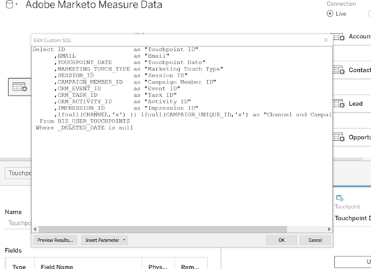
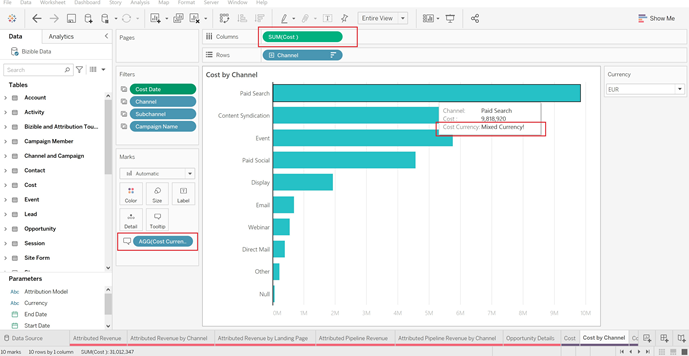

# [!DNL Marketo Measure]-Berichtsvorlage – Tableau {#marketo-measure-report-template-tableau}

## Erste Schritte {#getting-started}

Sie können auf die [!DNL Tableau] Berichtsvorlage ([) &#x200B;](https://github.com/adobe/Marketo-Measure-BI-Templates){target="_blank"}.

Öffnen Sie die Tableau-Arbeitsmappen-Datei der [!DNL Adobe Marketo Measure]-Berichtsvorlage.

Sie müssen die vorhandenen Verbindungsdaten gemäß Ihren spezifischen Snowflake-Verbindungsinformationen aktualisieren. Klicken Sie dazu auf die Schaltfläche [!UICONTROL Verbindung bearbeiten] und folgen Sie den im Abschnitt [[!UICONTROL Datenverbindung]](#data-connection) dieser Dokumentation beschriebenen Schritte.


## Datenverbindung {#data-connection}

Sie müssen eine Datenverbindung zu Ihrer Snowflake-Instanz einrichten. Dazu benötigen Sie den Server-Namen sowie Ihren Benutzernamen und Ihr Passwort. Details darüber, wo Sie diese Informationen finden und Ihr Passwort gegebenenfalls zurücksetzen können, finden Sie [hier](/help/data-warehouse/data-warehouse-access-reader-account.md){target="_blank"}.


Sie müssen auch einen ersten SQL-Befehl eingeben. Dadurch wird die Verwendung benutzerdefinierter Abfragen in diesem Datenmodell ermöglicht. Der einzugebende Befehl lautet „Use Schema `<your schema name>`“. Den Namen Ihres Schemas finden Sie auf der Seite [!UICONTROL Data Warehouse-Verbindungen]. Weitere Informationen dazu finden Sie in der oben genannten Dokumentation.


### Benutzerdefinierte SQL-Abfragen {#custom-sql-queries}

[!DNL Tableau] wendet Datenquellenfilter auf die gesamte Abfrage und nicht auf die einzelne Tabelle an, auf die der Filter gesetzt ist. Daher haben wir uns entschieden, für jede Tabelle im Modell eine benutzerdefinierte SQL-Abfrage zu verwenden. Hierdurch kann das Modell gelöschte und doppelte Zeilen auf Tabellenebene herausfiltern. Bei Verwendung als Datenquellenfilter wird beispielsweise „session._deleted_date is null“ der Where-Klausel der Abfrage hinzugefügt. Hieraus ergibt sich folgende Abfrage.

**Filter zur Datenquelle hinzugefügt**

```
--A deleted session removes this row completely and the touchpoint data is lost. Select *
   From Touchpoint    tp
      join Session sn
      on tp.session_id = sn.session_id
 Where tp._deleted_date is null
    and sn._deleted_date is null
```

Dies ist jedoch in folgender Hinsicht falsch: Wenn eine Sitzung gelöscht wurde, der entsprechende Touchpoint aber nicht, werden die Touchpoint-Daten aus dem Datensatz entfernt. Die Touchpoint-Daten sollen jedoch im Datensatz vorhanden sein, da der Touchpoint nicht gelöscht wurde. Durch das Hinzufügen einer benutzerdefinierten SQL-Abfrage wird sichergestellt, dass die Filterkriterien auf Tabellenebene angewendet werden. Hieraus ergibt sich folgende Abfrage.

**Filter über eine benutzerdefinierte SQL-Abfrage angewendet**

```
--A deleted session only removes the session related data, and the touchpoint data is preserved. Select *
   From Touchpoint       tp
      join Session sn
      on tp.session_id          = sn.session_id
      and sn._deleted_date      is null
  Where tp._deleted_date is null
```

## Datenumwandlungen {#data-transformations}

Einige Umwandlungen wurden ausgehend vom ursprünglichen Zustand in Snowflake auf die Daten in [!DNL Tableau] angewendet. Die meisten dieser Umwandlungen werden in den benutzerdefinierten SQL-Abfragen angewendet, die die Tabellen im [!DNL Tableau]-Modell generieren. Klicken Sie mit der rechten Maustaste auf den Tabellennamen und wählen Sie „Benutzerdefinierte SQL-Abfrage bearbeiten“ aus, um die benutzerdefinierte SQL-Abfrage anzuzeigen, die zum Generieren einer Tabelle verwendet wird. Einige der spezifischen Umwandlungen sind nachfolgend beschrieben.




### Spalten entfernt {#removed-columns}

Um das Datenmodell zu vereinfachen und unnötige Daten zu entfernen, wurde die Anzahl der aus der ursprünglichen Snowflake-Tabelle nach Tableau importierten Spalten verringert. Zu den entfernten Spalten gehören unnötige Fremdschlüssel, denormalisierte Dimensionsdaten, die besser über Beziehungen zu anderen Tabellen im Modell genutzt werden können, Audit-Spalten und für die interne [!DNL Marketo Measure]-Verarbeitung verwendete Spalten. Sie können Spalten entsprechend Ihren geschäftlichen Anforderungen hinzufügen oder entfernen, indem Sie die Liste der importierten Spalten im Abschnitt „Select“ der benutzerdefinierten SQL-Abfrage bearbeiten.

>[!NOTE]
>Die meisten Tabellen im Data Warehouse enthalten denormalisierte Dimensionsdaten. Das Modell wurde in [!DNL Tableau] so weit wie möglich normalisiert und bereinigt, um die Leistung und Datengenauigkeit zu verbessern. Gehen Sie beim Einschließen zusätzlicher denormalisierter Felder in Faktentabellen vorsichtig vor. Dies kann nämlich zu einer fehlerhaften tabellenübergreifenden Dimensionsfilterung und ungenauen Berichten führen.

### Spalten umbenannt {#renamed-columns}

Tabellen und Spalten wurden umbenannt, um sie benutzerfreundlicher zu gestalten und Namenskonventionen zu standardisieren. Um die Spaltennamenänderungen anzuzeigen, beziehen Sie sich auf die benutzerdefinierten SQL-Anweisungen, mit denen die Tabellen erstellt werden.

### Zeilen hinzugefügt {#rows-added}

Um den Berechnungen im Modell Funktionen zur Währungsumrechnung hinzuzufügen, wurde sowohl in der Tabelle für die Opportunity als auch in der für die Kosten eine Spalte für den unternehmensbezogenen Umrechnungskurs und eine Spalte für den Umrechnungszielkurs hinzugefügt. Der Wert in diesen Spalten wird auf Zeilenebene hinzugefügt und ausgewertet, indem sowohl für die Datums- als auch für die Währungs-ID eine Verknüpfung zur Tabelle mit dem Umrechnungskurs hergestellt wird. Da Tableau nicht zulässt, dass Faktentabellen mehr als eine Dimensionstabelle gemeinsam nutzen, wurden die Umrechnungskurse direkt den Tabellen hinzugefügt, die sie verwenden. Weitere Informationen dazu, wie die Währungsumrechnung in diesem Modell funktioniert, finden Sie im Abschnitt [Währungsumrechnung](#currency-conversion) in dieser Dokumentation.


Es gibt einige Stellen, an denen zwei Tabellen aus [!DNL Snowflake] mit einer Vereinigung kombiniert wurden, um im [!DNL Tableau]-Datenmodell eine einzige Tabelle zu bilden. In diesen Fällen wurde eine Spalte „Typ“ hinzugefügt, um anzugeben, aus welcher [!DNL Snowflake]-Tabelle diese stammt und für welche Entität die Zeile steht. Weitere Informationen zu den kombinierten Tabellen finden Sie im Abschnitt „Beziehungen und Datenfluss“ in dieser Dokumentation.


### Segmentnamen {#segment-names}

Segmentnamen sind anpassbar. Sie weisen daher im Snowflake Data Warehouse allgemeine Spaltennamen auf. [!DNL BIZ_SEGMENT_NAMES] ist eine Zuordnungstabelle, in der der allgemeine Segmentname mit dem angepassten, zugeordneten Segmentnamen aufgeführt wird, wie im Segmentabschnitt der [!DNL Marketo Measure]-Benutzeroberfläche definiert. Wenn Sie benutzerdefinierte Segmentnamen verwenden und diese in Ihr [!DNL Tableau]-Modell integrieren möchten, verwenden Sie diese Tabelle und benennen Sie die Spalten innerhalb des Tableau-Modells manuell um. Die Segmentspalten befinden sich in der Lead- und Attributions-Touchpoint-Tabelle und müssen nur einmal umbenannt werden.

Die Spalte [!UICONTROL KATEGORIE] enthält die Kategorienummer und die Spalte SEGMENTNAME den angepassten Segmentnamen, dem sie zugeordnet ist.


Namen können auf zwei Arten aktualisiert werden. Die erste Möglichkeit besteht darin, die benutzerdefinierte SQL-Abfrage zu aktualisieren. In diesem Beispiel wurden die Kategorien 1 bis 6 anhand der Zuordnung aus der Tabelle mit den Segmentnamen umbenannt.


Die andere Möglichkeit besteht darin, die Spalten direkt in der [!DNL Tableau]-Tabelle umzubenennen.


## Datenmodell {#data-model}

Klicken Sie auf das folgende Bild, um es in voller Größe anzuzeigen.

[](/help/bi-report-templates/assets/tableau-data-model.png){target="_blank"}

### Beziehungen und Datenfluss {#relationships-and-data-flow}

Ereignisdaten, die zum Erstellen von Touchpoints verwendet werden, werden in den Tabellen [!UICONTROL Sitzung], [!UICONTROL Aufgabe], [!UICONTROL Veranstaltung], [!UICONTROL Aktivität] und [!UICONTROL Kampagnenmitglied] gespeichert. Diese Ereignistabellen werden über ihre jeweiligen IDs mit der Touchpoint-Tabelle verknüpft. Wenn das Ereignis zu einem Touchpoint geführt hat, werden die Details in der Touchpoint-Tabelle gespeichert.

Lead-Touchpoints und Attributions-Touchpoints werden in diesem Modell zu einer einzigen Tabelle kombiniert, und zwar mit einem Link zur Touchpoint-Tabelle. Die Spalte „Touchpoint-Typ“ wurde hinzugefügt, um festzulegen, ob es sich bei einer Zeile um einen Lead- oder einen Attributions-Touchpoint handelt. Die meisten Dimensionsdaten für Lead- und Attributions-Touchpoints stammen aus ihrer Verknüpfung mit dem entsprechenden Touchpoint.

Übergänge in der Opportunity-Phase und Übergänge in der Lead-Phase werden in diesem Modell zu einer Tabelle kombiniert, und zwar mit einem Link zur Tabelle der [!UICONTROL Lead- und Attributions]-Touchpoints. Die Spalte „Übergangstyp“ wurde hinzugefügt, um festzulegen, ob es sich bei einer Zeile um einen Übergang der Opportunity- oder Lead-Phase handelt.

Sowohl Kosten- als auch Touchpoint-Daten haben dieselben Kanal- und Kampagnendimensionen. Tableau hat jedoch nur eine eingeschränkte Fähigkeit, gemeinsame Dimensionen zwischen Faktentabellen zu modellieren. Aufgrund der Beschränkung auf nur eine gemeinsame Dimensionstabelle wurden Kanal- und Kampagnendaten zu einer Tabelle kombiniert. Sie werden mit einem sogenannten Crossjoin (Kreuzprodukt) der beiden Dimensionen zu einer Tabelle in Tableau kombiniert: Kanal und Kampagne. Die eindeutige ID wird durch Verkettung der Kanal- und Kampagnen-IDs erstellt. Derselbe Wert dieser ID wird sowohl den Touchpoint- als auch den Kostentabellen hinzugefügt, um eine Beziehung zu dieser kombinierten Dimensionstabelle zu erstellen.


In diesem Modell sind die Dimensionen „Kampagne“ und „Kanal“ mit dem Touchpoint verknüpft, sodass alle Berichte zu diesen Dimensionen über diesen Link erfolgen. Das bedeutet, dass die dimensionsbezogenen Berichte zu Ereignisdaten möglicherweise unvollständig sind. Dies ist darauf zurückzuführen, dass viele Ereignisse erst dann Links zu diesen Dimensionen haben, nachdem sie zu Touchpoints verarbeitet wurden.

>[!NOTE]
>Einige Ereignisse, wie z. B. Sitzungen, haben direkte Links zu den Dimensionen „Kampagne“ und „Kanal“. Wenn Berichte zu diesen Dimensionen auf Sitzungsebene gewünscht werden, wird empfohlen, hierzu ein eigenes Datenmodell zu erstellen.

Kostendaten werden in der Snowflake Data Warehouse-Kostentabelle auf unterschiedlichen Aggregationsebenen gespeichert. Für alle Anzeigenanbieter kann für die Daten auf Kampagnenebene ein Rollup auf Kanalebene durchgeführt werden. Aus diesem Grund ruft dieses Modell Kostendaten basierend auf dem Flag „campaign_is_aggregatable_cost“ ab. Selbstgemeldete Kosten können nur auf Kanalebene übermittelt werden und sind nicht erforderlich, um über Kampagnendaten zu verfügen. Um möglichst genaue Kostenberichte zu ermöglichen, werden die selbstgemeldeten Kosten basierend auf dem Flag „channel_is_aggregatable_cost“ abgerufen. Die Abfrage zum Import von Kostendaten wird mit folgender Logik verfasst: If ad_provider = &quot;SelfReported&quot; then channel_is_aggregatable_cost = true, else campaign_is_aggregatable_cost = true.

Im Kontext dieses Modells werden diese Modell-, Lead-, [!UICONTROL Kontakt]-, [!UICONTROL Konto]- und [!UICONTROL Opportunity]-Daten als Dimensionsdaten betrachtet und direkt mit der Tabelle der Lead- und Attributions-Touchpoints verknüpft.

### Währungsumrechnung {#currency-conversion}

Die in der Tabelle „Umrechnungskurs“ angegebenen Kurse stellen den Wert dar, der zum Umrechnen eines Betrags aus der Unternehmenswährung erforderlich ist. Für Umrechnungen in eine beliebige Währung ist eine doppelte Umrechnung erforderlich: zunächst von der ursprünglichen Währung in die Unternehmenswährung und dann von der Unternehmenwährung in die ausgewählte Währung. Der erste Schritt in dieser Kette im Modell besteht darin, zwei Spalten mit diesen Umrechnungskursen zu den Tabellen mit Beträgen, Opportunitys und Kosten hinzuzufügen. Diese Schritte werden im Abschnitt „Zeilen hinzugefügt“ in diesem Dokument beschrieben. Da Umrechnungskurse nicht statisch sein müssen und sich in bestimmten Datumsbereichen ändern können, müssen alle Währungsumrechnungen auf Zeilenebene durchgeführt werden. Bei der Umrechnung von der ursprünglichen Währung in die Unternehmenswährung wird der Wert durch den unternehmensbezogenen Umrechnungskurs geteilt und dann mit dem Umrechnungszielkurs multipliziert. Der Umrechnungszielkurs wird durch den ausgewählten Währungsparameterwert bestimmt.

* Umrechnen des ursprünglichen Werts in den unternehmensbezogenen Währungswert / unternehmensbezogener Umrechnungskurs = Wert in der Unternehmenswährung
* Umrechnen des Werts aus dem unternehmensbezogenen in den ausgewählten Währungswert in der Unternehmenswährung `*` Umrechnungskurs der ausgewählten Währung = Wert in der ausgewählten Währung


In den Kennzahlen für die Währungsumrechnung in diesem Modell wird der Wert 1,0 für den Kurs eingesetzt, wenn kein Umrechnungskurs identifiziert werden kann. Es wurden separate Kennzahlen erstellt, um den Währungswert für die Kennzahl anzuzeigen und einen Warnhinweis auszugeben, wenn eine Berechnung mehr als einen Währungswert enthält ((d. h. ein Wert konnte nicht in die ausgewählte Währung umgerechnet werden). Diese Kennzahlen, Kostenwährung und Umsatzwährung, sind in allen visuellen Darstellungen, in denen Kosten- oder Umsatzdaten angezeigt werden, als QuickInfos enthalten.



## Datendefinitionen {#data-definitions}

Zum [!DNL Tableau model] wurden Definitionen für Parameter, benutzerdefinierte Spalten und Kennzahlen hinzugefügt.


Informationen zum Anzeigen von Definitionen für Spalten, die direkt aus [!DNL Snowflake] stammen, finden Sie in der [Data-Warehouse-Dokumentation](/help/data-warehouse/data-warehouse-schema.md){target="_blank"}.

## Diskrepanzen zwischen Vorlagen- und Discover-Modell {#discrepancies-between-templates-and-discover}

### Attributierter Umsatz {#attributed-revenue}

Lead-Touchpoints und Attributions-Touchpoints übernehmen Dimensionsdaten vom ursprünglichen Touchpoint. Das Berichtsvorlagenmodell liefert alle übernommenen Dimensionsdaten aus der Beziehung zum Touchpoint, während im Discover-Modell Dimensionsdaten in die Lead- und Attributions-Touchpoint-Einträge denormalisiert werden. Die insgesamt attributierten Umsätze oder attributierten Pipeline-Umsätze sollten zwischen den beiden Berichten stimmig sein. Es können jedoch Diskrepanzen auftreten, wenn der Umsatz nach Dimensionsdaten (Kanal, Subkanal oder Kampagne) aufgeschlüsselt oder gefiltert wird. Wenn die dimensionsbezogenen Umsatzbeträge zwischen Vorlage und Discover nicht übereinstimmen, fehlen wahrscheinlich Touchpoint-Einträge im Vorlagenberichtsdatensatz. Dies geschieht, wenn ein Lead- oder Attributions-Touchpoint-Eintrag vorhanden ist, es aber keinen entsprechenden Eintrag in der Touchpoint-Tabelle innerhalb des in den Bericht importierten Datensatzes gibt. Diese Tabellen werden nach dem Änderungsdatum gefiltert. Daher ist es möglich, dass der Lead-/Attributions-Touchpoint-Eintrag später als der Touchpoint-Eintrag geändert und somit zwar der Lead-/Attributions-Touchpoint in den Datensatz importiert wurde, der ursprüngliche Touchpoint-Eintrag aber nicht. Um dieses Problem zu beheben, erweitern Sie den gefilterten Datumsbereich für die Touchpoint-Tabelle oder entfernen Sie die Datumsbeschränkung insgesamt.

>[!NOTE]
>Die Touchpoint-Tabelle ist groß. Achten Sie daher auf eine gewisse Balance zwischen der Vollständigkeit eines Datensatzes und der Menge der zu importierenden Daten.

### Kosten {#cost}

Kostenberichte in den Vorlagen sind nur auf Kampagnen- und Kanalebene verfügbar. Discover bietet jedoch Berichte mit geringerer Granularität für bestimmte Anzeigenanbieter (z. B. zu Kreativinhalten, Keywords, Anzeigengruppen usw.). Weitere Informationen zum Modellieren der Kostendaten in den Vorlagen finden Sie im Abschnitt [!UICONTROL Datenmodell] in dieser Dokumentation. Wenn der Dimensionsfilter in [!UICONTROL Discover] auf Kanal oder Kampagne eingestellt ist, sollten die Kosten auf Kanal-, Subkanal- und Kampagnenebene zwischen Discover und Berichtsvorlagen stimmig sein.

### ROI {#roi}

Da sich der ROI aus attributiertem Umsatz und Kosten berechnet, können dieselben Diskrepanzen, die bei diesen Berechnungen auftreten können, auch im ROI aus den gleichen Gründen auftreten, wie in diesen Abschnitten beschrieben.

### Touchpoints {#touchpoints}

Diese Metriken werden, wie in den Berichtsvorlagen dargestellt, in Discover nicht widergespiegelt. Es ist derzeit kein direkter Vergleich zwischen Vorlagen und Discover möglich.

### Webtraffic {#web-traffic}

Das Datenmodell der Berichtsvorlage normalisiert die Dimensionsdaten von Kanal, Subkanal und Kampagne über die Beziehung zwischen Sitzung und Touchpoint. Dies unterscheidet sich vom Discover-Datenmodell, bei dem diese Dimensionen für die Sitzung denormalisiert werden. Aufgrund dieser Unterscheidung sollten die Gesamtzahlen für Besuche und Besuchende zwischen Discover und der Berichtsvorlage übereinstimmen. Wenn diese Zahlen jedoch nach Dimension angezeigt oder gefiltert werden, wird diese Übereinstimmung nicht erwartet. Dies liegt daran, dass die Dimensionsdaten in der Vorlage nur für Web-Ereignisse verfügbar sind, die zu einem Touchpoint geführt haben (d. h. nicht anonyme Ereignisse). Weitere Informationen finden Sie im Abschnitt [Datenmodell](#data-model) in dieser Dokumentation.

Es kann kleine Diskrepanzen bei der Gesamtzahl der Site-Formulare zwischen [!DNL Discover] und der Vorlage geben. Dies liegt daran, dass das Datenmodell in der Berichtsvorlage über eine Beziehung zur Sitzung und dann zum Touchpoint Dimensionsdaten für das Site-Formular erhält. Es einigen Fälle weisen Site-Formulardaten keine korrelierte Sitzung auf.

### Leads und Konten {#leads-and-accounts}

Die Dimensionsberichte für die betroffenen Konten können zwischen [!DNL Discover] und der Vorlage geringfügig voneinander abweichen. Dies ist erneut auf die Dimensionsmodellierung auf Basis der Beziehung zwischen Touchpoint und Lead- bzw. Attributions-Touchpoint zurückzuführen. Weitere Informationen dazu finden Sie im Abschnitt „Zugewiesener Umsatz“.

Alle Lead-Zahlen in [!UICONTROL Discover] sind attributierte Lead-Zahlen, und in der Berichtsvorlage weist die Metrik [!UICONTROL Lead]-Touchpoints auf. Daher ist für diese Kennzahl kein direkter Vergleich zwischen den beiden Berichten möglich.

### Interaktionsverlauf {#engagement-path}

Es gibt keinen direkten Vergleich zwischen dem Bericht [!UICONTROL Interaktionsverlauf] in [!DNL Discover] und der Vorlage. Der Bericht in [!DNL Discover] wird ausgehend vom Touchpoint, aber der Bericht in der Vorlage ausgehend vom Attributions-Touchpoint modelliert. Die Vorlage konzentriert sich ausschließlich auf Opportunitys und ihre zugehörigen Touchpoints, anstatt alle Touchpoint-Daten anzuzeigen.

### Abschlussgeschwindigkeit {#deal-velocity}

Es sollte keine Diskrepanz zwischen diesem Bericht in der Vorlage und der Kachel „Abschlussgeschwindigkeit“ im Dashboard „Geschwindigkeit“ in Discover geben.
