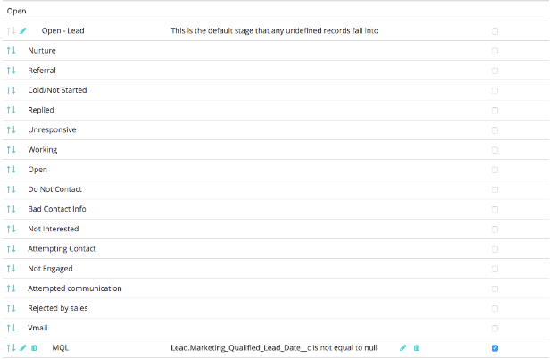
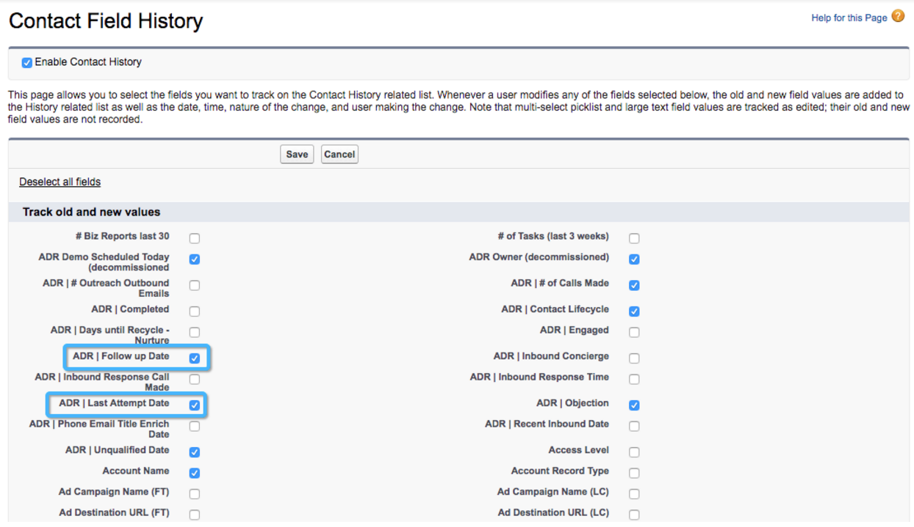

# Benutzerdefiniertes Modell-Setup: Feldverlauf-Tracking aktivieren {#custom-model-setup-enable-field-history-tracking}

## Warum und wann Sie das Feldverlauf-Tracking aktivieren sollten {#why-and-when-to-enable-field-history-tracking}

Wenn Sie sich entscheiden, ein benutzerdefiniertes Feld als Phase in Ihr benutzerdefiniertes Attributionsmodell aufzunehmen, **muss das Feldverlauf-Tracking für dieses Feld aktiviert sein**. Wenn Sie das Feldverlauf-Tracking aktivieren, wird [!DNL Salesforce] jedes Mal, wenn das benutzerdefinierte Feld bearbeitet wird, ein Eintrag in der Tabelle für das Feldverlauf-Tracking erstellt. [!DNL Marketo Measure] kann diese Tabelle herunterladen und diese Informationen verwenden, um die Zeit und den Tag zu messen, an dem ein „Übergang“ stattgefunden hat. Ohne Feldverlauf-Tracking ist [!DNL Marketo Measure] nicht in der Lage, Änderungen in Bezug auf dieses Feld zu verfolgen.

Wenn im benutzerdefinierten Modell nur [!UICONTROL Lead-Status] oder Opportunity-Phasen verwendet werden, brauchen Sie das Feldverlauf-Tracking nicht zu aktivieren, da es automatisch als Phasenübergang verfolgt wird.

Um das Feldverlauf-Tracking zu aktivieren, befolgen Sie die folgenden Anweisungen.

## Aktivieren des Feldverlauf-Trackings {#enable-field-history-tracking}

>[!NOTE]
>
>Sie müssen Systemadmin sein, um diese Änderungen an den Feldern des Objekts „Lead/Kontakt/Opportunity“ vornehmen zu können.

1. Gehen Sie zu dem Objekt, in dem sich das benutzerdefinierte Feld befindet, und klicken Sie auf die Schaltfläche **[!UICONTROL Verlaufs-Tracking festlegen]**.

   

1. Wählen Sie die Felder aus, für die Sie Änderungen verfolgen möchten.

   

[!DNL Marketo Measure] kann einen Eintrag nur dann erneut importieren, wenn feststellt wird, dass der Eintrag vor kurzem geändert wurde. Formelfelder verändern technisch gesehen einen Eintrag nicht, wenn er sich ändert, da die Berechnung im Hintergrund erfolgt. Wir haben Probleme festgestellt, bei denen eine Regel übersprungen wurde, weil [!DNL Marketo Measure] die Änderung des Eintrags nicht gesehen hat. Daher wird empfohlen, **keine Formelfelder in Regeldefinitionen zu verwenden**. Die Lösung besteht darin, ein Textfeld zu erstellen und dieses Feld mit einem Workflow zu füllen, der jedes Mal, wenn der Eintrag bearbeitet wird oder den Kriterien entspricht, den richtigen Wert oder die richtige Berechnung enthält. Dies setzt voraus, dass alle Einträge bearbeitet werden, damit der Workflow rückwirkend mit alten Einträgen arbeiten kann.
