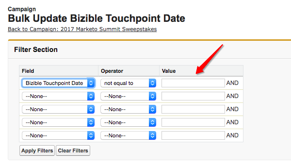

# Kampagnen und Kampagnenmitglieder {#campaigns-and-campaign-members}

[!DNL Salesforce] Kampagnen dienen dazu, Listen von Leads und Kontakten zu verfolgen, die mit einem Marketingprogramm oder einer Aktivität verbunden sind. Hierbei handelte es sich in der Regel um Webinare, Registrierungen oder z. B. Messebesuche. Marketingexperten können auswählen, ob eine Kampagne einer Touchpoint-Journey gutgeschrieben werden soll oder nicht.

## Aktivieren von Touchpoints {#enabling-touchpoints}

Die [!DNL Marketo Measure] [!DNL Salesforce] Das Paket enthält ein Feld mit der Bezeichnung &quot;Käufer-Touchpoints aktivieren&quot;im Campaign-Objekt. Nachdem das Feld zum Seitenlayout hinzugefügt wurde, sieht es in etwa so aus:

Die in der Auswahlliste verfügbaren Optionen sind:

* Alle Campaign-Mitglieder einschließen - Jeder Lead oder Kontakt, der zur Kampagne hinzugefügt wird, erhält einen Touchpoint, der dieser Kampagne zugeordnet ist.
* Nur &quot;Respondierte&quot; Kampagnenmitglieder einschließen - Nur Leads oder Kontakte mit dem Status &quot;Beantwortet&quot; der Kampagne erhalten einen Touchpoint, der mit dieser Kampagne verknüpft ist.
* Alle Campaign-Mitglieder ausschließen - Keiner der Leads oder Kontakte erhält einen Touchpoint, der mit dieser Kampagne verknüpft ist.

Bitte beachten Sie, dass den Mitgliedern der Kampagne eine E-Mail-Adresse zugeordnet sein muss, damit sie [!DNL Marketo Measure] um einen Touchpoint zu erstellen. Ohne E-Mail-Adresse [!DNL Marketo Measure] weist dem Kampagnenmitglied keinen Touchpoint zu.

## Kampagnensynchronisierungsdaten {#campaign-sync-dates}

Mit der Installation des Pakets [!DNL Marketo Measure] enthält außerdem zwei Datumsfelder für das Campaign-Objekt: Startdatum des Touchpoints und Enddatum des Touchpoints.

Diese Daten zeigen [!DNL Marketo Measure] wann wir beginnen oder aufhören sollten, Campaign-Mitglieder aus der Kampagne in die Touchpoint-Journey aufzunehmen. Sie können entweder ein Datum, beides oder gar kein Datum festlegen.

## Anwendungsbeispiel für das Startdatum von Touchpoints {#use-case-for-touchpoint-start-date}

Das Startdatum kann verwendet werden, wenn eine vorhandene Kampagne zum Tracking von Leads und Kontakten verwendet wird. Der Benutzer möchte jedoch erst mit der Messung beginnen, wenn neue Systeme oder Prozesse vorhanden sind. Daher beschließt er, ein Startdatum einmal festzulegen. [!DNL Marketo Measure] sollte damit beginnen, diese Campaign-Mitglieder zu verfolgen.

## Anwendungsbeispiel für das Enddatum von Touchpoints {#use-case-for-touchpoint-end-date}

Wenn die [!DNL Marketo Measure]verwendet haben, haben Sie eine Marketing Automation-Plattform verwendet, die die digitalen Interaktionen von Leads verfolgt hat (IE-Formularübermittlungen), und diese Leads dann in eine [!DNL Saleforce] Campaign können Sie das Feld Enddatum für Touchpoint nutzen. Sie würden das Touchpoint-Enddatum als Startdatum festlegen mit [!DNL Marketo Measure] und die Option &quot;Touchpoints des Käufers&quot;aktivieren, wird jede digitale Interaktion dieser Leads als Touchpoint erstellt. Der Grund, aus dem Sie das Touchpoint-Enddatum als Startdatum festlegen, mit dem [!DNL Marketo Measure] ist, weil wir diese digitalen Interaktionen künftig über unser JavaScript verfolgen werden.

## Kampagnenmitglieder {#campaign-members}

Campaign-Mitglieder sind unter [!UICONTROL Kampagnen]und mit einem Lead oder Kontakt in Verbindung stehen. Lead oder Kontakt können einer Kampagne nur einmal hinzugefügt werden. Dies kann je nach Anwendungsfall der Kampagne problematisch sein. Beim Synchronisieren einer Kampagne wird die Kampagnenmitgliedschaft als Marketingaktivität verwendet, die in die Touchpoint-Journey eingefügt und wie ein Ausfüllen des Formulars behandelt wird.

## Touchpoint-Status des Käufers {#buyer-touchpoint-status}

Wenn aktiviert, [!DNL Marketo Measure] sendet einen Statuswert über vier verschiedene Felder an das Campaign-Mitglied, die im installierten Package enthalten sind: Touchpoint-Status (Lead), Touchpoint-Status (Kontakt), Touchpoint-Status (Gelegenheit) und Touchpoint-Statusdatum. So können Kunden prüfen, ob ein Touchpoint als Touchpoint für Käufer oder als Touchpoint für die Käuferzuordnung erstellt wurde, je nach dem Objekt, mit dem er verbunden ist. Das Touchpoint-Statusdatum ist lediglich das letzte Datum, an dem der Status im Campaign-Mitglied aktualisiert wurde.

## Touchpoint-Datum des Käufers {#buyer-touchpoint-date}

Mit der Installation des Pakets [!DNL Marketo Measure] enthält auch ein Feld im Campaign-Mitglied mit der Bezeichnung &quot;Touchpoint-Datum des Käufers&quot;. Dadurch kann der Benutzer das Datum überschreiben, an dem [!DNL Marketo Measure] würde für das Touchpoint-Datum im Touchpoint-Datensatz verwenden.

Dies könnte erforderlich sein, wenn eine Liste Tage/Wochen/Monate nach dem tatsächlichen Eintreten eines Ereignisses hochgeladen wurde. Es gibt Möglichkeiten, alle Datensätze gleichzeitig zu aktualisieren, wie nachfolgend beschrieben.

Um herauszufinden, ob Sie das Touchpoint-Datum des Käufers verwenden müssen oder nicht, hier sehen Sie, wie die Daten durch [!DNL Marketo Measure] hängt von der [!UICONTROL Synchronisierungstyp] wird für die Kampagne ausgewählt.

Wenn die Variable [!UICONTROL Synchronisierungstyp] auf &quot;Alle Campaign-Mitglieder einschließen&quot;festgelegt ist, hat die Festlegung des Touchpoint-Datums Priorität von oben nach unten:

* Touchpoint-Datum des Käufers
* Erstellungsdatum des Kampagnenmitglieds

Wenn die Variable [!UICONTROL Synchronisierungstyp] auf &quot;Nur antwortende Kampagnenmitglieder einschließen&quot;festgelegt ist, hat die Festlegung des Touchpoint-Datums Priorität von oben nach unten:

* Touchpoint-Datum des Käufers
* Datum der ersten Antwort
   * Das Datum der ersten Reaktion wird automatisch festgelegt, sobald der Status in &quot;Beantwortet&quot;geändert wird. Es handelt sich dabei um einen standardmäßigen [!DNL Salesforce] Feld, das nicht geändert werden kann

* Erstellungsdatum des Kampagnenmitglieds

## Touchpoint-Datum für Massenaktualisierung {#bulk-update-touchpoint-date}

Das Bulk Update Touchpoint Date ist im installierten [!DNL Marketo Measure] [!DNL Salesforce] -Paket und -Schaltfläche müssen dem Seitenlayout hinzugefügt werden.

Wenn eine große Anzahl von Campaign-Mitgliederdatensätzen aktualisiert werden muss, können Sie die [!UICONTROL Touchpoint-Datum für Massenaktualisierung] Schaltfläche zur Massenbearbeitung.

Wenn es eindeutige Anwendungsfälle gibt, die diese Schnittstelle nicht abdeckt, können Sie auch die [Datenlader](https://dataloader.io/){target=&quot;_blank&quot;}, um die Datensätze zu exportieren, die Änderung vorzunehmen und die Datensätze erneut hochzuladen.

Suchen Sie zunächst nach den Datensätzen und filtern Sie die Datensätze, für die Sie ein Käufer-Touchpoint-Datum festlegen möchten.

>[!CAUTION]
>
>Es gibt eine Suche, die nicht funktioniert, die im folgenden Beispiel angezeigt wird. Die Benutzeroberfläche unterstützt nicht die Suche nach null Käufer-Touchpoint-Daten (die unten stehende Suche funktioniert nicht):

Wenn Sie die Suche nicht verwenden und nur die Daten auf jeden Datensatz eines Campaign-Mitglieds anwenden müssen, verwenden Sie den[!UICONTROL Alle Datensätze einschließen]&quot;(siehe Screenshot unten), das alle Datensätze auf allen Seiten überprüft.

Wählen Sie in der Kalenderauswahl Datum und Uhrzeit aus. Wenn Sie das aktuelle Datum und die aktuelle Uhrzeit auswählen möchten, klicken Sie auf das Datum/die Uhrzeit, die neben der Kalenderauswahl angezeigt wird.

Sobald Ihr Datum und Ihre Uhrzeit festgelegt sind, klicken Sie auf die **[!UICONTROL Ausgewählte Datensätze aktualisieren]** -Schaltfläche, um die Änderungen anzuwenden.

## Kampagnenkosten {#campaign-costs}

Informationen zu Kampagnenkosten [in diesem Artikel](/help/marketing-spend/spend-management/crm-campaign-costs.md).

## Entfernen von Kampagnenmitgliedern {#campaign-member-removal}

Die [!DNL Marketo Measure] hält mit allen gelöschten Datensätzen in Salesforce auf, unabhängig davon, ob es sich um gelöschte Leads oder Konten handelt oder ob es sich um Möglichkeiten handelt, diese Datensätze in der API anzuzeigen und zu verfolgen, ob ein Eintrag als &quot;IsDeleted&quot;markiert ist. Leider hat Salesforce mit Campaign-Mitgliedern eine andere Möglichkeit eingeführt, diese Campaign-Mitglieder aus einer Kampagne zu löschen. Sie sind eigentlich nur als &quot;entfernt&quot;markiert und nicht als &quot;gelöscht&quot;. Das Problem besteht daher darin, dass Touchpoints noch in Salesforce lebten, die mit gelöschten Campaign-Mitgliedern in Verbindung standen.

Um dieses Problem zu umgehen, [!DNL Marketo Measure] erstellt [!DNL Marketo Measure] Verlaufsobjekt und Trigger, die immer verfolgt werden, wenn Campaign-Mitglieder entfernt werden, und dann den entsprechenden Touchpoint löschen. **Sie benötigen [!DNL Marketo Measure] Marketing Analytics-Paket V6.15 oder höher** , um diese Funktion zu verwenden.

>[!CAUTION]
>
>Beachten Sie, dass dieser Trigger keine Kampagnenmitglieder verfolgt, die in der Vergangenheit entfernt wurden. Daher funktioniert dies nur in Zukunft. Wenn Sie die Touchpoints einer großen Anzahl von früheren Kampagnenmitgliedern entfernen müssen, wenden Sie sich an [Marketo-Support](https://nation.marketo.com/t5/support/ct-p/Support){target=&quot;_blank&quot;}.

>[!MORELIKETHIS]
>
>[[!DNL Marketo Measure] Universität: Kampagnenobjektfelder](https://universityonline.marketo.com/courses/bizible-fundamentals-channel-management/#/page/5c63007334d9f0367662b758)
>
>[[!DNL Marketo Measure] Universität: Zuordnen von Offline-Kanälen](https://universityonline.marketo.com/courses/bizible-fundamentals-channel-management/#/page/5c630eca34d9f0367662b77f)
