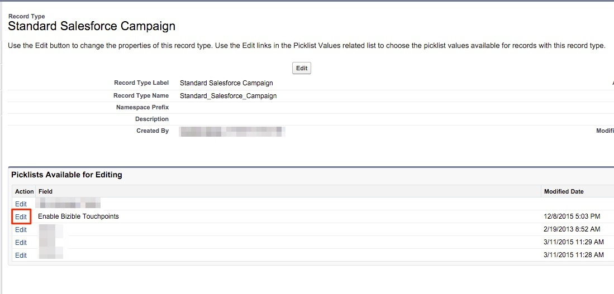

# Konfigurationen für mehrere Kampagneneintragstypen {#configurations-for-multiple-campaign-record-types}

**Fehlende Auswahllistenwerte im Feld „Käufer-Touchpoints aktivieren“**

Wenn Ihre SFDC-Organisation mehrere Kampagnendatensatztypen verwendet, müssen für jeden Datensatztyp die Werte der Auswahlliste für die „Käufer-Touchpoints aktivieren“ hinzugefügt werden. Gehen Sie wie folgt vor, um die Optionen hinzuzufügen.

1. Navigieren Sie **[!UICONTROL Setup]** > **[!UICONTROL Anpassen]** > **[!UICONTROL Kampagnen]** > **[!UICONTROL Datensatztypen]**.

   

1. Wählen Sie die Datensatztypen der Kampagne aus, indem Sie auf **[!UICONTROL Beschriftung Datensatztyp]** und nicht auf die Schaltfläche [!UICONTROL Bearbeiten] klicken.

   

1. Hier werden Sie mit den verfügbaren Auswahllisten für diesen Datensatztyp auf den Bildschirm gebracht. Wählen **[!UICONTROL Bearbeiten]** neben dem Feld „Käufer-Touchpoints aktivieren“ aus.

   

1. Fügen Sie alle drei Werte aus der Gruppe „Verfügbare Werte“ zur Gruppe „Ausgewählte Werte“ hinzu.

   

1. Setzen Sie den Standardwert auf „Keine“ und klicken Sie auf **[!UICONTROL Speichern]**. Wiederholen Sie diesen Vorgang für alle weiteren Kampagnendatensatztypen.
