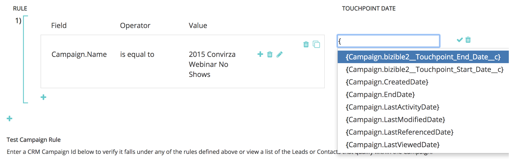

# Synchronisierung benutzerspezifischer Kampagnen {#custom-campaign-sync}

Heute können Sie mit dem installierten [!DNL Marketo Measure] -Paket angeben, welche Kampagnen als zulässigen Touchpoint einbezogen werden sollen. Es gibt mehrere Hürden dafür, wie es zuvor existierte. Sobald das Paket [!DNL Marketo Measure] im CRM installiert ist, kann es einige Zeit dauern, bis es von Ihrem Sicherheitsteam genehmigt wird. Darüber hinaus ist die Verwendung einer einzelnen Auswahlliste im Campaign-Objekt nicht flexibel. Mit dieser neuen Funktion ist keine Paketinstallation erforderlich, um mit der Verwendung der Datensätze von Campaign und Campaign-Mitgliedern zu beginnen. Regeln können erstellt werden, um genau zu definieren, welche Datensätze erstellt werden können, um genau zu definieren, welche Datensätze zulässig sind.

## Anforderungen {#requirements}

* Die Kampagnensynchronisierung ist in allen Ebenen verfügbar
* Um Daten zu importieren, müssen Sie Ihr CRM-System weiterhin mit Ihrem [!DNL Marketo Measure]-Konto verbinden

## Funktionsweise {#how-it-works}

1. Mit AccountAdmin-Berechtigungen können Sie zu **[!UICONTROL Einstellungen]** > **[!UICONTROL Kampagnen]** navigieren und die Benutzeroberfläche &quot;Regeln für Kampagnenmitglieder synchronisieren&quot;anzeigen.
1. Klicken Sie auf das Symbol **+** , um mit der Erstellung einer Regel zu beginnen.

   

1. Sie können eine Regel aus den Feldern [!UICONTROL Kampagne] oder [!UICONTROL Kampagnenmitglied] erstellen. Füllen Sie den Rest der Regel mit dem Operator und Wert aus, den wir überprüfen sollen. Im folgenden Beispiel wird nach einer bestimmten Kampagne mit ihrem Namen gesucht.

   

   >[!NOTE]
   >
   >Formelfelder können nicht in Ihren Regeln verwendet werden und werden nicht in der Auswahlliste angezeigt. Da Formeln im Hintergrund berechnet werden und einen Datensatz nicht ändern, kann [!DNL Marketo Measure] nicht erkennen, ob ein Datensatz zu einer Regel passt oder nicht.

1. Wählen Sie das Touchpoint-Datum aus. Die Liste der möglichen Datumswerte wird angezeigt, nachdem Sie eine geschweifte Klammer `{` eingegeben haben. Anschließend können Sie das Datum auswählen, das Sie für alle Touchpoints verwenden möchten, die aus der Regel erstellt wurden.

   

   >[!NOTE]
   >
   >Wenn Sie benutzerspezifische Kampagnensynchronisierungsregeln verwenden, liest [!DNL Marketo Measure] keine Aktualisierungen, die Sie über die Schaltfläche Touchpoint-Datum-Massenaktualisierung vorgenommen haben.

1. Klicken Sie auf das Häkchen und fügen Sie dann bei Bedarf zusätzliche Regeln für zusätzliche Kampagnen hinzu.

   

   >[!NOTE]
   >
   >Nachdem nun Regeln neben der CRM-Synchronisierung definiert sind, beginnen die angegebenen Regeln natürlich mit Konflikten. Wenn Sie sich dafür entscheiden, weiterhin sowohl die benutzerdefinierte Kampagnensynchronisierung _als auch den benutzerdefinierten CRM-Synchronisierungstyp_ zu verwenden, ist es wichtig, Regeln zu erstellen, damit Ihre CRM-Synchronisierungstypen nicht ignoriert werden.

   

   >[!NOTE]
   >
   >Wenn Sie erwägen, den Benutzer des [!UICONTROL CRM-Synchronisierungstyps] zu stoppen, empfiehlt es sich, Regeln zu erstellen, die nicht auf den &quot;Synchronisierungstyp&quot;verweisen, aber _dennoch_ die aktuellen CRM-Touchpoints beibehalten. Auf diese Weise funktionieren die Regeln immer noch, wenn/wenn dieser Wechsel erfolgt.

Hier ist ein Beispiel dafür, wie dies aussehen würde, sodass keine vorhandenen CRM-Touchpoints verloren gehen:

## Validierung {#validation}

Sie können die Touchpoints des Käufers und die Buyer Attribution Touchpoint-Datensätze in Campaign einfach überprüfen, um sicherzustellen, dass die Regeln ordnungsgemäß funktionieren. Hier ist ein BAT, den [!DNL Marketo Measure] mit dem entsprechenden dynamischen Touchpoint-Datum erstellt hat, das aus der Kampagne abgerufen wurde. Das Feld Erstellungsdatum befindet sich in der Abbildung darunter.

## Wird getestet {#testing}

1. Die Funktion zur Kampagnensynchronisierung verfügt über eine Testfunktion, mit der Sie überprüfen können, ob die von Ihnen erstellten Regeln tatsächlich den Campaign-Kriterien entsprechen. Beginnen Sie, indem Sie auf die Schaltfläche [!UICONTROL Test] klicken. Die Regeln müssen zuerst gespeichert werden, bevor Sie mit dem Testen beginnen können.

   

   Es wird ein Popup-Fenster angezeigt, in dem Sie eine Kampagnen-ID eingeben können (entweder 15 oder 18 Zeichen aus dem CRM), die getestet werden soll. Es geht darum, die Kampagnen-ID aus dem CRM-System einzugeben, das Sie synchronisieren wollten, um sicherzustellen, dass sie mit der von Ihnen erstellten Regel übereinstimmt.

   

1. Nachdem Sie auf [!UICONTROL Test] geklickt haben, sehen Sie den Namen der Kampagne und die Anzahl der Campaign-Mitglieder, die für Touchpoints berechtigt sind. Unten wird eine Tabelle mit allen Regeln angezeigt, die mit Ihrer Kampagnen-ID übereinstimmen. Es werden nur die Übereinstimmungen angezeigt.

   

1. Sie können auch auf die Anzahl der Mitglieder klicken, um eine Liste der Leads und Kontakte sowie deren IDs anzuzeigen, die Teil der Kampagnenregel sind. Dies ist nur ein Beispielsatz, der bis zu 50 angezeigt wird, sodass Sie eine Vorstellung davon erhalten, welche Datensätze qualifiziert sind.

   
