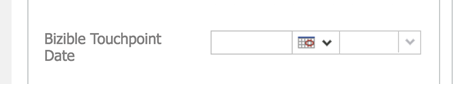

# Synchronisieren historischer Daten {#syncing-historical-data}

[!DNL Marketo Measure] ist eine Lösung, die die detailliertesten und ausführbarsten Daten bereitstellt. Wir wissen jedoch, dass Sie möglicherweise vorhandene Daten haben, für die Sie eine Attribution vornehmen möchten. Es ist möglich, Touchpoints für historische Daten zu generieren, aber es ist wichtig, einige Faktoren zu berücksichtigen, bevor Sie diesen Prozess vorantreiben.

>[!NOTE]
>
>Dieser Artikel behandelt einen veralteten Prozess. Wir ermutigen die Benutzenden, den [neuen, verbesserten In-App-Prozess](/help/channel-tracking-and-setup/offline-channels/custom-campaign-sync.md){target="_blank"} zu verwenden.

## Zu berücksichtigende Faktoren {#factors-to-consider}

**Sind die Daten bereits in Kampagnen organisiert?**

a. Die Daten müssen in Kampagnen organisiert werden, die mit [!DNL Marketo Measure] synchronisiert werden sollen, damit Touchpoints generiert werden können. Wenn sie derzeit nicht in Kampagnen organisiert ist, möchten Sie bewerten, ob es sich lohnt, die Zeit und die Ressourcen zu nutzen, die zur Segmentierung der Daten in die entsprechenden Kampagnen erforderlich sind.

b. Das Datum, an dem das Mitglied zur Kampagne hinzugefügt oder als beantwortet markiert wurde, wird für das Touchpoint-Datum verwendet, daher muss dies ebenfalls korrekt sein. [!DNL Marketo Measure] bietet Umgehungslösungen sowohl in SFDC als auch in MSD, um die Daten zu aktualisieren. Dies kann jedoch je nach Volumen zeitaufwendig sein.

**Ist die Datenmenge, die in Kampagnen für alle Kanäle (Paid Search, Ereignisse, organische Inhalte usw.) organisiert wird, recht gleich groß?**

Es ist wichtig, ein ausgewogenes Bild der Attribution zu haben, um eine genaue und &quot;faire&quot;Berichterstattung zu erhalten. Wenn Sie beispielsweise nur Daten für historische Offline-Kanal-Bemühungen wie Ereignisse haben, werden die Daten von Natur aus in die Richtung geleitet, ohne dass historische Online-Daten diese ergänzen.

**Welche Granularitätsstufe erwarten Sie?**

Sie kennen im Wesentlichen nur den Kanal-, Unterkanal- und Kampagnennamen.

**Welche Berichtsziele verfolgen Sie in Zukunft?**

Diese Daten werden begrenzt sein, daher ist es wichtig zu überlegen, wie Sie sie verwenden möchten. Es ist möglicherweise nicht sehr sinnvoll, historische Daten mit zukünftigen Daten zu vergleichen.

**Wie weit zurück willst du gehen?**

[!DNL Marketo Measure] empfiehlt dringend, nicht über das Vorjahr hinauszugehen.

Dieses Thema empfehlen wir dringend, zunächst mit Ihrem [!DNL Marketo Measure] -Kontakt zu diskutieren. Wenn Sie die oben genannten Punkte berücksichtigt haben und fortfahren möchten, finden Sie unten allgemeine Anweisungen (getrennt für [!DNL Salesforce] und [!DNL Microsoft Dynamics]).

## Synchronisieren historischer Kampagnen in [!DNL Salesforce] {#syncing-historic-campaigns-in-salesforce}

**Online:**

Um historische Online-Daten zu synchronisieren, müssen die Daten in Salesforce-Kampagnen organisiert sein, die Sie dann über die Regeln zur Kampagnensynchronisierung in der [!DNL Marketo Measure] -App mit [!DNL Marketo Measure] synchronisieren. [!DNL Salesforce] Es ist wichtig sicherzustellen, dass Touchpoints nach dem Datum, an dem Ihre JavaScript live geschaltet wurde, nicht aus diesen Kampagnen generiert werden. Der Grund dafür ist, dass doppelte Touchpoints vermieden werden. Nach der Live-Schaltung der JavaScript werden Online-Bemühungen automatisch verfolgt, sodass wir sie nicht auch über eine SFDC-Kampagne verfolgen möchten. Um dieses Problem zu vermeiden, sollten Sie der Regel unbedingt ein Gefühl der Zeit hinzufügen. Vielleicht etwas wie &quot;Das Erstellungsdatum eines Campaign-Mitglieds ist kleiner als [JavaScript Go-Live-Datum]&quot;.

Die Kanalzuordnungskomponente für historische Online-Daten kann etwas schwierig sein. Wir möchten, dass Ihre aktuellen Online-Kanalregeln (aus dem Online-Regelblatt) so genau wie möglich übereinstimmen, um eine saubere Berichterstellung zu ermöglichen. Unten finden Sie ein Beispiel für die ideale Kanalzuordnung.

>[!NOTE]
>
>Diese Kanalzuordnung erfolgt im Abschnitt [!UICONTROL Offline-Kanäle] der [!DNL Marketo Measure] -App, da wir SFDC-Kampagnen verwenden.

| Salesforce-Kampagnentyp | Kanal | Unterkanal |
|---|---|---|
| Paid Search - AdWords | Bezahlte Suchergebnisse | AdWords |
| Paid Search - Bing | Bezahlte Suchergebnisse | Bing |
| Paid Search - Yahoo | Bezahlte Suchergebnisse | Yahoo |

Online-Daten, die auf diese Weise hinzugefügt werden, sind von Natur aus weniger detailliert als Online-Daten-Tracks mit [!DNL Marketo Measure] über JavaScript. Beispielsweise werden Felder wie Formular-URL, Landingpage, Referrer-Seite usw. nicht ausgefüllt. Daher wird empfohlen, die Kampagnen nach Möglichkeit in jede Quelle zu unterteilen. Wie im obigen Beispiel gezeigt, müssen Sie für jede Quelle mehrere Kampagnentypen haben, um eine granularere Berichterstellung zu erhalten.

Möglicherweise ist es nicht möglich oder sinnvoll, die Anzahl der SFDC-Kampagnentypen festzulegen, um eine granulare Kanalzuordnung zu unterstützen. Daher können Sie einfach auf die Kanalebene zurückgreifen und untergeordnete Kanäle ignorieren. Wenn auch die Kanalebene nicht bekannt ist, können Sie einen Proxy-Kanal wie &quot;Historische Digitale Daten&quot;einrichten, damit Sie zumindest wissen, dass es sich um einen Online-Kontakt handelt.

Wenn Sie das Touchpoint-Datum, das für diese historischen Online-Bemühungen gepusht wird, in großem Umfang bearbeiten müssen, verwenden Sie die benutzerdefinierte Schaltfläche [!DNL Marketo Measure] &quot;[!UICONTROL Bulk Update Touchpoint Date]&quot;(dies ist als benutzerdefiniertes Feld im Campaign-Objekt in SFDC verfügbar). Wenn die Kampagne eine kurze Zeitspanne hat, wäre es möglicherweise sinnvoll, das Touchpoint-Datum in einem täglichen Tagesintervall gebündelt zu bearbeiten. Es kann jedoch sinnvoll sein, eine wöchentliche Massenaktualisierung vorzunehmen, wenn die Kampagne eine längere Zeitspanne hat. Wenn Sie die Funktion &quot;Touchpoint-Datum-Massenaktualisierung&quot;verwenden, aktualisieren Sie die Kampagnensynchronisierungsregel, um das Buyer Touchpoint-Datum im Datumsfeld zu verwenden. Beachten Sie, dass dazu möglicherweise kreative Elemente mit Ihren Kampagnensynchronisierungsregeln verwendet werden müssen, wenn dies nur für eine Kampagne oder zwei und nicht alle gilt.

**Offline:**

Historische Daten zu Offline-Marketing-Maßnahmen (die nicht über JavaScript verfolgt werden können) müssen ebenfalls in SFDC-Kampagnen organisiert werden. Mit SFDC-Kampagnen werden Offline-Bemühungen verfolgt, unabhängig davon, ob die Aktivität &quot;historisch&quot;oder &quot;aktuell/post-[!DNL Marketo Measure] -Implementierung&quot;ist. Befolgen Sie daher das gleiche Kanalzuordnung, das im ursprünglichen Offline-Kanal-Konfigurationstraining festgelegt wurde.[!DNL Marketo Measure]

Verwenden Sie bei Bedarf die Schaltfläche &quot;Touchpoint-Datum-Massenaktualisierung&quot;, um das Touchpoint-Datum für Kampagnenmitglieder in großem Umfang zu bearbeiten. Wenn Sie beispielsweise nach dem Eintreten des Ereignisses SFDC-Kampagnen erstellen, sollten Sie die Massenbearbeitung für das richtige Datum durchführen. Wenn Sie die Funktion &quot;Touchpoint-Datum-Massenaktualisierung&quot;verwenden, aktualisieren Sie die Kampagnensynchronisierungsregel, um das Buyer Touchpoint-Datum im Datumsfeld zu verwenden. Beachten Sie, dass dazu möglicherweise kreative Elemente mit Ihren Kampagnensynchronisierungsregeln verwendet werden müssen, wenn dies nur für eine Kampagne oder zwei und nicht alle gilt.

## Synchronisieren historischer Kampagnen in [!DNL Dynamics] {#syncing-historic-campaigns-in-dynamics}

[!DNL Marketo Measure] kann rückwirkend Touchpoints für in der Vergangenheit aufgetretene Interaktionen generieren, solange diese in Kampagnen innerhalb von [!DNL Dynamics] organisiert sind.

Dies erfordert in der Regel die Arbeit im CRM, um historische Daten zu berücksichtigen. Die Handhabung unterscheidet sich auch bei Online-Bemühungen (verfolgt von JS) und Offline-Bemühungen (kann nicht von JS verfolgt werden).

Befolgen Sie die unten stehenden Anweisungen zum Organisieren von historischen Daten in [!DNL Dynamics] in einem Format, das mit [!DNL Marketo Measure] synchronisiert werden kann.

**Online:**

Historische digitale Daten müssen in [!DNL Dynamics]-Kampagnen organisiert werden, damit sie aufgestockt werden können. Idealerweise ist diese Struktur bereits vorhanden.

Wenn die Daten an einem anderen Ort gespeichert sind (z. B. wenn sie noch in Marketing Automation leben), müssen sie an [!DNL Dynamics] gesendet und in die entsprechenden Kampagnen organisiert werden. Dann müssen Sie das Touchpoint-Datum berücksichtigen, da es das Datum der Vergangenheit widerspiegeln soll und nicht das Datum, an dem Sie es in [!DNL Dynamics] gepusht haben. Um dieses Datum zu überschreiben, können Sie das benutzerdefinierte Feld &quot;Buyer Touchpoint-Datum&quot;verwenden, um das Datum zu ändern. Sie müssen dies dem Marketinglisten-Formular hinzufügen.

Daher können Sie das Datum für alle Benutzer in dieser Marketingliste, die für das Touchpoint-Datum verwendet werden, in der Masse festlegen. Um genauere historische Daten zu erhalten, erstellen Sie mehrere Marketing-Listen für dieselbe Kampagne, von denen jede über ein eigenes Touchpoint-Datum verfügt. Wenn die Kampagne eine kurze Zeitspanne hat, wäre es möglicherweise sinnvoll, für jeden Tag eine Marketingliste zu erstellen. Wenn die Kampagne eine längere Zeitspanne hat, kann es sinnvoll sein, wöchentlich eine Marketingliste zu erstellen.

Weitere Informationen zur Synchronisierung von Marketinglisten finden Sie hier: [[!DNL Dynamics] Kampagnen und Marketinglisten](/help/channel-tracking-and-setup/offline-channels/legacy-processes/dynamics-campaigns-and-marketing-lists.md)

>[!NOTE]
>
>Wenn Sie aus irgendeinem Grund eine Kampagnen-Tracking-Online-Aktivität haben, die über das JavaScript-Live-Datum aktiv ist, stellen Sie sicher, dass Sie das Feld &quot;[!UICONTROL Touchpoint-Enddatum]&quot; auf das Datum einstellen, an dem das JS live geschaltet wurde. Dadurch soll verhindert werden, dass für dieselbe Interaktion doppelte Touchpoints vorhanden sind.

Zu beachten: Online-Daten, die auf diese Weise hinzugefügt werden, sind von Natur aus weniger detailliert als Online-Daten-Tracks mit [!DNL Marketo Measure] über JavaScript. Beispielsweise werden Felder wie Formular-URL, Landingpage, Referrer-Seite usw. nicht ausgefüllt. Daher wird empfohlen, die Kampagnen nach Möglichkeit in jede Quelle zu unterteilen. Nachfolgend finden Sie ein Beispiel für eine ideale Zuordnung.

| Dynamics-Kampagnentyp | Kanal | Unterkanal |
|---|---|---|
| Paid Search - AdWords | Bezahlte Suchergebnisse | AdWords |
| Paid Search - Bing | Bezahlte Suchergebnisse | Bing |
| Paid Search - Yahoo | Bezahlte Suchergebnisse | Yahoo |

Wenn Sie keine Möglichkeit haben, eine Quelle zu identifizieren, oder es sich nicht lohnt, die Zeit und Mühe aufzuwenden, können Sie einen Kampagnentyp verwenden, der einem Kanal zugeordnet ist, der z. B. &quot;Legacy Digital&quot;oder &quot;Historische Website&quot;heißt.

**Offline:**

Um Touchpoints für Offline-Marketing-Bemühungen aus der Vergangenheit zu haben, müssen die Daten in [!DNL Dynamics] -Kampagnen organisiert und mit [!DNL Marketo Measure] synchronisiert werden. Der Prozess entspricht dem für aktuelle Offline-Kanäle (Synchronisieren der Kampagne über Marketinglisten oder Kampagnenantworten). Nachfolgend finden Sie ein Beispiel für die Kanalzuordnung.

| Dynamics-Kampagnentyp | Kanal | Unterkanal |
|---|---|---|
| Veranstaltungen - gesponserte Konferenzen | Veranstaltungen | Gesponserte Konferenzen |
| Ereignisse - Partnerereignisse | Veranstaltungen | Partnerereignisse |
| Ereignisse - gehostete Ereignisse | Veranstaltungen | Gehostete Ereignisse |
| Webinar - Partner-Webinar | Webinar | Partner-Webinar |

Wenn diese Daten noch nicht in Kampagnen mit den richtigen Datumswerten organisiert sind, können Sie das Feld &quot;Buyer Touchpoint-Datum&quot;verwenden, um das genaue Datum aus der Offline-Aktivität der Vergangenheit anzuzeigen.

