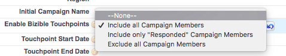

# Synchronisieren von Offline-Kampagnen {#syncing-offline-campaigns}

Es kann schwierig sein, Offline-Kampagnen genau zu verfolgen und zu verstehen, wie sie im Vergleich zu Ihren digitalen Marketing-Maßnahmen aussehen. Mit [!DNL Marketo Measure] können Sie Ihre Offline-Kampagnen in [!DNL Salesforce] verfolgen und Touchpoints zuordnen, selbst in Situationen, in denen eine [!DNL Salesforce] -Kampagne erst einige Wochen nach dem Ereignis erstellt wird.

>[!NOTE]
>
>Dieser Artikel behandelt einen veralteten Prozess. Wir ermutigen die Benutzenden, den [neuen, verbesserten In-App-Prozess](/help/channel-tracking-and-setup/offline-channels/custom-campaign-sync.md){target="_blank"} zu verwenden.

## Vor der Synchronisierung {#before-you-sync}

Im Folgenden finden Sie einige Tipps für einen effizienten Synchronisierungsprozess:

* Offline-Kampagnen beziehen sich auf Marketinginteraktionen, die nicht online stattfinden. Dazu gehören Marketing-Kanäle wie Veranstaltungen, Webinare und Messen. Schließen Sie nur Offline-Marketing-Kampagnen ein.
* Wenn Sie Kampagnen einbeziehen möchten, die die Online-Aktivität vor der Installation von [!DNL Marketo Measure] verfolgt haben, stellen Sie sicher, dass Sie das Enddatum des Touchpoints als das Datum festlegen, an dem unsere JavaScript auf Ihrer Site bereitgestellt wurde.
* Es ist hilfreich, die [!DNL Marketo Measure] -App auf der Seite &quot;Offline-Kanäle&quot;geöffnet zu halten, damit Sie die verschiedenen Kampagnentypen sowie den Marketingkanal, in den die Touchpoints zusammengefasst werden, leicht identifizieren können.

* Überprüfen Sie alles, bevor Sie auf die Schaltfläche &quot;[!UICONTROL Speichern]&quot; klicken!

## Massenaktualisierung des Touchpoint-Datums {#bulk-update-touchpoint-date}

In [!DNL Salesforce] wird im Feld Erstellungsdatum des Campaign-Member-Objekts das Datum notiert, an dem das Kampagnenmitglied zur Kampagne hinzugefügt wurde. Damit der Synchronisierungsprozess reibungslos ablaufen kann, müssen Sie sicherstellen, dass das Buyer Touchpoint-Datumsfeld dasselbe Datum wie das Datum für das Salesforce Campaign-Member-Objekt hat. Dieser Schritt wird mithilfe der Schaltfläche &quot;[!UICONTROL Massen-Update-Touchpoint-Datum]&quot; _vor_ durchgeführt, indem Sie im Feld &quot;Käufer-Touchpoints aktivieren&quot;die Option [!UICONTROL picklist] auswählen.

Warum ist das wichtig? Stellen Sie sich einen Moment vor, dass Ihr Unternehmen einen Stand auf einer Konferenz im Januar gesponsert hat. Auf der Konferenz zeigten 100 Personen Interesse an Ihrem Produkt und legten ihre Kontaktdaten vor, um E-Mail-Updates zu erhalten. Drei Wochen später haben Sie schließlich eine Kampagne in [!DNL Salesforce] erstellt, um das Ergebnis der Konferenz zu verfolgen.

Ihr Upload-Datum würde drei Wochen nach dem Konferenzdatum liegen. Um diesen Unterschied zu beheben, kann die Schaltfläche [!UICONTROL Touchpoint-Datum für Massenaktualisierung] verwendet werden, um das entsprechende Datum festzulegen. Die Schaltfläche ist in der Abbildung unten dargestellt.

In diesem Fall würde das Upload-Datum um drei Wochen aufgestockt. Dieser Schritt sollte vor dem Festlegen des Felds &quot;[!UICONTROL Käufer-Touchpoints aktivieren]&quot;durchgeführt werden.

Zusammenfassend wird bei Verwendung der Schaltfläche [!UICONTROL Touchpoint-Datum-Massenaktualisierung] und Änderung des Touchpoint-Datums auf das Ereignisdatum [!DNL Marketo Measure] Touchpoints für das tatsächliche Datum des Ereignisses und nicht für das Datum des Uploads generiert.

Sie können auch die Daten für alle Kampagnenmitglieder einer vorhandenen Kampagne aktualisieren. Stellen Sie dabei sicher, dass das Datum des Touchpoints das Datum der Interaktion des Mitglieds ist. Klicken Sie auf das Buyer Touchpoint-Datum für die Massenaktualisierung, filtern Sie die Liste der Kampagnenmitglieder nach Bedarf und fügen Sie in der Option &quot;[!UICONTROL Datum auswählen]&quot; oberhalb der Kampagnenmitglieder das Datum hinzu, an dem das Ereignis stattgefunden hat.

>[!CAUTION]
>
>Stellen Sie sicher, dass Sie das Touchpoint-Datum _vor_ aktualisieren, und aktivieren Sie Touchpoints für alle Kampagnenmitglieder.

## Erstellen einer Kampagne und Synchronisieren von Touchpoints des Käufers {#how-to-create-a-campaign-and-sync-buyer-touchpoints}

Um eine Kampagne in [!DNL Salesforce] zu erstellen, navigieren Sie zur Registerkarte [!UICONTROL Kampagnen] und wählen Sie &quot;[!UICONTROL Neu]&quot;, wie in der Abbildung unten dargestellt. Abhängig von Ihrer [!DNL Salesforce] -Konfiguration müssen Sie der oberen Leiste möglicherweise Kampagnen hinzufügen, indem Sie auf das Pluszeichen (+) klicken.

Klicken Sie beim Erstellen dieser Kampagne auf das Feld &quot;[!UICONTROL Käufer-Touchpoints aktivieren]&quot; und wählen Sie eine der folgenden Optionen aus der Auswahlliste aus:

* **Alle Kampagnenmitglieder einschließen**
   * Diese Option ermöglicht es [!DNL Marketo Measure], jedem Kampagnenmitglied einen Touchpoint zuzuordnen.

* **Fügen Sie &quot;Respondierte&quot; Kampagnenmitglieder hinzu.**
   * Diese Option wendet Touchpoints auf Kampagnenmitglieder an, die den Status &quot;Beantwortet&quot;haben.

* **Schließen Sie alle Kampagnenmitglieder aus.**
   * Diese Option weist keinen Mitgliedern der Kampagne Touchpoints zu und dient als Markierung, dass die Kampagne absichtlich aus [!DNL Marketo Measure] ausgeschlossen wurde. Wenn Sie eine Kampagne bei Unfall mit Touchpoints des Käufers synchronisieren, können Sie den Status auf &quot;Alle Mitglieder der Kampagne ausschließen&quot;ändern und die Touchpoints werden entfernt.

Sobald eine dieser Auswahlmöglichkeiten ausgewählt ist, weist [!DNL Marketo Measure] jedem Kampagnenmitglied einen Touchpoint zu, sofern zutreffend. Dem zur Kampagne hinzugefügten Lead oder Kontakt _muss_ eine E-Mail-Adresse zugeordnet sein, damit [!DNL Marketo Measure] einen Touchpoint erstellt. Ohne eine E-Mail-Adresse wird [!DNL Marketo Measure] dem Kampagnenmitglied keinen Touchpoint zuweisen.

>[!MORELIKETHIS]
>
>[[!DNL Marketo Measure] Tutorials: Zuordnen von Offline-Kanälen](https://experienceleague.adobe.com/de/docs/marketo-measure-learn/tutorials/onboarding/marketo-measure-salesforce/mapping-offline-channels){target="_blank"}
>
>[[!DNL Marketo Measure] Tutorials: Kampagnenobjektfelder](https://experienceleague.adobe.com/de/docs/marketo-measure-learn/tutorials/onboarding/marketo-measure-salesforce/campaign-object-fields){target="_blank"}
