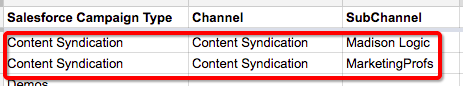

# Offline-Einrichtung benutzerdefinierter Kanäle {#offline-custom-channel-setup}

## Erste Schritte {#getting-started}

Verglichen mit der Art und Weise, wie [!DNL Marketo Measure] mit Online-Kanalregeln umgeht, werden Sie feststellen, dass die Offline-Kanalregeln keine Verwendung einer Tabelle erfordern. Im Implementierungsplan wird jedoch noch ein Blatt bereitgestellt, da dies für die Art und Weise hilfreich sein kann, wie Sie Ihre Offline-Kanäle organisieren möchten.

Das Arbeitsblatt besteht aus drei Spalten:

**[!UICONTROL Salesforce] Kampagnentyp** - Hier in [!DNL Salesforce] identifizierte Kampagnentypen hinzufügen

* Dies kann beispielsweise eine E-Mail, ein Webinar, eine Konferenz oder ein beliebiger Wert sein, den Sie für dieses Feld erstellt haben und dem Sie Touchpoints zuordnen möchten.

**[!UICONTROL Channel]** - Hier können Sie Ihre verschiedenen Marketing-Kanäle hinzufügen

**[!UICONTROL Unterkanal]** - Hier entsprechende Unterkanäle hinzufügen

## Offline-Kanallogik {#offline-channel-logic}

[!DNL Marketo Measure] Offline-Kanallogik wird durch das Campaign-Objekt bestimmt, insbesondere durch den [!DNL Salesforce] Kampagnentyp. Jeder Offline-Versuch muss einen [!DNL Salesforce] Kampagnentyp haben, z. B. Abendessen oder Messe, da [!DNL Marketo Measure] dieses Feld verwendet, um zu verstehen, welchem Kanal und welchem Unterkanal sie zugeordnet werden sollen.

Die SFDC-Kampagnentypen werden auf der Registerkarte Offline-Kanal angezeigt, die unter [!DNL Salesforce] Kampagnentyp aufgeführt ist. Beachten Sie, dass [!DNL Marketo Measure] nur SFDC-Kampagnentypen für Kampagnen importieren kann, denen Käufer-Touchpoints zugeordnet sind.

Hier können Sie die Kanal-/Unterkanal-Zuordnung in der [!DNL Marketo Measure] App erstellen. Dazu müssen wahrscheinlich neue Kanäle und Unterkanäle in der [!DNL Marketo Measure]-App erstellt werden, was im Abschnitt Erstellen von Kanälen der App erfolgt, der in der Abbildung unten dargestellt wird. Es müssen neue Kanäle und Unterkanäle erstellt werden, damit [!DNL Marketo Measure] verstehen können, wohin Touchpoints übertragen werden sollen. Sie können entscheiden, wie Kampagnentypen zugeordnet werden sollen.

## Beispiel für eine Kanalzuordnung {#channel-mapping-example}

Stellen Sie sich z. B. vor, Sie nehmen an zwei [!DNL Salesforce]-Konferenzen im Jahr teil. Jede Konferenz ist jedoch sehr unterschiedlich und hat eine einzigartige Zielgruppe. Sie wollen wissen, welche der beiden mehr Wert bringt. In Ihrer [!DNL Salesforce]-Umgebung können Sie dem Januar-Ereignis den Kampagnentyp „Konferenz“, Ihren Kanal &quot;[!DNL Salesforce]&quot; und Ihren Unterkanal „Januar-Konferenz“ zuweisen.

Nun möchten Sie dasselbe für die Juni-Konferenz tun. Da es sich um eine Konferenz handelt, kann ihr derselbe Kampagnentyp zugewiesen werden, in diesem Fall „Konferenz“. Der Kanal ist derselbe, [!DNL Salesforce], und der Unterkanal für diese zweite Konferenz ist „June Conference“. Aus organisatorischer Sicht ist dies sinnvoll. Es ist jedoch für die [!DNL Marketo Measure] Logik sehr verwirrend, diese Regeln zu lesen und anzuwenden, da beide Kampagnen denselben Kampagnentyp haben. [!DNL Marketo Measure] Skript kann keine Daten eines Typs zwei verschiedenen Unterkanälen zuordnen. Das bedeutet, dass Sie für jeden Unterkanal einen neuen Kampagnentyp erstellen müssen, aber die Unterkanäle können denselben Kanal haben.

Im Folgenden finden Sie ein Beispiel für eine Logik, die [!DNL Marketo Measure] nicht lesen könnten:

Im obigen Szenario empfiehlt es sich, einen eindeutigen Kampagnentyp zu erstellen, da ein und derselbe Kampagnentyp nicht zwei verschiedenen Unterkanälen zugeordnet werden kann. Stattdessen sollten Sie eindeutige Typen wie die folgenden einrichten:

Alle vorhandenen Kampagnentypen müssen in Ihrer Kanalzuordnung enthalten sein und „NULL“ sollte als Kanal hinzugefügt werden.

Nehmen Sie sich Zeit, um mit [!DNL Salesforce] zu beginnen und die Anzahl und Art Ihrer vorhandenen Datensatztypen zu bestimmen, die Sie einbeziehen möchten, und um zu entscheiden, ob Sie zusätzliche Kampagnen auf der Grundlage der oben genannten Informationen erstellen müssen. Nachdem Sie alle erforderlichen Informationen ausgefüllt haben, können Sie sie hochladen.

Erfahren Sie mehr über [Synchronisieren von  [!DNL Salesforce]  mit [!DNL Marketo Measure]](/help/channel-tracking-and-setup/offline-channels/legacy-processes/syncing-offline-campaigns.md).

## Handhabung von SFDC-Kampagnen für Online-Marketing-Maßnahmen {#handling-sfdc-campaigns-for-online-marketing-efforts}

Es ist üblich, dass Marketing-Teams [!DNL Salesforce] Kampagnen erstellen, um verschiedene digitale Marketing-Maßnahmen zu verfolgen. Mit dieser Vorgehensweise gibt es kein Problem. Es ist jedoch wichtig, diese Kampagnen anders zu behandeln als echte Offline-Kampagnen wie z. B. Briefpost oder Konferenzen. Kampagnen, die mit digitalen Ereignissen in Verbindung stehen (Interaktionen auf Ihrer Website), sollten nicht mit [!DNL Marketo Measure] synchronisiert werden. Die Synchronisierung dieser Kampagnen würde zu einer Duplizierung von Touchpoints führen, da die [!DNL Marketo Measure] JavaScript bereits Online-Aktivitäten verfolgt.

Ein weiterer Tipp für die Handhabung von Kampagnen für Online-Aktivitäten besteht darin, den [!DNL Salesforce] Kampagnentyp NULL zuzuordnen. Erstellen Sie dazu zunächst einen Kanal in der [!DNL Marketo Measure]-App mit dem Titel NULL, wie in der Abbildung unten gezeigt. Dies finden Sie in der [!DNL Marketo Measure] App unter dem Abschnitt **Kanäle erstellen**. Dies ist hilfreich, wenn eine Kampagne, die nicht synchronisiert werden sollte, versehentlich synchronisiert wird. Es ist einfach, die Kampagne zu finden und den Synchronisierungsstatus zu korrigieren, indem Sie sich alles ansehen, was unter NULL zusammengefasst ist.

## Offline-Kanalregeln in die App eingeben {#entering-your-offline-channel-rules-to-the-app}

Nachdem Sie die Kalkulationstabelle mit Ihren benutzerdefinierten Regeln bearbeitet und aktualisiert haben, besteht der nächste Schritt darin, diese Kanalzuordnung in der [!DNL Marketo Measure] App neu zu erstellen - Sie werden keine Tabelle für Offline-Kanäle hochladen. Stattdessen geben Sie die Informationen in die Auswahllistenfelder ein, wie in der Abbildung unten dargestellt. Klicken Sie dazu auf **[!UICONTROL Offline-Kanäle]** im Abschnitt **[!UICONTROL Kanäle]**.

>[!TIP]
>
>Möchten Sie ermitteln _wann_ ein [!DNL Salesforce] Kampagnentyp in [!DNL Marketo Measure] Kanalzuordnung übernommen wird? Navigieren Sie **[!UICONTROL Setup]** > **[!UICONTROL Kampagnen]** > **[!UICONTROL Felder]** > **[!UICONTROL Typ]**. Sie können dann sehen, welche Werte sich in der Auswahlliste befinden und welche inaktiv sind. Inaktive werden in unserem Abschnitt „Offline-[!UICONTROL &quot; nicht als &#x200B;] angezeigt. Beachten Sie, dass dieser Vorgang zwischen einigen Minuten und 48 Stunden dauern kann.

Klicken Sie **[!UICONTROL Speichern]** wenn Sie fertig sind. [!DNL Marketo Measure] werden die Änderungen hochladen und die Daten erneut verarbeiten.

>[!MORELIKETHIS]
>
>* [[!DNL Marketo Measure] Tutorials: Zuordnen von Offline-Kanälen](https://experienceleague.adobe.com/de/docs/marketo-measure-learn/tutorials/onboarding/marketo-measure-salesforce/mapping-offline-channels){target="_blank"}
>
>* [[!DNL Marketo Measure] Tutorials: Synchronisieren von Offline-Kampagnen](https://experienceleague.adobe.com/en/docs/marketo-measure-learn/tutorials/onboarding/marketo-measure-salesforce/syncing-offline-campaigns){target="_blank"}
>
>* [Integration von Marketo Engage-Programmen](/help/marketo-measure-and-marketo/marketo-measure-integrations-with-marketo/marketo-engage-programs-integration.md#channel-mapping){target="_blank"}
