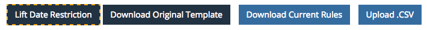
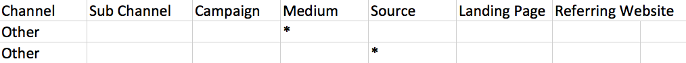

# Online-Einrichtung benutzerdefinierter Kanäle {#online-custom-channel-setup}

Um eine genaue Berichterstellung zu erhalten, müssen Marketing-Kanäle eingerichtet werden, die der UTM-Strategie Ihres Unternehmens entsprechen. In diesem Handbuch erfahren Sie, wie Sie Ihre benutzerspezifischen Kanalregeln am besten konfigurieren.

## Vorbereitung {#before-you-begin}

Bevor Sie mit der Erstellung Ihrer Kanalregeln für [!DNL Marketo Measure] beginnen, nehmen Sie sich Zeit, um über die Organisation Ihrer Marketing-Kampagnen nachzudenken und darüber, wie sie in das [!DNL Marketo Measure]-Framework passen. Bestimmen Sie, welche Kanäle, Unterkanäle, Kampagnen und verweisenden Websites Sie nachverfolgen möchten.

Folgendes sollte beachtet werden:

* Ihr Unternehmen kann maximal 40 benutzerdefinierte Marketing-Kanäle erstellen. Dies umfasst sowohl Offline- als auch Online-Kanäle.
* Ihr Unternehmen kann bis zu 200 Unterkanäle erstellen.
* Für jede Sammlung bzw. jeden Behälter von Daten ist eine eigene Regel erforderlich (Zeile im Arbeitsblatt), die angibt, wie die Daten organisiert werden. Seien Sie so spezifisch wie möglich.
* Die [!DNL Marketo Measure]-Logik priorisiert Daten in absteigender Reihenfolge, beginnend mit der obersten Zeile des Arbeitsblatts und dann nach unten. Sie liest jeden Behälter oder jede Zelle zeilenweise und sucht nach der ersten Übereinstimmung Die Daten werden dann nach den Werten in diesen Behältern sortiert. Mehr dazu unten.
* Sortieren Sie Ihr Blatt nicht in alphabetischer Reihenfolge, da dies die Logikregeln stört.
* Nach dem Hochladen der Datei können Sie für sieben Tage keine der Regeln ändern. [!DNL Marketo Measure] nutzt diese Zeit zur Verarbeitung und Aktualisierung der Touchpoints.

## Logik und Prioritäten von [!DNL Marketo Measure] {#marketo-measure-logic-and-priorities}

Der erste Schritt besteht darin, die benutzerdefinierte Kanaltabelle aus der [!DNL Marketo Measure]-App herunterzuladen. Navigieren Sie unter der Registerkarte **Mein Konto** zu **Einstellungen** und wählen Sie **Online**. Sie haben die Wahl zwischen **Originalvorlage herunterladen** oder **Aktuelle Regeln herunterladen**.

Die Tabelle enthält sieben Spalten:

* **Kanal:** Fügen Sie hier die verschiedenen Marketingkanäle hinzu
* **Unterkanal:** Fügen Sie hier die entsprechenden Unterkanäle hier hinzuf
* **Kampagne:** Fügen Sie hier Kampagnennamen hinzu, unabhängig davon, ob der Wert aus UTMs oder Salesforce-Kampagnen für die [!DNL Marketo Measure]-Aktivitätsfunktion kommt
* **Medium:** Die Medium-Spalte stellt den Wert des Parameters utm_medium dar.
* **Quelle:** Die Quellspalte stellt den Wert des Parameters utm_source dar.
* **Landingpage:** Fügen Sie hier die Landingpage hinzu
* **Verweisende Website:** die URLs von Websites, die auf Traffic auf Ihren Seiten verweisen oder integrierte [!DNL Marketo Measure]-Logik (durch Klammern angegeben)

In der achten Spalte wird angegeben, welche Regeln nicht aus der Tabelle mit „Nicht entfernen“ gelöscht werden können. Am oberen Rand des Arbeitsblatts befinden sich standardmäßige Kanalregeln, die [!DNL Marketo Measure] empfiehlt, nicht zu ändern oder zu entfernen, selbst wenn Sie diese Kanäle nicht verwenden. [!DNL Marketo Measure] verfügt über tiefe Integrationen mit diesen Plattformen, sodass sie standardmäßig eingeschlossen sind.

Die Zeilen stellen Regeln und die Reihenfolge dar, in der [!DNL Marketo Measure] die Daten priorisiert. Die erste Zeile hat Vorrang vor der zweiten Zeile, die zweite Zeile hat Vorrang vor der dritten Zeile usw. Bei der Bestimmung, in welchen Marketing-Kanälen und Unterkanälen Touchpoints zusammengefasst werden sollen, liest [!DNL Marketo Measure] von oben nach unten und von links nach rechts, bis eine Zeile gefunden wird, die den Kriterien des Touchpoints entspricht. (Wenn ein Touchpoint `utm_source=Facebook` hat, wird der Touchpoint aufgrund von Regel 15 im Screenshot im Kanal Social.Facebook zusammengefasst.)

[!DNL Marketo Measure] enthält 12 Standardkanäle für Ihre Verwendung. Diese Kanäle korrelieren mit Plattformen, mit denen [!DNL Marketo Measure] vollständig integriert ist. Unabhängig davon, ob Sie sie verwenden oder nicht, entfernen Sie sie nicht. Wenn Sie eine dieser Plattformen verwenden, z. B. Bing Ads, aber lieber eine andere Benennungsregel für den Kanal oder den Unterkanal verwenden, können Sie den Namen aktualisieren. Ein Beispiel wird in der Abbildung unten gezeigt.

Auch die Struktur der Regeln ist wichtig. Die Regeln können wie wiederholte Informationen und fehlende Daten aussehen, aber diese Struktur ist beabsichtigt. Für eine genaue Sortierung der Daten ist es erforderlich, jede einzelne Quelle separat dem entsprechenden Kanal zuzuordnen - selbst Quellen, die Unterkanäle und Kanäle gemeinsam nutzen. Je detaillierter und feiner die Regeln sind, desto aufschlussreicher sind die Ergebnisse. Grundsätzlich empfiehlt es sich, für jede Marketing-Maßnahme, die Sie nachverfolgen möchten, eine detaillierte Regel zu erstellen.

Betrachten Sie die folgende Situation: Sie haben andere Anzeigen, die Sie aus irgendeinem Grund nicht nachverfolgen möchten, oder Sie erhalten Besuche auf Ihrer Website von einem bekannten Kanal, aber keiner bekannten Quelle. Diese Situation kann zu Datenverlusten führen, wenn [!DNL Marketo Measure] die geeignete Regel zum Sortieren der Daten nicht finden kann. Um dies zu verhindern, empfiehlt Ihnen [!DNL Marketo Measure], Ihre Regel über mehrere Zeilen aufzuhteilen.

Jeder Parameter oder jede Komponente der Regel wird dem Kanal separat zugeordnet. Wenn [!DNL Marketo Measure] beispielsweise [!DNL Facebook]-Daten zu sortieren hat, sucht es nach Regeln, die sich auf [!DNL Facebook] beziehen. Es scannt von oben nach unten. Im unten abgebildeten Beispiel würde [!DNL Marketo Measure] verstehen, dass es für den ersten [!DNL Facebook]-Unterkanal nur den Quellparameter lesen muss, um Daten im Behälter der betreffenden Regel abzulegen.

Die nächste Regel fragt nur nach dem Medium-Parameter, sodass alle Daten mit diesem Parameter in diesen Kanal zusammengefasst werden. Schließlich werden für [!DNL Facebook] alle Daten, die von der Facebook-URL stammen, in den letzten Facebook-Kanal aufgenommen.

Der Standardkanal &quot;Sonstige&quot; ist vorhanden, um Daten zu erfassen, die nicht den Kriterien einer Regel entsprechen. Beachten Sie, dass einige Buckets im Kanal &quot;Sonstige&quot; Sternchen (&#42;) enthalten. Diese Sternchen stellen Platzhalterzeichen dar, die als Auffangbehälter dienen.

Da die [!DNL Marketo Measure]-Logik von oben nach unten arbeitet, ist zu beachten, dass die Platzhalterregel, die mit einem Sternchen (&#42;) gekennzeichnet ist, ganz am Ende des Regelblatts platziert werden sollte. Alle Daten, die nicht von den anderen Regeln abgefangen oder sortiert werden, werden zu diesem Platzhalter-Bucket hinzugefügt.

Im Folgenden finden Sie weitere Beispiele für die Logik von Platzhaltern:

* &#42;email&#42; = enthält &quot;email&quot;
* &#42;email = endet mit &quot;email&quot;
* email&#42; = [!UICONTROL beginnt mit &quot;email&quot;]

Beachten Sie außerdem, dass Sie beim Erstellen eines Unterkanals für einen Ihrer Kanäle einen Unterkanal für alle Regeln unter diesem Kanal erstellen müssen. Anders ausgedrückt: Wenn Sie einen Unterkanal erstellen, können Sie den Rest der Spalten nicht leer lassen.

## Einrichten Ihrer benutzerspezifischen Kanalregeln {#setting-up-your-custom-channels-rules}

Sobald Sie sich für die Organisation und Priorisierung Ihrer Daten entschieden haben, können Sie Ihre Regeln zur Tabelle hinzufügen. Nachfolgend finden Sie einige Best Practices:

* Halten Sie Ihre Regeln von Anfang an so einfach wie möglich. Sie können jederzeit auf den Regeln aufbauen.
* Fügen Sie den Kanalnamen keine Sonderzeichen hinzu (z. B. $%#&amp;&#42;@)
* Bearbeiten Sie nicht die mit BingAds und AdWords verknüpften Regeln. Diese Regeln sind von entscheidender Bedeutung für die Zusammenfassung der Daten, die automatisch aus der [!DNL Marketo Measure] API-Integration mit diesen Plattformen kommen. Eine Namensänderung des Subkanals und des Kanals zur Anpassung an Ihre Anforderungen ist jedoch kein Problem.
* Entfernen Sie nicht die Regeln, die einen Hinweis &quot;Do Not Remove“ enthalten.
* Organische Suchregeln werden immer nach den [!UICONTROL gebührenpflichtigen Suchregeln] platziert
* Sie können keine Regeln erstellen, die auf verschiedenen Subdomains basieren.
* Wenn Sie einer Zelle im Arbeitsblatt mehr als einen Wert hinzufügen müssen, trennen Sie diese Werte nur durch ein Semikolon `;`. Keine Kommas oder Leerzeichen.
* Sie müssen kein „.com“ am Ende der verweisenden URL hinzufügen.
* Wenn Sie eine verweisende URL hinzufügen, dürfen Sie sie nicht wie die anderen API-bezogenen Regeln in Klammern setzen.

## Hochladen Ihrer benutzerspezifischen Kanalregeln {#uploading-your-custom-channels-rules}

Stellen Sie sicher, dass alle neuen Kanal- und Unterkanalwerte, die Sie in der CSV-Datei hinzufügen, bereits im Kanaleinstellungsbereich Ihres Bizible-Kontos hinzugefügt wurden. Überprüfen Sie, ob alle Kanal- und Subkanalnamen in der CSV dem Kanaleinstellungsbereich Ihres [!DNL Marketo Measure]-Kontos entsprechen. Stellen Sie sicher, dass Sie sie auf Kommas und Leerzeichen überprüfen.

Wenn Sie beim Hochladen eine Fehlermeldung erhalten, beheben Sie das Problem und laden Sie erneut hoch. Wenn Sie keine Fehlermeldung erhalten, klicken Sie auf **Speichern und verarbeiten** unten auf der Seite.
