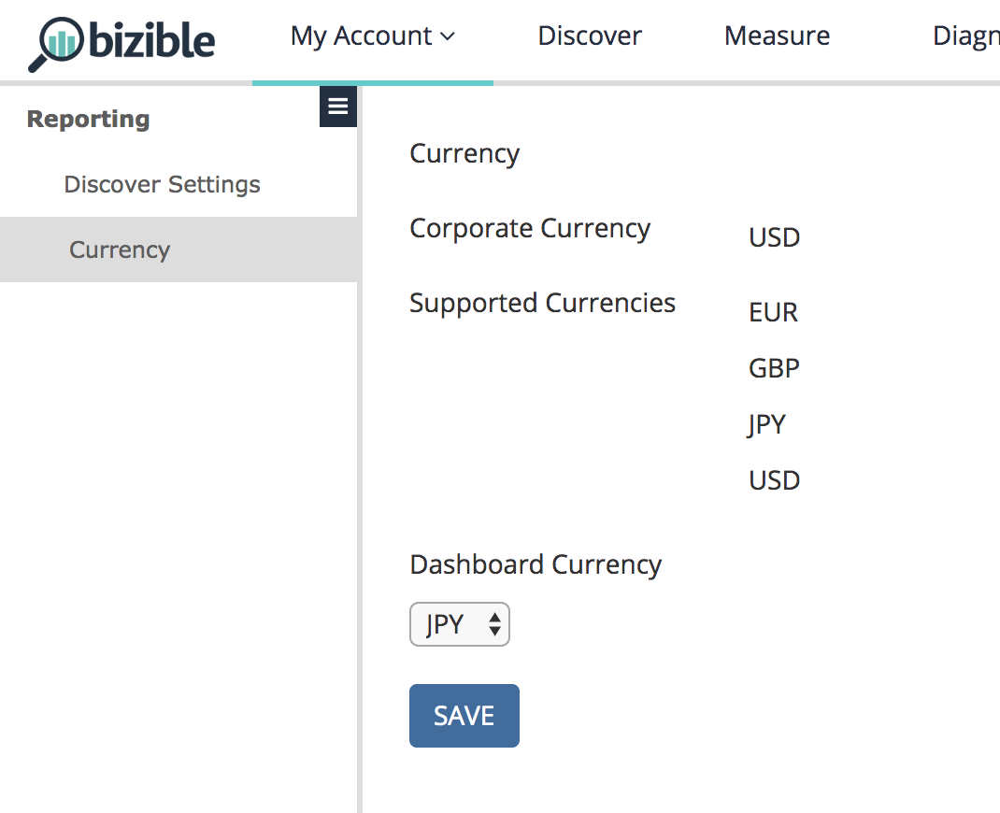

# Einstellungen {#settings}

Mit dieser Funktion sind zwei separate Funktionsbits verknüpft, die sich auf der Registerkarte [!UICONTROL Allgemeine Einstellungen“ des CRM &#x200B;]: Mehrere Währungen und Erweiterte Währungen.

**Mehrere Währungen**: Aktiviert, wenn der Kunde mehr als eine Währung verwendet.

**Erweiterte Währungen**: Ein zusätzliches Bit, das aktiviert werden muss, wenn der Kunde die Salesforce-Funktion „Erweiterte Währungsverwaltung“ verwendet, mit der der Benutzer einen zeitbasierten Bereich für Konversionsraten festlegen kann.

Unter Ihren [!UICONTROL Benutzereinstellungen] in der [!DNL Marketo Measure]-Anwendung zeigen wir die Unternehmenswährung und alle unterstützten Währungen an, die aus dem CRM abgerufen wurden. Da diese Werte alle aus dem CRM abgerufen werden, sind diese Felder schreibgeschützt und können nicht geändert werden. Die Dashboard-Währung ist Ihre Standardwährung für jedes Mal, wenn ein Dashboard geladen wird. Sie können zurückkommen und die Währung nach Bedarf ändern.

