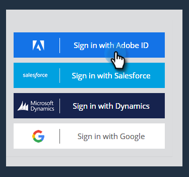

# Einrichten von Adobe Admin Console {#adobe-admin-console-setup}

Der erste Schritt zur Verwendung von [!DNL Marketo Measure] ist das Erstellen und Anmelden bei Ihrer bereitgestellten Adobe Admin Console. Wenn Sie die E-Mail mit den Anmeldeanweisungen nicht erhalten haben, wenden Sie sich an die Kundenbetreuung von [!DNL Marketo Measure].

## Einrichten von Adobe Admin Console und Identitätsanbieter {#set-up-your-adobe-admin-console-and-identity-provider}

Als Produkt innerhalb der Adobe Suite nutzt [!DNL Marketo Measure] die volle Funktionalität der Adobe Admin Console für Identity Management. Weitere Ressourcen [finden Sie hier](https://helpx.adobe.com/de/enterprise/using/admin-console.html).

Es wird empfohlen, die Ressourcen, Best Practices und Optionen durchzugehen, die Ihnen für [Identity Management](https://helpx.adobe.com/de/enterprise/using/set-up-identity.html) zur Verfügung stehen.

Wenden Sie sich für Anleitungen und eine Übersicht über die Einrichtung Ihres Identity Management in der Adobe Admin Console an die Kundenbetreuung von [!DNL Marketo Measure].

Um die Benutzerauthentifizierung und -autorisierung mit Ihren Instanzen von [!DNL Marketo Measure] zu ermöglichen, müssen die folgenden Schritte in der Adobe Admin Console ausgeführt werden:

**Einrichten der Produktkarte von [!DNL Marketo Measure]**

Beim Zugriff auf die Adobe Admin Console sehen Sie Ihre [!DNL Marketo Measure]-Produktinstanzen im Abschnitt „Überblick“.

Mit einem Klick auf die Produktkarte von [!DNL Marketo Measure] werden Ihnen alle Ihre [!DNL Marketo Measure]-Instanzen angezeigt. Standardmäßig hat jede Instanz von [!DNL Marketo Measure] ihr eigenes Profil mit dem Präfix „[!DNL Marketo Measure]“. Alle Admins oder Benutzenden, die diesem oder einem anderen Profil in dieser Instanz hinzugefügt wurden, können sich bei [!DNL Marketo Measure] anmelden.

Es ist keine Aktion erforderlich, um ein Profil innerhalb der [!DNL Marketo Measure]-Produktinstanz(en) zu erstellen.

Um mit dem Hinzufügen mit Benutzenden zu beginnen, die auf [!DNL Marketo Measure] zugreifen können, beziehen Sie sich bitte auf den nachfolgenden Abschnitt [Hinzufügen von  [!DNL Marketo Measure] -Admins und  [!DNL Marketo Measure] -Benutzenden](#adding-marketo-measure-admins-and-marketo-measure-users).

## Hinzufügen von [!DNL Marketo Measure]-Admins und [!DNL Marketo Measure]-Benutzenden {#adding-marketo-measure-admins-and-marketo-measure-users}

Der nächste Schritt besteht darin, Zugriff auf die [!DNL Marketo Measure]-Anwendung durch Hinzufügen von Benutzenden zu gewähren. Dies kann im Admin- und Benutzerverzeichnis der Produktkarte von [!DNL Marketo Measure] erfolgen.

| Benutzertyp | Beschreibung |
|---|---|
| Admins | Dies sind Admins und Power User der [!DNL Marketo Measure]-Anwendung mit der vollen Fähigkeit, [!DNL Marketo Measure]-spezifische Konfigurationsoptionen zu aktualisieren und zu verwalten |
| Benutzer | Dies sind Standardbenutzende der [!DNL Marketo Measure]-Anwendung mit schreibgeschützten Berechtigungen innerhalb der [!DNL Marketo Measure]-Anwendung. |

Wenn Sie eine Person zu der jeweiligen Gruppe hinzufügen, sehen Sie ihren [Identitätstyp aufgelistet](https://helpx.adobe.com/de/enterprise/using/set-up-identity.html).

>[!NOTE]
>Um [!DNL Marketo Measure]-Administrator zu sein (in [experience.adobe.com/marketo-measure](https://experience.adobe.com/marketo-measure){target="_blank"}), muss ein Benutzer als Benutzer _und_ Administrator zu jedem [!DNL Marketo Measure] Produktprofil in der [!DNL Marketo Measure] Produktkarte hinzugefügt werden.

**Anmelden bei[!DNL Marketo Measure]**

Nachdem ein(e) Benutzende(r) einem Produktprofil hinzugefügt wurde, kann er/sie auf seine/ihre [!DNL Marketo Measure]-Instanzen zugreifen, indem er/sie die Option **Mit Adobe ID anmelden** unter [experience.adobe.com/marketo-measure ](https://experience.adobe.com/marketo-measure){target="_blank"}.

