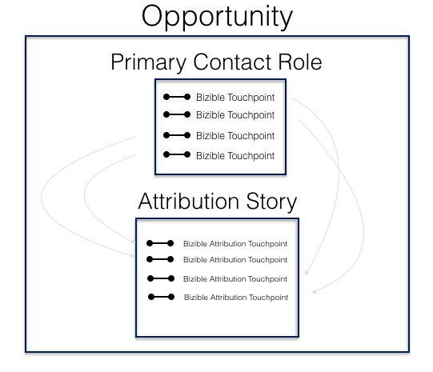

# Attributionszuordnungsmethode {#attribution-mapping-methodology}

Die Attributionszuordnungsmethode besteht darin, bestimmte Objekte in Ihrem CRM-System (Kontakte, Chancen, Konten) zu suchen, um Zuordnungs-Touchpoints in die zugehörige Chance zu erstellen. Mit anderen Worten, es ist die [!DNL Marketo Measure]-Methode, um zu verstehen, welche Touchpoints basierend auf den Prozessen Ihres aktuellen CRM-Systems in das Attributionsmodell aufgenommen werden sollen.

## Konto-ID-Zuordnung {#account-id-mapping}

Standardmäßig stellt [!DNL Marketo Measure] die Zuordnung der Konto-ID bereit. Das bedeutet, dass [!DNL Marketo Measure] sich die Marketing-Informationen zu Konto und Kontakten ansieht, um Attribution-Touchpoints zu erstellen, die mit der Gelegenheit verknüpft sind. Im Folgenden finden Sie eine einfache Darstellung dieses Prozesses.

Beachten Sie, dass **nicht alle** Touchpoints aus Ihren Kontakten als Attribution Touchpoints in die Option gepusht werden. Die Timeline der Opportunity (ihr Erstkontakt-Datum - das geschlossene Datum) bestimmt, ob ein Touchpoint als Einflussnehmer auf die Opportunity gezählt wird. Wenn also ein Touchpoint bei Kontakt A auftritt, nachdem die Gelegenheit geschlossen wurde, wird dieser Touchpoint durch [!DNL Marketo Measure] nicht an die Gelegenheit weitergeleitet. Dieses Timeline-Verfahren wird bei allen anderen Attributionsobjektzuordnungen angewendet.

Vorteile: Diese Attributionsmethode ist für die meisten Unternehmen sehr effektiv. Das Marketing-Team muss sich nicht darauf verlassen, dass das Vertriebsteam alle Kontakte einer bestimmten Gelegenheit zuordnet (was häufig ein Problem darstellt). Auch wenn ein Vertriebsteam Kontaktrollen zuordnet, kann es bei der Interaktion vieler anderer Kontakte mit Marketingmaterialien zu Problemen kommen. Schließlich unterstützt diese Methode die ABM-Strategie, die versucht, die Gesamtheit eines Kontos zu beeinflussen, anstatt bestimmte Einflussnehmer.

Nachteile: Wenn es starke Marketing &amp; Sales-SLAs gibt, die definieren, wem welche gutgeschrieben werden soll, könnte diese Methode problematisch sein. Darüber hinaus können, wenn Benutzer keine Kontohierarchien verwenden, um innerhalb eines größeren Kontos (z. B. IBM) bestimmte Geschäftseinheiten zu definieren, für eine Geschäftseinheit spezifische Marketing-Interaktionen auf andere Geschäftsbereichsmöglichkeiten verteilt werden.

## Opportunity Contact Role Mapping {#opportunity-contact-role-mapping}

Während die meisten Kunden die Zuordnung der Konto-ID verwenden, kann [!DNL Marketo Measure] innerhalb einer Gelegenheit nach den Kontaktrollen (mit der Gelegenheit verbundene Kontakte) suchen, um den Attributionsprozess aufzuschlüsseln. Das bedeutet, dass [!DNL Marketo Measure] nur Marketing-Interaktionen in Verbindung mit den Kontaktrollen auf der Opportunity als &quot;Buyer Attribution Touchpoints&quot;fördert. Nachfolgend finden Sie eine Darstellung dieses Prozesses.

Vorteile: Wenn Ihr Team über einen klar definierten Prozess von Kontaktrollen verfügt, kann dieser Typ von Attribution Mapping für Sie ideal sein. Sie hilft, Vertrieb und Marketing etwas besser aufeinander abzustimmen, da alle verstehen würden, wie die Attribution aufgeschlüsselt wird. Dieser Prozess ist auch hilfreich, wenn Unternehmen mehrere Geschäftsbereiche innerhalb eines großen Unternehmens ansprechen und verschiedene Produkte gleichzeitig verkaufen.

Nachteile: Wenn jedoch kein Prozess für die Kontaktrolle vorhanden ist, verliert das Marketing eine Menge Marketing-Daten und das Team erhält am Ende deutlich weniger Anerkennung für seine Marketing-Maßnahmen, die Chancen beeinflussen.

## Opportunity Primär Contact Role Mapping {#opportunity-primary-contact-role-mapping}

Neben der bloßen Betrachtung der Kontaktrollen für die Gelegenheit kann sich [!DNL Marketo Measure] noch mehr darauf konzentrieren, nur die Primären Kontakte auf eine Chance zu betrachten. Bei diesem Setup nimmt [!DNL Marketo Measure] nur den Marketing-Touchpoint, der mit den primären Kontakten einer Gelegenheit verknüpft ist, und leitet diese Informationen in die Zuordnungsgeschichte dieser speziellen Gelegenheit weiter. Siehe Abbildung unten.

Vorteile: Wenn Ihr Team nur daran interessiert ist, den Marketing-Einfluss auf Kontakte zu verstehen, die als &quot;primär&quot;für die Gelegenheit festgelegt sind, eignet sich diese Art von Zuordnung am besten für das Team.

Nachteile: Dies ist sicherlich der am wenigsten genutzte Mapping-Prozess und kann den Marketing-Einfluss stark untergraben, der die Nadel bei einer Gelegenheit über andere Kontakte bewegt.
