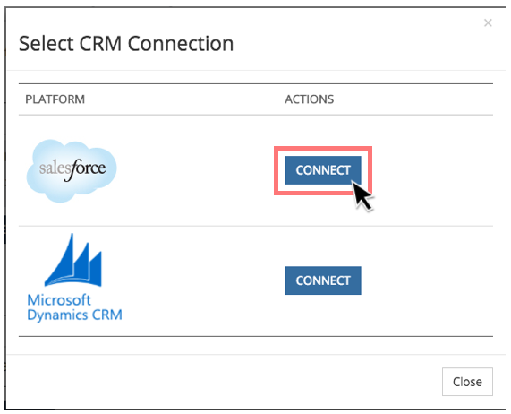

# Verbinden von Marketo Measure mit Salesforce {#connect-marketo-measure-to-salesforce}

Dieser Artikel bietet einen Überblick darüber, wie Sie Ihre [!DNL Salesforce] -Konto [!DNL Marketo Measure] -Konto.

## Verbinden [!DNL Marketo Measure] mit [!DNL Salesforce] {#connecting-marketo-measure-with-salesforce}

1. Anmelden über einen Inkognito-Browser bei [!DNL Marketo Measure].

1. Navigieren Sie in der Menüleiste am oberen Bildschirmrand zu **[!UICONTROL Mein Konto]** und klicken Sie auf **[!UICONTROL Einstellungen]** -Option.

1. Klicken Sie links in der Spalte mit den Einstellungsoptionen auf **[!UICONTROL Verbindungen]** unter dem [!UICONTROL Integrationen] Abschnitt.

   

1. Klicken Sie im Abschnitt CRM unter Verbindungen auf **[!UICONTROL Einrichten einer neuen CRM-Verbindung]**.

   

1. Es wird ein Popup-Fenster mit der Aufforderung angezeigt, die CRM-Verbindung auszuwählen. Klicken Sie auf **[!UICONTROL Verbinden]** Schaltfläche neben [!DNL Salesforce] Logo.

   

1. Daraufhin wird ein abschließendes Popup-Fenster angezeigt, in dem Sie nach Ihrer [!DNL Salesforce] Anmeldeinformationen, Sandbox oder Produktion. Geben Sie Ihre Informationen ein und klicken Sie auf **[!UICONTROL Autorisieren]** , um das Konto mit [!DNL Marketo Measure].

>[!NOTE]
>
>[!DNL Marketo Measure] kann nur mit einer [!DNL Salesforce] -Instanz zu einer bestimmten Zeit.
>
>* A [!DNL Marketo Measure] -Instanz kann mit einer SFDC-Sandbox-Instanz verbunden werden, um die Integration zu testen, bevor die Verbindung zu Ihrer SFDC-Produktionsinstanz gewechselt wird.
>* Wenn Sie zuerst mit einer SFDC-Sandbox testen, empfehlen wir dringend, einen Test durchzuführen, der eine exakte Replikation Ihrer SFDC-Produktionsinstanz ist, und zwar in Bezug auf die Felder auf den Objekten &quot;Lead&quot;, &quot;Kontakt&quot;, &quot;Konto&quot;, &quot;Chancen&quot;, &quot;Kampagne&quot;und &quot;Case&quot;. Wenn Sie aktive APEX-Trigger in der Produktion haben, die bei Aktualisierungen der Lead-, Kontakt-, Konto-, Opportunity-, Campaign- und Case-Objekte ausgelöst werden, sollten Sie versuchen, diese in Ihrer Sandbox zu aktivieren.
>* Sobald Sie mit dem Testen fertig sind, aktualisieren Sie Ihre [!DNL Marketo Measure] -Konto auf Ihre Produktion zu verweisen [!DNL Salesforce] (anstelle von Sandbox [!DNL Salesforce]). Aufgrund der Art und Weise, wie die Integration erstellt wurde, einmal pro [!DNL Marketo Measure] -Konto mit Produktion verbunden ist [!DNL Salesforce], können Sie nicht rückwärts gehen und eine Verbindung zu einer Sandbox herstellen [!DNL Salesforce] org.

## Nutzung von API-Anmeldeinformationen {#api-credits-usage}

Marketo Measure verwendet eine CRM-Integrationsaufgabe, um über einen integrierten Benutzer mit der Salesforce eines Kunden zu kommunizieren. Alle Datenaustauschvorgänge über diesen Benutzer nutzen Salesforce API-Gutschriften. Sie haben die Möglichkeit, einem Integrationsbenutzer ein Kreditkontingent zuzuweisen, das zur Regulierung übermäßiger API-Aufrufe dient. Dieses Kontingent bzw. diese Begrenzung wird alle 24 Stunden zurückgesetzt.

Der Zugriff auf diese Beschränkung erfolgt in Marketo Measure über: **Mein Konto** > **Einstellungen** > **CRM** > **Allgemein** > **Tägliche CRM-API-Beschränkung** und kann sie für Ihre Mandanten konfigurieren.

### Festlegen einer Beschränkung für API-Berechtigungen {#setting-a-limit-for-api-credits}

1. Navigieren Sie zu **Mein Konto** > **Einstellungen**.

1. Klicken Sie unter CRM auf **Allgemein**. Du wirst die **Tägliche CRM-API-Beschränkung** -Option.

1. Klicken Sie auf das Sperrsymbol, um es zu bearbeiten.

   

1. Geben Sie eine Grenze von mindestens 100.000 ein. Klicks **Speichern** wann geschehen.

   

>[!NOTE]
>
>Wenden Sie sich an Ihren Salesforce-Administrator und Ihre Referenz, um die verfügbaren Salesforce-API-Gutschriften für Ihre verbundene Lösung zu erhöhen [Dieses Salesforce-Dokument](https://developer.salesforce.com/docs/atlas.en-us.salesforce_app_limits_cheatsheet.meta/salesforce_app_limits_cheatsheet/salesforce_app_limits_platform_api.htm){target="_blank"}.

>[!MORELIKETHIS]
>
>[Fehlerbenachrichtigungen](/help/configuration-and-setup/getting-started-with-marketo-measure/error-notifications.md){target="_blank"}
