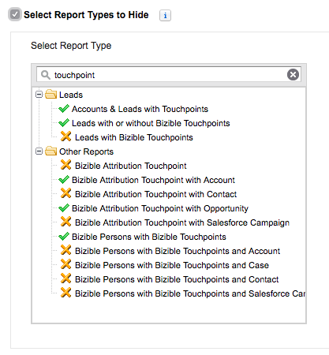

# Ausblenden unnötiger Berichtstypen {#hiding-unnecessary-report-types}

Nachdem Sie die Installation abgeschlossen und mit der Verwendung von Berichten begonnen haben, ist es oft der Fall, dass nicht jeder einzelne Bericht die [!DNL Marketo Measure] -Paket, das im Lieferumfang enthalten ist, wird von Ihrer Organisation verwendet. Daher ist es hilfreich, Berichtstypen auszublenden, die Sie nicht verwenden, um Verwirrung zu vermeiden und ein saubereres Erscheinungsbild zu ermöglichen. Sie können alle Berichte ausblenden, die Sie möchten. Die im folgenden Bild identifizierten Berichte sind jedoch in der Regel ausgeblendet.

1. Navigieren Sie zum **[!UICONTROL Berichte]** Registerkarte.

1. Klicken Sie auf **[!UICONTROL Neuen Bericht erstellen]** -Schaltfläche am oberen Rand des Bildschirms.

1. Geben Sie das Wort &quot;Touchpoint&quot;ein, um alle Berichte zu füllen.

1. Wählen Sie die **[!UICONTROL Berichtstypen zum Ausblenden auswählen]** oben links.

1. Klicken Sie auf die Berichte, die unten mit dem orangefarbenen X markiert sind, damit Ihre Berichtsliste dem unten stehenden Bild entspricht.

   

>[!MORELIKETHIS]
>
>[Salesforce - Nicht verwendete Berichtstypen ausblenden](https://releasenotes.docs.salesforce.com/en-us/spring14/release-notes/rn_analytics_hide_report_types.htm)
