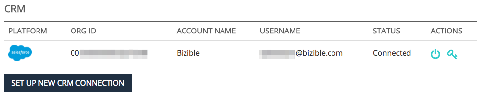

# How [!DNL Marketo Measure] und [!DNL Salesforce] Interact {#how-marketo-measure-and-salesforce-interact}

>[!NOTE]
>
>Es werden möglicherweise Anweisungen angezeigt, die[!DNL Marketo Measure]&quot; in unserer Dokumentation, sehen aber immer noch &quot;Bizible&quot; in Ihrem CRM. Wir arbeiten daran, diese Aktualisierung durchzuführen, und das Rebranding wird sich in Kürze in Ihrem CRM widerspiegeln.

Sehen wir uns die Beziehung zwischen [!DNL Marketo Measure] und Salesforce.

## Salesforce und [!DNL Marketo Measure] {#salesforce-and-marketo-measure}

Einmal [!DNL Marketo Measure] -Konto erstellt wird und [!DNL Salesforce] angeschlossen ist, [!DNL Marketo Measure] beginnt, Marketingdaten in die CRM-Instanz zu übertragen, solange die [!DNL Marketo Measure] das verwaltete Paket installiert ist und die [!DNL Marketo Measure] Salesforce-Benutzer haben Bearbeitungsberechtigungen.

Wenn Sie die [!DNL Marketo Measure] Salesforce-Paket, [!DNL Marketo Measure] schreibt keine Daten in Ihre Salesforce-Instanz.

Standardmäßig [!DNL Marketo Measure] exportiert jedes Mal 200 Datensätze pro API-Gutschrift, wenn ein Auftrag Daten an Ihr CRM sendet. Für die meisten Kunden bietet dies das optimale Gleichgewicht zwischen den API-Gutschriften, die von [!DNL Marketo Measure] und CPU-Ressourcenanforderungen im CRM-System. Bei Kunden mit komplexen CRM-Konfigurationen wie Workflows und Triggern kann eine kleinere Batch-Größe jedoch hilfreich sein, um die CRM-Leistung zu verbessern. Zu diesem Zweck [!DNL Marketo Measure] ermöglicht es Kunden, die Batch-Größe des CRM-Exports zu konfigurieren. Diese Einstellung ist auf der [!UICONTROL Einstellungen] > [!UICONTROL CRM] > [!UICONTROL Allgemein] in der [!DNL Marketo Measure] Webanwendung und Kunden können zwischen Batch-Größen von 200 (Standard), 100, 50 oder 25 wählen.

Beachten Sie bei der Änderung dieser Einstellung, dass kleinere Batch-Größen mehr API-Gutschriften aus Ihrem CRM-System verbrauchen. Es wird empfohlen, die Batch-Größe nur zu reduzieren, wenn in Ihrem CRM-System CPU-Timeouts oder eine hohe CPU-Last auftreten.

## Salesforce Standard-Objekte und Zugriff {#salesforce-standard-objects-and-access}

Dadurch werden die [!DNL Salesforce] Standardobjekte, die [!DNL Marketo Measure] interagiert mit diesen Objekten sowie mit den benutzerdefinierten Feldern, die wir diesen Objekten hinzufügen, sobald die Verbindung hergestellt ist, und dem [!DNL Marketo Measure] installiert ist. Vorkonfiguriert, [!DNL Marketo Measure] wird NICHT in einen Standard geschrieben [!DNL Salesforce] Objektfelder.

**Lead**

<table> 
 <tbody> 
  <tr> 
   <th>
Felder
</th> 
   <th>
Standard/Benutzerdefiniert
</th> 
   <th>
Lesen
</th> 
   <th>
Schreiben
</th> 
  </tr> 
  <tr> 
   <td>
ID
</td> 
   <td>
Standard
</td> 
   <td>
x
</td> 
   <td> </td> 
  </tr> 
  <tr> 
   <td>
E-Mail
</td> 
   <td>
Standard
</td> 
   <td>
x
</td> 
   <td> </td> 
  </tr> 
  <tr> 
   <td>
Status
</td> 
   <td>
Standard
</td> 
   <td>
x
</td> 
   <td> </td> 
  </tr> 
  <tr> 
   <td>
CreatedDate
</td> 
   <td>
Standard
</td> 
   <td>
x
</td> 
   <td> </td> 
  </tr> 
  <tr> 
   <td>
LastModifiedDate
</td> 
   <td>
Standard
</td> 
   <td>
x
</td> 
   <td> </td> 
  </tr> 
  <tr> 
   <td>
ConvertedDate
</td> 
   <td>
Standard
</td> 
   <td>
x
</td> 
   <td> </td> 
  </tr> 
  <tr> 
   <td>
ConvertedContactId
</td> 
   <td>
Standard
</td> 
   <td>
x
</td> 
   <td> </td> 
  </tr> 
  <tr> 
   <td>
ConvertedOpportunityId
</td> 
   <td>
Standard
</td> 
   <td>
x
</td> 
   <td> </td> 
  </tr> 
  <tr> 
   <td>
IsConverted
</td> 
   <td>
Standard
</td> 
   <td>
x
</td> 
   <td> </td> 
  </tr> 
  <tr> 
   <td>
IsDeleted
</td> 
   <td>
Standard
</td> 
   <td>
x
</td> 
   <td> </td> 
  </tr> 
  <tr> 
   <td>
Website
</td> 
   <td>
Standard
</td> 
   <td>
x
</td> 
   <td> </td> 
  </tr> 
  <tr> 
   <td>
Unternehmen
</td> 
   <td>
Standard
</td> 
   <td>
x
</td> 
   <td> </td> 
  </tr> 
  <tr> 
   <td>
bizible2__Account__c
</td> 
   <td>
Benutzerdefiniert
</td> 
   <td>
x
</td> 
   <td>
x
</td> 
  </tr> 
  <tr> 
   <td>
bizible2__Ad_Campaign_Name_FT__c
</td> 
   <td>
Benutzerdefiniert
</td> 
   <td>
x
</td> 
   <td>
x
</td> 
  </tr> 
  <tr> 
   <td>
bizible2__ad_campaign_name_LC__c
</td> 
   <td>
Benutzerdefiniert
</td> 
   <td>
x
</td> 
   <td>
x
</td> 
  </tr> 
  <tr> 
   <td>
bizible2__Landing_Page_FT__c
</td> 
   <td>
Benutzerdefiniert
</td> 
   <td>
x
</td> 
   <td>
x
</td> 
  </tr> 
  <tr> 
   <td>
bizible2__Landing_Page_LC__c
</td> 
   <td>
Benutzerdefiniert
</td> 
   <td>
x
</td> 
   <td>
x
</td> 
  </tr> 
  <tr> 
   <td>
bizible2__Marketing_Channel_FT_c
</td> 
   <td>
Benutzerdefiniert
</td> 
   <td>
x
</td> 
   <td>
x
</td> 
  </tr> 
  <tr> 
   <td>
bizible2__Marketing_Channel_LC__c
</td> 
   <td>
Benutzerdefiniert
</td> 
   <td>
x
</td> 
   <td>
x
</td> 
  </tr> 
  <tr> 
   <td>
bizible2__Touchpoint_Date_FT__c
</td> 
   <td>
Benutzerdefiniert
</td> 
   <td>
x
</td> 
   <td>
x
</td> 
  </tr> 
  <tr> 
   <td>
bizible2__Touchpoint_Date_LC__c
</td> 
   <td>
Benutzerdefiniert
</td> 
   <td>
x
</td> 
   <td>
x
</td> 
  </tr> 
  <tr> 
   <td>
bizible2__Touchpoint_Source_FT__c
</td> 
   <td>
Benutzerdefiniert
</td> 
   <td>
x
</td> 
   <td>
x
</td> 
  </tr> 
  <tr> 
   <td>
bizible2__Touchpoint_Source_LC__c
</td> 
   <td>
Benutzerdefiniert
</td> 
   <td>
x
</td> 
   <td>
x 
</td> 
  </tr> 
 </tbody> 
</table>

**Kontakt**

<table> 
 <tbody> 
  <tr> 
   <th>
Felder
</th> 
   <th>
Standard/Benutzerdefiniert
</th> 
   <th>
Lesen
</th> 
   <th>
Schreiben
</th> 
  </tr> 
  <tr> 
   <td>
Konto
</td> 
   <td>
Standard
</td> 
   <td>x</td> 
   <td> </td> 
  </tr> 
  <tr> 
   <td>
ID
</td> 
   <td>
Standard
</td> 
   <td>
x
</td> 
   <td> </td> 
  </tr> 
  <tr> 
   <td>
E-Mail
</td> 
   <td>
Standard
</td> 
   <td>
x
</td> 
   <td> </td> 
  </tr> 
  <tr> 
   <td>
Erstellungsdatum
</td> 
   <td>
Standard
</td> 
   <td>
x
</td> 
   <td> </td> 
  </tr> 
  <tr> 
   <td>
IsDeleted
</td> 
   <td>
Standard
</td> 
   <td>
x
</td> 
   <td> </td> 
  </tr> 
  <tr> 
   <td>
LastModifiedDate
</td> 
   <td>
Standard
</td> 
   <td>
x
</td> 
   <td> </td> 
  </tr> 
  <tr> 
   <td>
bizible2__Ad_Campaign_Name_FT__c
</td> 
   <td>
Benutzerdefiniert
</td> 
   <td>
x
</td> 
   <td>
x
</td> 
  </tr> 
  <tr> 
   <td>
bizible2__ad_campaign_name_LC__c
</td> 
   <td>
Benutzerdefiniert
</td> 
   <td>
x
</td> 
   <td>
x
</td> 
  </tr> 
  <tr> 
   <td>
bizible2__Landing_Page_FT__c
</td> 
   <td>
Benutzerdefiniert
</td> 
   <td>
x
</td> 
   <td>
x
</td> 
  </tr> 
  <tr> 
   <td>
bizible2__Landing_Page_LC__c
</td> 
   <td>
Benutzerdefiniert
</td> 
   <td>
x
</td> 
   <td>
x
</td> 
  </tr> 
  <tr> 
   <td>
bizible2__Marketing_Channel_FT_c
</td> 
   <td>
Benutzerdefiniert
</td> 
   <td>
x
</td> 
   <td>
x
</td> 
  </tr> 
  <tr> 
   <td>
bizible2__Marketing_Channel_LC__c
</td> 
   <td>
Benutzerdefiniert
</td> 
   <td>
x
</td> 
   <td>
x
</td> 
  </tr> 
  <tr> 
   <td>
bizible2__Touchpoint_Date_FT__c
</td> 
   <td>
Benutzerdefiniert
</td> 
   <td>
x
</td> 
   <td>
x
</td> 
  </tr> 
  <tr> 
   <td>
bizible2__Touchpoint_Date_LC__c
</td> 
   <td>
Benutzerdefiniert
</td> 
   <td>
x
</td> 
   <td>
x
</td> 
  </tr> 
  <tr> 
   <td>
bizible2__Touchpoint_Source_FT__c
</td> 
   <td>
Benutzerdefiniert
</td> 
   <td>
x
</td> 
   <td>
x
</td> 
  </tr> 
  <tr> 
   <td>
bizible2__Touchpoint_Source_LC__c
</td> 
   <td>
Benutzerdefiniert
</td> 
   <td>
x
</td> 
   <td>
x 
</td> 
  </tr> 
 </tbody> 
</table>

**Fall**

<table> 
 <tbody> 
  <tr> 
   <th>
Felder
</th> 
   <th>
Standard/Benutzerdefiniert
</th> 
   <th>
Lesen
</th> 
   <th>
Schreiben
</th> 
  </tr> 
  <tr> 
   <td>
ID
</td> 
   <td>
Standard
</td> 
   <td>
x
</td> 
   <td> </td> 
  </tr> 
  <tr> 
   <td>
CreatedDate
</td> 
   <td>
Standard
</td> 
   <td>
x
</td> 
   <td> </td> 
  </tr> 
  <tr> 
   <td>
LastModifiedDate
</td> 
   <td>
Standard
</td> 
   <td>
x
</td> 
   <td> </td> 
  </tr> 
  <tr> 
   <td>
SuppliedEmail
</td> 
   <td>
Standard
</td> 
   <td>
x
</td> 
   <td> </td> 
  </tr> 
  <tr> 
   <td>
IsDeleted
</td> 
   <td>
Standard
</td> 
   <td>
x
</td> 
   <td> </td> 
  </tr> 
  <tr> 
   <td>
bizible2__Ad_Campaign_Name_FT__c
</td> 
   <td>
Benutzerdefiniert
</td> 
   <td>
x
</td> 
   <td>
x
</td> 
  </tr> 
  <tr> 
   <td>
bizible2__ad_campaign_name_LC__c
</td> 
   <td>
Benutzerdefiniert
</td> 
   <td>
x
</td> 
   <td>
x
</td> 
  </tr> 
  <tr> 
   <td>
bizible2__Landing_Page_FT__c
</td> 
   <td>
Benutzerdefiniert
</td> 
   <td>
x
</td> 
   <td>
x
</td> 
  </tr> 
  <tr> 
   <td>
bizible2__Landing_Page_LC__c
</td> 
   <td>
Benutzerdefiniert
</td> 
   <td>
x
</td> 
   <td>
x
</td> 
  </tr> 
  <tr> 
   <td>
bizible2__Marketing_Channel_FT_c
</td> 
   <td>
Benutzerdefiniert
</td> 
   <td>
x
</td> 
   <td>
x
</td> 
  </tr> 
  <tr> 
   <td>
bizible2__Marketing_Channel_LC__c
</td> 
   <td>
Benutzerdefiniert
</td> 
   <td>
x
</td> 
   <td>
x
</td> 
  </tr> 
  <tr> 
   <td>
bizible2__Touchpoint_Date_FT__c
</td> 
   <td>
Benutzerdefiniert
</td> 
   <td>
x
</td> 
   <td>
x
</td> 
  </tr> 
  <tr> 
   <td>
bizible2__Touchpoint_Date_LC__c
</td> 
   <td>
Benutzerdefiniert
</td> 
   <td>
x
</td> 
   <td>
x
</td> 
  </tr> 
  <tr> 
   <td>
bizible2__Touchpoint_Source_FT__c
</td> 
   <td>
Benutzerdefiniert
</td> 
   <td>
x
</td> 
   <td>
x
</td> 
  </tr> 
  <tr> 
   <td>
bizible2__Touchpoint_Source_LC__c
</td> 
   <td>
Benutzerdefiniert
</td> 
   <td>
x
</td> 
   <td>
x 
</td> 
  </tr> 
 </tbody> 
</table>

**Konto**

<table> 
 <tbody> 
  <tr> 
   <th>
Felder
</th> 
   <th>
Standard/Benutzerdefiniert
</th> 
   <th>
Lesen
</th> 
   <th>
Schreiben
</th> 
  </tr> 
  <tr> 
   <td>
ID
</td> 
   <td>
Standard
</td> 
   <td>
x
</td> 
   <td> </td> 
  </tr> 
  <tr> 
   <td>
Website
</td> 
   <td>
Standard
</td> 
   <td>
x
</td> 
   <td> </td> 
  </tr> 
  <tr> 
   <td>
LastModifiedDate
</td> 
   <td>
Standard
</td> 
   <td>
x
</td> 
   <td> </td> 
  </tr> 
  <tr> 
   <td>
IsDeleted
</td> 
   <td>
Standard
</td> 
   <td>
x
</td> 
   <td> </td> 
  </tr> 
  <tr> 
   <td>
bizible2__Engagement_Score__c
</td> 
   <td>
Benutzerdefiniert
</td> 
   <td>
x
</td> 
   <td>
x 
</td> 
  </tr> 
 </tbody> 
</table>

**Chance**

<table> 
 <tbody> 
  <tr> 
   <th>
Felder
</th> 
   <th>
Standard/Benutzerdefiniert
</th> 
   <th>
Lesen
</th> 
   <th>
Schreiben
</th> 
  </tr> 
  <tr> 
   <td>
Konto
</td> 
   <td>
Standard
</td> 
   <td>
x
</td> 
   <td> </td> 
  </tr> 
  <tr> 
   <td>
ID
</td> 
   <td>
Standard
</td> 
   <td>
x
</td> 
   <td> </td> 
  </tr> 
  <tr> 
   <td>
CreatedDate
</td> 
   <td>
Standard
</td> 
   <td>
x
</td> 
   <td> </td> 
  </tr> 
  <tr> 
   <td>
LastModifiedDate
</td> 
   <td>
Standard
</td> 
   <td>
x
</td> 
   <td> </td> 
  </tr> 
  <tr> 
   <td>
IsWon
</td> 
   <td>
Standard
</td> 
   <td>
x
</td> 
   <td> </td> 
  </tr> 
  <tr> 
   <td>
IsClosed
</td> 
   <td>
Standard
</td> 
   <td>
x
</td> 
   <td> </td> 
  </tr> 
  <tr> 
   <td>
IsDeleted
</td> 
   <td>
Standard
</td> 
   <td>
x
</td> 
   <td> </td> 
  </tr> 
  <tr> 
   <td>
Enddatum
</td> 
   <td>
Standard
</td> 
   <td>
x
</td> 
   <td> </td> 
  </tr> 
  <tr> 
   <td>
StageName
</td> 
   <td>
Standard
</td> 
   <td>
x
</td> 
   <td> </td> 
  </tr> 
  <tr> 
   <td>
Betrag
</td> 
   <td>
Standard
</td> 
   <td>
x
</td> 
   <td> </td> 
  </tr> 
  <tr> 
   <td>
bizible2__bizible_Opportunity_Amount_c
</td> 
   <td>
Benutzerdefiniert
</td> 
   <td>
x
</td> 
   <td>
x 
</td> 
  </tr> 
 </tbody> 
</table>

**Kampagne**

<table> 
 <colgroup> 
  <col> 
  <col> 
  <col> 
  <col> 
 </colgroup> 
 <tbody> 
  <tr> 
   <th>
Felder
</th> 
   <th>
Standard/Benutzerdefiniert
</th> 
   <th>
Lesen
</th> 
   <th>
Schreiben
</th> 
  </tr> 
  <tr> 
   <td>
ID
</td> 
   <td>
Standard
</td> 
   <td>
x
</td> 
   <td> </td> 
  </tr> 
  <tr> 
   <td>
E-Mail
</td> 
   <td>
Standard
</td> 
   <td>
x
</td> 
   <td> </td> 
  </tr> 
  <tr> 
   <td>
Status
</td> 
   <td>
Standard
</td> 
   <td>
x
</td> 
   <td> </td> 
  </tr> 
  <tr> 
   <td>
CreatedDate
</td> 
   <td>
Standard
</td> 
   <td>
x
</td> 
   <td> </td> 
  </tr> 
  <tr> 
   <td>
LastModifiedDate
</td> 
   <td>
Standard
</td> 
   <td>
x
</td> 
   <td> </td> 
  </tr> 
  <tr> 
   <td>
ConvertedDate
</td> 
   <td>
Standard
</td> 
   <td>
x
</td> 
   <td> </td> 
  </tr> 
  <tr> 
   <td>
ConvertedContactId
</td> 
   <td>
Standard
</td> 
   <td>
x
</td> 
   <td> </td> 
  </tr> 
  <tr> 
   <td>
ConvertedOpportunityId
</td> 
   <td>
Standard
</td> 
   <td>
x
</td> 
   <td> </td> 
  </tr> 
  <tr> 
   <td>
IsConverted
</td> 
   <td>
Standard
</td> 
   <td>
x
</td> 
   <td> </td> 
  </tr> 
  <tr> 
   <td>
IsDeleted
</td> 
   <td>
Standard
</td> 
   <td>
x
</td> 
   <td> </td> 
  </tr> 
  <tr> 
   <td>
Website
</td> 
   <td>
Standard
</td> 
   <td>
x
</td> 
   <td> </td> 
  </tr> 
  <tr> 
   <td>
Unternehmen
</td> 
   <td>
Standard
</td> 
   <td>
x
</td> 
   <td> </td> 
  </tr> 
  <tr> 
   <td>
Typ
</td> 
   <td>
Standard
</td> 
   <td>
x
</td> 
   <td> </td> 
  </tr> 
 </tbody> 
</table>

**Kampagnenmitglied**

<table> 
 <tbody> 
  <tr> 
   <th>
Felder
</th> 
   <th>
Standard/Benutzerdefiniert
</th> 
   <th>
Lesen
</th> 
   <th>
Schreiben
</th> 
  </tr> 
  <tr> 
   <td>
ID
</td> 
   <td>
Standard
</td> 
   <td>
x
</td> 
   <td> </td> 
  </tr> 
  <tr> 
   <td>
CreatedDate
</td> 
   <td>
Standard
</td> 
   <td>
x
</td> 
   <td> </td> 
  </tr> 
  <tr> 
   <td>
LastModifiedDate
</td> 
   <td>
Standard
</td> 
   <td>
x
</td> 
   <td> </td> 
  </tr> 
  <tr> 
   <td>
IsDeleted
</td> 
   <td>
Standard
</td> 
   <td>
x
</td> 
   <td> </td> 
  </tr> 
  <tr> 
   <td>
ErstesAntwortdatum
</td> 
   <td>
Standard
</td> 
   <td>
x
</td> 
   <td> </td> 
  </tr> 
  <tr> 
   <td>
HasResponded
</td> 
   <td>
Standard
</td> 
   <td>
x
</td> 
   <td> </td> 
  </tr> 
  <tr> 
   <td>
ContactId
</td> 
   <td>
Standard
</td> 
   <td>
x
</td> 
   <td> </td> 
  </tr> 
  <tr> 
   <td>
LeadId
</td> 
   <td>
Standard
</td> 
   <td>
x
</td> 
   <td> </td> 
  </tr> 
  <tr> 
   <td>
IsConverted
</td> 
   <td>
Standard
</td> 
   <td>
x
</td> 
   <td> </td> 
  </tr> 
  <tr> 
   <td>
KampagnenID
</td> 
   <td>
Standard
</td> 
   <td>
x
</td> 
   <td> </td> 
  </tr> 
  <tr> 
   <td>
bizible2__bizible_Touchpoint_Date_c
</td> 
   <td>
Benutzerdefiniert
</td> 
   <td>
x
</td> 
   <td>
x
</td> 
  </tr> 
  <tr> 
   <td>
bizible2__Touchpoint_Status_Date_c
</td> 
   <td>
Benutzerdefiniert
</td> 
   <td>
x
</td> 
   <td>
x
</td> 
  </tr> 
  <tr> 
   <td>
bizible2__Touchpoint_Status_Contact_c
</td> 
   <td>
Benutzerdefiniert
</td> 
   <td>
x
</td> 
   <td>
x
</td> 
  </tr> 
  <tr> 
   <td>
bizible2__Touchpoint_Status_Leade__c
</td> 
   <td>
Benutzerdefiniert
</td> 
   <td>
x
</td> 
   <td>
x
</td> 
  </tr> 
  <tr> 
   <td>
bizible2__Touchpoint_Status_Opportunity_c
</td> 
   <td>
Benutzerdefiniert
</td> 
   <td>
x
</td> 
   <td>
x 
</td> 
  </tr> 
 </tbody> 
</table>

## [!DNL Marketo Measure] Benutzerdefinierte Objekte in [!DNL Salesforce] {#marketo-measure-custom-objects-in-salesforce}

Neben der Erstellung benutzerdefinierter Felder für die Standardobjekte des SFDC wird bei jedem [!DNL Marketo Measure] installiert ist, werden mehrere benutzerdefinierte Objekte erstellt. Nachfolgend finden Sie eine Liste dieser benutzerdefinierten Objekte sowie eine Tabelle mit den Feldern, die [!DNL Marketo Measure] wird schreiben.

**Käufer Touchpoint**

Der Touchpoint des Käufers ist ein [!DNL Marketo Measure] Benutzerdefiniertes Objekt zur Kapselung der Marketing-Interaktionen für Kontakte, Leads und Fälle.

<table> 
 <tbody> 
  <tr> 
   <th>
Felder
</th> 
   <th>
Standard/Benutzerdefiniert
</th> 
   <th>
Lesen
</th> 
   <th>
Schreiben
</th> 
  </tr> 
  <tr> 
   <td>
bizible2__bizible_Person_c
</td> 
   <td>
Benutzerdefiniert
</td> 
   <td>
x
</td> 
   <td>
x
</td> 
  </tr> 
  <tr> 
   <td>
bizible2__SF_Campaign__c
</td> 
   <td>
Benutzerdefiniert
</td> 
   <td>
x
</td> 
   <td>
x
</td> 
  </tr> 
  <tr> 
   <td>
bizible2__UniqueId__c
</td> 
   <td>
Benutzerdefiniert
</td> 
   <td>
x
</td> 
   <td>
x
</td> 
  </tr> 
  <tr> 
   <td>
bizible2__Marketing_Channel_c
</td> 
   <td>
Benutzerdefiniert
</td> 
   <td>
x
</td> 
   <td>
x
</td> 
  </tr> 
  <tr> 
   <td>
bizible2__Marketing_Channel_Path_c
</td> 
   <td>
Benutzerdefiniert
</td> 
   <td>
x
</td> 
   <td>
x
</td> 
  </tr> 
  <tr> 
   <td>
bizible2__Touchpoint_Type_c
</td> 
   <td>
Benutzerdefiniert
</td> 
   <td>
x
</td> 
   <td>
x
</td> 
  </tr> 
  <tr> 
   <td>
bizible2__Ad_Id__c
</td> 
   <td>
Benutzerdefiniert
</td> 
   <td>
x
</td> 
   <td>
x
</td> 
  </tr> 
  <tr> 
   <td>
bizible2__ad_content_c
</td> 
   <td>
Benutzerdefiniert
</td> 
   <td>
x
</td> 
   <td>
x
</td> 
  </tr> 
  <tr> 
   <td>
bizible2__ad_group_id__c
</td> 
   <td>
Benutzerdefiniert
</td> 
   <td>
x
</td> 
   <td>
x
</td> 
  </tr> 
  <tr> 
   <td>
bizible2__ad_group_name__c
</td> 
   <td>
Benutzerdefiniert
</td> 
   <td>
x
</td> 
   <td>
x
</td> 
  </tr> 
  <tr> 
   <td>
bizible2__Ad_Campaign_Id__c
</td> 
   <td>
Benutzerdefiniert
</td> 
   <td>
x
</td> 
   <td>
x
</td> 
  </tr> 
  <tr> 
   <td>
bizible2__ad_campaign_name__c
</td> 
   <td>
Benutzerdefiniert
</td> 
   <td>
x
</td> 
   <td>
x
</td> 
  </tr> 
  <tr> 
   <td>
bizible2__Placement_Id__c
</td> 
   <td>
Benutzerdefiniert
</td> 
   <td>
x
</td> 
   <td>
x
</td> 
  </tr> 
  <tr> 
   <td>
bizible2__Placement_Name__c
</td> 
   <td>
Benutzerdefiniert
</td> 
   <td>
x
</td> 
   <td>
x
</td> 
  </tr> 
  <tr> 
   <td>
bizible2__Site_Id__c
</td> 
   <td>
Benutzerdefiniert
</td> 
   <td>
x
</td> 
   <td>
x
</td> 
  </tr> 
  <tr> 
   <td>
bizible2__Site_Name__c
</td> 
   <td>
Benutzerdefiniert
</td> 
   <td>
x
</td> 
   <td>
x
</td> 
  </tr> 
  <tr> 
   <td>
bizible2__Form_URL__c
</td> 
   <td>
Benutzerdefiniert
</td> 
   <td>
x
</td> 
   <td>
x
</td> 
  </tr> 
  <tr> 
   <td>
bizible2__form_URL_Raw__c
</td> 
   <td>
Benutzerdefiniert
</td> 
   <td>
x
</td> 
   <td>
x
</td> 
  </tr> 
  <tr> 
   <td>
bizible2__Platform__c
</td> 
   <td>
Benutzerdefiniert
</td> 
   <td>
x
</td> 
   <td>
x
</td> 
  </tr> 
  <tr> 
   <td>
bizible2__Browser__c
</td> 
   <td>
Benutzerdefiniert
</td> 
   <td>
x
</td> 
   <td>
x
</td> 
  </tr> 
  <tr> 
   <td>
bizible2__geo_city__c
</td> 
   <td>
Benutzerdefiniert
</td> 
   <td>
x
</td> 
   <td>
x
</td> 
  </tr> 
  <tr> 
   <td>
bizible2__geo_Country__c
</td> 
   <td>
Benutzerdefiniert
</td> 
   <td>
x
</td> 
   <td>
x
</td> 
  </tr> 
  <tr> 
   <td>
bizible2__geo_Region__c
</td> 
   <td>
Benutzerdefiniert
</td> 
   <td>
x
</td> 
   <td>
x
</td> 
  </tr> 
  <tr> 
   <td>
bizible2__Keyword_Id__c
</td> 
   <td>
Benutzerdefiniert
</td> 
   <td>
x
</td> 
   <td>
x
</td> 
  </tr> 
  <tr> 
   <td>
bizible2__Keyword_MatchType__c
</td> 
   <td>
Benutzerdefiniert
</td> 
   <td>
x
</td> 
   <td>
x
</td> 
  </tr> 
  <tr> 
   <td>
bizible2__Touchpoint_Position__c
</td> 
   <td>
Benutzerdefiniert
</td> 
   <td>
x
</td> 
   <td>
x
</td> 
  </tr> 
  <tr> 
   <td>
bizible2__keyword_Text__c
</td> 
   <td>
Benutzerdefiniert
</td> 
   <td>
x
</td> 
   <td>
x
</td> 
  </tr> 
  <tr> 
   <td>
bizible2__Landing_Page__c
</td> 
   <td>
Benutzerdefiniert
</td> 
   <td>
x
</td> 
   <td>
x
</td> 
  </tr> 
  <tr> 
   <td>
bizible2__landing_page_Raw__c
</td> 
   <td>
Benutzerdefiniert
</td> 
   <td>
x
</td> 
   <td>
x
</td> 
  </tr> 
  <tr> 
   <td>
bizible2__medium_c
</td> 
   <td>
Benutzerdefiniert
</td> 
   <td>
x
</td> 
   <td>
x
</td> 
  </tr> 
  <tr> 
   <td>
bizible2__referrer_Page__c
</td> 
   <td>
Benutzerdefiniert
</td> 
   <td>
x
</td> 
   <td>
x
</td> 
  </tr> 
  <tr> 
   <td>
bizible2__referrer_Page_Raw__c
</td> 
   <td>
Benutzerdefiniert
</td> 
   <td>
x
</td> 
   <td>
x
</td> 
  </tr> 
  <tr> 
   <td>
bizible2__search_Phrase__c
</td> 
   <td>
Benutzerdefiniert
</td> 
   <td>
x
</td> 
   <td>
x
</td> 
  </tr> 
  <tr> 
   <td>
bizible2__Touchpoint_Date_c
</td> 
   <td>
Benutzerdefiniert
</td> 
   <td>
x
</td> 
   <td>
x
</td> 
  </tr> 
  <tr> 
   <td>
bizible2__Touchpoint_Source_c
</td> 
   <td>
Benutzerdefiniert
</td> 
   <td>
x
</td> 
   <td>
x
</td> 
  </tr> 
  <tr> 
   <td>
bizible2__Segment__c
</td> 
   <td>
Benutzerdefiniert
</td> 
   <td>
x
</td> 
   <td>
x
</td> 
  </tr> 
  <tr> 
   <td>
bizible2__count_First_Touch__c
</td> 
   <td>
Benutzerdefiniert
</td> 
   <td>
x
</td> 
   <td>
x
</td> 
  </tr> 
  <tr> 
   <td>
bizible2__Count_Lead_Creation_Touch_c
</td> 
   <td>
Benutzerdefiniert
</td> 
   <td>
x
</td> 
   <td>
x
</td> 
  </tr> 
  <tr> 
   <td>
bizible2__Count_U_Shaped_c
</td> 
   <td>
Benutzerdefiniert
</td> 
   <td>
x
</td> 
   <td>
x
</td> 
  </tr> 
  <tr> 
   <td>
bizible2__ad_destination_URL__c
</td> 
   <td>
Benutzerdefiniert
</td> 
   <td>
x
</td> 
   <td>
x
</td> 
  </tr> 
  <tr> 
   <td>
bizible2__Case__c
</td> 
   <td>
Benutzerdefiniert
</td> 
   <td>
x
</td> 
   <td>
x
</td> 
  </tr> 
  <tr> 
   <td>
bizible2__Contact_c
</td> 
   <td>
Benutzerdefiniert
</td> 
   <td>
x
</td> 
   <td>
x
</td> 
  </tr> 
 </tbody> 
</table>

**[!DNL Marketo Measure]Person**

Die [!DNL Marketo Measure] Person ist eine [!DNL Marketo Measure] Benutzerdefiniertes Objekt, das sowohl mit dem Lead- als auch dem Kontakt- und dem Groß-/Kleinschreibung-Objekt verknüpft ist.

<table> 
 <tbody> 
  <tr> 
   <th>
Felder
</th> 
   <th>
Standard/Benutzerdefiniert
</th> 
   <th>
Lesen
</th> 
   <th>
Schreiben
</th> 
  </tr> 
  <tr> 
   <td>
bizible2__UniqueId__c
</td> 
   <td>
Benutzerdefiniert
</td> 
   <td>
x
</td> 
   <td>
x
</td> 
  </tr> 
  <tr> 
   <td>
bizible2__Lead__c
</td> 
   <td>
Benutzerdefiniert
</td> 
   <td>
x
</td> 
   <td>
x
</td> 
  </tr> 
  <tr> 
   <td>
bizible2__Case__c
</td> 
   <td>
Benutzerdefiniert
</td> 
   <td>
x
</td> 
   <td>
x
</td> 
  </tr> 
  <tr> 
   <td>
bizible2__Contact_c
</td> 
   <td>
Benutzerdefiniert
</td> 
   <td>
x
</td> 
   <td>
x 
</td> 
  </tr> 
 </tbody> 
</table>

## Touchpoint der Käuferzuordnung {#buyer-attribution-touchpoint}

Der Touchpoint der Käuferzuordnung ist ein [!DNL Marketo Measure] Benutzerdefiniertes Objekt, um den Einfluss des Marketing auf Chancen einzuschließen.

**Touchpoint der Käuferzuordnung**

<table> 
 <tbody> 
  <tr> 
   <th>
Felder
</th> 
   <th>
Standard/Benutzerdefiniert
</th> 
   <th>
Lesen
</th> 
   <th>
Schreiben
</th> 
  </tr> 
  <tr> 
   <td>
bizible2__Account__c
</td> 
   <td>
Benutzerdefiniert
</td> 
   <td>
x
</td> 
   <td>
x
</td> 
  </tr> 
  <tr> 
   <td>
bizible2__SF_Campaign__c
</td> 
   <td>
Benutzerdefiniert
</td> 
   <td>
x
</td> 
   <td>
x
</td> 
  </tr> 
  <tr> 
   <td>
bizible2__Contact_c
</td> 
   <td>
Benutzerdefiniert
</td> 
   <td>
x
</td> 
   <td>
x
</td> 
  </tr> 
  <tr> 
   <td>
bizible2__Opportunity_c
</td> 
   <td>
Benutzerdefiniert
</td> 
   <td>
x
</td> 
   <td>
x
</td> 
  </tr> 
  <tr> 
   <td>
bizible2__UniqueId__c
</td> 
   <td>
Benutzerdefiniert
</td> 
   <td>
x
</td> 
   <td>
x
</td> 
  </tr> 
  <tr> 
   <td>
bizible2__Marketing_Channel_c
</td> 
   <td>
Benutzerdefiniert
</td> 
   <td>
x
</td> 
   <td>
x
</td> 
  </tr> 
  <tr> 
   <td>
bizible2__Marketing_Channel_Path_c
</td> 
   <td>
Benutzerdefiniert
</td> 
   <td>
x
</td> 
   <td>
x
</td> 
  </tr> 
  <tr> 
   <td>
bizible2__Touchpoint_Type_c
</td> 
   <td>
Benutzerdefiniert
</td> 
   <td>
x
</td> 
   <td>
x
</td> 
  </tr> 
  <tr> 
   <td>
bizible2__Ad_Id__c
</td> 
   <td>
Benutzerdefiniert
</td> 
   <td>
x
</td> 
   <td>
x
</td> 
  </tr> 
  <tr> 
   <td>
bizible2__ad_content_c
</td> 
   <td>
Benutzerdefiniert
</td> 
   <td>
x
</td> 
   <td>
x
</td> 
  </tr> 
  <tr> 
   <td>
bizible2__ad_group_id__c
</td> 
   <td>
Benutzerdefiniert
</td> 
   <td>
x
</td> 
   <td>
x
</td> 
  </tr> 
  <tr> 
   <td>
bizible2__ad_group_name__c
</td> 
   <td>
Benutzerdefiniert
</td> 
   <td>
x
</td> 
   <td>
x
</td> 
  </tr> 
  <tr> 
   <td>
bizible2__Ad_Campaign_Id__c
</td> 
   <td>
Benutzerdefiniert
</td> 
   <td>
x
</td> 
   <td>
x
</td> 
  </tr> 
  <tr> 
   <td>
bizible2__ad_campaign_name__c
</td> 
   <td>
Benutzerdefiniert
</td> 
   <td>
x
</td> 
   <td>
x
</td> 
  </tr> 
  <tr> 
   <td>
bizible2__Placement_Id__c
</td> 
   <td>
Benutzerdefiniert
</td> 
   <td>
x
</td> 
   <td>
x
</td> 
  </tr> 
  <tr> 
   <td>
bizible2__Placement_Name__c
</td> 
   <td>
Benutzerdefiniert
</td> 
   <td>
x
</td> 
   <td>
x
</td> 
  </tr> 
  <tr> 
   <td>
bizible2__Site_Id__c
</td> 
   <td>
Benutzerdefiniert
</td> 
   <td>
x
</td> 
   <td>
x
</td> 
  </tr> 
  <tr> 
   <td>
bizible2__Site_Name__c
</td> 
   <td>
Benutzerdefiniert
</td> 
   <td>
x
</td> 
   <td>
x
</td> 
  </tr> 
  <tr> 
   <td>
bizible2__Form_URL__c
</td> 
   <td>
Benutzerdefiniert
</td> 
   <td>
x
</td> 
   <td>
x
</td> 
  </tr> 
  <tr> 
   <td>
bizible2__form_URL_Raw__c
</td> 
   <td>
Benutzerdefiniert
</td> 
   <td>
x
</td> 
   <td>
x
</td> 
  </tr> 
  <tr> 
   <td>
bizible2__Platform__c
</td> 
   <td>
Benutzerdefiniert
</td> 
   <td>
x
</td> 
   <td>
x
</td> 
  </tr> 
  <tr> 
   <td>
bizible2__Browser__c
</td> 
   <td>
Benutzerdefiniert
</td> 
   <td>
x
</td> 
   <td>
x
</td> 
  </tr> 
  <tr> 
   <td>
bizible2__geo_city__c
</td> 
   <td>
Benutzerdefiniert
</td> 
   <td>
x
</td> 
   <td>
x
</td> 
  </tr> 
  <tr> 
   <td>
bizible2__geo_Country__c
</td> 
   <td>
Benutzerdefiniert
</td> 
   <td>
x
</td> 
   <td>
x
</td> 
  </tr> 
  <tr> 
   <td>
bizible2__geo_Region__c
</td> 
   <td>
Benutzerdefiniert
</td> 
   <td>
x
</td> 
   <td>
x
</td> 
  </tr> 
  <tr> 
   <td>
bizible2__Keyword_Id__c
</td> 
   <td>
Benutzerdefiniert
</td> 
   <td>
x
</td> 
   <td>
x
</td> 
  </tr> 
  <tr> 
   <td>
bizible2__Keyword_MatchType__c
</td> 
   <td>
Benutzerdefiniert
</td> 
   <td>
x
</td> 
   <td>
x
</td> 
  </tr> 
  <tr> 
   <td>
bizible2__Touchpoint_Position__c
</td> 
   <td>
Benutzerdefiniert
</td> 
   <td>
x
</td> 
   <td>
x
</td> 
  </tr> 
  <tr> 
   <td>
bizible2__keyword_Text__c
</td> 
   <td>
Benutzerdefiniert
</td> 
   <td>
x
</td> 
   <td>
x
</td> 
  </tr> 
  <tr> 
   <td>
bizible2__Landing_Page__c
</td> 
   <td>
Benutzerdefiniert
</td> 
   <td>
x
</td> 
   <td>
x
</td> 
  </tr> 
  <tr> 
   <td>
bizible2__landing_page_Raw__c
</td> 
   <td>
Benutzerdefiniert
</td> 
   <td>
x
</td> 
   <td>
x
</td> 
  </tr> 
  <tr> 
   <td>
bizible2__medium_c
</td> 
   <td>
Benutzerdefiniert
</td> 
   <td>
x
</td> 
   <td>
x
</td> 
  </tr> 
  <tr> 
   <td>
bizible2__referrer_Page__c
</td> 
   <td>
Benutzerdefiniert
</td> 
   <td>
x
</td> 
   <td>
x
</td> 
  </tr> 
  <tr> 
   <td>
bizible2__referrer_Page_Raw__c
</td> 
   <td>
Benutzerdefiniert
</td> 
   <td>
x
</td> 
   <td>
x
</td> 
  </tr> 
  <tr> 
   <td>
bizible2__search_Phrase__c
</td> 
   <td>
Benutzerdefiniert
</td> 
   <td>
x
</td> 
   <td>
x
</td> 
  </tr> 
  <tr> 
   <td>
bizible2__Touchpoint_Date_c
</td> 
   <td>
Benutzerdefiniert
</td> 
   <td>
x
</td> 
   <td>
x
</td> 
  </tr> 
  <tr> 
   <td>
bizible2__Touchpoint_Source_c
</td> 
   <td>
Benutzerdefiniert
</td> 
   <td>
x
</td> 
   <td>
x
</td> 
  </tr> 
  <tr> 
   <td>
bizible2__Segment__c
</td> 
   <td>
Benutzerdefiniert
</td> 
   <td>
x
</td> 
   <td>
x
</td> 
  </tr> 
  <tr> 
   <td>
bizible2__Attribution_First_Touch_c
</td> 
   <td>
Benutzerdefiniert
</td> 
   <td>
x
</td> 
   <td>
x
</td> 
  </tr> 
  <tr> 
   <td>
bizible2__Attribution_Lead_Conversion_Touch_c
</td> 
   <td>
Benutzerdefiniert
</td> 
   <td>
x
</td> 
   <td>
x
</td> 
  </tr> 
  <tr> 
   <td>
bizible2__Attribution_U_Shaped_c
</td> 
   <td>
Benutzerdefiniert
</td> 
   <td>
x
</td> 
   <td>
x
</td> 
  </tr> 
  <tr> 
   <td>
bizible2__Attribution_W_Shaped_c
</td> 
   <td>
Benutzerdefiniert
</td> 
   <td>
x
</td> 
   <td>
x
</td> 
  </tr> 
  <tr> 
   <td>
bizible2__Attribution_Custom_Model__c
</td> 
   <td>
Benutzerdefiniert
</td> 
   <td>
x
</td> 
   <td>
x
</td> 
  </tr> 
  <tr> 
   <td>
bizible2__Attribution_Custom_Model_2__c
</td> 
   <td>
Benutzerdefiniert
</td> 
   <td>
x
</td> 
   <td>
x
</td> 
  </tr> 
  <tr> 
   <td>
bizible2__count_First_Touch__c
</td> 
   <td>
Benutzerdefiniert
</td> 
   <td>
x
</td> 
   <td>
x
</td> 
  </tr> 
  <tr> 
   <td>
bizible2__Count_Lead_Creation_Touch_c
</td> 
   <td>
Benutzerdefiniert
</td> 
   <td>
x
</td> 
   <td>
x
</td> 
  </tr> 
  <tr> 
   <td>
bizible2__Count_U_Shaped_c
</td> 
   <td>
Benutzerdefiniert
</td> 
   <td>
x
</td> 
   <td>
x
</td> 
  </tr> 
  <tr> 
   <td>
bizible2__Count_W_Shaped_c
</td> 
   <td>
Benutzerdefiniert
</td> 
   <td>
x
</td> 
   <td>
x
</td> 
  </tr> 
  <tr> 
   <td>
bizible2__count_Custom_Model__c
</td> 
   <td>
Benutzerdefiniert
</td> 
   <td>
x
</td> 
   <td>
x
</td> 
  </tr> 
  <tr> 
   <td>
bizible2__count_Custom_Model_2__c
</td> 
   <td>
Benutzerdefiniert
</td> 
   <td>
x
</td> 
   <td>
x
</td> 
  </tr> 
  <tr> 
   <td>
bizible2__ad_destination_URL__c
</td> 
   <td>
Benutzerdefiniert
</td> 
   <td>
x
</td> 
   <td>
x
</td> 
  </tr> 
  <tr> 
   <td>
bizible2__Revenue_First_Touch__c
</td> 
   <td>
Benutzerdefiniert
</td> 
   <td>
x
</td> 
   <td>
x
</td> 
  </tr> 
  <tr> 
   <td>
bizible2__Revenue_Lead_Creation_Touch_c
</td> 
   <td>
Benutzerdefiniert
</td> 
   <td>
x
</td> 
   <td>
x
</td> 
  </tr> 
  <tr> 
   <td>
bizible2__Revenue_U_Shaped_c
</td> 
   <td>
Benutzerdefiniert
</td> 
   <td>
x
</td> 
   <td>
x
</td> 
  </tr> 
  <tr> 
   <td>
bizible2__Revenue_W_Shaped_c
</td> 
   <td>
Benutzerdefiniert
</td> 
   <td>
x
</td> 
   <td>
x
</td> 
  </tr> 
  <tr> 
   <td>
bizible2__Revenue_Custom_Model__c
</td> 
   <td>
Benutzerdefiniert
</td> 
   <td>
x
</td> 
   <td>
x
</td> 
  </tr> 
  <tr> 
   <td>
bizible2__Revenue_Custom_Model_2__c
</td> 
   <td>
Benutzerdefiniert
</td> 
   <td>
x
</td> 
   <td>
x
</td> 
  </tr> 
 </tbody> 
</table>
