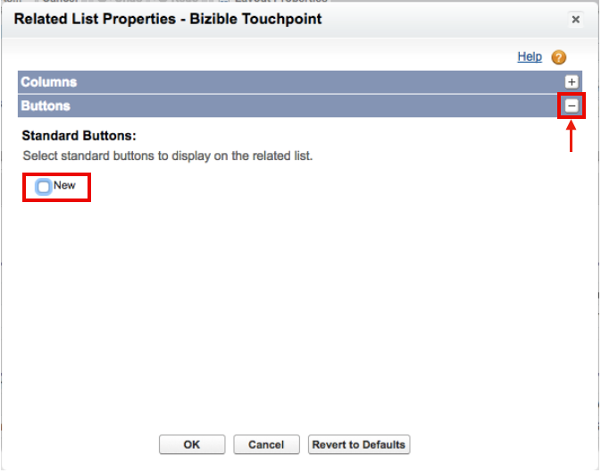

# Seitenlayoutanleitungen {#page-layout-instructions}

>[!NOTE]
>
>Es werden möglicherweise Anweisungen mit den folgenden Eigenschaften angezeigt:[!DNL Marketo Measure]&quot; in unserer Dokumentation, sehen aber immer noch &quot;Bizible&quot; in Ihrem CRM. Wir arbeiten daran, diese Aktualisierung durchzuführen, und das Rebranding wird sich in Kürze in Ihrem CRM widerspiegeln.

Einfache Anzeige [!DNL Marketo Measure] -Daten verwenden, wird empfohlen, die Seitenlayouts für die [!UICONTROL Konto], [!UICONTROL Kontakt], [!UICONTROL Lead], [!UICONTROL Chancen], und [!UICONTROL Kampagne] Objekte. Die Anweisungen werden für jedes Objektseitenlayout unten aufgeschlüsselt.

Navigieren Sie zunächst zu Ihrer [!DNL Salesforce] Einstellungen einrichten und die [!UICONTROL Anpassen] Registerkarte.

## Kampagnenobjekt {#campaign-object}

Wir empfehlen, [!DNL Marketo Measure] Felder zu Ihrer SFDC-Kampagne hinzu, nur für Ihre Sandbox. Die Felder können zum Testen der Touchpoint-Generierung verwendet werden. In der Produktion wird empfohlen, nur die [!DNL Marketo Measure] Schaltfläche &quot;Touchpoint-Datum-Massenaktualisierung&quot; Es wird nicht empfohlen, die [!DNL Marketo Measure] -Felder in die Produktion hinein, da Sie Regeln zur Kampagnensynchronisierung erstellen können.

1. Wählen Sie in der Build-Option **[!UICONTROL Kampagnen]**.

1. Klicks **[!UICONTROL Seitenlayouts]**.

   

1. Klicks **[!UICONTROL Bearbeiten]** neben dem Seitenlayout, das Sie aktualisieren möchten.

   

1. Innerhalb der [!UICONTROL fields] auswählen, wählen Sie die **[!UICONTROL Käufer-Touchpoints aktivieren]** und ziehen Sie sie an die gewünschte Stelle auf der Seite. Fügen Sie als Nächstes die **[!UICONTROL Startdatum des Touchpoints]** und **[!UICONTROL Enddatum des Touchpoints]** -Felder.

   

1. Klicken Sie dann oben auf der Seite auf das Symbol[!UICONTROL Schaltflächen]&quot; im Schnellsuche-Menü.

1. Ziehen Sie die **[!UICONTROL Touchpoint-Datum für Massenaktualisierung]** zu Ihrem Abschnitt mit den benutzerdefinierten Schaltflächen.

   

1. Klicks **[!UICONTROL Speichern]**.

   >[!NOTE]
   >
   >Wenn Sie mehrere Campaign-Datensatztypen verwenden, werden die Picklist-Werte für die **[!UICONTROL Käufer-Touchpoints aktivieren]** -Feld aktualisiert werden. Referenz [diesem Artikel](/help/channel-tracking-and-setup/offline-channels/configurations-for-multiple-campaign-record-types.md) für Anweisungen.

## Leads {#leads}

1. Wählen Sie in der Build-Option **[!UICONTROL Leads]**.

1. Klicks **[!UICONTROL Seitenlayouts]**.

1. Klicks **[!UICONTROL Bearbeiten]** neben dem Seitenlayout, das Sie aktualisieren möchten. Beachten Sie, dass mehrere Seitenlayouts die Touchpoints des Käufers enthalten können.

1. Klicken Sie links in Ihrem Schnellsuche-Menü auf die Option VisualForce-Seite .

1. Erstellen Sie einen neuen Abschnitt und nennen Sie ihn &quot;Käufer-Touchpoints&quot;.

   >[!NOTE]
   >
   >Wählen Sie für jeden dieser Abschnitte das Format &quot;eine Spalte&quot; aus.

1. Ziehen Sie die **[!UICONTROL Marketo Measure Lead-bezogene Liste]** VisualForce-Seite in den Abschnitt mit dem Seitenlayout einfügen.

   

1. Klicken Sie auf das Schraubenschlüssel im [!DNL VisualForce] und ändern Sie die Höhe in 100 und aktivieren Sie Bildlaufleisten.

1. Wählen Sie im Menü die Option [!UICONTROL Leinwandanwendungen] und erstellen Sie einen neuen Abschnitt mit dem Namen &quot;Marketo Measure Insights&quot;unter den Touchpoints. [!DNL VisualForce] -Abschnitt, den Sie gerade erstellt haben.

   >[!NOTE]
   >
   >Wählen Sie für jeden dieser Abschnitte das Format &quot;eine Spalte&quot; aus.

1. Ziehen Sie die [!DNL Marketo Measure Insights] Arbeitsfläche der App in den neu erstellten Abschnitt. Klicks **Speichern**. Manchmal ist es erforderlich, das Seitenlayout zuerst zu speichern, bevor es in der Canvas-App abgelegt wird, da Salesforce es nicht sofort erkennt. Nachdem Sie den neuen Abschnitt erstellt haben, speichern Sie das Seitenlayout und bearbeiten Sie es dann erneut, um die Leinwand-App in diesen Abschnitt zu ziehen. Dies gilt für jedes Objekt.

   >[!NOTE]
   >
   >Für [!DNL Marketo Measure Insights] Die Canvas-App funktioniert ordnungsgemäß. [-Berechtigungen müssen ordnungsgemäß konfiguriert werden](/help/configuration-and-setup/marketo-measure-insights-canvas-app/marketo-measure-insights-configuration.md).

   >[!TIP]
   >
   >Die meisten Kunden verwenden keine Felder, die mit (FT) oder (LC) enden, da es sich um veraltete Felder von vor dem [!DNL Marketo Measure] Touchpoint existierte als Objekt.

Wenn Sie die [!DNL Marketo Measure] ABM-Funktion [Bitte klicken Sie hier , um weitere Anweisungen zum Seitenlayout zu erhalten](/help/advanced-marketo-measure-features/account-based-marketing/account-based-marketing-overview.md).

## Kontakte {#contacts}

1. Wählen Sie in der Build-Option **[!UICONTROL Kontakte]**.

1. Klicks **[!UICONTROL Seitenlayouts]**.

1. Wählen Sie das Seitenlayout aus, das Sie bearbeiten möchten.

   Gehen Sie zur Option Zugehörige Listen im Schnellsuche-Menü und fügen Sie die **[!UICONTROL Touchpoints des Käufers]** zugehörige Liste.

1. Klicken Sie auf das Schraubenschlüsselsymbol und fügen Sie die folgenden Spalten in dieser Reihenfolge hinzu:

   * Käufer Touchpoint
   * Marketing-Kanal
   * Touchpoint Quelle
   * Name der Ad-Kampagne
   * Touchpoint-Position
   * Touchpoint-Datum

1. Sortieren nach: Touchpoint-Datum, aufsteigend.

   

1. Erweitern Sie die Option Schaltflächen und deaktivieren Sie die Option **[!UICONTROL Neu]**.

   

1. Gehen Sie zurück zu [!UICONTROL Verwandte Liste] im Menü und fügen Sie nun die **[!UICONTROL Touchpoint der Käuferzuordnung]** zugehörige Liste.

1. Klicken Sie auf das Schraubenschlüsselsymbol und fügen Sie die folgenden Spalten in dieser Reihenfolge hinzu:

   * Attributions-Touchpoint
   * Marketing-Kanal
   * Opportunity
   * Name der Ad-Kampagne
   * Touchpoint-Typ
   * Touchpoint-Position
   * Attribution % W-förmig (_oder dem stabilsten Attributionsmodell wie Vollständiger Pfad oder Benutzerdefiniert_)
   * Umsatz W-förmig (_oder dem stabilsten Attributionsmodell wie Vollständiger Pfad oder Benutzerdefiniert_)
   * Touchpoint-Datum

1. Nach Touchpoint sortieren [!UICONTROL Datum] > [!UICONTROL Aufsteigend].

1. Erweitern Sie den Abschnitt Schaltflächen und deaktivieren Sie die Option **[!UICONTROL Neu]**.

1. Klicks **[!UICONTROL Speichern]**.

## Gelegenheiten {#opportunities}

1. Wählen Sie in der Build-Option **[!UICONTROL Chancen]**.

1. Klicks **[!UICONTROL Seitenlayouts]**.

1. Wählen Sie das Seitenlayout aus, das Sie bearbeiten möchten.

1. Fügen Sie die **[!UICONTROL Touchpoint der Käuferzuordnung]** Verwandte Liste und klicken Sie auf den Schraubenschlüssel, um die folgenden Spalten für Möglichkeiten hinzuzufügen:

   * Attributions-Touchpoint
   * Marketing-Kanal
   * Kontakt
   * Name der Ad-Kampagne
   * Touchpoint-Typ
   * Touchpoint-Position
   * Attribution % W-förmig (_oder dem stabilsten Attributionsmodell wie Vollständiger Pfad oder Benutzerdefiniert_)
   * Umsatz W-förmig (_oder dem stabilsten Attributionsmodell wie Vollständiger Pfad oder Benutzerdefiniert_)
   * Touchpoint-Datum

1. Sortieren nach [!UICONTROL Touchpoint-Datum] > [!UICONTROL Aufsteigend].

1. Auswahl deaktivieren **[!UICONTROL Neu]** innerhalb der [!UICONTROL Schaltflächen] Abschnitt.

1. Klicks **[!UICONTROL Speichern]**.

## Konten {#accounts}

1. Wählen Sie in der Build-Option **[!UICONTROL Konten]**.

1. Klicks **[!UICONTROL Seitenlayouts]**.

1. Wählen Sie das Seitenlayout aus, das Sie bearbeiten möchten.

1. Fügen Sie die **[!UICONTROL Touchpoint der Käuferzuordnung]** &quot;Related List&quot;und klicken Sie auf den Schraubenschlüssel, um die folgenden Spalten hinzuzufügen:

   * Attributions-Touchpoint
   * Marketing-Kanal
   * Opportunity
   * Name der Ad-Kampagne
   * Touchpoint-Typ
   * Touchpoint-Position
   * Attribution % W-förmig (_oder dem stabilsten Attributionsmodell wie Vollständiger Pfad oder Benutzerdefiniert_)
   * Umsatz W-förmig (_oder dem stabilsten Attributionsmodell wie Vollständiger Pfad oder Benutzerdefiniert_)
   * Touchpoint-Datum

1. Nach Touchpoint-Datum sortieren > Aufsteigend.

1. Auswahl deaktivieren **[!UICONTROL Neu]** innerhalb der [!UICONTROL Schaltflächen] Abschnitt.

1. Klicks **[!UICONTROL Speichern]**.

Wenn Sie die [!DNL Marketo Measure] ABM-Funktion  [Bitte klicken Sie hier , um weitere Anweisungen zum Seitenlayout zu erhalten](/help/advanced-marketo-measure-features/account-based-marketing/account-based-marketing-overview.md).
