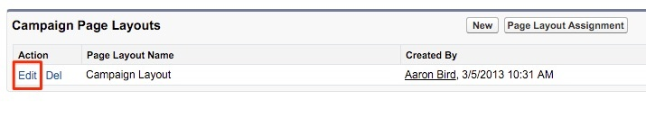
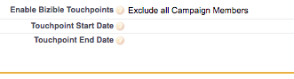

# Anweisungen zum Seiten-Layout {#page-layout-instructions}

>[!NOTE]
>
>Es werden möglicherweise Anweisungen mit den folgenden Eigenschaften angezeigt:[!DNL Marketo Measure]&quot; in der Dokumentation, sehen aber trotzdem &quot;Bizible&quot;in Ihrem CRM. Wir arbeiten an dieser Aktualisierung, und das Rebranding wird bald in Ihrem CRM zu sehen sein.

Zur einfachen Anzeige von [!DNL Marketo Measure]-Daten empfehlen wir, die Seiten-Layouts für [!UICONTROL Konto-], [!UICONTROL Kontakt-], [!UICONTROL Lead-], [!UICONTROL Gelegenheits-] und [!UICONTROL Kampagnen-]Objekte zu aktualisieren. Unten sind die Anweisungen zum Seiten-Layout für jedes Objekt aufgeschlüsselt.

Navigieren Sie zunächst zu Ihren [!DNL Salesforce]-Einstellungen und öffnen Sie die Registerkarte [!UICONTROL Anpassen].

## Kampagnenobjekt {#campaign-object}

Es wird empfohlen, die [!DNL Marketo Measure] Felder zu Ihrer SFDC-Kampagne hinzu, nur für Ihre Sandbox. Mit diesem Feldern können Sie die Touchpoint-Generierung testen. In der Produktion wird empfohlen, nur die [!DNL Marketo Measure] Schaltfläche &quot;Touchpoint-Datum-Massenaktualisierung&quot; Das Hinzufügen der [!DNL Marketo Measure] -Felder in die Produktionsumgebung übertragen, da Sie eine Kampagnensynchronisierungsregel erstellen können.

1. Wählen Sie innerhalb der Build-Option **[!UICONTROL Kampagnen]**.

1. Klicken Sie auf **[!UICONTROL Seiten-Layouts]**.

   

1. Klicks **[!UICONTROL Bearbeiten]** neben dem Seitenlayout, das Sie aktualisieren möchten.

   

1. Wählen Sie unter der Option [!UICONTROL Felder] das Feld **[!UICONTROL Buyer Touchpoints aktivieren]** und ziehen Sie es an die gewünschten Stelle auf der Seite. Fügen Sie als Nächstes die Felder **[!UICONTROL Startdatum des Touchpoints]** und **[!UICONTROL Enddatum des Touchpoints]** hinzu.

   

1. Klicken Sie dann oben auf der Seite auf die Option „[!UICONTROL Schaltflächen]“ im Schnellsuche-Menü.

1. Ziehen Sie die Schaltfläche **[!UICONTROL Massenaktualisierung Touchpoint-Datum]** in den Abschnitt mit den benutzerdefinierten Schaltflächen.

   

1. Klicken Sie auf **[!UICONTROL Speichern]**.

   >[!NOTE]
   >
   >Wenn Sie mehrere Campaign-Datensatztypen verwenden, müssen Sie die Picklist-Werte für die **[!UICONTROL Käufer-Touchpoints aktivieren]** -Feld. Siehe Abschnitt [diesem Artikel](/help/channel-tracking-and-setup/offline-channels/configurations-for-multiple-campaign-record-types.md) für Anweisungen.

## Leads {#leads}

1. Wählen Sie in Ihrer Build-Option **[!UICONTROL Leads]**.

1. Klicken Sie auf **[!UICONTROL Seiten-Layouts]**.

1. Klicks **[!UICONTROL Bearbeiten]** neben dem Seitenlayout, das Sie aktualisieren möchten. Beachten Sie, dass es mehrere Seiten-Layouts mit den Buyer Touchpoint-Abschnitten geben kann.

1. Klicken Sie in Ihrem Schnellsuche-Menü links auf die Option VisualForce-Seite .

1. Erstellen Sie einen Abschnitt und nennen Sie ihn &quot;Käufer-Touchpoints&quot;.

   >[!NOTE]
   >
   >Wählen Sie für jeden dieser Abschnitte das Format „Einspaltig“ aus.

1. Ziehen Sie die VisualForce-Seite aus der **[!UICONTROL Marketo Measure-Lead-bezogene Liste]** in den Abschnitt mit dem Seiten-Layout.

   

1. Klicken Sie auf den Schraubenschlüssel im [!DNL VisualForce] und ändern Sie die Höhe in 100 und aktivieren Sie Bildlaufleisten.

1. Wählen Sie im Menü die Option [!UICONTROL Leinwandanwendungen] und erstellen Sie einen Abschnitt namens &quot;Marketo Measure Insights&quot;unter den Touchpoints. [!DNL VisualForce] erstellen.

   >[!NOTE]
   >
   >Wählen Sie für jeden dieser Abschnitte das Format „Einspaltig“ aus.

1. Ziehen Sie die [!DNL Marketo Measure Insights]-Arbeitsflächenanwendung in den neu erstellten Abschnitt. Klicken Sie auf **Speichern**. Manchmal ist es erforderlich, das Seiten-Layout zuerst in der Arbeitsflächenanwendung zu speichern, bevor sie abgelegt wird, da Salesforce es nicht sofort erkennt. Nachdem Sie den Abschnitt erstellt haben, speichern Sie das Seitenlayout und bearbeiten Sie es dann erneut, um die Leinwand-App in diesen Abschnitt zu ziehen. Dies gilt für jedes Objekt.

   >[!NOTE]
   >
   >Für [!DNL Marketo Measure Insights] Die Canvas-App funktioniert ordnungsgemäß. [-Berechtigungen müssen ordnungsgemäß konfiguriert sein](/help/configuration-and-setup/marketo-measure-insights-canvas-app/marketo-measure-insights-configuration.md).

   >[!TIP]
   >
   >Die meisten Kundinnen und Kunden verwenden keine Felder, die mit (FT) oder (LC) enden, da es sich um veraltete Felder handelt, die genutzt wurden, bevor der [!DNL Marketo Measure]-Touchpoint zu einem Objekt wurde.

Wenn Sie die [!DNL Marketo Measure] ABM-Funktion [Klicken Sie hier für weitere Anweisungen zum Seitenlayout](/help/advanced-marketo-measure-features/account-based-marketing/account-based-marketing-overview.md).

## Kontakte {#contacts}

1. Wählen Sie in der Build-Option **[!UICONTROL Kontakte]**.

1. Klicken Sie auf **[!UICONTROL Seiten-Layouts]**.

1. Wählen Sie das Seitenlayout aus, das Sie bearbeiten möchten.

   Gehen Sie zur Option „Zugehörige Listen“ im Schnellsuchmenü und fügen Sie die zugehörige Liste **[!UICONTROL Buyer Touchpoints]** hinzu.

1. Klicken Sie auf das Schraubenschlüsselsymbol und fügen Sie folgenden Spalten in dieser Reihenfolge hinzu:

   * Buyer Touchpoint
   * Marketing-Kanal
   * Touchpoint-Quelle
   * Name der Anzeigenkampagne
   * Touchpoint-Position
   * Touchpoint-Datum

1. Sortieren nach: Touchpoint-Datum, aufsteigend.

   

1. Erweitern Sie die Option „Schaltflächen“ und deaktivieren Sie **[!UICONTROL Neu]**.

   

1. Gehen Sie zurück zur Option [!UICONTROL Zugehörige Liste] im Menü und fügen Sie die zum **[!UICONTROL Buyer Attribution Touchpoint]** zugehörige Liste hinzu.

1. Klicken Sie auf das Schraubenschlüsselsymbol und fügen Sie folgenden Spalten in dieser Reihenfolge hinzu:

   * Attribution Touchpoint
   * Marketing-Kanal
   * Opportunity
   * Name der Anzeigenkampagne
   * Touchpoint-Typ
   * Touchpoint-Position
   * Attribution % W-förmig (_oder das stabilste Attributionsmodell wie „Vollständiger Pfad“ oder „Benutzerdefiniert“_)
   * Umsatz W-förmig (_oder das stabilste Attributionsmodell wie „Vollständiger Pfad“ oder „Benutzerdefiniert“_)
   * Touchpoint-Datum

1. Sortieren Sie die Touchpoints nach [!UICONTROL Datum] > [!UICONTROL Aufsteigend].

1. Erweitern Sie den Abschnitt „Schaltflächen“ und deaktivieren Sie **[!UICONTROL Neu]**.

1. Klicken Sie auf **[!UICONTROL Speichern]**.

## Opportunitys {#opportunities}

1. Wählen Sie in der Build-Option **[!UICONTROL Opportunitys]**.

1. Klicken Sie auf **[!UICONTROL Seiten-Layouts]**.

1. Wählen Sie das Seitenlayout aus, das Sie bearbeiten möchten.

1. Fügen Sie die zum **[!UICONTROL Buyer Attribution Touchpoint]** zugehörige Liste hinzu und klicken Sie auf das Schraubenschlüsselsymbol, um die folgenden Spalten für Opportunitys hinzuzufügen:

   * Attribution Touchpoint
   * Marketing-Kanal
   * Kontakt
   * Name der Anzeigenkampagne
   * Touchpoint-Typ
   * Touchpoint-Position
   * Attribution % W-förmig (_oder das stabilste Attributionsmodell wie „Vollständiger Pfad“ oder „Benutzerdefiniert“_)
   * Umsatz W-förmig (_oder das stabilste Attributionsmodell wie „Vollständiger Pfad“ oder „Benutzerdefiniert“_)
   * Touchpoint-Datum

1. Sortieren Sie nach [!UICONTROL Touchpoint-Datum] > [!UICONTROL Aufsteigend].

1. Deaktivieren Sie die Option **[!UICONTROL Neu]** im Abschnitt [!UICONTROL Schaltflächen].

1. Klicken Sie auf **[!UICONTROL Speichern]**.

## Konten {#accounts}

1. Wählen Sie in der Build-Option **[!UICONTROL Konten]**.

1. Klicken Sie auf **[!UICONTROL Seiten-Layouts]**.

1. Wählen Sie das Seitenlayout aus, das Sie bearbeiten möchten.

1. Fügen Sie die zum **[!UICONTROL Buyer Attribution Touchpoint]** zugehörige Liste hinzu und klicken Sie auf das Schraubenschlüsselsymbol, um folgende Spalten hinzuzufügen:

   * Attribution Touchpoint
   * Marketing-Kanal
   * Opportunity
   * Name der Anzeigenkampagne
   * Touchpoint-Typ
   * Touchpoint-Position
   * Attribution % W-förmig (_oder das stabilste Attributionsmodell wie „Vollständiger Pfad“ oder „Benutzerdefiniert“_)
   * Umsatz W-förmig (_oder das stabilste Attributionsmodell wie „Vollständiger Pfad“ oder „Benutzerdefiniert“_)
   * Touchpoint-Datum

1. Sortieren Sie nach „Touchpoint-Datum“ > „Aufsteigend“.

1. Deaktivieren Sie die Option **[!UICONTROL Neu]** im Abschnitt [!UICONTROL Schaltflächen].

1. Klicken Sie auf **[!UICONTROL Speichern]**.

Wenn Sie die [!DNL Marketo Measure] ABM-Funktion, überprüfen Sie die [zusätzliche Anweisungen zum Seitenlayout](/help/advanced-marketo-measure-features/account-based-marketing/account-based-marketing-overview.md).
