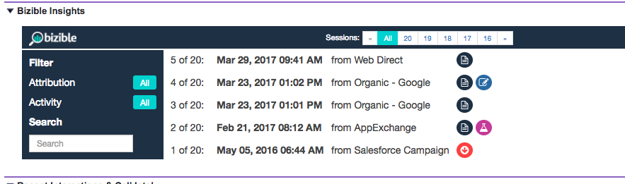
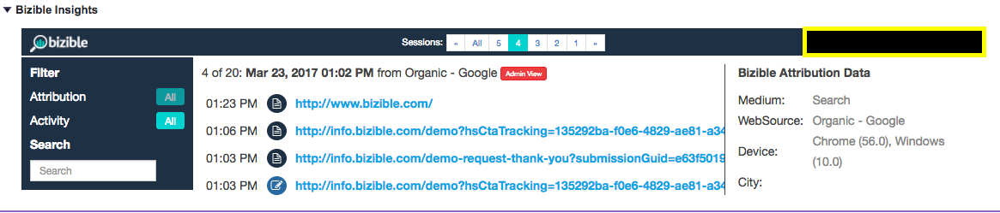

# Erläuterung von [!DNL Marketo Measure]-Insights {#marketo-measure-insights-explained}

Informationen zum [!DNL Marketo Measure] Insights-Ansicht in [!DNL Salesforce], einschließlich der Darstellung der verschiedenen Symbole und der Verwendung der Funktion. Diese Funktion ist besonders hilfreich, wenn Sie die ersten 20 Sitzungen eines Leads, Kontakts oder Kontos sehen möchten.

Sobald jemand von der [!DNL Marketo Measure] Javascript und füllt ein Formular auf Ihrer Website aus, wird die Person Lead in Ihrem System werden und wir werden ihre digitalen Marketing-Daten an Ihre Salesforce (SFDC)-Organisation übertragen. In diesem Fall werden die Touchpoint-Daten im [!DNL Marketo Measure] Lead Insights-Bereich (eine Canvas-App) auf den Lead-/Kontakt-/Opportunity-/Kontoobjekten.

Zunächst sehen Sie im mittleren Teil Ihrer Einblicke die Anzahl der Sitzungen, die die Person auf Ihrer Website hatte. Sie können durch diese Sitzungen blättern und beliebig navigieren.

Sie können sich die Zusammenfassung aller Sitzungen ansehen, wenn Sie im mittleren oberen Teil Ihrer Einblicke auf &quot;Alle&quot;klicken. Dort werden Sie die Daten der einzelnen Sitzungen, den Kanal oder die Quelle, von denen diese geleitet wurden, und eine Reihe von Symbolen verstehen, die weitere Informationen angeben.

Das erste, was Sie sehen werden, sind die FT- oder LC-Symbole. Diese stellen die Touchpoint-Position Ihrer aufgelisteten Sitzungen dar. Insbesondere steht FT für First Touch und LC für Lead Creation. Sie können mehrere Sitzungen haben, aber nur ein Touchpoint kann FT oder LC sein. Sie werden nie mehrere FTs oder LCs finden, die mit einer Person verbunden sind.

Die Symbole, die wie Papier aussehen, zeigen an, dass eine Seitenansicht innerhalb der Sitzung stattgefunden hat. Wahrscheinlich enthält jede Sitzung dieses Symbol.

Das Symbol, das wie ein Beaker aussieht, signalisiert, dass ein A/B-Test-Experiment durchgeführt wurde. An dieser Stelle integrieren wir mit Optimizely und VWO. Mit dieser Integration können wir das Experiment und die Variante, die der Benutzer auf seiner spezifischen Sitzung gesehen hat, vorantreiben.

Wenn Sie auf eine bestimmte Sitzung klicken (dazu können Sie auf das tatsächliche Datum der Sitzung oder im oberen mittleren Teil der gruppierten Sitzungen klicken), können Sie die Sitzungsdetails anzeigen. In jeder Sitzung können Sie alle spezifischen Seiten sehen, die der Benutzer gesehen hat, geordnet nach Datum und Uhrzeit.

Auf der rechten Seite jeder Sitzung können Sie mehr der detaillierten Marketing-Daten sehen, die wir auf die [!DNL Marketo Measure] -Felder in Ihrem SFDC. In diesem Beispiel sehen Sie Anzeigengruppe, Anzeigeninhalt, Kampagne, Suchbegriff und Medium. Sie können auch nach unten scrollen, um weitere Informationen zu erhalten. [!DNL Marketo Measure] Daten, die wir bereitstellen.

Sobald jemand über eine Vielzahl von Sitzungen verfügt, können Sie einige Filter in [!UICONTROL Insights] , um nach bestimmten Teilen ihrer Interaktion auf Ihrer Site zu suchen. Sie können nach [!UICONTROL Touchpoint-Position] zum Beispiel.

Sie können auch nach Seitenansichten, AB-Tests oder Forms suchen.
