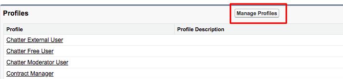

# Konfiguration von [!DNL Marketo Measure]-Insights {#marketo-measure-insights-configuration}

Die [!DNL Marketo Measure] Insights Canvas-App sollte zum Lead-Seiten-Layout hinzugefügt werden, erfordert jedoch eine zusätzliche Einrichtung im Abschnitt „Verbundene Apps“ Ihrer [!DNL Salesforce]. Befolgen Sie diese Anweisungen, um sicherzustellen, dass die Canvas-App über die entsprechenden Berechtigungen verfügt.

1. Navigieren Sie zu [!DNL Salesforce] Setup und klicken Sie auf **[!UICONTROL Verbundene Apps]** auf der Registerkarte [!UICONTROL Apps verwalten].

1. Wählen Sie die [!DNL Marketo Measure Insights] aus der Liste aus, die mit Werten gefüllt wird.

1. Ändern Sie im Abschnitt [!UICONTROL OAuth]-Richtlinien die Einstellung Zulässige Benutzer in „Admin-genehmigte Benutzer sind vorautorisiert“. Ein Popup wird angezeigt, klicken Sie auf **[!UICONTROL OK]** und dann auf **[!UICONTROL Speichern]**.

   

1. Nachdem die Seite gespeichert wurde, können Sie auf die Schaltfläche **[!UICONTROL Profile verwalten]** klicken.

   

1. Wählen Sie alle Profile aus, die Zugriff auf [!DNL Marketo Measure] Insights haben sollen, und klicken Sie auf **[!UICONTROL Speichern]**.
