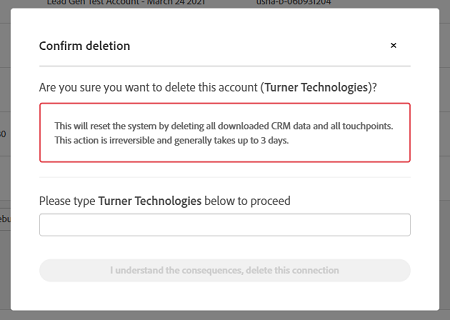

# Migration der Salesforce-Sandbox zur Produktion {#salesforce-sandbox-to-production-migration}

Wenn Sie sich dafür entschieden haben, [!DNL Marketo Measure] in einer [!DNL Salesforce] Sandbox-Umgebung zu testen, folgen Sie diesen Anweisungen, um zur Produktion zu migrieren, sobald Sie bereit sind. Bei den folgenden Anweisungen wird davon ausgegangen, dass Sie das Paket [!DNL Marketo Measure] bereits in Ihre Sandbox-Organisation heruntergeladen, die erforderlichen Tests durchgeführt haben und bereit sind, [!DNL Marketo Measure] in die Produktion zu übertragen.

## Schritt 1: Installieren des [!DNL Marketo Measure]-Pakets auf Ihrer [!DNL Salesforce]-Produktionsinstanz

* Installieren Sie das Paket [!DNL Marketo Measure] in der Produktion mit der Einstellung „[!UICONTROL Alle Benutzer]“.

   * [Basispaket](https://appexchange.salesforce.com/appxListingDetail?listingId=a0N3000000B3KLuEAN){target="_blank"}

* Weitere Informationen über die Beziehung von [!DNL Marketo Measure] zu [!DNL Salesforce] finden Sie in [diesem Artikel](/help/configuration-and-setup/marketo-measure-and-salesforce/how-marketo-measure-and-salesforce-interact.md)
* Ein wenig [!DNL Salesforce]-Konfiguration ist notwendig. Die spezifischen Maßnahmen sind in [Schritt 4 im Folgenden beschrieben](#salesforce-configuration)

## Schritt 2: Löschen der aktuellen Sandbox-CRM-Verbindung in der [!DNL Marketo Measure]-App {#delete-the-current-sandbox-crm-connection-in-marketo-measure-app}

* Melden Sie sich bei der [!DNL Marketo Measure]-Anwendung unter experience.adobe.com/marketo-measure an.
* Navigieren Sie zu „Mein Konto“ >[!UICONTROL Einstellungen] >[!UICONTROL Verbindungen]
* Klicken Sie auf das Papierkorbsymbol neben Ihrer SFDC-Verbindung, um sie zu löschen.
* Sie werden aufgefordert, den Löschvorgang zu bestätigen. Achten Sie darauf, den Prompt sorgfältig zu lesen und die Folgen der Löschung zu verstehen.

  

   * Geben Sie den Namen des Unternehmens ein, wie im Bestätigungsmodell angezeigt, und klicken Sie auf „Ich verstehe die Konsequenzen, Verbindung jetzt löschen“.
* Dadurch wird der Löschvorgang ausgelöst. Es dauert einige Zeit, bis er abgeschlossen ist.

## Schritt 3: Verbinden der Produktions-CRM-Instanz in der [!DNL Marketo Measure]-App {#connect-the-production-crm-instance-in-marketo-measure-app}

* Melden Sie sich bei der [!DNL Marketo Measure]-Anwendung unter experience.adobe.com/marketo-measure an.
* Navigieren Sie zu [!UICONTROL Mein Konto] >[!UICONTROL Einstellungen] > [!UICONTROL Verbindungen]
* Sobald die Löschung der Sandbox-Verbindung erfolgreich durchgeführt wurde, verschwindet die Verbindung von der Seite. Andernfalls bleibt die Verbindung mit dem Status „Löschung in Bearbeitung“ bestehen.
* Klicken Sie auf „[!UICONTROL Neue CRM-Verbindung einrichten]“.
* Klicken Sie im modalen Dialog „[!UICONTROL CRM-Verbindung auswählen]“ auf die Aktion „[!UICONTROL Verbinden]“ neben der [!DNL Salesforce]-Plattform und wählen Sie die Option „[!UICONTROL Produktion]“.
* Sie werden zur Eingabe Ihrer Anmeldedaten aufgefordert. Geben Sie die Anmeldedaten für die Produktion ein.

## Schritt 4: Salesforce-Konfiguration {#salesforce-configuration}

[Seiten-Layouts](/help/configuration-and-setup/marketo-measure-and-salesforce/page-layout-instructions.md)

[Berechtigungssätze](/help/configuration-and-setup/marketo-measure-and-salesforce/marketo-measure-permission-sets.md)

[Freigeben von Berichten](https://help.salesforce.com/s/articleView?language=de_DE&id=analytics_share_folder.htm&type=0){target="_blank"}

[Ausblenden unnötiger Berichtstypen](/help/configuration-and-setup/marketo-measure-and-salesforce/hiding-unnecessary-report-types.md)

[Benutzerdefinierter Workflow, falls anwendbar](/help/advanced-marketo-measure-features/custom-revenue-amount/using-a-custom-revenue-amount-field.md)
