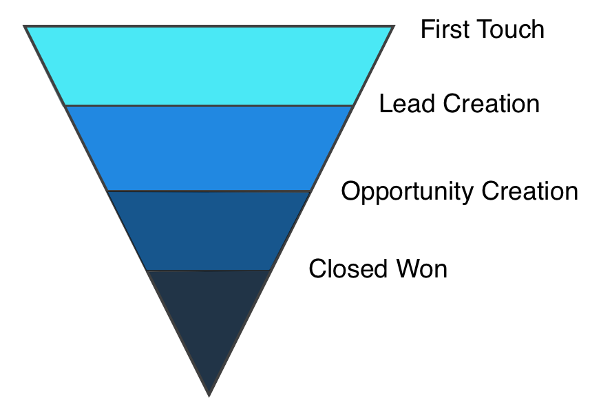

# Marketing-Zuordnung {#marketing-attribution}

## Willkommen bei Marketo Measure {#welcome-to-marketo-measure}

Marketo Measure gibt Marketing-Experten einen Einblick, welche Marketing-Maßnahmen am effektivsten zur Umsatzsteigerung für ihre Firma beitragen. Marketo Measure ist eine Marketing-Attributionslösung, die die Kanalleistung automatisch verfolgt und in Berichten aufzeigt, welche Kanäle die Kundeninteraktion am meisten fördern und Ihnen die Möglichkeit gibt, Ihre Marketing-Ausgaben entsprechend zu optimieren.

## Marketing-Zuordnung {#marketing-attribution-1}

**Marketing-Attribution** ist der Prozess der Zuweisung von Umsatzgutschriften an einen Marketing-Touchpoint. Dies geschieht, indem die gesamte Customer Journey der potenziellen Kundschaft verfolgt wird, angefangen bei der ersten Interaktion mit Ihrem Unternehmen bis zum Abschluss des Deals. Der durch das Geschäft generierte Umsatz wird den Marketing-Touchpoints zugeordnet, die den Verkauf angetrieben haben. Die Höhe des einem Touchpoint gewährten Umsatz-Credits hängt davon ab, inwieweit dieser Touchpoint die Kaufentscheidung der Kundschaft beeinflusst hat.

**Touchpoints** beziehen sich auf die Interaktionen, die eine interessierte Person/ein Lead mit Ihren Online- oder Offline-Marketing-Maßnahmen hat. Es gibt vier **wichtige Touchpoints**, die bei der Marketing-Attribution berücksichtigt werden. Sie spiegeln die verschiedenen Phasen in der Journey einer Kundin oder eines Kunden wider. Diese wichtigen Touchpoints, auch als **Meilenstein-Touchpoints** bezeichnet, sind: First Touch (FT), Lead Creation (LC), Opportunity Creation (OC), Closed Won Deal (CW).

Diese Meilensteinbkontakte bilden die Grundlage für die **Attributionsmodelle** von Marketo Measure. Marketo Measure bietet sechs Attributionsmodelle. Jedes Modell konzentriert sich auf verschiedene Phasen der Journey und bietet eine allgemeine Struktur für die Zuweisung von Umsatzguthaben zu Ihren Marketing-Touchpoints. Welches Modell Sie verwenden, hängt davon ab, welche Phasen der Journey Sie vor allem messen möchten und wie viele Daten Sie auswerten möchten. Die von Marketo Measure angebotenen Attributionsmodelle sind:

* First Touch
* Leaderstellung
* U-förmig
* W-förmig
* Vollständiger Pfad
* Benutzerdefiniertes Modell

>[!NOTE]
>
>[Weitere Informationen zu den einzelnen Attributionsmodellen](/help/introduction-to-marketo-measure/overview-resources/marketo-measure-attribution-models.md).

## Warum Attribution wichtig ist {#why-attribution-is-important}

Marketing-Teams melden normalerweise Interaktionen, Aktivitäten und andere Softmetriken. Daher ist es für Marketing-Experten oft eine Herausforderung zu zeigen, wie viel Umsatz sie effektiv für die Organisation generiert haben. Die Marketing-Attribution löst dieses Problem, indem Marketing-Maßnahmen direkt an den Umsatz gebunden werden. Dadurch erhalten Marketing-Fachleute die harten Metriken, die sie benötigen, um:

* Zu bestimmen, welche Kampagnen und Kanäle eine gute Leistung erbringen und welche am rentabelsten sind.
* Marketing-Fonds den leistungsstärksten Kanälen zuzuweisen
* Zu Ermitteln, welche Marketing-Kanäle am meisten für die Konversion von Leads in Kunden verantwortlich sind.
* Prognosen zu Marketing-Zielen in Bezug auf den Umsatz

Darüber hinaus wird durch die Marketing-Attribution die fehlende Abstimmung zwischen Verkaufs- und Marketing-Teams behoben. Da Vertriebsteams über Umsatz und Pipeline berichten und Marketing-Teams hauptsächlich auf Softmetriken angewiesen sind, können Marketing-Experten nicht herausfinden, welche ihrer Bemühungen am einflussreichsten bei der Verkaufsförderung waren. Durch die Verknüpfung von Marketing-Maßnahmen mit Umsatz können beide Teams dieselbe Sprache sprechen, und Marketing-Fachleute können demonstrieren, wie ihre Bemühungen dazu beigetragen haben, Kunden zu werden.
