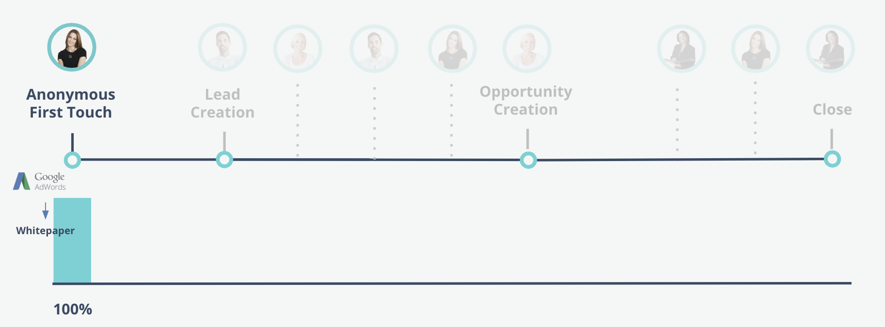

# Marketo Measure-Attributionsmodelle {#marketo-measure-attribution-models}

Marketo Measure bietet sechs Arten von Attributionsmodellen:

* First Touch
* Leaderstellung
* U-förmig
* W-förmig
* Vollständiger Pfad
* Benutzerdefiniertes Modell

Diese Modelle sind unterschiedlich komplex. Erstkontakt und Lead-Erstellung sind einfache Single-Touch-Modelle. Die restlichen vier sind komplexere Multi-Touch-Modelle. Die Struktur der Marketo Measure-Attributionsmodelle spiegelt die vier wichtigsten Touchpoints wider, die während der Customer Journey auftreten:

* First Touch (FT)
* Lead Creation (LC)
* Opportunity Creation (OC)
* Closed-Won-Deal (CW)

In den **Single-Touch-Modellen** werden die Attributions-Credits nur einem Meilenstein-Touchpoint zugeordnet, weswegen der Name „Single Touch“ lautet.
In den **Multi-Touch-Modellen** wird der Großteil der Attributionsgutschriften zwei oder mehr Meilenstein-Touchpoints zugewiesen. Das verbleibenden Guthaben wird Touchpoints zugeordnet, die zwischen den Meilensteinkontaktpunkten auftreten.

In den nächsten Abschnitten werden die einzelnen Attributionsmodelle und die Zuweisung von Attributions-Credits behandelt.

## Single-Touch-Modelle {#single-touch-models}

**Erstkontakt-Modell**

Das Erstkontakt-Modell konzentriert sich nur auf die allererste Interaktion, die ein Lead mit Ihrem Unternehmen hat. Dieses Modell ordnet 100 % der Attributions-Credits dem Zeitpunkt zu, an dem der Lead zum ersten Mal auf Ihre Firma aufmerksam wurde – der Erstkontakt (First Touch, FT).

Nehmen wir an, Kate kommt über eine Adwords-Anzeige zum ersten Mal auf `www.adobe.com` und sieht sich ein Whitepaper an. Der Adwords-Kanal würde 100 % des Attributionsguthabens von dieser Opportunity erhalten.

**Lead-Erstellungsmodell**

Das Lead-Erstellungsmodell ordnet dem LC-Touchpoint 100 % des Attributionsguthabens zu, wenn ein Interessent seine Kontaktinformationen angibt und zum Lead wird.

Wie im vorherigen Beispiel besucht Austin nach Kates erstem Besuch bei `www.adobe.com` über Adwords die Website über einen LinkedIn-Post. Austin füllt ein Formular aus und wird zum Lead. In diesem Modell würde Linkedin 100 % des Attributionsguthabens erhalten.

## Multi-Touch-Modelle {#multi-touch-models}

Multi-Touch-Modelle werden für längere, kompliziertere Verkaufszyklen verwendet. Diese Modelle sind besonders nützlich, wenn mehrere Personen eines Kontos/Unternehmens an der Journey der Käuferin oder des Käufers beteiligt sind.

**U-förmiges Modell**

Das U-förmige Modell konzentriert sich sowohl auf die FT- als auch auf LC-Touchpoints. In diesem Modell erhalten FT- und LC-Touchpoints jeweils 50 % der Umsatz-Credits.

Kates erster Besuch bei `www.adobe.com` über eine Adwords-Anzeige würde 50 % des Attributions-Credits erhalten. Die restlichen 50 % würden dem Linkedin-Beitrag zugeordnet, der Austin dazu brachte, ein Formular auszufüllen und zu einem Lead zu werden.

**W-förmiges Modell**

Drei der Meilenstein-Touchpoints sind im W-förmigen Modell enthalten. In diesem Modell werden den Touchpoints FT, LC und OC jeweils 30 % des Attributionskredits zugeordnet. Die verbleibenden 10 % werden proportional zu allen zwischengeschalteten Touchpoints zugeordnet, die zwischen den drei Meilenstein-Touchpoints auftreten.

Kate und Austin erwähnen Marketo Measure gegenüber ihrer Kollegin Hillary. Sie findet einen Inhalt durch eine Google-Suche und füllt ein Formular aus. Später erhält Austin eine E-Mail für eine Webinar-Registrierung und füllt das Registrierungsformular auf der Website aus. Kate unterhält sich mit Vertriebsmitarbeitenden über das Marketo Measure-Produkt.

Hillary erhält eine E-Mail mit einem Link zur Preisseite und besucht die Seite. Anschließend wird eine Opportunity für ihr Konto erstellt. Der Webbesuch von Hillary auf der Preisseite erhält die Gutschrift für die Opportunity-Erstellung, da es sich um die Marketing-Interaktion handelte, die am nächsten am Erstellungsdatum der Opportunity gelegen hat. Jedem Meilenstein-Touchpoint werden 30 % des Attributionsguthabens zugewiesen, und den Zwischen-Touchpoints werden die verbleibenden 10 % zugeordnet.

**Vollständiges Pfadmodell**

Das vollständige Pfadmodell umfasst alle vier Meilenstein-Touchpoints. FT, LC, OC und CW erhalten jeweils 22,5 % der Einnahmegutschrift, und die verbleibenden 10 % werden zu gleichen Teilen auf die zwischengeschalteten Kontakte verteilt.

Nach der Schaffung dieser Opportunity entscheiden sich Kate, Austin und Hillary, Marketo Measure ihrer CMO, Elizabeth, vorzustellen. Elizabeth nimmt an einer Konferenz teil, auf der Marketo Measure eine Veranstaltung veranstaltet. Kate sieht einen LinkedIn-Beitrag zu einer Fallstudie und füllt ein Formular aus, um den Inhalt herunterzuladen. Elizabeth nimmt an einem Verkaufsessen teil, das von Marketo Measure veranstaltet wird. Nach dem Abendessen entscheidet sie sich für den Kauf von Marketo Measure und wird Kunde. In diesem Szenario würden dem Verkaufsessen 22,5 % der Einnahmegutschrift aus dem geschlossenen Geschäft zugeordnet. Die Touchpoints FT, LC und OC erhalten ebenfalls jeweils 22,5 % des Kredits. Den zwischengeschalteten Touchpoints werden ebenfalls die verbleibenden 10 % der Einnahmegutschrift zugewiesen.

**Benutzerdefiniertes Attributionsmodell**

Marketo Measure bietet außerdem ein benutzerdefiniertes Attribution-Modell, mit dem Benutzer auswählen können, welche Touchpoints oder benutzerdefinierten Stufen in ihr Modell aufgenommen werden sollen. Darüber hinaus können Benutzende den Prozentsatz des diesen Touchpoints und Stufen zugewiesenen Attributions-Credits steuern. Wenn eine Opportunity keine dedizierten mittleren Touches aufweist, wird der Prozentsatz gleichmäßig auf andere Positionen verteilt.
