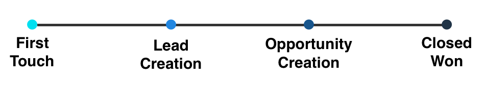
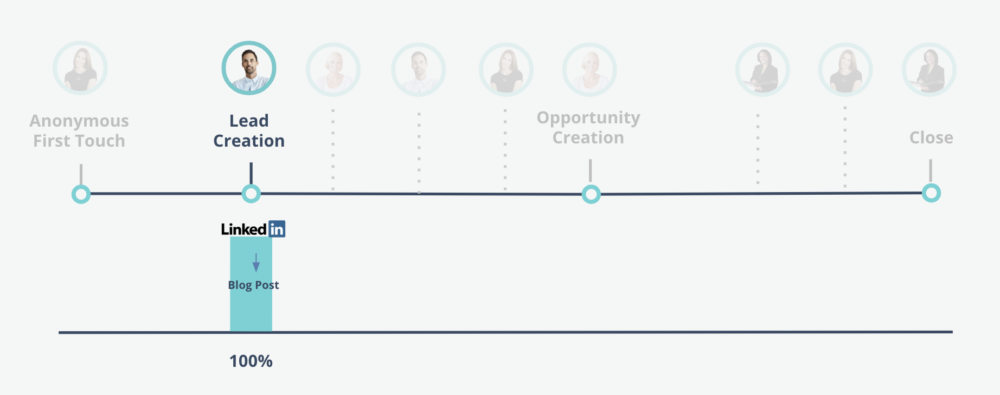

# Marketo-Attributionsmodelle messen {#marketo-measure-attribution-models}

Marketo Measurement bietet sechs Arten von Attributionsmodellen:

* First Touch
* Leaderstellung
* U-förmig
* W-förmig
* Vollständiger Pfad
* Benutzerdefiniertes Modell

Diese Modelle sind unterschiedlich komplex. First Touch und Lead Creation sind unsere einfachen Single Touch Modelle. Die restlichen vier sind unsere komplexeren Multitouch-Modelle. Die Struktur der Attributionsmodelle von Marketo Measurement spiegelt die vier wichtigsten Touchpoints wider, die auf der Journey des Kunden auftreten:

* First Touch (FT)
* Lead Creation (LC)
* Opportunity Creation (OC)
* Closed-Won-Deal (CW)

Im **Single-Touch-Modelle**, wird die Attribution nur einem Meilenstein-Touchpoint zugeordnet, sodass der Name &quot;Single Touch&quot;lautet.
Im **Multi-Touch-Modelle**, wird der Großteil des Attributionskredits zwei oder mehr Meilenstein-Touchpoints zugewiesen. Der verbleibende Kredit wird Touchpoints zugeordnet, die zwischen den Meilensteinkontaktpunkten auftreten.

In den nächsten Abschnitten werden die einzelnen Attributionsmodelle und die Zuweisung von Attributionsguthaben behandelt.

## Einzelkontaktmodelle {#single-touch-models}

**Erstkontakt-Modell**

Das First Touch-Modell konzentriert sich nur auf die allererste Interaktion, die ein Lead mit Ihrem Unternehmen hat. Dieses Modell ordnet 100 % des Attributionskredits dem ersten Mal zu, dass der Lead Ihr Unternehmen, den Erstkontakt (FT), in Kenntnis setzte.

Say Kate besucht www.adobe.com zum ersten Mal über eine Adwords-Anzeige und sieht sich ein Whitepaper an. Der Adwords -Kanal würde 100 % des Attributionsguthabens von dieser Gelegenheit erhalten.

**Lead-Erstellungsmodell**

Das Modell Lead-Erstellung ordnet dem LC-Touchpoint 100 % des Attributionsguts zu, wenn ein Interessent seine Kontaktinformationen bereitstellt und zum Lead wird.

Austin besucht nach Kates erstem Besuch auf www.adobe.com über Adwords die Website über einen LinkedIn-Beitrag. Austin füllt ein Formular aus und wird Lead. In diesem Modell würde Linkedin 100 % des Attributionskredits erhalten.

## Multi-Touch-Modelle {#multi-touch-models}

Multi-Touch-Modelle werden für längere, kompliziertere Verkaufszyklen verwendet. Diese Modelle sind besonders nützlich, wenn mehrere Personen eines Kontos/Unternehmens an der Journey des Käufers beteiligt sind.

**U-förmiges Modell**

Das U-förmige Modell konzentriert sich sowohl auf die FT- als auch auf LC-Touchpoints. In diesem Modell erhalten FT- und LC-Touchpoint jeweils 50 % des Umsatzkredits.

Kates erster Besuch bei www.adobe.com über eine AdWords-Website würde 50 % des Attributionskredits erhalten. Die restlichen 50 % würden dem Linkedin-Beitrag zugeordnet, der Austin dazu brachte, ein Formular auszufüllen und zu einem Lead zu werden.

**W-förmiges Modell**

Drei der Meilenstein-Touchpoints sind im W-förmigen Modell enthalten. In diesem Modell werden den Touchpoints FT, LC und OC jeweils 30 % des Attributionskredits zugeordnet. Die verbleibenden 10 % werden proportional zu allen zwischengeschalteten Touchpoints zugeordnet, die zwischen den drei Meilenstein-Touchpoints auftreten.

Kate und Austin erwähnen Marketo Measure ihrem Mitarbeiter, Hillary. Sie findet einen Inhalt durch eine Google-Suche und füllt ein Formular aus. Später erhält Austin eine E-Mail für eine Webinar-Registrierung und füllt das Registrierungsformular auf der Website aus. Kate führt mit einem Vertriebsmitarbeiter ein Gespräch über das Marketo Measure-Produkt.

Hillary erhält eine E-Mail mit einem Link zur Preisseite und besucht die Seite. Anschließend wird eine Chance für ihr Konto erstellt. Der Webbesuch von Hillary auf der Preisseite erhält die Gutschrift für die Opportunity-Erstellung, da es sich um die am nächsten gelegene Marketing-Interaktion zum Erstellungsdatum der Opportunity handelte. Jedem Meilenstein-Touchpoint werden 30 % des Attributionskredits zugewiesen, und den Zwischen-Touchpoints werden die verbleibenden 10 % zugeordnet.

**Vollständiges Pfadmodell**

Das vollständige Pfadmodell umfasst alle vier Meilensteinkontaktpunkte. FT, LC, OC und CW erhalten jeweils 22,5 % des Einnahmenkredits, und die verbleibenden 10 % werden zu gleichen Teilen auf die zwischengeschalteten Personen verteilt.

Nach der Schaffung dieser Möglichkeiten entscheiden sich Kate, Austin und Hillary, Marketo Measure ihrer CMO, Elizabeth, zu überlassen. Elizabeth nimmt an einer Konferenz teil, auf der Marketo Measure eine Veranstaltung veranstaltet. Kate sieht einen LinkedIn-Beitrag zu einer Fallstudie und füllt ein Formular aus, um den Inhalt herunterzuladen. Elizabeth nimmt an einem Verkaufsabendessen teil, das von Marketo Measure veranstaltet wird. Nach dem Abendessen beschließt sie, Marketo Measure zu erwerben und wird Kunde. In diesem Szenario würde das Abendessen für Verkäufe 22,5 % des Umsatzkredits aus dem geschlossenen Geschäft zugeordnet. Die Touchpoints FT, LC und OC erhalten ebenfalls jeweils 22,5 % des Kredits. Den zwischengeschalteten Touchpoints werden ebenfalls die verbleibenden 10 % des Umsatzkredits zugewiesen.

**Benutzerdefiniertes Attributionsmodell**

Marketo Measurement bietet außerdem ein Custom Attribution-Modell, mit dem Benutzer auswählen können, welche Touchpoints oder benutzerdefinierten Bühnen in ihr Modell aufgenommen werden sollen. Darüber hinaus können Benutzer den Prozentsatz der Attributionszuweisung steuern, der diesen Touchpoints und Bühnen zugeordnet ist.
