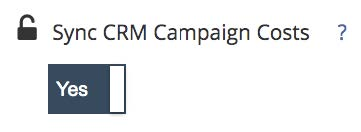

# Ausgabenverwaltungsmethoden {#spend-management-methods}

Ausgabendaten sind der Schlüssel für den Erfolg von ROI-Berichten mit [!DNL Marketo Measure]. Um ein genaues und umfassendes ROI-Reporting über alle Ihre Kanäle und Unterkanäle hinweg zu erhalten, müssen Sie sicherstellen, dass Sie über die entsprechenden Ausgabendaten verfügen, die in [!DNL Marketo Measure] abgerufen werden.

Es gibt drei Möglichkeiten, Ausgabedaten in [!DNL Marketo Measure] zu übertragen. Jede Methode ist so konzipiert, dass Ausgabendaten aus bestimmten Dateneingaben abgerufen werden.

**1 API Connected Accounts**

Die Ausgaben jedes Werbekontos, mit dem Sie über eine API eine Verbindung [!DNL Marketo Measure] haben, werden automatisch für die ROI-Berichterstellung in [!DNL Marketo Measure] übernommen. Um zu überprüfen, welche Konten Sie verbunden haben und somit Ausgaben einholen, gehen Sie zu Ihrer [!DNL Marketo Measure] App und wählen Sie die Registerkarte [!UICONTROL Verbindungen] unter dem Abschnitt [!UICONTROL Integrationen] aus. Weitere Informationen zum Einrichten Ihrer API-Verbindungen finden Sie unter [Integrierte Werbeplattformen](/help/api-connections/utilizing-marketo-measures-api-connections/integrated-ad-platforms.md#how-to-connect-ad-platforms).

**2 CRM-Kampagnenkosten-Synchronisation**

Jedes [!DNL Marketo Measure] hat Zugriff auf eine Funktion namens [CRM-Kampagnenkosten synchronisieren](/help/marketing-spend/spend-management/crm-campaign-costs.md#availability). Standardmäßig ist dieses Funktionsbit auf „Nein“ gesetzt, kann jedoch jederzeit aktiviert werden.

Wenn diese Funktion aktiviert ist, werden automatisch Ausgaben aus jeder CRM-Kampagne/-Programm abgerufen, die die folgenden Kriterien erfüllt:

I. [!DNL Marketo Measure] prüft zunächst, ob die Kampagne/das Programm Touchpoints erstellt, entweder anhand einer entsprechenden erstellten [Kampagnensynchronisierungsregel](/help/channel-tracking-and-setup/offline-channels/custom-campaign-sync.md) oder anhand einer [Programmsynchronisierungsregel](/help/marketo-measure-and-marketo/marketo-measure-integrations-with-marketo/marketo-engage-programs-integration.md) erstellten passenden oder [Wert für Buyer Touchpoints aktivieren](/help/channel-tracking-and-setup/offline-channels/legacy-processes/syncing-offline-campaigns.md#how-to-create-a-campaign-and-sync-buyer-touchpoints) „Alle Kampagnenmitglieder einbeziehen“ oder „Responded“-Kampagnenmitglieder einbeziehen.“

ii. Für die Kampagne/das Programm muss ein Startdatum angegeben werden

iii. Für die Kampagne/das Programm muss ein Enddatum angegeben werden

IV. Die Istkosten (für Kampagnen in SFDC) oder Periodenkosten (für Programme in Marketo) müssen angegeben werden.

**3 Manueller Kosten-Upload**

Mit dieser Methode können Sie [Ausgabendaten manuell hochladen](/help/marketing-spend/spend-management/marketing-channel-costs.md#uploading-marketing-costs) für die Kanäle und Unterkanäle, die nicht von API Connected Accounts oder der CRM-Kampagnensynchronisierung abgedeckt werden. Wenn Sie in Ihren [!DNL Marketo Measure] zum Abschnitt „Marketingausgaben“ navigieren, können Sie Ausgabendaten über eine CSV-Datei für einen beliebigen Kanal hochladen.

Kunden können eine Kombination aus allen drei Methoden verwenden, um ihre Ausgaben je nach Einrichtung der [!DNL Marketo Measure] zu verwalten. Da es drei Methoden zum Importieren von Ausgaben in [!DNL Marketo Measure] gibt, empfehlen wir dringend, das Marketing-Ausgabenboard in Discover zu verwenden, um eine umfassende Ansicht aller Ausgabendaten zu erhalten. Dieses Board ist der einzige Ort, an dem Sie alle Ihre Kanäle und die damit verbundenen Ausgaben sehen können. Das Marketing-Ausgabenboard kann Ihnen dabei helfen, schnell zu identifizieren, wo Lücken in Ihren Ausgabendaten bestehen könnten und wie Sie Ihre ROI-Berichterstellung verbessern können.
