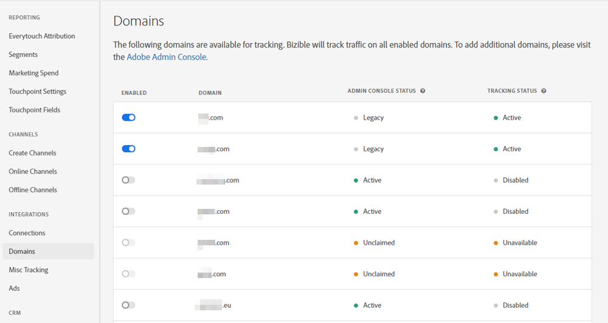

# Adobe Experience Cloud-Benutzeroberfläche – Übersicht {#experience-cloud-interface-overview}

Die Benutzeroberfläche von Adobe Experience Cloud stimmt das Erscheinungsbild von Adobe Experience Cloud-Programmen und -Services ab. Aber es ist mehr als nur ein neues Design. Es handelt sich dabei um ein Single Page Application-Programm, das das Anwendererlebnis in einer einzigen Instanz bereitstellt.

## Benutzerfluss {#user-flow}

Wenn Sie bereits bei einem Adobe Experience Cloud-Produkt angemeldet sind, klicken Sie auf das Menüsymbol und wählen Sie **[!DNL Marketo Measure]** aus.

>[!NOTE]
>
>Je nachdem, welche Adobe Experience Cloud-Produkte Sie abonniert haben, kann Ihr Dropdown-Menü unterschiedlich aussehen.

Wenn Sie _nicht_ bereits bei einem Adobe Experience Cloud-Produkt angemeldet sind, melden Sie sich direkt hier bei [!DNL Marketo Measure] an: [https://experience.adobe.com/marketo-measure](https://experience.adobe.com/marketo-measure).

## Neue Funktionen {#new-features}

Neben dem aktualisierten Look-and-Feel sind die folgenden Funktionen zu beachten:

**Domain-Verwaltung**

[Verwalten  [!DNL Marketo Measure]  Domains](/help/marketo-measure-and-adobe/domain-management.md) ohne Hilfe von [!DNL Marketo Measure].

**Integriertes Hilfezentrum**

Suchen Sie in der [!DNL Marketo Measure]-Anwendung nach Support-Artikeln, reichen Sie Tickets ein und geben Sie Feedback.

**Programmumschalter**

Diejenigen, die Zugriff auf mehrere Adobe-Produkte haben, können problemlos zwischen ihnen wechseln.

**Benachrichtigungen und Ankündigungen**

Anzeigen von produktspezifischen Benachrichtigungen und allgemeinen Adobe-Produktankündigungen direkt in der Anwendung und Interagieren mit diesen.

**Adobe-Einstellungen**

Um Ihre Sprache oder andere Adobe-weite Voreinstellungen zu ändern, klicken Sie auf Ihr Profilsymbol. Sie können auch [!DNL Marketo Measure] Änderungen vornehmen, indem Sie auf &quot;**&quot;**.

## FAQs {#faq}

**Was passiert mit meinen Lesezeichen?**

Lesezeichen werden umgeleitet. Wenn Sie beispielsweise zu https://apps.marketo-measure.com/Discover/391 navigieren, werden Sie nach Abschluss der Authentifizierung zu https://experience.adobe.com/marketo-measure/Discover/391 weitergeleitet.

**Ich kann mich nicht über die Experience Cloud-Oberfläche bei [!DNL Marketo Measure] anmelden. Was könnte das Problem sein?**

Wenn Sie sich bei Adobe Experience Cloud anmelden können, aber eine Seite wie die folgende sehen, könnte das Problem auf der [!DNL Marketo Measure] liegen:

Wenn Sie den oben genannten Fehler erhalten, [ Sie den Support ](https://nation.marketo.com/t5/support/ct-p/Support) Hilfe.
