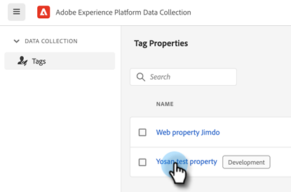
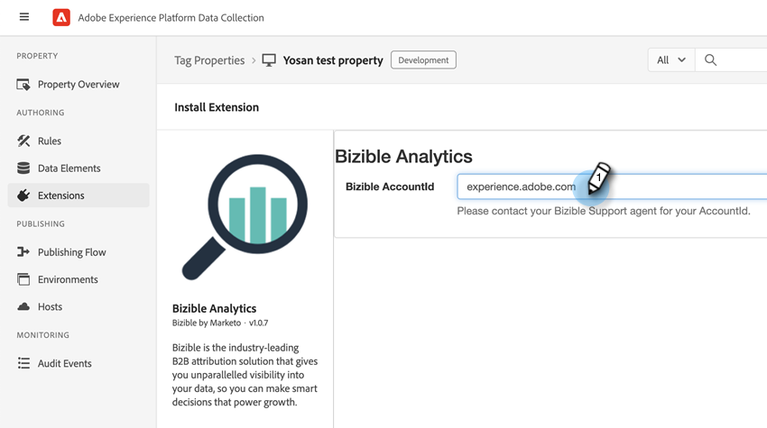

# [!DNL Marketo Measure]-Integrationen mit Adobe Launch {#marketo-measure-integrations-with-adobe-launch}

Die Adobe Launch-Erweiterung ist für bestehende [!DNL Marketo Measure] -Benutzer konzipiert, die bereits Adobe Launch auf ihrer Website verwenden. Die Erweiterung dient als Tag-Management-Lösung, mit der Sie Skripte basierend auf bestimmten Ereignissen und Bedingungen auf Ihren Seiten konfigurieren und dynamisch laden können.

Wenn sie in Adobe Launch installiert und konfiguriert ist, lädt die Erweiterung [!DNL Marketo Measure] das Skript bizible.js auf den Seiten, auf denen das Adobe Launch-Skript vorhanden ist. Dadurch können Marketingexperten bizible.js über die Adobe Launch-Konfiguration hinzufügen, anstatt die Webseite explizit zu ändern und das Skript-Tag bizible.js hinzuzufügen.

## Konfigurieren der Adobe Launch-Erweiterung {#configure-the-adobe-launch-extension}

>[!PREREQUISITES]
>
>Unter den folgenden Links erfahren Sie mehr über Adobe Launch und seine Erweiterungen:
>
>* [[!DNL Marketo Measure] Erweiterung](https://experienceleague.adobe.com/docs/experience-platform/destinations/catalog/email/bizible.html#catalog){target="_blank"}
>* [Adobe Launch-Übersicht ](https://experienceleague.adobe.com/docs/platform-learn/implement-in-websites/overview.html){target="_blank"}
>* [Übersicht über die Adobe Launch-Erweiterung](https://experienceleague.adobe.com/docs/experience-platform/tags/extension-dev/overview.html){target="_blank"}

1. Erstellen Sie eine Eigenschaft gemäß den Schritten [in diesem Artikel](https://experienceleague.adobe.com/docs/platform-learn/implement-in-websites/configure-tags/create-a-property.html#go-to-the-data-collection-interface){target="_blank"}.

1. Klicken Sie auf die von Ihnen erstellte Eigenschaft.

   

1. Klicken Sie auf **[!UICONTROL Erweiterungen]**.

   

1. Klicken Sie auf die Registerkarte **[!UICONTROL Katalog]** und suchen Sie nach &quot;[!UICONTROL Bizible]&quot;.

   

1. Klicken Sie auf der Kachel [!UICONTROL Bizible Analytics] auf **[!UICONTROL Installieren]**.

   

1. Geben Sie im Feld Bizible AccountId die URL Ihrer Website ein (z. B. `adobe.com`).

   

1. Klicken Sie auf **[!UICONTROL Speichern]**.

   

1. Klicken Sie auf **[!UICONTROL Regeln]** und wählen Sie dann **[!UICONTROL Neue Regel erstellen]** aus.

   

1. Klicken Sie unter [!UICONTROL Ereignisse] auf die Schaltfläche **[!UICONTROL Hinzufügen]** .

   

1. Wählen Sie in der Dropdown-Liste Erweiterung die Option **[!UICONTROL Core]** aus. Wählen Sie dann in der Dropdown-Liste Ereignistyp die Option **[!UICONTROL Bibliothek geladen (Seitenanfang)]** aus. Wenn Sie Ihrem Ereignis keinen Namen geben, wird ein Standardwert angewendet. Klicken Sie nach Abschluss auf **[!UICONTROL Änderungen beibehalten]** .

   

1. Klicken Sie unter &quot;Aktionen&quot;auf die Schaltfläche **[!UICONTROL Hinzufügen]** .

   

1. Wählen Sie in der Dropdown-Liste Erweiterung die Option **[!UICONTROL Bizible Analytics]** aus. Wählen Sie dann in der Dropdown-Liste Aktionstyp die Option **[!UICONTROL Initialize]** aus. Wenn Sie Ihrer Aktion keinen Namen geben, wird ein Standardwert angewendet. Klicken Sie nach Abschluss auf **[!UICONTROL Änderungen beibehalten]** .

   

1. Klicken Sie auf **[!UICONTROL Speichern]**.

   

