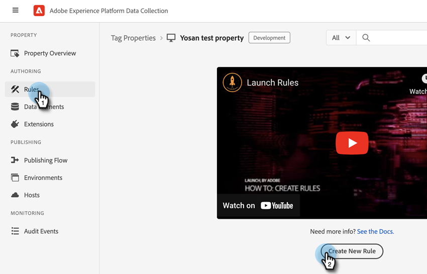

# [!DNL Marketo Measure]-Integrationen mit Adobe Launch {#marketo-measure-integrations-with-adobe-launch}

Die Adobe Launch-Erweiterung ist für bestehende [!DNL Marketo Measure] Benutzende, die Adobe Launch bereits auf ihrer Website verwenden. Die Erweiterung dient als Tag-Management-Lösung, mit der Sie basierend auf bestimmten Ereignissen und Bedingungen Skripte konfigurieren und dynamisch auf Ihren Seiten laden können.

Nach der Installation und Konfiguration in Adobe Launch [!DNL Marketo Measure] lädt das bizible.js-Skript auf den Seiten, auf denen sich das Adobe Launch-Skript befindet. Auf diese Weise können Marketing-Fachleute bizible.js über die Adobe Launch-Konfiguration hinzufügen, anstatt die Webseite explizit zu ändern und das Skript-Tag bizible.js hinzuzufügen.

## Konfigurieren der Adobe Launch-Erweiterung {#configure-the-adobe-launch-extension}

>[!PREREQUISITES]
>
>Weitere Informationen zu Adobe Launch und seinen Erweiterungen finden Sie unter den folgenden Links:
>
>* [[!DNL Marketo Measure] Erweiterung](https://experienceleague.adobe.com/docs/experience-platform/destinations/catalog/email/bizible.html#catalog){target="_blank"}
>* [Adobe Launch - Übersicht](https://experienceleague.adobe.com/docs/platform-learn/implement-in-websites/overview.html){target="_blank"}
>* [Adobe Launch-Erweiterung - Übersicht](https://experienceleague.adobe.com/docs/experience-platform/tags/extension-dev/overview.html){target="_blank"}

1. Erstellen Sie eine Eigenschaft wie folgt [In diesem Artikel](https://experienceleague.adobe.com/docs/platform-learn/implement-in-websites/configure-tags/create-a-property.html#go-to-the-data-collection-interface){target="_blank"}.

1. Klicken Sie auf die von Ihnen erstellte Eigenschaft.

   

1. Klick **[!UICONTROL Erweiterungen]**.

   

1. Klicken Sie auf die Schaltfläche **[!UICONTROL Katalog]** und suchen Sie nach &quot;[!UICONTROL Bizible].“

   

1. In der [!UICONTROL Bizible Analytics] Kachel, Klick **[!UICONTROL Installieren von]**.

   

1. Geben Sie in das Feld Bizible-Konto-ID die URL Ihrer Website ein (zum Beispiel `adobe.com`).

   

1. Klicken Sie auf **[!UICONTROL Speichern]**.

   

1. Klick **[!UICONTROL Regeln]** und wählen Sie dann **[!UICONTROL Neue Regel erstellen]**.

   

1. Klicken Sie auf die Schaltfläche **[!UICONTROL Hinzufügen]** Schaltfläche unter [!UICONTROL -Events].

   

1. Wählen Sie in der Dropdown-Liste Erweiterung aus. **[!UICONTROL Core]**. Wählen Sie dann in der Dropdown-Liste Ereignistyp Folgendes aus **[!UICONTROL Bibliothek geladen (Seitenanfang)]**. Wenn Sie Ihrem Ereignis keinen Namen geben, wird ein Standardname angewendet. Klick **[!UICONTROL Änderungen beibehalten]** Wenn fertig.

   

1. Klicken Sie auf die Schaltfläche **[!UICONTROL Hinzufügen]** Schaltfläche unter „Aktionen„.

   

1. Wählen Sie in der Dropdown-Liste Erweiterung aus. **[!UICONTROL Bizible Analytics]**. Wählen Sie dann in der Dropdown-Liste Aktionstyp aus **[!UICONTROL initialize]**. Wenn Sie Ihrer Aktion keinen Namen geben, wird ein Standardname angewendet. Klick **[!UICONTROL Änderungen beibehalten]** Wenn fertig.

   

1. Klicken Sie auf **[!UICONTROL Speichern]**.

   

