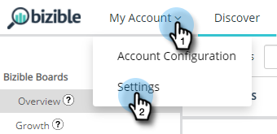

# [!DNL Microsoft Dynamics] CRM-Installationsanleitung {#microsoft-dynamics-crm-installation-guide}

>[!NOTE]
>
>Möglicherweise werden Anweisungen zu „[!DNL Marketo Measure]“ in unserer Dokumentation angezeigt, obwohl Sie in Ihrem CRM weiterhin „Bizible“ sehen. Wir arbeiten an dieser Aktualisierung, und das Rebranding wird bald in Ihrem CRM zu sehen sein.

## Unterstützte Versionen {#supported-versions}

[!DNL Marketo Measure] unterstützt Folgendes [!DNL Microsoft Dynamics CRM] Versionen:

* [!DNL Microsoft Dynamics 2016] (Online und On-Premise)
* [!DNL Microsoft Dynamics 365] (Online und On-Premise)

Für Verbindung und Authentifizierung [!DNL Marketo Measure] unterstützt die folgenden Active Directory Federated Services (ADFS)-Versionen:

* ADFS 4.0 - [!DNL Windows Server 2016]
* ADFS 5.0 - [!DNL Windows Server 2019]

## Installieren Sie die verwaltete Lösung {#install-the-managed-solution}

[Herunterladen und installieren](assets/marketo-measure-dynamics-extension.zip) die ZIP-Datei im Dynamics CRM.

**[!UICONTROL Einstellungen]** > **[!UICONTROL Anpassungen]** > **[!UICONTROL Lösungen]** > **[!UICONTROL Import]** (Schaltfläche) > **[!UICONTROL Datei auswählen]**.

>[!NOTE]
>
>Die folgenden beiden Screenshots können geringfügig von Ihren abweichen, da sie während einer Lösungsaktualisierung erstellt wurden.

## [!DNL Marketo Measure] Benutzerberechtigungen {#marketo-measure-user-permissions}

Es wird empfohlen, eine dedizierte [!DNL Marketo Measure] Verwenden Sie in Dynamics , damit wir Daten exportieren und importieren können, um Probleme mit anderen Benutzern in Ihrem CRM zu vermeiden. Beachten Sie den Benutzernamen und das Kennwort sowie die Endpunkt-URL, da diese bei der Erstellung der [!DNL Marketo Measure] -Konto.

## Sicherheitsrollen {#security-roles}

Wenn Ihr Unternehmen Dynamics-Sicherheitsrollen verwendet, stellen Sie sicher, dass der verbundene Benutzer oder der [!DNL Marketo Measure] Der Benutzer verfügt über ausreichende Lese-/Schreibberechtigungen für die erforderlichen Entitäten.

Sicherheitsrollen finden Sie hier: **[!UICONTROL Einstellungen]** > **[!UICONTROL Sicherheit]** > **[!UICONTROL Sicherheitsrollen]**.

Für [!DNL Marketo Measure] benutzerdefinierten Entitäten benötigen wir vollständige Berechtigungen für alle unsere Entitäten.

>[!NOTE]
>
>Benutzer, die Chancen schließen werden, benötigen auch die vollständigen Berechtigungen.

Informationen zu Dynamics-Standardentitäten finden Sie im Abschnitt [!DNL Marketo Measure] Dynamics-Schema-Dokument. Auf hoher Ebene [!DNL Marketo Measure] müssen nur in bestimmten Entitäten gelesen werden, um die entsprechenden Daten zu sammeln und in benutzerdefinierte Felder zu schreiben, die mit der verwalteten Lösung installiert werden. Wir werden keine neuen Standarddatensätze erstellen und auch keine Standardfelder aktualisieren.

## Touchpoints in Seitenlayouts einschließen: {#include-touchpoints-on-page-layouts}

1. Navigieren Sie für jede Entität zum Formular-Editor. Sie finden dies unter **[!UICONTROL Einstellungen]** > **[!UICONTROL Anpassungen]** > **[!UICONTROL System anpassen]** > `[Entity]` > **[!UICONTROL Forms]**. Oder Sie finden es in den Einstellungen, während Sie einen Datensatz anzeigen.

   * Die zu konfigurierenden Entitäten: Konto, Gelegenheit, Kontakt, Lead und Kampagne.

   * Um Kampagnen zu konfigurieren, müssen Sie die Option &quot;Kampagnensynchronisierung&quot;in **[!UICONTROL CRM]** > **[!UICONTROL Kampagnen]**.

   

1. Seitenlayouts: Fügen Sie zuerst eine &quot;[!UICONTROL Eine Spalte]&quot; in dem Abschnitt, in dem die Touchpoints live geschaltet werden sollen. In dieser neuen Spalte benötigen wir ein Unterraster, das zu jedem Formular in Ihren Konto-, Opportunity-, Kontakt- und Lead-Entitäten hinzugefügt wird.

   

   

1. Wählen Sie das Objekt (Touchpoints der Käuferzuordnung oder Touchpoints der Käufer) aus, das im Unterraster dargestellt werden soll, was von der Objektbeziehung abhängt. Ändern Sie optional die anzuzeigenden Spalten, indem Sie auf die Schaltfläche Bearbeiten klicken. Die verwaltete Lösung hat ein Standardlayout festgelegt.

   Touchpoint-Subgrid für die Käuferzuordnung - Konten, Chancen und Kontakt\
   Käufer-Touchpoint-Subgrid - Leads und Kontakte

   

1. Nachdem Sie die Aktualisierung des Formulars abgeschlossen haben, veröffentlichen Sie die Änderungen und speichern Sie sie.

## Schema-bezogene Aspekte {#schema-related-considerations}

**Umsatz**

[!DNL Marketo Measure] verweist standardmäßig auf das Standardfeld &quot;Tatsächlicher Umsatz&quot;. Wenn Sie dies nicht verwenden, erläutern Sie bitte, wie Sie Ihren Lösungstechniker oder Success Manager über den Umsatz informieren, da ein benutzerdefinierter Workflow erforderlich ist.

**Abschlussdatum**

[!DNL Marketo Measure] verweist standardmäßig auf das Feld &quot;Datum der tatsächlichen Schließung&quot;. Wenn Sie dies nicht verwenden oder auch das Feld Geschätztes Schließdatum verwenden, erläutern Sie Ihren Prozess bitte Ihrem Solutions Engineer oder Success Manager. Möglicherweise müssen beide Felder in einem benutzerdefinierten Workflow berücksichtigt werden.

## Konfigurieren von Verbindungen und Datenanbietern {#configuring-your-connections-and-data-providers}

Nachdem Sie sich bei der [!DNL Marketo Measure] und als Benutzer in der Adobe Admin Console eingerichtet wurden, besteht der nächste Schritt darin, Ihre verschiedenen Datenverbindungen einzurichten.

**CRM als Datenanbieter**

1. In der [!DNL Marketo Measure] klicken Sie auf das **[!UICONTROL Mein Konto]** und wählen Sie **[!UICONTROL Einstellungen]**.

   

1. under [!UICONTROL Integrationen] Klicken Sie im linken Navigationsbereich auf **[!UICONTROL Verbindungen]**.

   

1. Klicken Sie auf **[!UICONTROL Einrichten einer neuen CRM-Verbindung]** Schaltfläche.

   

1. Weiter zu [!UICONTROL Microsoft Dynamics CRM], klicken Sie auf die **[!UICONTROL Verbinden]** Schaltfläche.

   

1. Auswählen [!UICONTROL Anmeldeinformationen] oder [!UICONTROL OAuth].

   

   >[!NOTE]
   >
   >Weitere Informationen zu OAuth finden Sie unter [diesem Artikel](/help/marketo-measure-and-dynamics/getting-started-with-marketo-measure-and-dynamics/oauth-with-azure-active-directory-for-dynamics-crm.md). Wenden Sie sich bei Fragen zum Prozess an Ihren [!DNL Marketo Measure] Kundenbetreuer.

1. In diesem Beispiel haben wir Anmeldedaten ausgewählt. Geben Sie Ihre Anmeldedaten ein und klicken Sie auf **[!UICONTROL Nächste]**.

Nach der Verbindung werden die Details Ihrer Dynamics-Verbindung in der Liste der CRM/MAP-Verbindungen angezeigt.

**Kontoverbindungen für Anzeigen**

So verbinden Sie Ihre Anzeigenkonten mit [!DNL Marketo Measure], indem Sie [!UICONTROL Verbindungen] innerhalb der [!DNL Marketo Measure] Anwendung.

1. Befolgen Sie die obigen Schritte 1 und 2. _CRM als Datenanbieter_ Abschnitt.

1. Klicken Sie auf **[!UICONTROL Einrichten einer neuen CRM-Verbindung]** Schaltfläche.

   

1. Wählen Sie die gewünschte Plattform aus.

   

**[!DNL Marketo Measure]JavaScript**

Zur [!DNL Marketo Measure] zur Verfolgung Ihrer Web-Aktivitäten gibt es mehrere Schritte für die Einrichtung.

1. Klicken Sie auf **[!UICONTROL Mein Konto]** und wählen Sie **[!UICONTROL Kontokonfiguration]**.

   

1. Geben Sie Ihre Telefonnummer ein. Geben Sie für Website Ihre primäre Stammdomäne ein, die für [!DNL Marketo Measure] Tracking auf Ihrer Website. Klicks **[!UICONTROL Speichern]** wann geschehen.

   

   >[!NOTE]
   >
   >Wenden Sie sich zum Hinzufügen mehrerer Stammdomänen an Ihren [!DNL Marketo Measure] Kundenbetreuer.

1. Die [[!DNL Marketo Measure] JavaScript](/help/marketo-measure-tracking/setting-up-tracking/adding-marketo-measure-script.md) müssen dann auf der gesamten Site und Landingpages platziert werden. Es wird empfohlen, das Skript fest im Kopf Ihrer Landingpages zu codieren oder über ein Tag Management-System hinzuzufügen, z. B. [Google Tag Manager](/help/marketo-measure-tracking/setting-up-tracking/adding-marketo-measure-script-via-google-tag-manager.md).

   >[!NOTE]
   >
   >Standardmäßig exportiert [!DNL Marketo Measure] jedes Mal 200 Einträge pro API-Credit, wenn ein Vorgang Daten an Ihr CRM sendet. Den meisten Kunden bietet dies das optimale Gleichgewicht zwischen den von [!DNL Marketo Measure] verbrauchten API-Credits und den Anforderungen der CPU-Ressourcen im CRM-System. Bei Kundinnen und Kunden mit komplexen CRM-Konfigurationen, wie Workflows und Triggern, kann eine kleinere Batch-Größe die CRM-Leistung möglicherweise jedoch verbessern. Dazu können Kundinnen und Kunden mit [!DNL Marketo Measure] die Batch-Größe für den CRM-Export konfigurieren. Diese Einstellung ist auf der Seite Einstellungen > CRM > Allgemein in der [!DNL Marketo Measure] Web-Anwendung verfügbar. Dort können die Kundinnen und Kunden zwischen Batch-Größen von 200 (Standard), 100, 50 oder 25 wählen.
   >
   >Beachten Sie bei der Änderung dieser Einstellung, dass kleinere Batch-Größen mehr API-Credits aus Ihrem CRM-System verbrauchen. Es wird empfohlen, die Batch-Größe nur zu reduzieren, wenn in Ihrem CRM-System CPU-Timeouts oder eine hohe CPU-Last auftreten.

   >[!NOTE]
   >
   >Wenn Sie Marketo Measure deaktivieren und Daten nach Dynamics exportieren, werden keine vorhandenen Daten entfernt. Hilfe zum Entfernen vorhandener Daten erhalten Sie beim Dynamics-Support.
