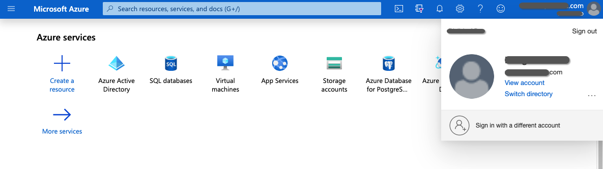
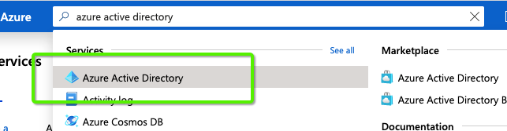

# OAuth mit [!DNL Azure Active Directory] für Dynamics CRM {#oauth-with-azure-active-directory-for-dynamics-crm}

## Betroffene Personen {#who-s-affected}

Diese Einrichtung ist für neue [!DNL Marketo Measure] Kunden, die Dynamics CRM mit einer [!DNL Azure Active Directory] (AAD)-Konto oder für Kunden, die von ihrem alten Benutzernamen und Kennwort zu migrieren möchten [!DNL Azure Active Directory] mit OAuth.

>[!NOTE]
>
>Für beide Szenarien ist AAD hier eingerichtet, um die Verbindung Ihrer Dynamics-Instanz mit [!DNL Marketo Measure] als Datenanbieter.

## Einrichten einer neuen Anwendung {#set-up-new-application}

1. Anmelden bei [Azure Portal](https://portal.azure.com/#home).

1. Wählen Sie den Azure AD-Mandanten aus, indem Sie auf Ihr Konto in der oberen rechten Ecke der Seite klicken, dann auf die Navigation Switch Directory klicken und dann den entsprechenden Mandanten auswählen. Überspringen Sie diesen Schritt, wenn Sie nur einen Azure AD-Mandanten unter Ihrem Konto haben oder wenn Sie bereits den entsprechenden Azure AD-Mandanten ausgewählt haben.

   

1. Suchen Sie nach &quot;[!DNL Azure Active Directory]&quot; in der Suchleiste und klicken Sie auf den Namen, der geöffnet werden soll.

   

1. Klicks **[!UICONTROL App-Registrierungen]** im Menü links.

   

1. Klicks **[!UICONTROL Neue Registrierung]** oben.

   

1. Befolgen Sie die Anweisungen und erstellen Sie eine Anwendung. Es spielt keine Rolle, ob es sich um eine Webanwendung oder eine öffentliche Client-Anwendung (mobile und Desktop) handelt. Wenn Sie jedoch spezifische Beispiele für Webanwendungen oder öffentliche Clientanwendungen wünschen, sehen Sie sich die [quickstart](https://learn.microsoft.com/en-us/azure/active-directory/develop/v2-overview).\
   a. Name ist der App-Name und beschreibt Ihre Anwendung für Endbenutzer.\
   b. Wählen Sie unter &quot;Unterstützte Kontotypen&quot;Konten in einem beliebigen Organisationsverzeichnis und persönlichen Microsoft-Konten aus.\
   c. Geben Sie den Umleitungs-URI an. Bei Webanwendungen ist dies die Basis-URL Ihrer App, an der sich Benutzer anmelden können. Beispiel: `http://localhost:12345`. Für öffentliche Clients (mobile und Desktopgeräte) verwendet Azure AD diese, um Token-Antworten zurückzugeben. Geben Sie einen anwendungsspezifischen Wert ein. Beispiel: `http://MyFirstAADApp`.

1. Nachdem Sie die Registrierung abgeschlossen haben, weist Azure AD Ihrer Anwendung eine eindeutige Client-Kennung (die Anwendungs-ID) zu. Sie benötigen diesen Wert im nächsten Abschnitt. Kopieren Sie ihn daher von der Anwendungsseite.

1. Um Ihre Anwendung im Azure-Portal zu finden, klicken Sie auf **[!UICONTROL App-Registrierungen]** Klicken Sie auf **[!UICONTROL Alle Anwendungen]**. Öffnen Sie die neu erstellte Anwendung

1. Klicks **[!UICONTROL Authentifizierung]** im Menü links.

   

1. Fügen Sie die [!DNL Marketo Measure] Umleitungs-URLs: `https://apps.bizible.com/OAuth2` und `https://apps.bizible.com/OAuth2?identityOnly=true` zur Liste der Umleitungs-URLs hinzugefügt.

   

1. Navigieren Sie zur Registerkarte API-Berechtigungen und stellen Sie sicher, dass der Anwendung die richtigen Berechtigungen zugewiesen sind.

   

1. Geben Sie hier &quot;[!UICONTROL enterprise]&quot;in das Suchfeld ein und klicken Sie auf **[!UICONTROL Enterprise-Anwendungen]**.

   

1. Suchen und öffnen Sie erneut Ihre neue Anwendung in der Liste der Anwendungen.

1. Klicken Sie auf der Registerkarte Berechtigungen auf **[!UICONTROL Admin-Zustimmung erteilen für (Instanzname)]**.

   

1. Klicks **[!UICONTROL Accept]**.

   

1. Aus dem[!UICONTROL Benutzer und Gruppen]&quot;, stellen Sie sicher, dass der Anwendung die gültigen &quot;Benutzer und Gruppen&quot;zugewiesen sind.

   

## Anwendungsbenutzer erstellen {#creating-an-application-user}

Sobald die Registrierung der Anwendung abgeschlossen ist, kann ein Anwendungsbenutzer erstellt werden.

1. Navigieren Sie zu Ihrer Common Data Service-Umgebung (`https://[org].crm.dynamics.com`).

1. Navigieren Sie zu **[!UICONTROL Einstellungen]** > **[!UICONTROL Sicherheit]** > **[!UICONTROL Benutzer]**.

1. Auswählen **[!UICONTROL Anwendungsbenutzer]** im Ansichtsfilter.

1. Auswählen **[!UICONTROL + Neu]**.

1. Geben Sie im Formular &quot;Application User&quot;die erforderlichen Informationen ein.

   >[!NOTE]
   >
   >* Die Benutzernameninformationen dürfen nicht mit einem Benutzer übereinstimmen, der im [!DNL Azure Active Directory].
   >
   >* Geben Sie im Feld Anwendungs-ID die Anwendungs-ID der App ein, die Sie zuvor in der Azure AD registriert haben.

1. Wenn die Einrichtung korrekt ist, klicken Sie nach Auswahl von **[!UICONTROL Speichern]**, die **[!UICONTROL Anwendungs-ID-URI]** und **[!UICONTROL Azure AD Object Id]** -Felder werden automatisch mit den richtigen Werten ausgefüllt.

1. Wählen Sie vor dem Beenden des Benutzerformulars **[!UICONTROL Rollen verwalten]** und weisen Sie diesem Anwendungsbenutzer eine Sicherheitsrolle zu, damit der Anwendungsbenutzer auf die gewünschten Organisationsdaten zugreifen kann.

## Verbinden Ihrer Dynamics-Instanz über OAuth {#connecting-your-dynamics-instance-via-oAuth}

1. Führen Sie beim erstmaligen Einrichten Ihrer Dynamics-Verbindung die Schritte 1 bis 5 des Abschnitts &quot;CRM as a Data Provider&quot;aus unter [diesem Artikel](/help/marketo-measure-and-dynamics/getting-started-with-marketo-measure-and-dynamics/microsoft-dynamics-crm-installation-guide.md).

1. Wenn Sie nach OAuth-Anmeldeinformationen gefragt werden, geben Sie die Client-ID, das Client-Geheimnis und den Anwendungs-ID-URI ein, die im obigen Abschnitt eingerichtet wurden.

a. Die Client-ID ist die ID aus Schritt 7 im obigen Abschnitt. Wenn Sie es nicht notiert haben, wird die Anwendungs-ID in den Einstellungen der App-Registrierung angezeigt.

b. Client Secret ist das Anwendungsgeheimnis, das im Azure Portal für Ihre Anwendung unter Zertifikate und Geheimnisse erstellt wurde.

c. Der Anwendungs-ID-URI ist die URL der Ziel-Web-API (gesicherte Ressource). Um die App-ID-URL zu finden, klicken Sie im Azure Portal auf [!DNL Azure Active Directory], klicken Sie auf Anwendungsregistrierungen , öffnen Sie die Seite Einstellungen der Anwendung und klicken Sie dann auf Eigenschaften . Es kann auch eine externe Ressource sein, wie `https://graph.microsoft.com`. Dies ist normalerweise die URL der Dynamics-Instanz.

1. Nachdem Sie auf **[!UICONTROL Einsenden]**, werden Sie aufgefordert, sich mit [!DNL Azure Active Directory]. Wenn die Authentifizierung erfolgreich ist, ist Ihr Dynamics-Konto als Datenanbieter innerhalb von [!DNL Marketo Measure].

## Reauthentifizieren Ihres Dynamics-Kontos {#re-authenticating-your-dynamics-account}

1. Wenn Sie sich im [!DNL Marketo Measure] Anwendung, navigieren Sie zu **[!UICONTROL Meine Einstellungen]** > **[!UICONTROL Einstellungen]** > **[!UICONTROL Verbindungen]**.

1. Klicken Sie auf das Schlüsselsymbol im Abschnitt CRM neben der Dynamics-Verbindung.

1. Wenn auf den Schlüssel geklickt wird, wird ein Popup-Fenster angezeigt, in dem Sie aufgefordert werden, die Client-ID, das Client-Geheimnis und den Anwendungs-ID-URI einzugeben, ähnlich dem Anmeldefluss.

   

1. Nachdem Sie auf **[!UICONTROL Einsenden]**, werden Sie aufgefordert, sich mit [!DNL Azure Active Directory]. Wenn die Authentifizierung erfolgreich ist, wird Ihr Dynamics-Konto in [!DNL Marketo Measure].
