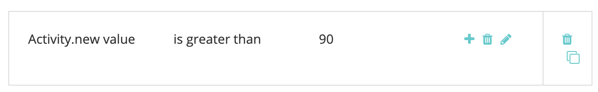

# [!DNL Marketo Engage] Aktivitätsintegration {#marketo-engage-activities-integration}

Im Rahmen der Gesamtübersicht [!DNL Marketo Measure] und [!DNL Marketo Engage] Bei der Integration spielt diese Anstrengung, Marketo-Aktivitäten zu nutzen, eine große Rolle. Über Marketo-Aktivitäten verfolgt das System Ereignisse wie &quot;Klick-E-Mail&quot;, &quot;Bewertung ändern&quot;oder &quot;Status ändern&quot;in der Progression - diese Aktivitätstypen können heruntergestuft und definiert werden, um eine Teilmenge auszuwählen, die für Touchpoints geeignet ist. Sobald Touchpoints für diese Aktivitäten erstellt wurden, werden sie in der Interaktions-Journey verfolgt und zusammen mit Ihren anderen Marketingkanälen wie Paid Search oder Partner Marketing gemessen.

## Anforderungen {#requirements}

* Marketo-Produktionsinstanz
* Produktion [!DNL Salesforce] oder [!DNL Microsoft Dynamics] instance
* Entrichtete [!DNL Marketo Measure] Abonnement
* Marketo People Sync aktiviert ([!DNL Marketo Measure] Einstellungen)
* Marketo-Programme aktiviert ([!DNL Marketo Measure] Einstellungen)
* Aktivierte Marketo-Aktivitäten ([!DNL Marketo Measure] Einstellungen)

## Setup {#setup}

1. Um mit der Einrichtung von Marketo-Aktivitäten zu beginnen, navigieren Sie zu **Mein Konto** > **Einstellungen** > **Tätigkeiten**.

   

   

   Zunächst müssen Sie die Liste der Aktivitätstypen auswählen, für die Sie Regeln erstellen möchten. Es ist keine große Anzahl von Aktivitätstypen erforderlich. Wir empfehlen Ihnen jedoch auch, Ihre Touchpoints nicht zu überlasten und die Wichtigkeit wichtiger Meilensteine zu verwässern. Daher benötigen Sie möglicherweise nicht mehr als fünf Aktivitätstypen, um die relevanten Interaktionen zu verfolgen.

1. Klicken Sie auf das Dropdown-Menü unter [!UICONTROL Aktivitätstypen auswählen] , um die verschiedenen Typen auszuwählen.

   

1. Sobald alle gewünschten Aktivitäten ausgewählt sind, werden sie auch in Ihrer [!UICONTROL Liste der ausgewählten Aktivitäten] sowie unter [!UICONTROL Regeln definieren].

   

1. Für jeden Aktivitätstyp müssen Sie eine oder mehrere Regeln definieren, die bestimmen, welche Datensätze für Touchpoints zulässig sind. In unserem Beispiel wird eine Regel für den Aktivitätstyp &quot;Ergebnis ändern&quot;hinzugefügt, sodass das System einen Touchpoint erstellt, wenn eine Marketo-Person einen Wert von 90 oder höher erreicht.

1. Je nach Aktivitätstyp müssen Sie zunächst eventuell einen [!DNL Marketo Measure] Kampagnenname, der später für die Kanalzuordnung verwendet werden kann. [!DNL Marketo Measure] Kampagnennamen können über mehrere Regeln hinweg wiederverwendet werden. Dies hilft, breitere Namen zu haben, die in einer Kanalregel verwendet werden können. Nicht alle Aktivitätstypen enthalten ein Marketo-Programm. Daher ist für diesen ersten Schritt ein Name erforderlich.

   Hier ist ein Beispiel dafür, wie dieser zusätzliche Schritt aussehen würde:

   

1. In unserem Beispiel &quot;Punktzahl ändern&quot;müssen wir keinen Kampagnennamen eingeben, da wir diese Informationen aus dem Marketo-Programm abrufen können. Jetzt können Sie den Regelausdruck erstellen. In unserem Beispiel möchten wir das Feld &quot;[!UICONTROL Neuer Wert]&quot; mit einem Operator für &quot;[!UICONTROL größer als]&quot; mit einem Wert von 90.

   Sie können die Regeln erweitern und zusätzliche Filter oder Kriterien hinzufügen, indem Sie &quot;und&quot;- oder &quot;Oder&quot;-Anweisungen hinzufügen, um die Ergebnisse einzugrenzen.

   

   

1. Wählen Sie abschließend aus, was wir als Touchpoint-Datum verwenden sollten. Alle verfügbaren Datums- oder Datums-/Uhrzeitfelder werden hier aus Marketo angezeigt. Wenn Sie keine benutzerdefinierten Datumsfelder haben, sehen Sie &quot;[!UICONTROL Aktivitätsdatum].&quot;

   

1. Klicken Sie auf **[!UICONTROL Als Entwurf speichern]** auf dem Weg, damit Sie Ihre Änderungen nicht verlieren.

   

1. Navigieren Sie zum **[!UICONTROL Attributzuordnung]** Registerkarte.

   

1. Für jeden von Ihnen ausgewählten Aktivitätstyp haben Sie die Möglichkeit, zusätzliche Marketo-Attribute Touchpoint-Feldern zuzuordnen, damit Sie diese Werte in [!DNL Marketo Measure Discover] oder im CRM.

   Viele Felder wurden automatisch zugeordnet und können nicht geändert werden, um mit unseren anderen Integrationen konsistent zu sein. Referenzieren Sie den Abschnitt Feldzuordnungen unten, um diese Werte zu finden. Bei einigen Aktivitätstypen enthält Marketo Attribute für eine Landingpage, Referrer-Seite oder einen Browser, die Sie optional einem Touchpoint-Feld zuordnen können. Im folgenden Beispiel haben wir einige zusätzliche Vorschläge gemacht, die entfernt werden können.

1. Wählen Sie in der linken Spalte, die Sie zuordnen möchten, das Feld &quot;Buyer Touchpoint&quot;aus. Wählen Sie dann das Marketo-Attribut aus, das Sie im Feld &quot;Touchpoint für Käufer&quot;ausfüllen möchten. Beachten Sie, dass es sich hierbei um ein optionales, zusätzliches Mapping zusätzlich zu den entsprechenden [!DNL Marketo Measure] hat sich bereits bewährt.

   Zugeordnete Felder:

   * Ort
   * Land
   * Region
   * Landing Page
   * Referrer-Seite
   * Formularseite
   * Formulardatum
   * Plattform
   * Browser

   >[!NOTE]
   >
   >Anzeigenfelder wie Anzeigeninhalt oder Suchbegriff sind nicht in dieser Liste verfügbar, da sie für unsere Anzeigenplattformintegrationen reserviert sind.

## Aktivitätstypen {#activity-types}

Bei einigen Aktivitätstypen erhalten Sie die Programm-ID und den Programmnamen. Daher ist es einfach, diese der Kampagnen-ID und dem Kampagnennamen auf dem Touchpoint des Käufers zuzuordnen. Für andere gibt es keine Programmverknüpfung. Daher müssen Sie bei der Definition der Regeln einen [!DNL Marketo Measure] Kampagnenname. Nachfolgend sind die Listen der einzelnen Kategorien aufgeführt:

**Aktivitätstypen mit Programm-ID**

E-Mail senden (6)\
Zugestellt in E-Mail (7)\
E-Mail-Bounce (8)\
E-Mail abmelden (9)\
E-Mail öffnen (10)\
Klicken Sie auf E-Mail (11)\
Datenwert ändern (13)\
Score ändern (22)\
Zu Liste hinzufügen (24)\
Änderungsstatus in Progression (104)\
Zur Krankenversicherung hinzufügen (113)\
Ändern der Nurturkadenz (115)

>[!NOTE]
>
>der Aktivitätstypen, bei denen eine Programm-ID erwartet wird, wenn eine Aktivität ohne Programm erkannt wird, [!DNL Marketo Measure] wird dies nicht als zulässigen Touchpoint akzeptieren, da wir keine null Campaign-Werte haben können.

**Aktivitätstypen ohne Programm-ID**

Klicken Sie auf Link (3)\
Neuer Lead (12)\
Blei mit SFDC synchronisieren (19)\
Blei konvertieren (21)\
Inhaber ändern (23)\
Aus Liste entfernen (25)\
SFDC-Aktivität (26)\
E-Mail-Bounce Soft (27)\
Lead aus SFDC löschen (29)\
Leads zusammenführen (32)\
Zu Chance hinzufügen (34)\
Aus Opportunity entfernen (35)\
Aktualisierungsmöglichkeit (36)\
Lead löschen (37)\
Warnhinweis senden (38)\
E-Mail zum Vertrieb senden (39)\
E-Mail &quot;Verkauf öffnen&quot;(40)\
Klicken Sie auf Sales Email (41)\
Zu SFDC Campaign hinzufügen (42)\
Aus SFDC Campaign entfernen (43)\
Änderungsstatus in SFDC Campaign (44)\
Receive Sales Email (45)\
Kampagne anfordern (47)\
E-Mail-Bounce Vertrieb (48)\
Umsatzstufe ändern (101)\
Manuelles Ändern der Umsatzstufe (102)\
Segment ändern (108)\
Webhook aufrufen (110)\
Weiterleiten an Freunde-E-Mail (111)\
Weiterleiten an Freunde-E-Mail erhalten (112)\
Wechseln der Krankenpflege (114)\
Push-Lead an Marketo (145)\
Lead mit Microsoft synchronisieren (300)\
Dialogfeld &quot;Inhalt freigeben&quot;(400) Interagiertes Dokument (158) Dokument interagiert mit (159) Dialogfeld Termin geplant (160) Dialogfeld Ziel erreicht (161) Benutzerspezifische Aktivität (xxx)

## Kanalzuordnung {#channel-mapping}

Für alle Regeln eines Aktivitätstyps mit einer Programm-ID wird der Marketo-Programmkanal vom Programm bestimmt. Wir verwenden den Programmkanal , um Ihre benutzerdefinierten Offline-Kanäle zuzuordnen. Daher müssen Sie sicherstellen, dass Ihre Kanäle richtig konfiguriert sind. [wie hier angegeben](/help/marketo-measure-and-marketo/marketo-measure-integrations-with-marketo/marketo-engage-programs-integration.md#channel-mapping).

Und bei allen Regeln eines Aktivitätstyps ohne Programm-IDs bestand der erste Schritt darin, einen Kampagnennamen zu erstellen. Verwenden Sie diesen Kampagnennamen, um Ihre benutzerdefinierten Online-Kanäle einzurichten. [hier](/help/channel-tracking-and-setup/online-channels/online-custom-channel-setup.md).

Wenn Kanäle für Ihre Marketo-Aktivitäten nicht ordnungsgemäß konfiguriert sind, werden Ihre neuen Touchpoints wahrscheinlich unter den Kanal &quot;Sonstige&quot;fallen.

## Programmkosten {#program-costs}

Durch den Datenimport von Marketo-Programmen werden die Kosten automatisch aus den Kosten des Zeitraums heruntergeladen und die in Marketo gemeldeten Kosten werden über den gesamten zugewiesenen Monat verteilt. Wenn beispielsweise für Januar 2021 1000 USD gemeldet werden, werden die 1000 USD auf 31 Tage aufgeteilt. Die Kosten finden Sie unter [!DNL Marketo Measure Discover].

## Cookie-Zuordnung {#cookie-mapping}

Als Ergebnis der [!DNL Marketo Measure] Integration mit Marketo, der [!DNL Marketo Measure] Die Cookie-ID wird jetzt auch mit der [!DNL Marketo Munchkin Id]. Dies hilft, die Lücke zu schließen, um den anonymen Erstkontakt einer Web-Sitzung zuzuordnen, anstatt sowohl FT- als auch LC-Touches einer Marketo-Aktivität zuzuordnen. Stellen Sie sich dieses Szenario vor:

Mark klickt auf eine Facebook-Anzeige und landet auf waynecompanies.com, wo er mit Cookies [!DNL Marketo Measure] ID 123 und [!DNL Marketo Munchkin Id] 456. Es wird kein Formular ausgefüllt.

Das Marketing-Team von Wayne Enterprises sendet eine E-Mail-Benachrichtigung an bestimmte Interessenten, darunter `mark@email.com`.

`mark@email.com` empfängt die E-Mail und klickt durch und landet auf `wayneenterprises.com`. Dies wird `mark@email.com's` zweiter Besuch bei `wayneenterprise.com` mit den gleichen Cookie-IDs, aber kein Formular ausgefüllt wurde, so [!DNL Marketo Measure], sind sie immer noch ein anonymer Besucher.

Das Marketingteam von Web-Unternehmen erstellt eine Marketo-Aktivitätsregel, um Touchpoints für den Aktivitätstyp &quot;Klick-E-Mail&quot;zu generieren.

Die heutige Implementierung würde einen einzigen FT- und LC-Touchpoint für `mark@email.com` aus der Marketo-Aktivität vom Aktivitätstyp &quot;E-Mail anklicken&quot;.

Mit dieser Verbesserung des Cookie-Mappings würde der FT zurück gehen und der Facebook-Anzeige gutgeschrieben und der LC würde der E-Mail gutgeschrieben.

>[!NOTE]
>
>Beim Verhalten der Cookie-Zuordnung finden Sie möglicherweise einige LC-Touchpoints, die von einem Webbesuch stammen. Es ist möglich, dass ein Lead in Marketo ohne zugehörige Aktivität angezeigt wird, und [!DNL Marketo Measure] heruntergeladen haben, mit den zugehörigen Cookies übereinstimmen und sie dann auf die neueste Websitzung verfolgen, selbst wenn keine Formularaktivität vorhanden war, durch die der Lead erstellt wurde.

## FAQs {#faq}

**Woher weiß ich, ob ich eine Marketo-Programmregel oder eine Marketo-Aktivitätsregel erstellen soll?**

Die [!DNL Marketo Engage] Programmintegration ist eine einfache Möglichkeit, Touchpoints zu generieren, je nachdem, ob eine Person Programmmitglied ist oder nicht. Wenn Sie eine Regel definieren möchten, die darauf basiert, wann eine Person zu einem bestimmten Programmstatus wechselt, wird die [!DNL Marketo Engage] Die Aktivitätenintegration ist das gewünschte Setup, insbesondere der Aktivitätstyp &quot;Status in Progression ändern&quot;, sodass Ihr Touchpoint-Datum dem vom System generierten Aktivitätsdatum zugeordnet werden kann.

**Warum ist der Name meines Touchpoint-Typs abgeschnitten?**

Das Feld &quot;Touchpoint-Typ&quot;wurde im [!DNL Marketo Measure] Paket mit 16 Zeichen. Leider würde eine Änderung der Zeichenbeschränkung für das Feld bedeuten, dass das vorhandene Feld veraltet wird und ein neues erstellt wird. Der Wert des Touchpoint-Typs ist der Aktivitätstyp, der auch im Feld Medium festgelegt wird.

**Warum wird mein benutzerdefinierter Aktivitätstyp nicht in der Liste der verfügbaren Aktivitäten angezeigt?**

Es werden nur die benutzerdefinierten Aktivitätstypen &quot;Genehmigt&quot;und nicht &quot;Entwurf&quot;oder &quot;Genehmigt mit Entwurf&quot;angezeigt.

**Wie kann ich ermitteln, für welche Aktivitätstypen ich einen Touchpoint generieren möchte?**

Obwohl die Anzahl der Aktivitätstypen, die Sie erstellen können, nicht begrenzt ist, empfehlen wir im Allgemeinen maximal 5 Aktivitätstypen. Es braucht Zeit, um zu ermitteln, welche Marketing-Aktivitäten relevant genug sind, um Teil der Touchpoint-Journey zu sein. Beispielsweise ist &quot;E-Mail abmelden&quot;möglicherweise kein wichtiger Touchpoint, der verfolgt werden kann, aber &quot;E-Mail anklicken&quot;mit zusätzlichen Filtern kann gut sein. Dies variiert je nach Organisation und Team. Wir empfehlen Ihnen daher, mit Ihren Teams zusammenzuarbeiten, um hier den besten Ansatz zu finden.

**Warum ist mein Browsername abgeschnitten?**

Die [!DNL Marketo Measure] Der Browsername ist auf 20 Zeichen begrenzt, obwohl der Benutzeragentenwert, den wir von Marketo erhalten, in der Regel eine längere Zeichenfolge ist.

BrowserInfo.Name\
BrowserInfo.Version\
PlatformInfo.Name\
PlatformInfo.Version
