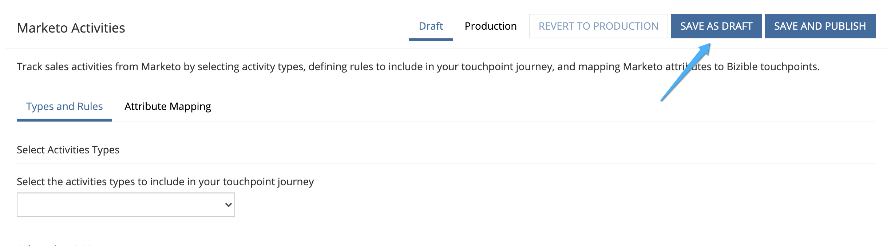

# Integration von [!DNL Marketo Engage] {#marketo-engage-activities-integration}

Im Rahmen der allgemeinen [!DNL Marketo Measure]- und [!DNL Marketo Engage]-Integration spielt diese Anstrengung zur Einbindung von Marketo-Aktivitäten eine große Rolle. Über Marketo-Aktivitäten verfolgt das System Ereignisse wie `Click Email`, `Change Score` oder `Change Status in Progression`. Diese Aktivitätstypen können nach unten geordnet und definiert werden, um eine Teilmenge auszuwählen, die für Touchpoints infrage kommen. Sobald Touchpoints für diese Aktivitäten erstellt wurden, werden sie in der Interaktions-Journey erfasst und neben Ihren anderen Marketing-Kanälen wie Paid Search oder Partner-Marketing gemessen.

## Anforderungen {#requirements}

* Marketo-Produktionsinstanz
* [!DNL Salesforce] oder [!DNL Microsoft Dynamics]
* Alle gebührenpflichtigen [!DNL Marketo Measure]
* Marketo People Sync aktiviert ([!DNL Marketo Measure])
* Marketo-Programme aktiviert ([!DNL Marketo Measure])
* Marketo-Aktivitäten aktiviert ([!DNL Marketo Measure])

## Einrichten {#setup}

1. Um mit der Einrichtung von Marketo-Aktivitäten zu beginnen, navigieren Sie **Mein Konto** > **Einstellungen** > **Aktivitäten**.

   

   

   Als Erstes müssen Sie die Liste der Aktivitätstypen auswählen, auf denen Sie Regeln erstellen möchten. Es ist keine feste Anzahl von Aktivitätstypen erforderlich. Es wird jedoch empfohlen, dass Sie Ihre Touchpoints nicht überlasten und die Wichtigkeit wichtiger Meilensteine nicht schmälern. Allerdings benötigen Sie möglicherweise nicht mehr als fünf Aktivitätstypen, um die relevanten Interaktionen zu verfolgen.

1. Klicken Sie auf das Dropdown-Menü unter [!UICONTROL Aktivitätstypen auswählen], um mit der Auswahl der verschiedenen Typen zu beginnen.

   

1. Wenn alle erforderlichen Aktivitäten ausgewählt sind, werden sie in Ihrer [!UICONTROL Liste der ausgewählten Aktivitäten] und unter [!UICONTROL Regeln definieren] angezeigt.

   

1. Für jeden Aktivitätstyp müssen Sie eine oder mehrere Regeln definieren, die festlegen, welche Datensätze für Touchpoints infrage kommen. In diesem Beispiel fügen wir eine Regel für den Aktivitätstyp „Score ändern“ hinzu, sodass das System einen Touchpoint erstellt, wenn eine Marketo-Person einen Score von 90 oder höher erreicht.

1. Zunächst müssen Sie je nach Aktivitätstyp möglicherweise einen [!DNL Marketo Measure] Kampagnennamen einrichten, der später für die Kanalzuordnung verwendet werden kann. [!DNL Marketo Measure] Kampagnennamen können über mehrere Regeln hinweg wiederverwendet werden. Dies hilft, breitere Namen zu haben, die in einer einzigen Kanalregel verwendet werden können. Nicht alle Aktivitätstypen enthalten ein Marketo-Programm. Daher ist als erster Schritt ein Name erforderlich.

   Im Folgenden finden Sie ein Beispiel dafür, wie dieser zusätzliche Schritt aussehen würde:

   

1. Im Beispiel „Score ändern“ müssen Sie einen Kampagnennamen eingeben, da diese Informationen aus dem Marketo-Programm abgerufen werden. Erstellen Sie nun den Regelausdruck. Wählen Sie nach diesem Beispiel das Feld &quot;[!UICONTROL Neuer Wert]&quot; mit dem Operator &quot;[!UICONTROL ist größer als]&quot; mit dem Wert 90 aus.

   Sie können die Regeln erweitern und zusätzliche Filter oder Kriterien hinzufügen, indem Sie „AND“- oder „OR“-Anweisungen hinzufügen, um die Ergebnisse einzugrenzen.

   

   

1. Wählen Sie abschließend, was als Touchpoint-Datum verwendet werden soll. Alle verfügbaren Datums- oder Datums-/Uhrzeitfelder werden hier in Marketo angezeigt. Sofern Sie keine benutzerdefinierten Datumsfelder haben, sehen Sie &quot;[!UICONTROL Aktivitätsdatum].

   

1. Klicken Sie auf **[!UICONTROL Als Entwurf speichern]**, damit Ihre Änderungen nicht verloren gehen.

   

1. Navigieren Sie zur Registerkarte **[!UICONTROL Attributzuordnung]** .

   

1. Für jeden ausgewählten Aktivitätstyp haben Sie die Möglichkeit, zusätzliche Marketo-Attribute Touchpoint-Feldern zuzuordnen, damit Sie diese Werte in [!DNL Marketo Measure Discover] oder im CRM anzeigen und darüber berichten können.

   Viele der Felder wurden automatisch zugeordnet und können nicht geändert werden, um sie mit unseren anderen Integrationen in Einklang zu bringen. Verweisen Sie auf den Abschnitt Feldzuordnungen unten, um diese Werte zu finden. Bei einigen Aktivitätstypen enthält Marketo Attribute für eine Landingpage, eine Referrer-Seite oder einen Browser, die Sie optional einem Touchpoint-Feld zuordnen können. Im folgenden Beispiel haben wir einige zusätzliche Vorschläge gemacht, die entfernt werden können.

1. Wählen Sie in der linken Spalte das Buyer Touchpoint-Feld aus, dem Sie zuordnen möchten. Wählen Sie anschließend das Marketo-Attribut, das Sie im Feld Buyer Touchpoint ausfüllen möchten. Denken Sie daran, dass es sich hierbei um optionale, zusätzliche Zuordnungen zusätzlich zu den bereits von [!DNL Marketo Measure] erstellten handelt.

   Zuordnungsfähige Felder:

   * Stadt
   * Land
   * Region
   * Landingpage
   * Referrer-Seite
   * Formularseite
   * Formulardatum
   * Plattform
   * Browser

   >[!NOTE]
   >
   >Anzeigenfelder wie Anzeigeninhalt oder Keyword sind in dieser Liste nicht verfügbar, da sie für unsere Anzeigenplattformintegrationen reserviert sind.

## Aktivitätstypen {#activity-types}

Einige Aktivitätstypen liefern die Programm-ID und den Programmnamen, sodass diese einfach der Kampagnen-ID und dem Kampagnennamen auf der Buyer Touchpoint zugeordnet werden können. Für andere gibt es keine Programmverknüpfung. Daher erfordert ein Teil der Regeldefinition, dass ein [!DNL Marketo Measure] Kampagnenname erstellt wird. Nachfolgend finden Sie eine Liste jeder Kategorie:

**Aktivitätstypen mit Programm-ID**

E-Mail senden (6)\
E-Mail zugestellt (7)\
E-Mail gebounct (8)\
E-Mail zur Abmeldung (9)\
E-Mail öffnen (10)\
Click Email (11)\
Datenwert ändern (13)\
Punktzahl ändern (22)\
Zur Liste hinzufügen (24)\
Statusänderung in Progress (104)\
Add to Nurture (113)\
Change Nurture Cadence (115)

>[!NOTE]
>
>Wenn von den Aktivitätstypen, bei denen eine Programm-ID erwartet wird, eine Aktivität ohne Programm erkannt wird, akzeptiert [!DNL Marketo Measure] dies nicht als geeigneten Touchpoint, da wir keine Nullwerte für Campaign haben können.

**Aktivitätstypen ohne Programm-ID**

Link anklicken (3)\
Neuer Lead (12)\
Lead mit SFDC synchronisieren (19)\
Lead konvertieren (21)\
Besitzer ändern (23)\
Aus Liste entfernen (25)\
Aktivität SFDC (26)\
Softbounce bei E-Mails (27)\
Lead aus SFDC löschen (29)\
Zusammenführen von Leads (32)\
Zur Opportunity hinzufügen (34)\
Aus Opportunity entfernen (35)\
Opportunity aktualisieren (36)\
Lead löschen (37)\
Warnhinweis senden (38)\
Verkaufs-E-Mail senden (39)\
Verkaufs-E-Mail öffnen (40)\
Klicken Sie auf Verkaufs-E-Mail (41)\
Zu SFDC Campaign hinzufügen (42)\
Aus SFDC Campaign entfernen (43)\
Statusänderung in SFDC Campaign (44)\
Verkaufs-E-Mail empfangen (45)\
Kampagne anfordern (47)\
E-Mail-Bounce (48)\
Umsatzschritt ändern (101)\
Umsatzschritt manuell ändern (102)\
Segment ändern (108)\
Webhook aufrufen (110)\
E-Mail an Freunde weiterleiten (111)\
Erhalten Weiterleiten an Freund E-Mail (112)\
Change Nurture Track (114)\
Lead auf Marketo pushen (145)\
Lead mit Microsoft synchronisieren (300)\
Inhalt freigeben (400)
Dialog aktiviert (158)
Dokument interagiert mit (159)
Dialog Termin geplant (160)
Dialogziel erreicht (161)
Benutzerdefinierte Aktivität (xxx)

## Kanalzuordnung {#channel-mapping}

Für jede der Regeln eines Aktivitätstyps mit einer Programm-ID wird der Marketo-Programmkanal anhand des Programms bestimmt. Wir verwenden den Programmkanal, um Ihre benutzerdefinierten Offline-Kanäle zuzuordnen, sodass Sie sicherstellen müssen, dass Ihre Kanäle ordnungsgemäß konfiguriert sind [wie hier beschrieben](/help/marketo-measure-and-marketo/marketo-measure-integrations-with-marketo/marketo-engage-programs-integration.md#channel-mapping).

Für alle Regeln aus einem Aktivitätstyp ohne Programm-ID war der erste Schritt die Erstellung eines Kampagnennamens. Verwenden Sie diesen Kampagnennamen, um Ihre benutzerdefinierten Online-Kanäle einzurichten [hier beschrieben](/help/channel-tracking-and-setup/online-channels/online-custom-channel-setup.md).

Wenn die Kanäle für Ihre Marketo-Aktivitäten nicht ordnungsgemäß konfiguriert sind, fallen Ihre neuen Touchpoints wahrscheinlich unter den Kanal „Sonstige“.

## Programmkosten {#program-costs}

Durch den Datenimport von Marketo-Programmen werden Kosten automatisch aus dem Kostenzeitraum heruntergeladen und die gemeldeten Kosten in Marketo werden über den zugewiesenen Monat verteilt. Wenn beispielsweise für Januar 2021 1.000 $ gemeldet werden, werden die 1.000 $ auf 31 Tage aufgeteilt. Die Kosten sind in [!DNL Marketo Measure Discover] zu finden.

## Cookie-Zuordnung {#cookie-mapping}

Aufgrund der [!DNL Marketo Measure] Integration mit Marketo wird die [!DNL Marketo Measure] Cookie-ID jetzt auch der [!DNL Marketo Munchkin Id] zugeordnet und mit ihr synchronisiert. Auf diese Weise wird die Lücke geschlossen, sodass der anonyme Erstkontakt einer Web-Sitzung zugeordnet werden kann, anstatt sowohl die FT- als auch die LC-Kontakte einer Marketo-Aktivität zuzuordnen. Stellen Sie sich dieses Szenario vor:

Mark klickt auf eine Facebook-Anzeige und landet auf wayneenterprises.com, wo er ein Cookie mit [!DNL Marketo Measure] ID 123 und [!DNL Marketo Munchkin Id] 456 erhält. Es wird kein Formular ausgefüllt.

Das Marketing-Team von Wayne Enterprises sendet eine E-Mail-Nachricht an bestimmte ausgewählte Leads, von denen einer `mark@email.com` wird.

`mark@email.com` erhält die E-Mail und klickt durch und landet auf `wayneenterprises.com`. Dies wird `mark@email.com's` zweiter Besuch bei `wayneenterprise.com` mit denselben Cookie-IDs, aber es wurde kein Formular ausgefüllt, sodass sie [!DNL Marketo Measure] immer noch ein anonymer Besucher sind.

Das Marketing-Team von Wayne Enterprises erstellt eine Marketo-Aktivitätsregel, um Touchpoints für einen Aktivitätstyp „Klick-E-Mail“ zu generieren.

Mit der heutigen Implementierung würde ein einziger FT- und LC-Touchpoint für die `mark@email.com` aus der Marketo-Aktivität vom Aktivitätstyp „E-Mail klicken“ erstellt.

Mit dieser Verbesserung der Cookie-Zuordnung würde die FTP zurückgehen und der Facebook-Anzeige gutgeschrieben und der LC würde der E-Mail gutgeschrieben.

>[!NOTE]
>
>Mit dem Cookie-Mapping-Verhalten finden Sie möglicherweise einige LC-Touchpoints, die aus einem Web-Besuch stammen. Es ist möglich, dass ein Lead ohne zugehörige Aktivität in Marketo erschien, dann [!DNL Marketo Measure] diesen Lead heruntergeladen, die zugehörigen Cookies zugeordnet und dann auf die neueste Web-Sitzung zurückverfolgt hat, selbst wenn keine Formular-Aktivität vorhanden war, die den Lead erstellt hat.

## FAQs {#faq}

**Woher weiß ich, ob ich eine Regel für Marketo-Programme oder eine Regel für Marketo-Aktivitäten erstellen soll?**

Die Integration von [!DNL Marketo Engage]-Programmen ist eine einfache Möglichkeit, Touchpoints basierend darauf zu generieren, ob eine Person Programmmitglied eines Programms ist. Wenn Sie eine Regel basierend auf dem Zeitpunkt definieren möchten, zu dem eine Person zu einem bestimmten Programmstatus wechselt, ist die [!DNL Marketo Engage] Aktivitätsintegration die gewünschte Einrichtung, insbesondere der Aktivitätstyp „Status in Bearbeitung ändern“, damit Ihr Touchpoint-Datum dem systemgenerierten Aktivitätsdatum zugeordnet werden kann.

**Warum wird der Name meines Touchpoint-Typs abgeschnitten?**

Das Feld Touchpoint-Typ wurde im [!DNL Marketo Measure]-Paket mit 16 Zeichen erstellt. Unglücklicherweise würde eine Änderung der Zeichenbeschränkung des Felds erfordern, dass das vorhandene Feld verworfen und ein neues erstellt wird. Der Wert des Touchpoint-Typs ist der Aktivitätstyp, der ebenfalls im Feld Medium festgelegt wird.

**Warum wird mein benutzerdefinierter Aktivitätstyp nicht in der Liste der verfügbaren Aktivitäten angezeigt?**

Wir zeigen nur benutzerdefinierte Aktivitätstypen „Genehmigt“ an und nicht „Entwurf“ oder „Genehmigt mit Entwurf“.

**Wie kann ich feststellen, für welche Aktivitätstypen ich einen Touchpoint generieren möchte?**

Auch wenn es keine Begrenzung für die Anzahl der Aktivitätstypen gibt, die Sie erstellen können, empfehlen wir im Allgemeinen nicht mehr als fünf Aktivitätstypen. Es braucht Zeit, um zu bestimmen, welche Marketing-Aktivitäten relevant genug sind, um Teil der Touchpoint-Journey zu sein. Beispielsweise ist „E-Mail abmelden“ möglicherweise kein wichtiger Touchpoint zum Nachverfolgen, aber „E-Mail klicken“ mit zusätzlichen Filtern könnte ein guter sein. Dies variiert je nach Organisation und Team. Daher empfehlen wir Ihnen, mit Ihrem Team über den besten Ansatz zu diskutieren.

**Warum ist mein Browser-Name abgeschnitten?**

Der [!DNL Marketo Measure] Browser-Name ist auf maximal 20 Zeichen begrenzt, obwohl der User Agent-Wert, den wir von Marketo erhalten, in der Regel eine längere Zeichenfolge ist.

BrowserInfo.Name\
BrowserInfo.Version\
PlatformInfo.Name\
PlatformInfo.Version
