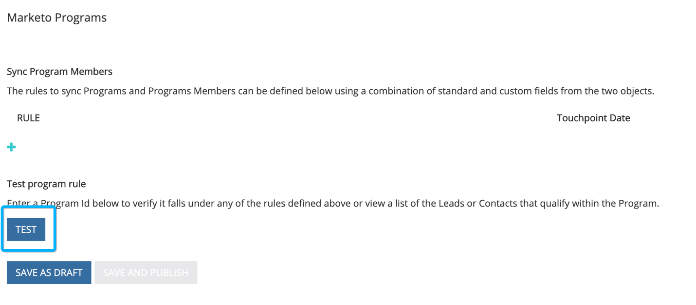

# Integration von [!DNL Marketo Engage] Programmen {#marketo-engage-programs-integration}

Durch die [!DNL Marketo Measure] Integration mit [!DNL Marketo Engage]-Programmen können unsere Kunden damit beginnen, Touchpoints für das Attributions-Tracking aus den Marketo-Programmmitgliedschaften zu erstellen. Mit dieser Funktion können Marketing-Fachleute Programmmitgliedschaften aus E-Mail- oder Interaktionsprogrammen verfolgen, die ansonsten vom [!DNL Marketo Measure] JavaScript nicht gesehen werden und auf der Attributions-Journey gemessen werden sollten.

## Verfügbarkeit {#availability}

Alle Ebenen.

## Anforderungen {#requirements}

* Marketo-Produktionsinstanz
* Produktions-Salesforce- oder Microsoft Dynamics-Instanz
* Alle gebührenpflichtigen [!DNL Marketo Measure]
* Marketo People Sync aktiviert ([!DNL Marketo Measure])
* Marketo-Programme aktiviert ([!DNL Marketo Measure])

## Einrichten {#setup}

**Regeln**

1. Um Regeln für Marketo-Programme einzurichten, navigieren Sie zu **[!UICONTROL Mein Konto]** > **[!UICONTROL Einstellungen]** > **[!UICONTROL Programme]**. Klicken Sie auf das Symbol **+** , um mit der Erstellung Ihrer ersten Regel zu beginnen.

   

   

1. Sie können optional einen Namen für die Regel festlegen, wenn dies hilft, sie im Auge zu behalten. Wählen Sie zunächst das Feld aus, um Ihre Regel in der Liste der Felder Programm und Programmmitgliedschaft zu definieren. Fahren Sie mit dem Erstellen der Regel fort, indem Sie den Operator und den erwarteten Wert auswählen, auf den geprüft werden soll.

   

1. Fügen Sie innerhalb desselben Felds eine weitere Anweisung hinzu, um ein „Und“-Kriterium in der Regel festzulegen, oder klicken Sie außerhalb des Felds auf das + -Symbol, um eine „Oder“-Anweisung einzurichten.

   

1. Wählen Sie aus, welches Datums- oder Datums-/Uhrzeitfeld zum Zuordnen zum Touchpoint-Datum verwendet werden soll. Um die Liste der in Marketo verfügbaren Werte anzuzeigen, geben Sie eine geschweifte Klammer `{` und wir zeigen die verfügbaren Felder an.

   

   >[!NOTE]
   >
   >Wenn Ihre Regel das Aktivitätsdatum oder das Datum, an dem ein Programmteilnehmer einen bestimmten Status erreicht hat, erfassen möchte, sollten Sie die [!DNL Marketo Engage] Aktivitätsintegration verwenden und eine Regel für den Aktivitätstyp „Status in Bearbeitung ändern“ einrichten.

   

Ihre abgeschlossene Regel sollte in etwa wie folgt aussehen:

## Test {#test}

Nachdem Sie einige Regeln erstellt haben, können Sie sie testen, um zu überprüfen, ob Ihre Anweisung mit Ihren Programmen übereinstimmt.

1. Um einen Test auszuführen, klicken Sie auf die Schaltfläche **[!UICONTROL TEST]**, wie unten dargestellt.

   

1. Es wird ein Modal angezeigt, in das Sie die Programm-ID aus Marketo eingeben können.

   

   Nachdem Sie die ID eingegeben und auf die Schaltfläche [!UICONTROL Test] geklickt haben, überprüft unsere Regel-Engine jede einzelne Regel und ermittelt, ob das Programm mit einer der Regeln übereinstimmt. Im folgenden Beispiel sehen Sie, dass das Programm 1002, genannt [!DNL Marketo Measure] Ebook, fünf Programmmitglieder hat und aufgrund der angezeigten Regel berechtigt ist.

   Die Regeln werden mit einer Stichprobengröße von 5.000 Mitgliedern ausgeführt. Wenn Ihr Programm mehr als 5000 Mitglieder umfasst, ist es möglich, dass wir nicht die Kompatibilität aller Mitglieder überprüfen. Dieses Tool dient lediglich dazu, zu überprüfen, ob die Regeln korrekt erstellt wurden.

   

   Sie können auf die Mitgliederzahl klicken, um eine Liste der Marketo Personen-IDs anzuzeigen, die für das Programm infrage kommen.

   

## Kanalzuordnung {#channel-mapping}

Aus der Liste der Marketo-Programmkanäle sollten Sie die Werte den [!DNL Marketo Measure] benutzerdefinierten Marketing-Kanälen zuordnen, die Sie in den Einstellungen erstellt haben. Alle von diesen Programmen generierten Touchpoints übernehmen die Namen der Kanäle und Unterkanäle, die Sie hier auswählen.

1. Navigieren Sie zunächst zu **[!UICONTROL Mein Konto]** > **[!UICONTROL Einstellungen]** > **[!UICONTROL Offline-Kanäle]**.

1. Oben haben Sie die Möglichkeit, Ihren CRM-Kampagnentypen zuzuordnen, und unten sehen Sie die Optionen für Ihre Marketo-Programmkanäle.

1. Wählen Sie zunächst den Kanal aus, der dem Wert zugeordnet werden soll, und wählen Sie dann optional den Unterkanal aus. Wenn Sie fertig sind, klicken Sie unten **[!UICONTROL Speichern]**.

   

## Programmkosten {#program-costs}

Durch den Datenimport von Marketo-Programmen werden Kosten automatisch aus dem Kostenzeitraum heruntergeladen und die in Marketo gemeldeten Kosten werden über den zugewiesenen Monat verteilt. Wenn beispielsweise für Januar 2021 1.000 $ gemeldet werden, werden die 1.000 $ auf 31 Tage aufgeteilt. Die Kosten sind in [!DNL Marketo Measure Discover] zu finden.

>[!NOTE]
>
>Marketo Measure unterstützt nur eine Periodenkosteneingabe pro Monat. Um sicherzustellen, dass alle Kosten importiert werden, aggregieren Sie die monatlichen Gesamtkosten in einem einzigen Eintrag. Mehrere Kosteneinträge für Perioden für denselben Monat werden nicht unterstützt.

## Funktionsweise {#how-it-works}

**Feldzuordnungen**

<table><thead>
  <tr> 
   <th>Biz_Ad_campaigns</th> 
   <th>Marketo</th> 
  </tr></thead>
<tbody>
  <tr> 
   <td>ID</td> 
   <td>ID</td> 
  </tr> 
  <tr> 
   <td>IS_DELETED</td> 
   <td>(Prüfen, ob das Programm noch über die API existiert)</td> 
  </tr> 
  <tr> 
   <td>NAME</td> 
   <td>name</td> 
  </tr> 
 </tbody> 
</table>

<table><thead>
  <tr>
    <th>Biz_Campaign_Members</th>
    <th>Marketo</th>
  </tr></thead>
<tbody>
  <tr>
    <td>ID</td>
    <td>„MarketoProgramMembership„_ProgramId_Lead-ID</td>
  </tr>
  <tr>
    <td>MODIFIED_DATE</td>
    <td>updatedAt</td>
  </tr>
  <tr>
    <td>CREATED_DATE</td>
    <td>membershipDate</td>
  </tr>
  <tr>
    <td>LEAD_ID</td>
    <td>ID (Mitgliedschaft in der Liste)</td>
  </tr>
  <tr>
    <td>LEAD_EMAIL</td>
    <td>E-Mail (Mitgliedschaft in der Liste)</td>
  </tr>
  <tr>
    <td>STATUS</td>
    <td>progressStatus</td>
  </tr>
  <tr>
    <td>HAS_RESPONDED</td>
    <td>reachedStatus</td>
  </tr>
  <tr>
    <td>CAMPAIGN_NAME</td>
    <td>programName</td>
  </tr>
  <tr>
    <td>CAMPAIGN_ID</td>
    <td>programId</td>
  </tr>
  <tr>
    <td>CAMPAIGN_TYPE</td>
    <td>Kanal</td>
  </tr>
</tbody>
</table>

## Cookie-Zuordnung {#cookie-mapping}

Aufgrund der [!DNL Marketo Measure] Integration mit Marketo wird die [!DNL Marketo Measure] Cookie-ID jetzt auch der [!DNL Marketo Munchkin Id] zugeordnet und mit ihr synchronisiert. Auf diese Weise wird die Lücke geschlossen, sodass der anonyme Erstkontakt einer Web-Sitzung zugeordnet werden kann, anstatt sowohl die FT- als auch die LC-Kontakte einer Marketo-Aktivität zuzuordnen. Stellen Sie sich dieses Szenario vor:

Mark klickt auf eine [!DNL Facebook] Anzeige und landet auf wayneenterprises.com, wo er mit der [!DNL Marketo Measure] ID 123 und [!DNL Marketo Munchkin Id] 456 gebacken wird. Es wird kein Formular ausgefüllt.

Das Marketing-Team von Wayne Enterprises sendet eine E-Mail-Nachricht an bestimmte ausgewählte Leads, von denen einer `mark@email.com` wird.

`mark@email.com` erhält die E-Mail und klickt über und landet auf wayneenterprises.com. Dies wird `mark@email.com's` zweiter Besuch bei `wayneenterprise.com` mit denselben Cookie-IDs, aber es wurde kein Formular ausgefüllt, sodass sie [!DNL Marketo Measure] immer noch ein anonymer Besucher sind.

Das Marketing-Team von Wayne Enterprises erstellt eine Marketo-Aktivitätsregel, um Touchpoints für einen Aktivitätstyp „Klick-E-Mail“ zu generieren.

Mit der heutigen Implementierung würde ein einziger FT- und LC-Touchpoint für die `mark@email.com` aus der Marketo-Aktivität vom Aktivitätstyp „E-Mail klicken“ erstellt.

Mit dieser Verbesserung der Cookie-Zuordnung würde die FTP zurückgehen und der [!DNL Facebook] Anzeige gutgeschrieben werden, und der LC würde der E-Mail gutgeschrieben.

>[!NOTE]
>
>Mit dem Cookie-Mapping-Verhalten finden Sie möglicherweise einige LC-Touchpoints, die aus einem Web-Besuch stammen. Es ist möglich, dass ein Lead ohne zugehörige Aktivität in Marketo erschien, dann [!DNL Marketo Measure] diesen Lead heruntergeladen, die zugehörigen Cookies zugeordnet und dann auf die neueste Web-Sitzung zurückverfolgt hat, selbst wenn keine Formular-Aktivität vorhanden war, die den Lead erstellt hat.

## FAQs {#faq}

**Wie setze ich das Touchpoint-Datum auf das Fortschrittsdatum oder auf das Datum, an dem die Statusänderung bei meinem Programmmitglied eingetreten ist?**

Wenn Ihre Regel das Aktivitätsdatum oder das Datum, an dem ein Programmteilnehmer einen bestimmten Status erreicht hat, erfassen möchte, sollten Sie die [!DNL Marketo Engage] Aktivitätsintegration verwenden und eine Regel für den Aktivitätstyp „Status in Bearbeitung ändern“ einrichten. Andernfalls stellt die Integration von [!DNL Marketo Engage]-Programmen nur das Mitgliedschaftsdatum zur Verfügung. Dies ist das erste Datum, an dem die Marketo-Person zum Programm hinzugefügt wurde, selbst wenn mehrere Status vorhanden sind.

**Kann ich eine Auswahlliste mit Datumsoptionen für das Touchpoint-Datum erhalten?**

Um die automatische Vervollständigung Trigger, geben Sie zunächst eine geschweifte Klammer `{` das Textfeld ein. Daraufhin werden die verfügbaren Felder angezeigt.

**Wenn ich Marketo-Programmregeln erstelle und auch CRM-Kampagnenregeln verwende, werden diese zweimal gezählt?**

Das hängt von Ihrer Regeldefinition ab, aber möglicherweise ja. Sie sollten Ihren Regelsatz so bewerten, dass Sie keine Regeln haben, die ein Programm und eine Kampagne abdecken, da wir keine Deduplizierung vornehmen oder ähnliche Mitgliedschaften erkennen. Eine mögliche Lösung besteht darin, Ihre Campaign-Regeln in Programme zu kopieren, wenn Sie möchten, dass Marketo Ihre zentrale Datenquelle ist. Entfernen Sie dann die Campaign-Regeln. Eine andere Möglichkeit besteht darin, die Kriterien „CreatedOn“ oder „CreatedDate“ zu Ihren Regeln hinzuzufügen, sodass Regeln vor einem bestimmten Datum Kampagnenregeln verwenden und Regeln nach einem bestimmten Datum Programmregeln verwenden. Es gibt viele Problemumgehungen, aber es wird einige Planung und Koordination erfordern.

**Sind benutzerdefinierte Felder für die Programmmitgliedschaft von Marketo verfügbar, um sie zu definieren?**

Aufgrund technischer Einschränkungen können benutzerdefinierte Felder für die Programmmitgliedschaft derzeit nicht unterstützt werden. Sobald diese Felder über zusätzliche Marketo-APIs verfügbar sind, werden sie für uns verfügbar und für Sie sichtbar sein.

**Woher weiß ich, ob ich Programme oder Aktivitäten verwenden soll?**

Die Integration von [!DNL Marketo Engage]-Programmen ist eine einfache Möglichkeit, Touchpoints basierend darauf zu generieren, ob eine Person Programmmitglied eines Programms ist oder nicht. Wenn Sie eine Regel definieren möchten, die auf dem Zeitpunkt basiert, zu dem eine Person zu einem bestimmten Programmstatus wechselt, ist die [!DNL Marketo Engage] Aktivitätsintegration die gewünschte Einrichtung, insbesondere der Aktivitätstyp „Statusänderung in Bearbeitung“.
